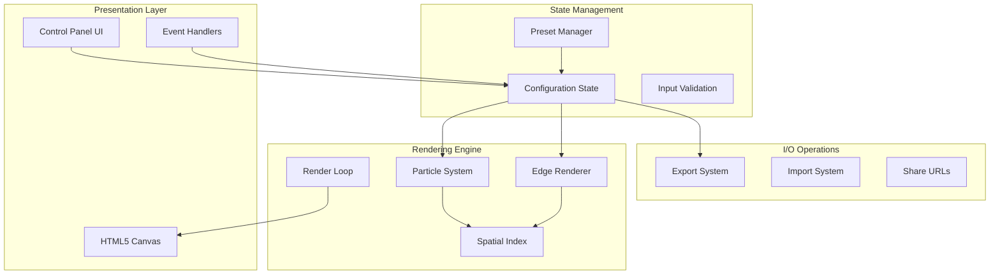
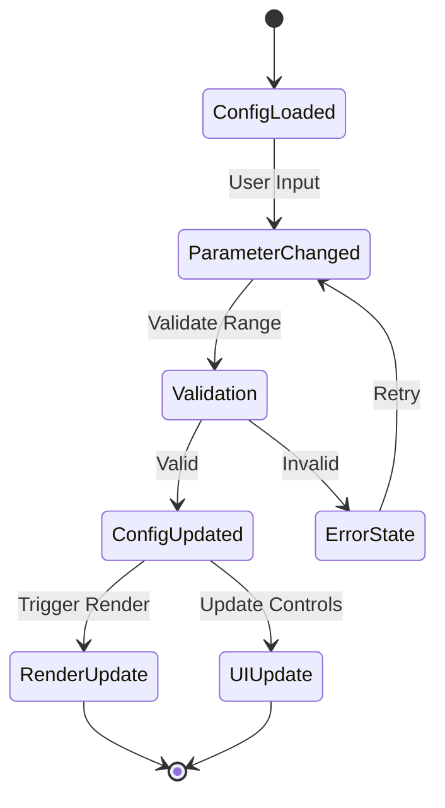
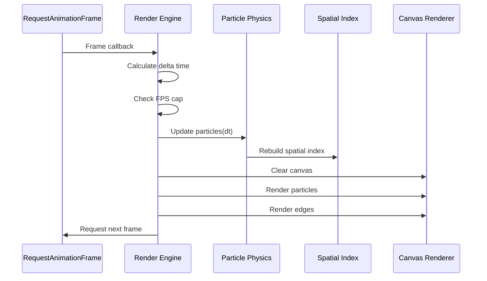
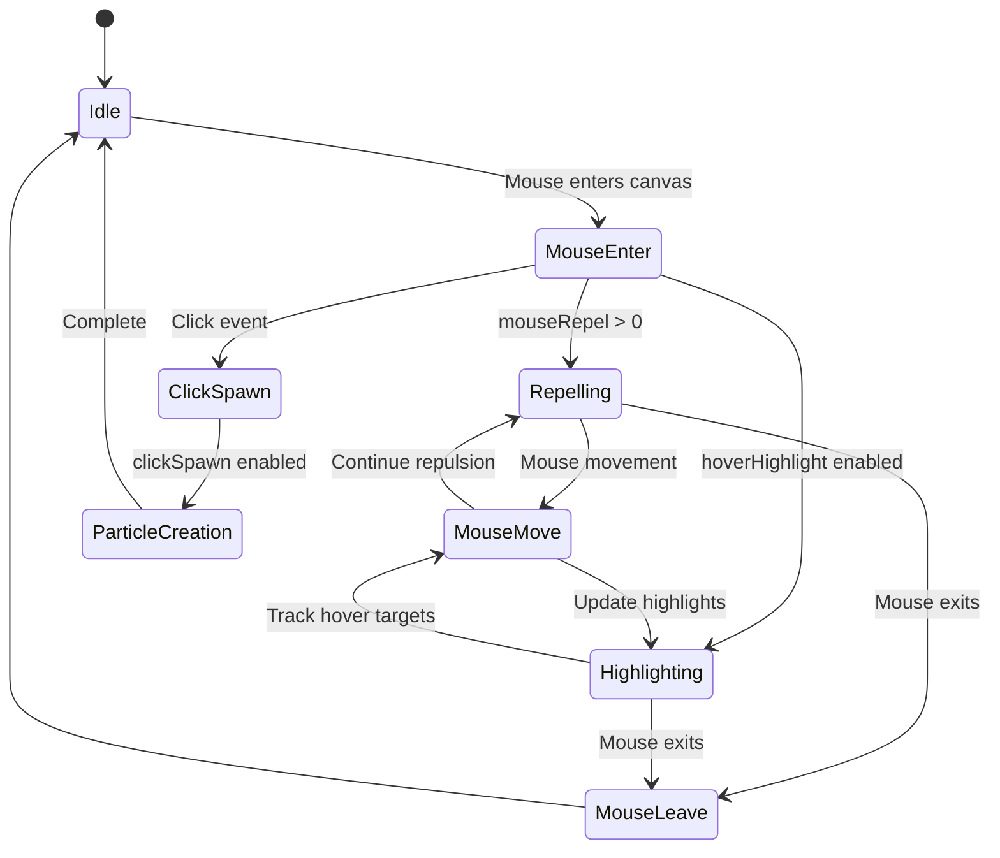
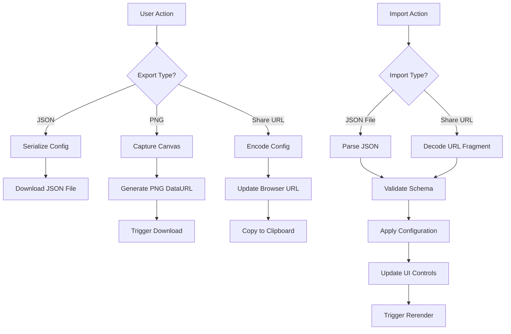

# Plexus Canvas - Interactive Particle Network Visualization System Design

## Overview

Plexus Canvas is a performance-oriented web application that visualizes dynamic particle networks with real-time parameter control. The system renders an interactive "plexus" network of particles connected by edges on an HTML5 canvas, accompanied by a comprehensive control panel for live parameter adjustment.

### Core Value Proposition
- Real-time visualization of dynamic particle networks
- Zero-reload parameter modification for immediate visual feedback  
- Export capabilities for sharing and preservation of configurations
- High performance targeting 60 FPS with 1000+ particles
- Vanilla JavaScript implementation requiring no build process

### Target Performance
- 60 FPS sustained performance with 1000-1500 particles
- Maximum distance connections of 140px
- Optimized for mid-range laptop hardware

## Technology Stack & Dependencies

### Core Technologies
- **Frontend**: Pure HTML5, CSS3, Vanilla JavaScript (ES2020+)
- **Graphics**: HTML5 Canvas API with HiDPI support
- **Styling**: CSS3 with optional Tailwind CSS integration
- **Storage**: localStorage for configuration persistence

### Zero Dependencies Approach
- No external frameworks or libraries required
- Optional file-saver library for enhanced download capabilities
- Direct browser API utilization for maximum performance
- No build process required - runs directly from index.html

## Architecture

### System Architecture Overview



### File Structure Organization

| Module | Responsibility | Key Components |
|--------|---------------|----------------|
| `/index.html` | Application structure | Canvas element, control panel container |
| `/styles/app.css` | Visual presentation | Two-column layout, responsive design, theming |
| `/src/main.js` | Application bootstrap | Initialization, event wiring, startup logic |
| `/src/render/engine.js` | Render loop management | RAF loop, DPI handling, frame timing |
| `/src/render/plexus.js` | Particle simulation | Physics, particle arrays, edge calculations |
| `/src/state/config.js` | Configuration management | State validation, change events, persistence |
| `/src/state/presets.js` | Preset system | Built-in configurations, preset switching |
| `/src/ui/panel.js` | Control interface | Dynamic UI generation, parameter binding |
| `/src/io/exporter.js` | Export/Import system | JSON serialization, PNG export, URL sharing |
| `/src/utils/` | Utility functions | Math helpers, DOM utilities, RAF management |

## Component Architecture

### State Management Architecture

The application uses a centralized configuration object with event-driven updates:



### Control Panel Architecture

| Control Group | Parameters | UI Components |
|---------------|------------|---------------|
| **Particles** | count, spawnArea, speed, size, jitter | Range sliders, select dropdown |
| **Edges** | maxDistance, maxEdgesPerNode, lineWidth, lineOpacity, blendMode | Range sliders, select dropdown |
| **Forces & Motion** | noiseStrength, gravity, drag | Range sliders |
| **Colors & Style** | bgColor, particleColor, gradient, edgeColorMode | Color pickers, gradient editor |
| **Interaction** | mouseRepel, mouseRadius, hoverHighlight, clickSpawn | Range sliders, checkboxes |
| **Performance** | fpsCap, pixelRatioMode, spatialIndex, batchEdges | Select dropdowns, checkboxes |

### Particle System Architecture

#### Data Structure (Structure of Arrays)
- **Position Arrays**: `Float32Array` for x, y coordinates
- **Velocity Arrays**: `Float32Array` for vx, vy components  
- **Property Arrays**: Optional color and size arrays
- **Benefits**: Cache-friendly memory access, SIMD optimization potential

#### Physics Integration Loop
1. **Noise Application**: Apply Perlin-style noise to velocity vectors
2. **Gravity Forces**: Calculate center attraction/repulsion
3. **Drag Application**: Velocity damping for natural motion
4. **Position Integration**: Update positions based on velocity and time delta
5. **Boundary Handling**: Elastic or soft boundary reflections

### Edge Rendering System

#### Connection Algorithm
- **Distance Check**: Euclidean distance < maxDistance threshold
- **Edge Limiting**: Enforce maxEdgesPerNode constraint per particle
- **Spatial Optimization**: Use spatial indexing for O(n) complexity

#### Rendering Strategies
- **Batch Rendering**: Single beginPath() call with multiple moveTo/lineTo operations
- **Color Interpolation**: Distance-based or velocity-based color mapping
- **Blend Modes**: Support for normal, lighten, screen, overlay blend modes

## Data Models & Configuration Schema

### Primary Configuration Structure

```mermaid
erDiagram
    CONFIG ||--|| PARTICLES : contains
    CONFIG ||--|| EDGES : contains
    CONFIG ||--|| FORCES : contains
    CONFIG ||--|| STYLE : contains
    CONFIG ||--|| INTERACTION : contains
    CONFIG ||--|| PERFORMANCE : contains
    CONFIG ||--|| META : contains
    
    PARTICLES {
        number count
        string spawnArea
        number speed
        number size
        number jitter
    }
    
    EDGES {
        number maxDistance
        number maxEdgesPerNode
        number lineWidth
        number lineOpacity
        string blendMode
        string colorMode
        string staticColor
    }
    
    FORCES {
        number noiseStrength
        number gravity
        number drag
    }
    
    STYLE {
        object bg
        string particleColor
        array gradient
    }
    
    INTERACTION {
        number mouseRepel
        number mouseRadius
        boolean hoverHighlight
        boolean clickSpawn
    }
    
    PERFORMANCE {
        number fpsCap
        string pixelRatioMode
        string spatialIndex
        boolean batchEdges
    }
```

### Configuration Parameter Ranges

| Parameter | Type | Range | Default | Validation |
|-----------|------|-------|---------|------------|
| particles.count | number | 50-3000 | 800 | Integer, performance warning >2000 |
| particles.speed | number | 0-2 | 0.35 | Float, px/ms units |
| particles.size | number | 1-6 | 2 | Float, pixel radius |
| edges.maxDistance | number | 30-400 | 140 | Integer, pixels |
| edges.lineOpacity | number | 0-1 | 0.6 | Float, alpha value |
| forces.noiseStrength | number | 0-1 | 0.15 | Float, motion influence |
| forces.gravity | number | -1 to 1 | 0.05 | Float, center attraction |
| interaction.mouseRadius | number | 0-300 | 120 | Integer, pixels |

### Preset System Data Model

| Preset Name | Characteristics | Key Parameters |
|-------------|----------------|----------------|
| **Neon Breeze** | Soft gradient, light blend mode | blendMode: lighten, gradient: blue-purple |
| **Cosmic Web** | Large connections, slow motion | maxDistance: 200+, speed: 0.1 |
| **Wireframe** | Minimal particles, thin lines | size: 0.5, lineOpacity: 0.25 |
| **Storm** | High noise, strong mouse interaction | noiseStrength: 0.8, mouseRepel: 0.7 |
| **Minimal** | Few particles, thick connections | count: 200, lineWidth: 2.5 |

## Rendering Engine Architecture

### Frame Loop Management



### Spatial Indexing Strategies

#### Grid-Based Indexing (Default)
- **Cell Size**: Approximately equal to maxDistance parameter
- **Grid Dimensions**: Dynamic based on canvas size
- **Lookup Pattern**: 3x3 neighborhood search for edge detection
- **Performance**: O(n) average case, suitable for uniform distributions

#### Quadtree Indexing (Optional)
- **Node Capacity**: 8-16 particles per leaf node
- **Subdivision**: Recursive spatial partitioning
- **Use Cases**: Non-uniform particle distributions, large particle counts
- **Trade-offs**: Higher memory usage, better for clustered distributions

### High-DPI Rendering Support

| Mode | Behavior | Use Case |
|------|----------|----------|
| **Auto** | Use devicePixelRatio | Standard high-DPI displays |
| **1x** | Force 1:1 pixel ratio | Performance optimization |
| **2x** | Force 2x scaling | Consistent high-quality output |

## Performance Optimization Strategy

### Rendering Optimizations

#### Structure of Arrays (SoA) Pattern
- **Memory Layout**: Separate arrays for x, y, vx, vy coordinates
- **Cache Benefits**: Improved CPU cache utilization during vector operations
- **SIMD Potential**: Enables future SIMD acceleration opportunities

#### Batch Rendering Techniques
- **Edge Batching**: Single path for all edges, reducing draw calls
- **State Consolidation**: Minimize context state changes
- **Opacity Optimization**: Avoid transparency when possible

### Algorithm Complexity Targets

| Operation | Target Complexity | Implementation |
|-----------|------------------|----------------|
| Particle Update | O(n) | Direct array iteration |
| Edge Detection | O(n) average | Spatial indexing |
| Spatial Index Rebuild | O(n) | Grid-based partitioning |
| Rendering | O(n + e) | Batch processing |

### Performance Monitoring

- **FPS Tracking**: Real-time frame rate monitoring
- **Performance Warnings**: Automatic degradation suggestions
- **Adaptive Quality**: Optional quality reduction under load
- **Profiling Hooks**: Development-time performance measurement

## User Interaction Design

### Mouse Interaction Behaviors



### Keyboard Shortcuts System

| Key Combination | Action | Behavior |
|------------------|--------|----------|
| `Space` | Play/Pause | Toggle animation state |
| `R` | Soft Reset | Reset particle positions |
| `Shift + R` | Hard Reset | Recreate particle system |
| `S` | Save PNG | Export current frame |
| `[` / `]` | Adjust Count | Decrease/increase by 50 |
| `1` / `2` / `3` | Quick Presets | Load first three presets |

### Responsive Design Strategy

#### Layout Breakpoints
- **Desktop (>900px)**: Side-by-side canvas and control panel
- **Tablet (600-900px)**: Stacked layout with collapsible panel
- **Mobile (<600px)**: Full-screen canvas with overlay controls

#### Touch Interaction Adaptations
- **Touch Repulsion**: Finger-based particle repulsion
- **Gesture Support**: Pinch-to-zoom for parameter adjustment
- **Touch Targets**: Minimum 44px touch target sizes

## Import/Export System Architecture

### Data Serialization Formats

#### JSON Configuration Export
- **Structure**: Complete configuration object serialization
- **Validation**: Schema validation on import
- **Versioning**: Backward compatibility handling
- **Compression**: Optional gzip for large configurations

#### PNG Image Export
- **Resolution**: Native canvas resolution or custom scaling
- **Quality**: Lossless PNG format for crisp exports
- **Metadata**: Optional configuration embedding in PNG metadata

#### Share URL Generation
- **Encoding**: Base64 encoded configuration in URL fragment
- **Compression**: Gzip compression for URL length optimization
- **Restoration**: Automatic configuration restoration from URL

### Export/Import Flow



## Testing Strategy

### Performance Testing Requirements

#### Frame Rate Validation
- **Target**: Sustained 60 FPS with 1000 particles
- **Measurement**: 10-second sampling periods
- **Degradation**: Graceful quality reduction strategies
- **Platform Testing**: Chrome, Firefox, Safari compatibility

#### Memory Usage Monitoring
- **Baseline**: Initial memory footprint measurement
- **Growth Tracking**: Memory leak detection over time
- **Cleanup Validation**: Proper resource disposal verification

### Functional Testing Checklist

| Test Category | Test Cases | Success Criteria |
|---------------|------------|------------------|
| **Parameter Changes** | All controls affect visualization | No reload required, immediate feedback |
| **State Management** | Reset, hard reset, presets | Predictable state transitions |
| **Import/Export** | JSON round-trip, PNG export | Identical configuration restoration |
| **Performance** | FPS under target loads | Maintains 60 FPS target |
| **Interaction** | Mouse events, keyboard shortcuts | Responsive interaction feedback |
| **Browser Compatibility** | Cross-browser rendering | Consistent behavior across platforms |

### User Acceptance Testing

#### Visual Quality Validation
- **Smooth Animation**: No stuttering or frame drops during normal operation
- **Visual Fidelity**: Accurate color reproduction and blending modes
- **Responsive Layout**: Proper adaptation to different screen sizes

#### Usability Testing
- **Parameter Discovery**: Intuitive control organization and labeling  
- **Immediate Feedback**: Visual changes reflect parameter adjustments instantly
- **Error Recovery**: Graceful handling of invalid inputs or extreme values

## Security & Input Validation

### Parameter Validation Rules

| Parameter | Validation Strategy | Error Handling |
|-----------|-------------------|----------------|
| Numeric Ranges | Min/max boundary enforcement | Clamp to valid range |
| File Uploads | JSON schema validation | Display error message |
| URL Parameters | Base64 decode validation | Fallback to defaults |
| Color Values | Hex format verification | Default color substitution |

### Performance Safety Measures

#### Resource Limits
- **Maximum Particles**: Hard limit of 5000 particles with user warning
- **Frame Rate Protection**: Automatic quality degradation under performance stress
- **Memory Monitoring**: Tab visibility detection to pause rendering when inactive

#### Input Sanitization
- **XSS Prevention**: Escape user-provided preset names and descriptions
- **File Size Limits**: Restrict imported JSON file sizes to prevent memory exhaustion
- **URL Length Limits**: Validate share URL length to prevent browser issues

## Accessibility & User Experience

### Keyboard Navigation Support
- **Tab Order**: Logical navigation through all interactive controls
- **Focus Indicators**: Clear visual focus states for all controls
- **Screen Reader Support**: Proper ARIA labels and descriptions

### Visual Accessibility
- **Color Contrast**: Ensure sufficient contrast for all UI elements
- **Font Scaling**: Support for browser zoom levels up to 200%
- **Motion Sensitivity**: Optional reduced motion mode for accessibility

### Responsive Design Implementation

#### Mobile Adaptations
- **Touch Targets**: Minimum 44px touch areas for all controls
- **Gesture Support**: Touch-based parameter adjustment
- **Viewport Optimization**: Proper viewport meta tag configuration

#### Progressive Enhancement
- **Core Functionality**: Basic visualization works without advanced features
- **Feature Detection**: Graceful degradation for older browsers
- **Performance Scaling**: Automatic quality adjustment based on device capabilities