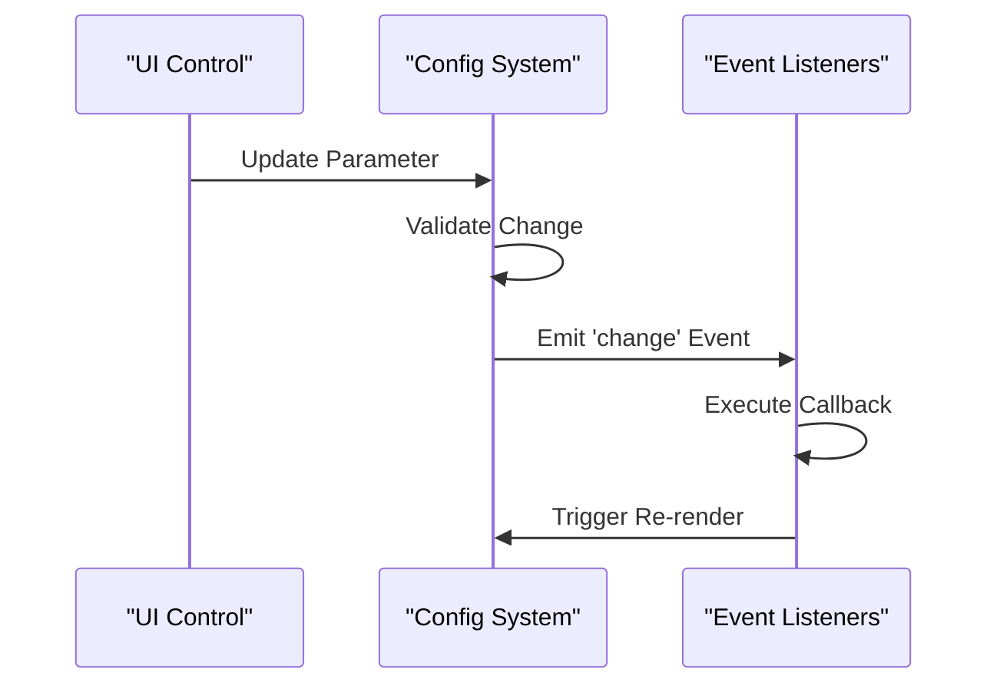

# API Reference

<cite>
**Referenced Files in This Document**
- [tasks.md](file://aicontext/tasks.md)
- [README.md](file://README.md)
</cite>

## Table of Contents
1. [Introduction](#introduction)
2. [Event System API](#event-system-api)
3. [Export Functions](#export-functions)
4. [Preset System API](#preset-system-api)
5. [Security Considerations](#security-considerations)
6. [Client Implementation Guidelines](#client-implementation-guidelines)
7. [Error Handling Strategies](#error-handling-strategies)
8. [Rate Limiting Recommendations](#rate-limiting-recommendations)

## Introduction

The Plexus Canvas application exposes a comprehensive set of public APIs for configuration management, data export/import operations, and preset system interactions. These APIs enable external applications and custom scripts to integrate seamlessly with the canvas rendering system while maintaining security and performance standards.

The API is built around a clean vanilla JavaScript architecture with ES2020+ features, ensuring compatibility with modern web environments without requiring additional frameworks or libraries.

## Event System API

### config.on('change', callback)

The configuration change event system allows external code to subscribe to real-time updates whenever configuration parameters are modified.

#### Function Signature
```javascript
config.on(eventName, callback)
```

#### Parameters
- **eventName** (string): Must be `'change'` to subscribe to configuration changes
- **callback** (function): Callback function that receives two parameters:
  - **path** (string): Dot-separated path to the changed configuration property
  - **value** (any): New value of the changed property

#### Usage Example
```javascript
// Subscribe to all configuration changes
config.on('change', (path, value) => {
  console.log(`Configuration changed at ${path}:`, value);
  
  // Handle specific configuration changes
  if (path === 'particles.count') {
    console.log('Particle count changed:', value);
    // Trigger reinitialization or update logic
  }
});

// Unsubscribe from events
const unsubscribe = config.on('change', handler);
unsubscribe(); // Remove the listener
```

#### Event Flow


**Diagram sources**
- [tasks.md](file://aicontext/tasks.md#L207-L230)

**Section sources**
- [tasks.md](file://aicontext/tasks.md#L207-L230)

## Export Functions

### exportJSON(config)

Exports the current configuration as a JSON string for storage or transmission.

#### Function Signature
```javascript
exportJSON(config) => string
```

#### Parameters
- **config** (object): Current configuration object to serialize

#### Return Value
- **string**: JSON-formatted string representing the current configuration

#### Usage Example
```javascript
// Export current configuration
const currentConfig = getCurrentConfig();
const jsonConfig = exportJSON(currentConfig);

// Save to localStorage
localStorage.setItem('plexus-config', jsonConfig);

// Send to server
fetch('/api/save-config', {
  method: 'POST',
  body: jsonConfig,
  headers: { 'Content-Type': 'application/json' }
});
```

### importJSON(text)

Imports configuration from a JSON string and applies it to the current system.

#### Function Signature
```javascript
importJSON(text) => object | null
```

#### Parameters
- **text** (string): JSON string containing configuration data

#### Return Value
- **object**: Parsed configuration object if successful
- **null**: If parsing fails or validation errors occur

#### Usage Example
```javascript
try {
  const savedConfig = localStorage.getItem('plexus-config');
  const config = importJSON(savedConfig);
  
  if (config) {
    applyConfiguration(config);
    console.log('Configuration loaded successfully');
  } else {
    console.warn('Failed to load configuration');
  }
} catch (error) {
  console.error('Invalid JSON:', error.message);
}
```

### savePNG(canvas)

Triggers a PNG download of the current canvas content with appropriate DPI scaling.

#### Function Signature
```javascript
savePNG(canvas) => void
```

#### Parameters
- **canvas** (HTMLCanvasElement): Canvas element to capture as PNG

#### Usage Example
```javascript
// Get the canvas element
const canvas = document.getElementById('plexusCanvas');

// Save PNG with proper DPI scaling
savePNG(canvas);

// Alternative with custom filename
function saveCustomPNG(canvas, filename) {
  const dataURL = canvas.toDataURL('image/png');
  const link = document.createElement('a');
  link.download = filename;
  link.href = dataURL;
  link.click();
}
```

### buildShareURL(config)

Generates a shareable URL containing the encoded configuration state.

#### Function Signature
```javascript
buildShareURL(config) => string
```

#### Parameters
- **config** (object): Configuration object to encode

#### Return Value
- **string**: URL with encoded configuration in the hash fragment

#### Usage Example
```javascript
// Build shareable URL
const shareURL = buildShareURL(getCurrentConfig());
console.log('Share this URL:', shareURL);

// Copy to clipboard
navigator.clipboard.writeText(shareURL)
  .then(() => console.log('URL copied to clipboard'))
  .catch(err => console.error('Failed to copy URL:', err));

// Open in new tab
window.open(shareURL, '_blank');
```

#### URL Structure
The generated URL follows this pattern:
```
https://your-app.com/#encoded_config_data
```

Where `encoded_config_data` is a compressed and base64-encoded representation of the configuration object.

**Section sources**
- [tasks.md](file://aicontext/tasks.md#L292-L297)

## Preset System API

### getByName(name)

Retrieves a preset configuration by its name identifier.

#### Function Signature
```javascript
getByName(name) => object | null
```

#### Parameters
- **name** (string): Name of the preset to retrieve

#### Return Value
- **object**: Preset configuration object if found
- **null**: If the preset name is not recognized

#### Usage Example
```javascript
// Available presets from the documentation
const presets = ['Neon Breeze', 'Cosmic Web', 'Wireframe', 'Storm', 'Minimal'];

// Load a specific preset
const presetName = 'Cosmic Web';
const presetConfig = getByName(presetName);

if (presetConfig) {
  applyConfiguration(presetConfig);
  console.log(`Loaded preset: ${presetName}`);
} else {
  console.warn(`Preset "${presetName}" not found`);
}

// Batch load presets
presets.forEach(presetName => {
  const config = getByName(presetName);
  if (config) {
    console.log(`${presetName}:`, config.meta.name);
  }
});
```

#### Preset Categories
The system includes five predefined presets:

1. **Neon Breeze** (Default): Soft gradient with `blendMode=lighten`
2. **Cosmic Web**: Large `maxDistance`, low speed, dark background
3. **Wireframe**: White thin lines, minimal particles, low opacity
4. **Storm**: High `noiseStrength`, high `mouseRepel`
5. **Minimal**: Few particles, thick lines, pastel colors

**Section sources**
- [tasks.md](file://aicontext/tasks.md#L232-L266)

## Security Considerations

### Input Validation

All API functions implement robust input validation to prevent security vulnerabilities:

#### Configuration Validation
- Numeric ranges are strictly enforced (e.g., `count` between 50-3000)
- String values are validated against allowed enumerations
- JSON parsing includes error handling for malformed input

#### Cross-Site Scripting (XSS) Protection
- Configuration data is sanitized before processing
- URLs are properly encoded to prevent injection attacks
- Canvas data URLs are handled securely

#### Data Integrity
- Configuration objects undergo schema validation
- Import operations verify data structure and type safety
- Preset names are checked against whitelist

### Rate Limiting

For export operations, implement rate limiting to prevent abuse:

```javascript
// Example rate limiting implementation
let exportCount = 0;
const MAX_EXPORTS_PER_MINUTE = 10;
const RATE_LIMIT_WINDOW = 60000;

function exportWithRateLimit(operation) {
  const currentTime = Date.now();
  
  // Reset counter if window expired
  if (currentTime - exportCount.timestamp > RATE_LIMIT_WINDOW) {
    exportCount = { count: 0, timestamp: currentTime };
  }
  
  if (exportCount.count >= MAX_EXPORTS_PER_MINUTE) {
    throw new Error('Rate limit exceeded. Please wait before exporting again.');
  }
  
  exportCount.count++;
  return operation();
}
```

**Section sources**
- [tasks.md](file://aicontext/tasks.md#L258-L266)

## Client Implementation Guidelines

### Integration Steps

1. **Initialize the API**
```javascript
// Wait for the application to be ready
document.addEventListener('DOMContentLoaded', () => {
  // Access the global API
  const api = window.PlexusCanvasAPI;
  
  if (!api) {
    console.error('Plexus Canvas API not available');
    return;
  }
  
  // Subscribe to configuration changes
  api.config.on('change', handleConfigChange);
});
```

2. **Error Handling Wrapper**
```javascript
class PlexusCanvasClient {
  constructor() {
    this.api = window.PlexusCanvasAPI;
    this.isReady = !!this.api;
  }
  
  async exportConfig() {
    if (!this.isReady) return null;
    
    try {
      const config = this.getCurrentConfig();
      return this.api.exportJSON(config);
    } catch (error) {
      console.error('Export failed:', error);
      return null;
    }
  }
  
  async importConfig(jsonString) {
    if (!this.isReady) return false;
    
    try {
      const config = this.api.importJSON(jsonString);
      if (config) {
        this.applyConfiguration(config);
        return true;
      }
      return false;
    } catch (error) {
      console.error('Import failed:', error);
      return false;
    }
  }
}
```

3. **Configuration Management**
```javascript
// Persistent configuration storage
class ConfigManager {
  constructor() {
    this.client = new PlexusCanvasClient();
    this.cache = {};
  }
  
  async saveCurrentConfig() {
    const json = await this.client.exportConfig();
    if (json) {
      localStorage.setItem('last-config', json);
      this.cache.lastSaved = Date.now();
    }
  }
  
  async restoreLastConfig() {
    const lastConfig = localStorage.getItem('last-config');
    if (lastConfig) {
      return await this.client.importConfig(lastConfig);
    }
    return false;
  }
}
```

### Best Practices

1. **Debounce Configuration Changes**
```javascript
// Debounce heavy operations
let configTimeout;
config.on('change', (path, value) => {
  clearTimeout(configTimeout);
  configTimeout = setTimeout(() => {
    // Perform expensive operations
    updateRendering();
  }, 100);
});
```

2. **Graceful Degradation**
```javascript
// Check API availability
function initializePlexusIntegration() {
  if (!window.PlexusCanvasAPI) {
    console.warn('Plexus Canvas not available, falling back to defaults');
    return;
  }
  
  // Initialize with fallbacks
  try {
    setupAPIIntegration();
  } catch (error) {
    console.error('API initialization failed:', error);
    setupFallbackMode();
  }
}
```

## Error Handling Strategies

### Invalid JSON Handling

```javascript
function safeImportJSON(text) {
  try {
    // Basic JSON validation
    JSON.parse(text); // Just to check syntax
    
    const config = importJSON(text);
    if (!config) {
      throw new Error('Configuration validation failed');
    }
    
    return config;
  } catch (error) {
    if (error instanceof SyntaxError) {
      return { error: 'Invalid JSON syntax', code: 'INVALID_JSON' };
    } else {
      return { error: 'Configuration validation failed', code: 'VALIDATION_ERROR' };
    }
  }
}
```

### Unsupported Preset Names

```javascript
function safeGetPreset(name) {
  const preset = getByName(name);
  
  if (!preset) {
    console.warn(`Unknown preset: ${name}`);
    
    // Fallback to default preset
    const defaultPresets = ['Neon Breeze', 'Cosmic Web'];
    for (const fallback of defaultPresets) {
      const fallbackPreset = getByName(fallback);
      if (fallbackPreset) {
        console.info(`Using fallback preset: ${fallback}`);
        return fallbackPreset;
      }
    }
    
    return null;
  }
  
  return preset;
}
```

### Canvas Export Errors

```javascript
async function safeSavePNG(canvas) {
  try {
    // Check canvas validity
    if (!canvas || !canvas.getContext) {
      throw new Error('Invalid canvas element');
    }
    
    // Test canvas rendering
    const ctx = canvas.getContext('2d');
    if (!ctx) {
      throw new Error('Cannot access canvas context');
    }
    
    // Attempt export
    savePNG(canvas);
    return true;
  } catch (error) {
    console.error('PNG export failed:', error);
    return false;
  }
}
```

**Section sources**
- [tasks.md](file://aicontext/tasks.md#L258-L266)

## Rate Limiting Recommendations

### Export Operation Limits

Implement rate limiting for export operations to prevent abuse:

```javascript
class RateLimitedAPI {
  constructor(api, options = {}) {
    this.api = api;
    this.options = {
      maxExportsPerMinute: 10,
      maxUrlsPerMinute: 5,
      windowSize: 60000,
      ...options
    };
    this.exportCounts = new Map();
  }
  
  async exportJSON(config) {
    return this._rateLimit('export', () => this.api.exportJSON(config));
  }
  
  async buildShareURL(config) {
    return this._rateLimit('url', () => this.api.buildShareURL(config));
  }
  
  async _rateLimit(operationType, operation) {
    const now = Date.now();
    const key = `${operationType}-${Math.floor(now / this.options.windowSize)}`;
    
    if (!this.exportCounts.has(key)) {
      this.exportCounts.set(key, 0);
    }
    
    const count = this.exportCounts.get(key);
    if (count >= this._getLimit(operationType)) {
      throw new Error('Rate limit exceeded');
    }
    
    this.exportCounts.set(key, count + 1);
    return await operation();
  }
  
  _getLimit(operationType) {
    switch (operationType) {
      case 'export':
        return this.options.maxExportsPerMinute;
      case 'url':
        return this.options.maxUrlsPerMinute;
      default:
        return Infinity;
    }
  }
}
```

### Client-Side Rate Limiting

```javascript
// Client-side throttling
class ThrottledClient {
  constructor(client, throttleMs = 1000) {
    this.client = client;
    this.throttleMs = throttleMs;
    this.lastExportTime = 0;
  }
  
  async exportConfig() {
    const now = Date.now();
    if (now - this.lastExportTime < this.throttleMs) {
      throw new Error('Export operation too frequent');
    }
    
    try {
      const result = await this.client.exportConfig();
      this.lastExportTime = now;
      return result;
    } catch (error) {
      console.error('Export failed:', error);
      throw error;
    }
  }
}
```

### Monitoring and Analytics

```javascript
// Track API usage
class APIMonitor {
  constructor(api) {
    this.api = api;
    this.metrics = {
      exports: 0,
      imports: 0,
      urlBuilds: 0,
      errors: 0
    };
  }
  
  trackExport() {
    this.metrics.exports++;
    this._logMetrics();
  }
  
  trackImport() {
    this.metrics.imports++;
    this._logMetrics();
  }
  
  trackError(error) {
    this.metrics.errors++;
    console.error('API Error:', error);
    this._logMetrics();
  }
  
  _logMetrics() {
    console.log('API Metrics:', this.metrics);
  }
}
```

**Section sources**
- [tasks.md](file://aicontext/tasks.md#L258-L266)