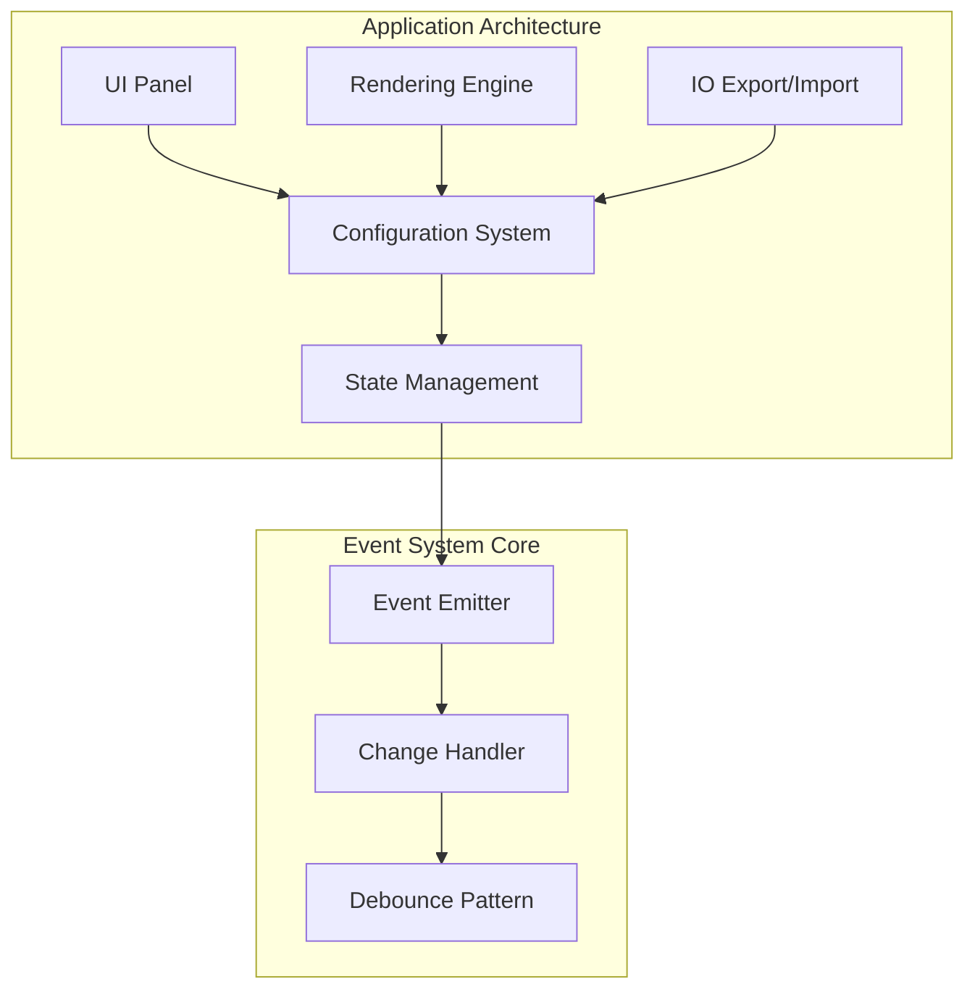
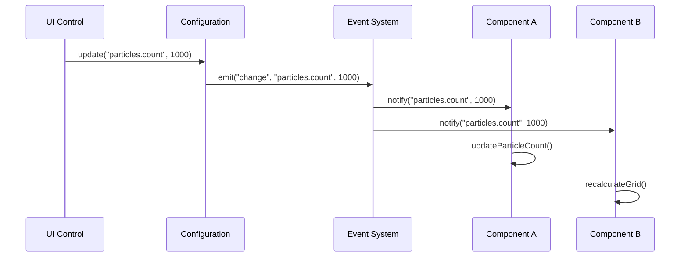
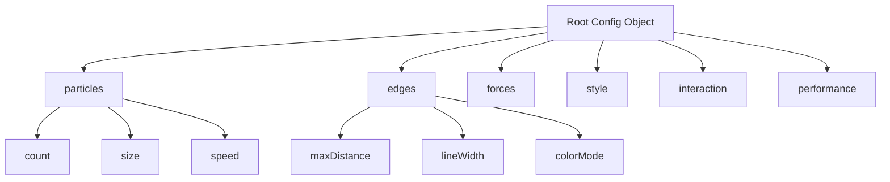
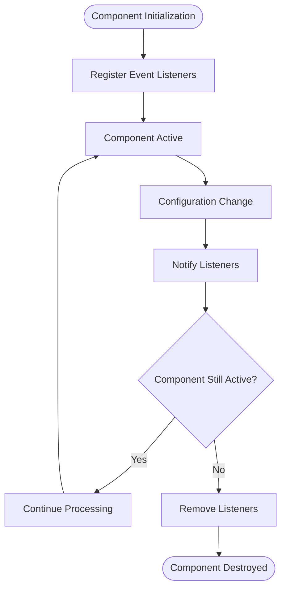
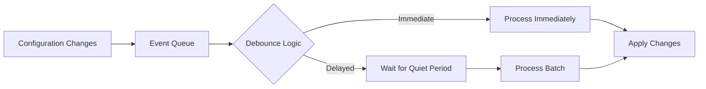
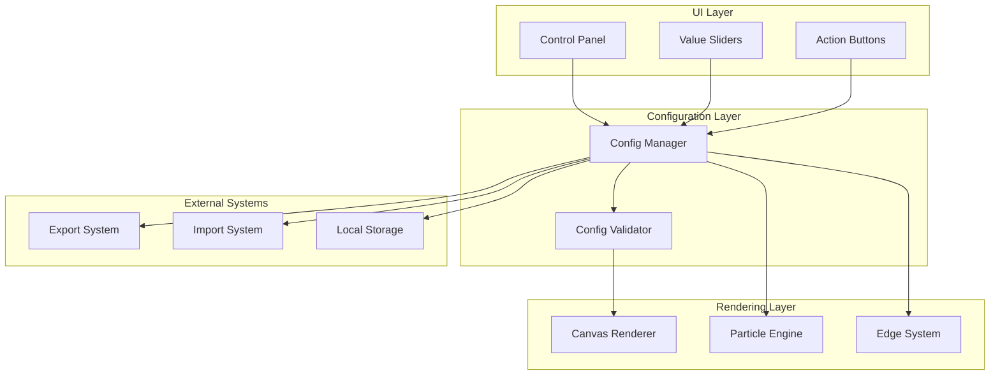

# Event System API Documentation

<cite>
**Referenced Files in This Document**
- [tasks.md](file://aicontext/tasks.md)
- [README.md](file://README.md)
</cite>

## Table of Contents
1. [Introduction](#introduction)
2. [Project Overview](#project-overview)
3. [Event System Architecture](#event-system-architecture)
4. [Configuration Change Events](#configuration-change-events)
5. [Event Listener Management](#event-listener-management)
6. [Performance Considerations](#performance-considerations)
7. [Integration Patterns](#integration-patterns)
8. [Best Practices](#best-practices)
9. [Troubleshooting Guide](#troubleshooting-guide)
10. [Conclusion](#conclusion)

## Introduction

The Plexus Canvas project implements an event-driven configuration system that enables reactive updates across the application. This system allows developers to subscribe to configuration changes and reactively update UI components, rendering engines, and external systems in real-time as configuration parameters are modified.

The event system is built around a central `config` object that emits change events whenever configuration values are updated. These events carry essential metadata about the changed property, enabling precise and efficient reaction patterns throughout the application.

## Project Overview

Plexus Canvas is a modern web application that visualizes dynamic particle networks on canvas elements. The project follows a clean architecture with vanilla JavaScript (ES2020+) and organizes code into several key modules:



**Diagram sources**
- [tasks.md](file://aicontext/tasks.md#L4-L22)

**Section sources**
- [tasks.md](file://aicontext/tasks.md#L1-L22)

## Event System Architecture

The event system in Plexus Canvas is designed around a centralized configuration object that manages all application state changes. The architecture follows a publish-subscribe pattern where configuration changes trigger events that subscribers can listen to and react accordingly.

### Core Event Concepts

The event system operates on the principle of declarative configuration updates with immediate reactive responses. When any part of the application modifies a configuration value, the system automatically broadcasts change events to registered listeners.



**Diagram sources**
- [tasks.md](file://aicontext/tasks.md#L207-L210)

### Event Emission Patterns

The system employs intelligent debouncing and batching mechanisms to handle high-frequency updates efficiently. This prevents performance degradation during rapid configuration changes and ensures optimal resource utilization.

**Section sources**
- [tasks.md](file://aicontext/tasks.md#L207-L230)

## Configuration Change Events

### The `config.on('change', callback)` Method

The primary interface for subscribing to configuration changes is the `config.on('change', callback)` method. This method registers a callback function that will be invoked whenever any configuration value is modified.

#### Parameter Specifications

The change event callback receives two parameters:

- **`path`** (string): Represents the configuration key path that was modified
- **`value`** (any): The new value being set for the specified configuration key

```javascript
// Example usage pattern
config.on('change', (path, value) => {
    console.log(`Configuration changed: ${path} = ${value}`);
    
    // React to specific configuration changes
    switch(path) {
        case 'particles.count':
            updateParticleSystem(value);
            break;
        case 'edges.maxDistance':
            rebuildEdgeConnections();
            break;
        case 'style.bg.color':
            updateBackgroundColor(value);
            break;
    }
});
```

### Configuration Key Path Structure

Configuration keys follow a hierarchical path structure that mirrors the JSON configuration object:



**Diagram sources**
- [tasks.md](file://aicontext/tasks.md#L100-L149)

### Event Trigger Scenarios

The configuration change event system responds to various modification scenarios:

1. **Direct Value Updates**: Manual configuration modifications
2. **Batch Operations**: Multiple related changes applied atomically
3. **Reset Operations**: Complete configuration restoration
4. **Import Operations**: Bulk configuration loading from external sources
5. **Hotkey Interactions**: Runtime parameter adjustments via keyboard shortcuts

**Section sources**
- [tasks.md](file://aicontext/tasks.md#L207-L210)

## Event Listener Management

### Registration and Cleanup

Proper event listener management is crucial for maintaining application performance and preventing memory leaks. The system provides mechanisms for both registering and removing event listeners.

```javascript
// Registering event listeners
const listenerId = config.on('change', (path, value) => {
    // Implementation logic
});

// Removing specific listeners
config.off('change', listenerId);

// Removing all listeners for a specific event type
config.removeAllListeners('change');
```

### Memory Leak Prevention

The event system includes safeguards against common memory leak scenarios:



**Diagram sources**
- [tasks.md](file://aicontext/tasks.md#L207-L210)

### Listener Lifecycle Management

Components should implement proper lifecycle management to ensure event listeners are cleaned up appropriately:

```javascript
class ParticleRenderer {
    constructor() {
        this.listenerIds = [];
        this.registerListeners();
    }
    
    registerListeners() {
        const id = config.on('change', this.handleConfigChange.bind(this));
        this.listenerIds.push(id);
    }
    
    destroy() {
        // Clean up all registered listeners
        this.listenerIds.forEach(id => config.off('change', id));
        this.listenerIds = [];
    }
    
    handleConfigChange(path, value) {
        // Handle configuration changes
    }
}
```

**Section sources**
- [tasks.md](file://aicontext/tasks.md#L207-L210)

## Performance Considerations

### High-Frequency Update Handling

The event system implements sophisticated debouncing and throttling mechanisms to handle high-frequency configuration updates efficiently. This is particularly important for parameters that can change rapidly, such as mouse position or animation frame updates.

### Debounce Patterns

The system employs several debouncing strategies:

1. **Immediate Execution**: For critical updates that require immediate response
2. **Delayed Execution**: For expensive operations that can be batched
3. **Leading Edge Debouncing**: Ensures first update is processed immediately
4. **Trailing Edge Debouncing**: Processes the last update after a quiet period



**Diagram sources**
- [tasks.md](file://aicontext/tasks.md#L207-L210)

### Performance Optimization Strategies

The system implements several performance optimization techniques:

- **Selective Updates**: Only process changes that affect the current operation
- **Lazy Evaluation**: Defer expensive computations until absolutely necessary
- **Resource Pooling**: Reuse expensive objects and calculations
- **Frame Rate Adaptation**: Adjust update frequency based on performance metrics

**Section sources**
- [tasks.md](file://aicontext/tasks.md#L211-L220)

## Integration Patterns

### Custom Module Integration

The event system is designed to integrate seamlessly with custom modules that depend on real-time configuration updates. This enables modular architecture where different parts of the application can react independently to configuration changes.

```javascript
// Example integration with custom module
class CustomModule {
    constructor() {
        this.configListener = null;
        this.initialize();
    }
    
    initialize() {
        // Store reference to prevent garbage collection
        this.configListener = (path, value) => {
            this.handleConfigChange(path, value);
        };
        
        config.on('change', this.configListener);
    }
    
    handleConfigChange(path, value) {
        // Custom logic based on configuration changes
        if (path.startsWith('customModule.')) {
            this.updateCustomLogic(path, value);
        }
    }
    
    destroy() {
        if (this.configListener) {
            config.off('change', this.configListener);
        }
    }
}
```

### Cross-System Communication

The event system facilitates communication between different subsystems:



**Diagram sources**
- [tasks.md](file://aicontext/tasks.md#L4-L22)

**Section sources**
- [tasks.md](file://aicontext/tasks.md#L4-L22)

## Best Practices

### Event Listener Registration

Follow these guidelines for effective event listener registration:

1. **Use Descriptive Callback Names**: Make callback functions easily identifiable
2. **Implement Proper Error Handling**: Wrap event handlers in try-catch blocks
3. **Maintain Reference Management**: Keep track of listener IDs for proper cleanup
4. **Consider Event Bubbling**: Understand how events propagate through the system

### Configuration Change Handling

Implement robust configuration change handling:

```javascript
// Good practice example
class ConfigAwareComponent {
    constructor() {
        this.configChanges = new Map();
        this.setupEventHandling();
    }
    
    setupEventHandling() {
        const handler = (path, value) => {
            try {
                this.handleConfigChange(path, value);
            } catch (error) {
                console.error(`Error handling config change for ${path}:`, error);
            }
        };
        
        this.configListenerId = config.on('change', handler);
    }
    
    handleConfigChange(path, value) {
        // Efficient change handling
        if (!this.shouldReactToChange(path)) {
            return;
        }
        
        // Batch related changes
        this.configChanges.set(path, value);
        
        // Process changes after a brief delay
        setTimeout(() => {
            this.processBatchedChanges();
            this.configChanges.clear();
        }, 16); // ~60fps
    }
    
    shouldReactToChange(path) {
        // Implement filtering logic
        return path.startsWith(this.targetPrefix);
    }
    
    processBatchedChanges() {
        // Process accumulated changes
        this.configChanges.forEach((value, path) => {
            this.reactToChange(path, value);
        });
    }
}
```

### Testing Event-Driven Code

Write comprehensive tests for event-driven functionality:

```javascript
describe('Configuration Event System', () => {
    let mockConfig;
    let changeCallback;
    
    beforeEach(() => {
        mockConfig = createMockConfig();
        changeCallback = jest.fn();
        mockConfig.on('change', changeCallback);
    });
    
    afterEach(() => {
        mockConfig.removeAllListeners('change');
    });
    
    it('should notify listeners of configuration changes', () => {
        mockConfig.set('test.key', 'new value');
        expect(changeCallback).toHaveBeenCalledWith('test.key', 'new value');
    });
    
    it('should support multiple listeners', () => {
        const secondCallback = jest.fn();
        mockConfig.on('change', secondCallback);
        
        mockConfig.set('test.key', 'value');
        
        expect(changeCallback).toHaveBeenCalled();
        expect(secondCallback).toHaveBeenCalled();
    });
});
```

## Troubleshooting Guide

### Common Issues and Solutions

#### Issue: Event Listeners Not Firing

**Symptoms**: Configuration changes are made but event callbacks are not executed.

**Possible Causes**:
- Listener not properly registered
- Event emitter not initialized
- Callback function has errors

**Solutions**:
```javascript
// Verify listener registration
const listenerId = config.on('change', callback);
console.log('Listener ID:', listenerId);

// Check for initialization issues
if (!config.isInitialized()) {
    throw new Error('Configuration system not initialized');
}

// Add error handling to callbacks
const safeCallback = (path, value) => {
    try {
        callback(path, value);
    } catch (error) {
        console.error('Error in config change handler:', error);
    }
};
config.on('change', safeCallback);
```

#### Issue: Memory Leaks from Unremoved Listeners

**Symptoms**: Application performance degrades over time, memory usage increases.

**Solutions**:
```javascript
// Implement proper cleanup
class ComponentWithCleanup {
    constructor() {
        this.listeners = [];
        this.initialize();
    }
    
    initialize() {
        const listener = (path, value) => this.handleConfigChange(path, value);
        const id = config.on('change', listener);
        this.listeners.push({ id, callback: listener });
    }
    
    destroy() {
        this.listeners.forEach(({ id, callback }) => {
            config.off('change', id);
        });
        this.listeners = [];
    }
}
```

#### Issue: Rapid-Fire Events Causing Performance Problems

**Symptoms**: UI becomes unresponsive during configuration changes.

**Solutions**:
```javascript
// Implement debouncing
class DebouncedConfigHandler {
    constructor() {
        this.pendingUpdates = new Map();
        this.updateTimeout = null;
    }
    
    handleConfigChange(path, value) {
        // Clear existing pending update for this path
        if (this.pendingUpdates.has(path)) {
            clearTimeout(this.pendingUpdates.get(path).timeout);
        }
        
        // Schedule new update with debouncing
        const timeout = setTimeout(() => {
            this.performUpdate(path, value);
            this.pendingUpdates.delete(path);
        }, 16); // 60fps
        
        this.pendingUpdates.set(path, { value, timeout });
    }
    
    performUpdate(path, value) {
        // Actual update logic
    }
}
```

### Debugging Tools

Enable debug mode for comprehensive event tracking:

```javascript
// Enable debug logging
config.enableDebug(true);

// Track all configuration changes
config.on('change', (path, value) => {
    console.log(`DEBUG: Config change - ${path}:`, value);
    console.trace(); // Show call stack
});
```

**Section sources**
- [tasks.md](file://aicontext/tasks.md#L207-L230)

## Conclusion

The event-driven configuration system in Plexus Canvas provides a robust foundation for building reactive applications. By leveraging the `config.on('change', callback)` method, developers can create responsive user interfaces and efficient rendering systems that adapt to configuration changes in real-time.

Key takeaways for effective implementation:

1. **Proper Listener Management**: Always register and clean up event listeners to prevent memory leaks
2. **Performance Awareness**: Implement debouncing and throttling for high-frequency updates
3. **Error Resilience**: Wrap event handlers in error boundaries to maintain application stability
4. **Modular Design**: Use the event system to enable loose coupling between application modules
5. **Testing Strategy**: Implement comprehensive tests for event-driven functionality

The system's architecture supports complex interaction patterns while maintaining simplicity for basic use cases. Whether building simple UI controls or complex rendering engines, the event system provides the flexibility and performance needed for modern web applications.

Future enhancements could include advanced filtering capabilities, selective event propagation, and enhanced debugging tools to further improve the developer experience and application performance.