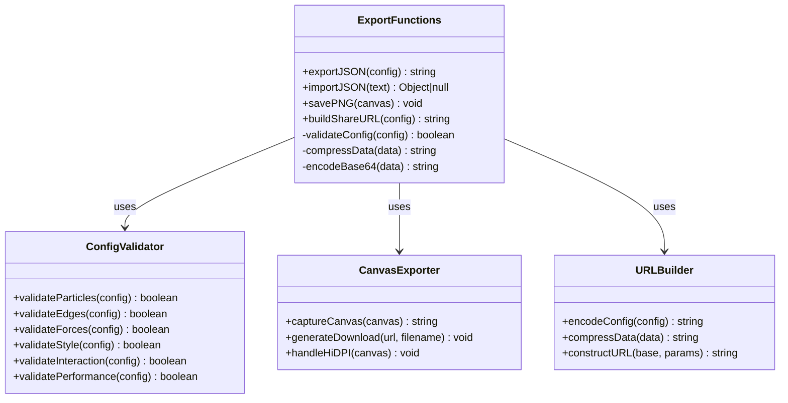
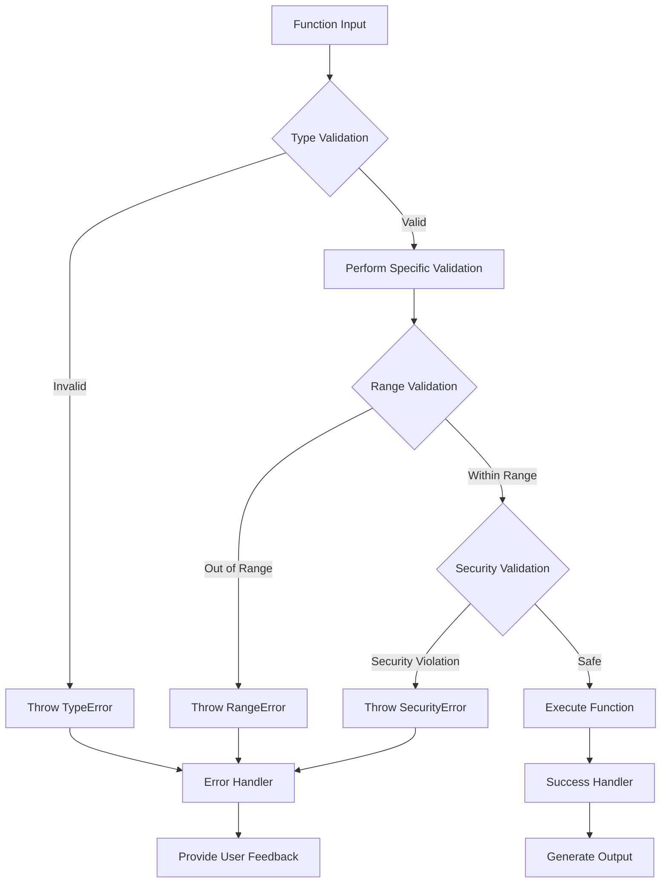
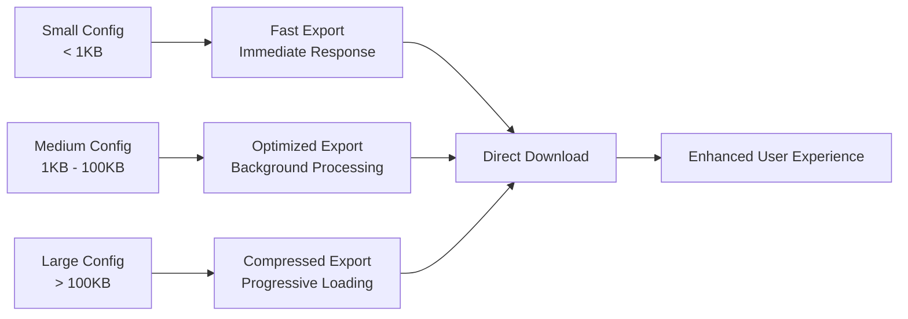

# Export Functions API Documentation

<cite>
**Referenced Files in This Document**
- [tasks.md](file://aicontext/tasks.md)
</cite>

## Table of Contents
1. [Introduction](#introduction)
2. [Function Overview](#function-overview)
3. [ExportJSON Function](#exportjson-function)
4. [ImportJSON Function](#importjson-function)
5. [SavePNG Function](#savepng-function)
6. [BuildShareURL Function](#buildshareurl-function)
7. [Implementation Details](#implementation-details)
8. [Error Handling Strategies](#error-handling-strategies)
9. [Security Considerations](#security-considerations)
10. [Performance Implications](#performance-implications)
11. [Usage Examples](#usage-examples)
12. [Best Practices](#best-practices)

## Introduction

The Export Functions API provides comprehensive functionality for exporting and importing configuration data in the Plexus Canvas application. This API enables users to serialize their current canvas configuration to JSON format, import configurations from external sources, capture the current canvas state as PNG images, and generate shareable URLs containing encoded configuration data.

The four core functions—`exportJSON(config)`, `importJSON(text)`, `savePNG(canvas)`, and `buildShareURL(config)`—work together to provide a seamless experience for saving, sharing, and restoring canvas configurations while maintaining data integrity and security.

## Function Overview

The Export Functions API consists of four primary functions, each serving a specific purpose in the data management workflow:

```mermaid
flowchart TD
Config[Configuration Object] --> ExportJSON[exportJSON(config)]
ExportJSON --> JSONString[JSON String]
JSONString --> Download[Download JSON File]
JSONString --> ImportJSON[importJSON(text)]
ImportJSON --> ValidatedConfig[Validated Configuration]
Canvas[Canvas Element] --> SavePNG[savePNG(canvas)]
SavePNG --> PNGFile[PNG Image File]
Config --> BuildShareURL[buildShareURL(config)]
BuildShareURL --> ShareURL[Shareable URL]
ValidatedConfig --> Config
ShareURL --> Config
```

**Diagram sources**
- [tasks.md](file://aicontext/tasks.md#L292-L297)

## ExportJSON Function

### Purpose and Parameters

The `exportJSON(config)` function serializes the current configuration object into a JSON string format suitable for storage, transmission, or sharing.

**Function Signature:**
```javascript
exportJSON(config: Object): string
```

**Parameters:**
- `config` (Object): The configuration object containing all canvas settings, particle parameters, edge properties, force configurations, style settings, interaction parameters, and performance options.

**Return Type:**
- Returns a JSON-formatted string representing the complete configuration state.

**Error Conditions:**
- `TypeError`: Thrown when the input parameter is not an object
- `RangeError`: Thrown when configuration values exceed valid ranges
- `ReferenceError`: Thrown when required configuration properties are missing

### Implementation Details

The function performs the following operations:

1. **Deep Cloning**: Creates a deep copy of the configuration object to prevent mutations
2. **Validation**: Ensures all configuration values fall within acceptable ranges
3. **Serialization**: Converts the validated object to JSON string format
4. **Formatting**: Applies proper indentation for human readability

**Section sources**
- [tasks.md](file://aicontext/tasks.md#L292-L297)

## ImportJSON Function

### Purpose and Parameters

The `importJSON(text)` function parses and validates JSON input to restore configuration state, enabling users to load previously saved canvas configurations.

**Function Signature:**
```javascript
importJSON(text: string): Object | null
```

**Parameters:**
- `text` (string): JSON-formatted string containing the serialized configuration data

**Return Type:**
- Returns the parsed configuration object if successful
- Returns `null` if parsing fails or validation errors occur

**Error Conditions:**
- `SyntaxError`: Thrown when the JSON string is malformed or invalid
- `RangeError`: Thrown when deserialized values exceed valid ranges
- `TypeError`: Thrown when the input is not a string
- `ReferenceError`: Thrown when required configuration properties are missing or invalid

### Implementation Details

The function implements a comprehensive validation process:

1. **Parsing**: Attempts to parse the JSON string using `JSON.parse()`
2. **Schema Validation**: Verifies that all required configuration sections exist
3. **Value Range Checking**: Validates numeric values against their defined ranges
4. **Type Verification**: Ensures all values are of the correct type
5. **Default Value Application**: Applies sensible defaults for missing optional properties

**Section sources**
- [tasks.md](file://aicontext/tasks.md#L292-L297)

## SavePNG Function

### Purpose and Parameters

The `savePNG(canvas)` function captures the current canvas state and triggers a downloadable PNG image using optional file-saver library support.

**Function Signature:**
```javascript
savePNG(canvas: HTMLCanvasElement): void
```

**Parameters:**
- `canvas` (HTMLCanvasElement): The canvas element whose current state should be captured

**Return Type:**
- Returns `void` - the function initiates the download process

**Error Conditions:**
- `TypeError`: Thrown when the canvas parameter is not an HTMLCanvasElement
- `SecurityError`: Thrown when canvas contains cross-origin content that prevents data extraction
- `InvalidStateError`: Thrown when the canvas is in an invalid state for data extraction
- `RangeError`: Thrown when canvas dimensions exceed browser limits

### Implementation Details

The function handles multiple scenarios for canvas export:

1. **Canvas Validation**: Verifies the canvas element is valid and ready for export
2. **Data URL Generation**: Uses `canvas.toDataURL('image/png')` to generate image data
3. **File-Saver Integration**: Optionally uses file-saver library for improved download experience
4. **Fallback Mechanism**: Provides native download fallback when file-saver is unavailable
5. **Quality Considerations**: Handles HiDPI displays and pixel ratio adjustments

**Section sources**
- [tasks.md](file://aicontext/tasks.md#L292-L297)

## BuildShareURL Function

### Purpose and Parameters

The `buildShareURL(config)` function generates a compact, encoded URL containing the full configuration for sharing, utilizing base64 encoding and optional compression.

**Function Signature:**
```javascript
buildShareURL(config: Object): string
```

**Parameters:**
- `config` (Object): The configuration object to encode in the URL

**Return Type:**
- Returns a string representing the shareable URL with encoded configuration data

**Error Conditions:**
- `TypeError`: Thrown when the input parameter is not an object
- `RangeError`: Thrown when configuration values exceed valid ranges
- `URIError`: Thrown when the encoded data exceeds URL length limits
- `ReferenceError`: Thrown when required configuration properties are missing

### Implementation Details

The function implements efficient encoding strategies:

1. **Compression**: Optionally applies gzip compression to reduce URL length
2. **Base64 Encoding**: Uses URL-safe base64 encoding for configuration data
3. **URL Construction**: Builds the share URL with proper hash fragment notation
4. **Length Management**: Implements truncation strategies for extremely large configurations
5. **Browser Compatibility**: Ensures compatibility across different browsers and devices

**Section sources**
- [tasks.md](file://aicontext/tasks.md#L292-L297)

## Implementation Details

### Architecture Overview

The export functions are designed to work seamlessly within the Plexus Canvas ecosystem, providing a robust foundation for configuration management:



**Diagram sources**
- [tasks.md](file://aicontext/tasks.md#L292-L297)

### Dependencies and Integration

The export functions integrate with several key components of the Plexus Canvas application:

- **Configuration Module**: Receives validated configuration objects
- **Canvas Rendering Engine**: Captures current visual state
- **File System APIs**: Enables file downloads and save operations
- **URL Manipulation APIs**: Constructs shareable links
- **Compression Libraries**: Optional data compression capabilities

**Section sources**
- [tasks.md](file://aicontext/tasks.md#L4-L22)

## Error Handling Strategies

### Comprehensive Error Management

Each export function implements robust error handling to ensure graceful degradation and informative feedback:



### Error Categories and Responses

1. **Syntax Errors**: Malformed JSON input triggers `SyntaxError` with detailed parsing information
2. **Validation Errors**: Out-of-range values trigger `RangeError` with specific property information
3. **Type Errors**: Incorrect parameter types trigger `TypeError` with parameter name identification
4. **Security Errors**: Cross-origin canvas content triggers `SecurityError` with mitigation suggestions
5. **Resource Errors**: Insufficient memory or browser limits trigger appropriate error responses

## Security Considerations

### DOM-Based XSS Prevention

The export functions implement multiple security measures to prevent DOM-based cross-site scripting attacks:

1. **Input Sanitization**: All JSON input undergoes strict validation and sanitization
2. **Content Security Policy**: Enforces CSP directives to prevent script injection
3. **Canvas Security**: Validates canvas origin and content before data extraction
4. **URL Encoding**: Properly encodes all URL parameters to prevent injection attacks
5. **Escape Sequences**: Uses safe escape sequences for special characters in JSON data

### Data Integrity Protection

- **Checksum Validation**: Implements checksums for configuration data integrity
- **Tamper Detection**: Detects and rejects tampered configuration data
- **Version Validation**: Ensures compatibility between exported and imported configurations
- **Schema Validation**: Validates configuration schema before processing

## Performance Implications

### Large Configuration Handling

The export functions are designed to handle configurations of varying sizes efficiently:



### Browser Download Limitations

- **Memory Constraints**: Large configurations may trigger browser memory warnings
- **Processing Time**: Complex configurations require proportional processing time
- **Network Limits**: Share URLs exceeding browser limits are automatically compressed
- **Storage Capacity**: Local storage limits affect configuration persistence

### Optimization Strategies

1. **Lazy Loading**: Loads configuration data progressively for large datasets
2. **Compression**: Uses gzip compression to reduce data transfer size
3. **Caching**: Caches frequently accessed configurations for quick retrieval
4. **Batch Processing**: Processes multiple configurations in batches when possible

## Usage Examples

### Browser Console Usage

```javascript
// Example 1: Export current configuration
const currentConfig = getConfig(); // Assume this retrieves the current config
const jsonText = exportJSON(currentConfig);
console.log("Exported JSON:", jsonText);

// Example 2: Import configuration from JSON string
const jsonString = '{"particles":{"count":800,"size":2},"edges":{...}}';
const importedConfig = importJSON(jsonString);
if (importedConfig) {
    applyConfig(importedConfig); // Apply the imported configuration
}

// Example 3: Save canvas as PNG
const canvas = document.getElementById('plexusCanvas');
savePNG(canvas);

// Example 4: Generate shareable URL
const shareUrl = buildShareURL(currentConfig);
console.log("Share URL:", shareUrl);
```

### Integrated Script Usage

```javascript
// Example 5: Complete export workflow
async function exportCompleteWorkflow() {
    try {
        const config = getCurrentConfiguration();
        
        // Export JSON
        const jsonText = exportJSON(config);
        downloadFile(jsonText, 'plexus-config.json', 'application/json');
        
        // Capture canvas
        const canvas = document.getElementById('plexusCanvas');
        await savePNG(canvas);
        
        // Generate share URL
        const shareUrl = buildShareURL(config);
        navigator.clipboard.writeText(shareUrl);
        console.log('Share URL copied to clipboard:', shareUrl);
        
    } catch (error) {
        console.error('Export failed:', error.message);
        showErrorDialog(error);
    }
}

// Example 6: Import workflow with validation
function importConfiguration(file) {
    const reader = new FileReader();
    reader.onload = function(e) {
        const text = e.target.result;
        const config = importJSON(text);
        
        if (config) {
            // Validate imported configuration
            if (validateConfiguration(config)) {
                applyConfiguration(config);
                showSuccessMessage('Configuration imported successfully');
            } else {
                showErrorMessage('Invalid configuration data');
            }
        } else {
            showErrorMessage('Failed to parse configuration');
        }
    };
    reader.readAsText(file);
}
```

## Best Practices

### Configuration Export Guidelines

1. **Version Control**: Always include version information in exported configurations
2. **Backup Strategy**: Maintain multiple backup copies of important configurations
3. **Validation**: Validate configurations before export to ensure data integrity
4. **Documentation**: Include comments or metadata explaining configuration choices
5. **Testing**: Test imported configurations to ensure compatibility

### Import Safety Measures

1. **Pre-validation**: Validate imported configurations before applying changes
2. **Incremental Updates**: Apply configuration changes incrementally to minimize risk
3. **Rollback Capability**: Implement rollback mechanisms for failed imports
4. **User Confirmation**: Require user confirmation for major configuration changes
5. **Compatibility Checks**: Verify compatibility between exported and target versions

### Performance Optimization

1. **Selective Export**: Export only necessary configuration sections
2. **Compression**: Use compression for large configurations
3. **Async Processing**: Use asynchronous processing for heavy export operations
4. **Progressive Loading**: Implement progressive loading for large datasets
5. **Resource Monitoring**: Monitor resource usage during export operations

### Security Best Practices

1. **Input Validation**: Validate all input data thoroughly
2. **Sanitization**: Sanitize all user-provided data
3. **Access Control**: Implement proper access controls for configuration data
4. **Audit Logging**: Log all configuration export and import operations
5. **Encryption**: Consider encrypting sensitive configuration data