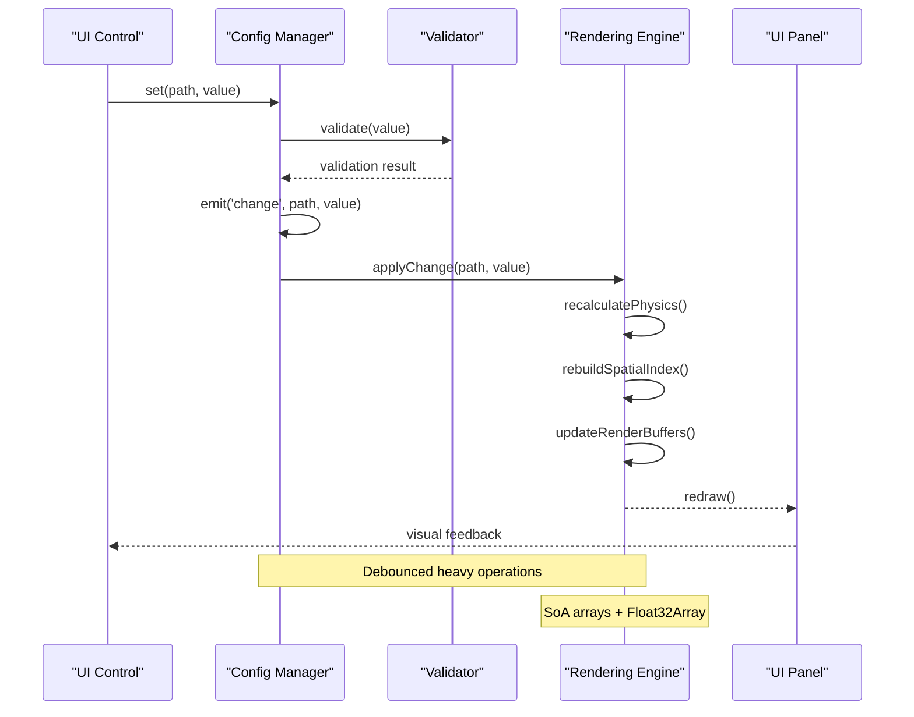

# Configuration Schema Documentation

<cite>
**Referenced Files in This Document**
- [tasks.md](file://aicontext/tasks.md)
</cite>

## Table of Contents
1. [Introduction](#introduction)
2. [Schema Overview](#schema-overview)
3. [Configuration Sections](#configuration-sections)
4. [Default Values and Validation](#default-values-and-validation)
5. [Event-Driven System](#event-driven-system)
6. [Performance Considerations](#performance-considerations)
7. [Programmatic Modifications](#programmatic-modifications)
8. [Common Issues and Solutions](#common-issues-and-solutions)
9. [Schema Evolution](#schema-evolution)
10. [Implementation Guidelines](#implementation-guidelines)

## Introduction

The Plexus Canvas Configuration Schema defines the complete JSON structure used to configure particle network visualizations. This schema enables real-time parameter modification without requiring page reloads, supports presets, and provides export/import capabilities for sharing configurations. The schema is designed around an event-driven architecture that propagates changes through the system efficiently.

The configuration system manages all aspects of the particle network simulation including particle behavior, edge connections, forces, styling, interaction, and performance optimization settings. Each section of the configuration controls specific aspects of the visualization while maintaining compatibility with the underlying rendering engine.

## Schema Overview

The configuration schema is structured as a hierarchical JSON object with seven main sections, plus metadata. Each section contains specific parameters that control different aspects of the particle network visualization.

```mermaid
graph TB
Config["Configuration Object"] --> Particles["particles"]
Config --> Edges["edges"]
Config --> Forces["forces"]
Config --> Style["style"]
Config --> Interaction["interaction"]
Config --> Performance["performance"]
Config --> Meta["meta"]
Particles --> ParticleCount["count: 50-3000"]
Particles --> ParticleSize["size: 1-6"]
Particles --> ParticleSpeed["speed: 0-2"]
Particles --> ParticleJitter["jitter: 0-1"]
Particles --> ParticleSpawn["spawnArea: full/ellipse/ring/rect"]
Edges --> EdgeMaxDist["maxDistance: 30-400"]
Edges --> EdgeMaxEdges["maxEdgesPerNode: 0-12"]
Edges --> EdgeWidth["lineWidth: 0.2-3"]
Edges --> EdgeOpacity["lineOpacity: 0-1"]
Edges --> EdgeBlend["blendMode: normal/lighten/screen/overlay"]
Edges --> EdgeColorMode["colorMode: static/byDistance/byVelocity"]
Edges --> EdgeStaticColor["staticColor: #hex"]
Forces --> NoiseStrength["noiseStrength: 0-1"]
Forces --> Gravity["gravity: -1-1"]
Forces --> Drag["drag: 0-1"]
Style --> Background["bg: color + opacity"]
Style --> ParticleColor["particleColor: #hex/auto"]
Style --> Gradient["gradient: array of stops"]
Interaction --> MouseRepel["mouseRepel: 0-1"]
Interaction --> MouseRadius["mouseRadius: pixels"]
Interaction --> HoverHighlight["hoverHighlight: bool"]
Interaction --> ClickSpawn["clickSpawn: bool"]
Performance --> FPSCap["fpsCap: 30/60/120/off"]
Performance --> PixelRatio["pixelRatioMode: auto/1x/2x"]
Performance --> SpatialIndex["spatialIndex: none/grid/quadtree"]
Performance --> BatchEdges["batchEdges: bool"]
Meta --> MetaName["name: string"]
Meta --> MetaVersion["version: number"]
```



**Diagram sources**
- [tasks.md](file://aicontext/tasks.md#L102-L178)

## Configuration Sections

### Particles Section

The particles section controls the fundamental behavior and appearance of individual particles in the network.

**Parameters:**
- `count` (Number): Number of particles, range 50-3000
- `size` (Number): Particle size in pixels, range 1-6
- `speed` (Number): Base speed of particles, range 0-2 pixels per millisecond
- `jitter` (Number): Random variation in movement, range 0-1
- `spawnArea` (String): Area where particles spawn, one of: "full", "ellipse", "ring", "rect"

**Functional Impact:**
- Controls the density and visual appearance of particles
- Affects performance linearly with particle count
- Determines initial distribution pattern
- Influences collision detection and edge formation

### Edges Section

The edges section defines how particles connect and form the network structure.

**Parameters:**
- `maxDistance` (Number): Maximum distance for edge connection, range 30-400 pixels
- `maxEdgesPerNode` (Number): Maximum number of edges per particle, range 0-12
- `lineWidth` (Number): Edge line thickness, range 0.2-3 pixels
- `lineOpacity` (Number): Edge transparency, range 0-1
- `blendMode` (String): Canvas blend mode for edges, one of: "normal", "lighten", "screen", "overlay"
- `colorMode` (String): Edge coloring strategy, one of: "static", "byDistance", "byVelocity"
- `staticColor` (String): Hex color for static color mode

**Functional Impact:**
- Determines network connectivity and visual complexity
- Affects rendering performance based on edge count
- Controls visual aesthetics through blending modes
- Supports dynamic color gradients based on distance or velocity

### Forces Section

The forces section governs the physics and motion dynamics of particles.

**Parameters:**
- `noiseStrength` (Number): Pseudo-random noise influence, range 0-1
- `gravity` (Number): Central attraction/repulsion force, range -1 to 1
- `drag` (Number): Velocity damping factor, range 0-1

**Functional Impact:**
- Creates organic, flowing motion patterns
- Controls particle clustering and dispersion
- Enables emergent behavior through noise injection
- Maintains stability through drag coefficient

### Style Section

The style section handles visual appearance and theming.

**Parameters:**
- `bg` (Object): Background configuration with `color` and `opacity`
- `particleColor` (String): Color for particles, hex or "auto" for gradient
- `gradient` (Array): Array of gradient stops with `stop` (0.0-1.0) and `color` (hex)

**Functional Impact:**
- Defines overall visual theme and contrast
- Supports gradient-based particle coloring
- Controls background transparency effects
- Enables color scheme customization

### Interaction Section

The interaction section manages user input and dynamic responses.

**Parameters:**
- `mouseRepel` (Number): Repulsion strength from mouse cursor, range 0-1
- `mouseRadius` (Number): Radius of mouse interaction effect in pixels
- `hoverHighlight` (Boolean): Whether to highlight particles on hover
- `clickSpawn` (Boolean): Whether clicking spawns new particles

**Functional Impact:**
- Enables interactive exploration of the network
- Provides real-time feedback to user actions
- Supports creative particle generation
- Enhances user engagement and experimentation

### Performance Section

The performance section optimizes rendering and computational efficiency.

**Parameters:**
- `fpsCap` (Number/String): Frame rate limit, one of: 30, 60, 120, "off"
- `pixelRatioMode` (String): Device pixel ratio setting, one of: "auto", "1x", "2x"
- `spatialIndex` (String): Spatial indexing strategy, one of: "none", "grid", "quadtree"
- `batchEdges` (Boolean): Whether to batch edge rendering operations

**Functional Impact:**
- Balances visual quality with performance
- Adapts to different hardware capabilities
- Optimizes memory usage and computation
- Reduces visual artifacts through batching

### Meta Section

The meta section contains metadata about the configuration.

**Parameters:**
- `name` (String): Human-readable name for the configuration
- `version` (Number): Version number for schema compatibility

**Functional Impact:**
- Enables configuration identification and categorization
- Supports version tracking and migration
- Facilitates preset management and organization

**Section sources**
- [tasks.md](file://aicontext/tasks.md#L102-L178)

## Default Values and Validation

The configuration system initializes with predefined default values for all parameters, ensuring predictable behavior and preventing invalid states. Each parameter has strict validation rules to maintain system stability and performance.

### Default Configuration

```javascript
const defaultConfig = {
  particles: {
    count: 800,
    size: 2,
    speed: 0.35,
    jitter: 0.2,
    spawnArea: "full"
  },
  edges: {
    maxDistance: 140,
    maxEdgesPerNode: 6,
    lineWidth: 1,
    lineOpacity: 0.6,
    blendMode: "lighten",
    colorMode: "byDistance",
    staticColor: "#88ccff"
  },
  forces: {
    noiseStrength: 0.15,
    gravity: 0.05,
    drag: 0.02
  },
  style: {
    bg: { color: "#0b1020", opacity: 1 },
    particleColor: "#e0f2ff",
    gradient: [
      { stop: 0.0, color: "#00e5ff" },
      { stop: 1.0, color: "#7c4dff" }
    ]
  },
  interaction: {
    mouseRepel: 0.35,
    mouseRadius: 120,
    hoverHighlight: true,
    clickSpawn: false
  },
  performance: {
    fpsCap: 60,
    pixelRatioMode: "auto",
    spatialIndex: "grid",
    batchEdges: true
  },
  meta: {
    name: "Neon Breeze v1",
    version: 1
  }
};
```

### Validation Rules

Each parameter follows specific validation rules:

**Numeric Ranges:**
- `count`: 50-3000 (with warning at 5000)
- `size`: 1-6 pixels
- `speed`: 0-2 px/ms
- `jitter`: 0-1
- `maxDistance`: 30-400 pixels
- `maxEdgesPerNode`: 0-12
- `lineWidth`: 0.2-3 pixels
- `lineOpacity`: 0-1
- `noiseStrength`: 0-1
- `gravity`: -1 to 1
- `drag`: 0-1
- `mouseRepel`: 0-1
- `mouseRadius`: Positive integer pixels

**Enumerated Values:**
- `spawnArea`: "full", "ellipse", "ring", "rect"
- `blendMode`: "normal", "lighten", "screen", "overlay"
- `colorMode`: "static", "byDistance", "byVelocity"
- `fpsCap`: 30, 60, 120, "off"
- `pixelRatioMode`: "auto", "1x", "2x"
- `spatialIndex`: "none", "grid", "quadtree"

**Type Constraints:**
- All numeric values must be finite numbers
- String values must match enumeration exactly
- Boolean values must be true/false
- Objects must have required properties
- Arrays must contain valid elements

**Section sources**
- [tasks.md](file://aicontext/tasks.md#L102-L178)

## Event-Driven System

The configuration system operates on an event-driven architecture that enables real-time updates and maintains consistency across all components. Changes propagate through the system via a centralized event emitter.



**Diagram sources**
- [tasks.md](file://aicontext/tasks.md#L207-L230)

### Event Flow

The event system follows a publish-subscribe pattern:

1. **User Interaction**: UI controls trigger configuration changes
2. **Validation**: New values are validated against schema rules
3. **Event Emission**: Successful changes emit 'change' events
4. **Debouncing**: Heavy operations are debounced to prevent thrashing
5. **Propagation**: Events cascade through dependent systems
6. **Rendering**: Updates trigger re-rendering with minimal overhead

### Change Propagation

Changes propagate through the system in a controlled manner:

**Immediate Updates:**
- Simple parameter changes (numbers, booleans, strings)
- UI feedback and immediate visual updates
- Local state synchronization

**Deferred Operations:**
- Spatial index rebuilding
- Physics recalculations
- Memory-intensive operations
- Debounced for performance

**Batched Updates:**
- Multiple related changes are batched together
- Render operations are synchronized
- Memory allocations are minimized

**Section sources**
- [tasks.md](file://aicontext/tasks.md#L207-L230)

## Performance Considerations

The configuration system is designed with performance optimization in mind, particularly for large-scale particle networks and real-time interaction.

### Memory Management

**Structure of Arrays (SoA):**
- Position arrays: `x[], y[]` (Float32Array)
- Velocity arrays: `vx[], vy[]` (Float32Array)
- Optional color arrays: `color[]` (Float32Array)
- Efficient cache locality and SIMD optimization

**Dynamic Allocation:**
- Particles created on-demand
- Edges rebuilt when distances change
- Spatial indices updated incrementally
- Memory pools for frequent allocations

### Computational Efficiency

**Spatial Indexing Strategies:**
- **Grid Index**: Default, O(n) for neighbor queries
- **Quadtree**: O(log n) for sparse distributions
- Automatic selection based on particle density
- Incremental updates during simulation

**Rendering Optimizations:**
- Single `beginPath()` per frame for edges
- Batched `moveTo()` and `lineTo()` operations
- Conditional shadow/gradients based on performance
- HiDPI support with automatic scaling

### Performance Targets

**Hardware Requirements:**
- Target: 60 FPS with 1000-1500 particles and maxDistance=140
- Minimum: 30 FPS acceptable for larger configurations
- Adaptive: Automatic quality adjustment based on performance

**Quality vs Performance:**
- FPS capping for battery life
- Dynamic spatial index selection
- Conditional feature disabling
- Progressive enhancement

**Section sources**
- [tasks.md](file://aicontext/tasks.md#L8-L22)
- [tasks.md](file://aicontext/tasks.md#L232-L266)

## Programmatic Modifications

The configuration system supports programmatic modifications through a structured API that maintains consistency and validation.

### Setting Configuration Values

```javascript
// Direct property access
config.particles.count = 1000;
config.edges.maxDistance = 200;

// Using setter method
config.set('particles.count', 1000);
config.set('edges.colorMode', 'byVelocity');

// Bulk updates
config.update({
  particles: { count: 1000, size: 3 },
  edges: { maxDistance: 200, lineWidth: 1.5 }
});
```

### Configuration Validation

```javascript
// Manual validation
try {
  const isValid = config.validate();
  if (!isValid) {
    console.error('Invalid configuration:', config.getErrors());
  }
} catch (error) {
  console.error('Validation failed:', error.message);
}

// Partial validation
const partialConfig = {
  particles: { count: 1000 }
};
const isValidPartial = config.validate(partialConfig);
```

### Configuration Export/Import

```javascript
// Export current configuration
const jsonConfig = config.exportJSON();

// Import configuration
try {
  config.importJSON(jsonConfig);
  // Configuration automatically validates and applies
} catch (error) {
  console.error('Failed to import configuration:', error);
}

// Apply preset
config.applyPreset('Neon Breeze');
```

### Advanced Operations

```javascript
// Get configuration diff
const diff = config.diff(previousConfig);

// Merge configurations
const mergedConfig = config.merge(baseConfig, overrideConfig);

// Clone configuration
const clonedConfig = config.clone();

// Reset to defaults
config.reset();

// Reset to specific preset
config.resetToPreset('Minimal');
```

## Common Issues and Solutions

### Invalid Parameter Values

**Problem**: Users attempt to set parameters outside valid ranges
**Solution**: Automatic clamping and validation warnings

```javascript
// Invalid value
config.particles.count = 50000; // Too high

// Automatic correction
console.log(config.particles.count); // 3000 (clamped)
console.warn('Particle count limited to 3000'); // Warning message
```

### Out-of-Range Parameters

**Problem**: Parameters exceed their defined ranges
**Solution**: Graceful degradation and fallback values

```javascript
// Range violation
config.edges.lineWidth = 10; // Exceeds maximum

// Fallback behavior
config.edges.lineWidth = 3; // Clamped to maximum
config.edges.lineWidth = 0.2; // Clamped to minimum
```

### Performance Degradation

**Problem**: Large configuration changes cause performance issues
**Solution**: Debouncing and gradual updates

```javascript
// Large change triggering performance issues
config.particles.count = 3000;

// Gradual update with debouncing
setTimeout(() => {
  config.particles.count = 3000;
}, 100); // Delayed application
```

### Schema Evolution

**Problem**: Configuration schema changes break backward compatibility
**Solution**: Migration system and versioning

```javascript
// Old schema version
const oldConfig = {
  particles: { count: 1000 },
  edges: { maxDistance: 140 }
};

// Automatic migration
const migratedConfig = config.migrate(oldConfig);
// New schema applied with appropriate defaults
```

### Memory Leaks

**Problem**: Accumulation of unused resources
**Solution**: Automatic cleanup and resource pooling

```javascript
// Automatic cleanup
config.cleanup(); // Release unused resources

// Resource pooling
const pool = config.getResourcePool();
const buffer = pool.getBuffer(size);
// Buffer automatically returned to pool
```

## Schema Evolution

The configuration schema is designed to evolve over time while maintaining backward compatibility and smooth transitions.

### Version Management

```javascript
// Current schema version
const currentVersion = 1;

// Version checking
if (config.meta.version < currentVersion) {
  config.migrateToLatest();
}

// Schema evolution tracking
const evolutionHistory = [
  { version: 1, changes: ['Initial release'] },
  { version: 2, changes: ['Added spatial indexing'] },
  { version: 3, changes: ['Enhanced interaction controls'] }
];
```

### Backward Compatibility

**Migration Strategies:**
- Automatic property renaming
- Default value propagation
- Type conversion and coercion
- Deprecation warnings

**Example Migration:**
```javascript
// Old configuration
const oldConfig = {
  particles: { count: 1000, radius: 2 },
  edges: { maxDist: 140 }
};

// Migrated configuration
const migratedConfig = {
  particles: { count: 1000, size: 2 }, // radius renamed to size
  edges: { maxDistance: 140 } // maxDist renamed to maxDistance
};
```

### Future Extensions

**Planned Additions:**
- Additional force types (vortex, spring)
- Advanced edge coloring modes
- Multi-color gradient support
- Animation keyframes for transitions
- Preset categories and tags

**Extension Points:**
- Plugin system for custom parameters
- Dynamic UI control generation
- External configuration sources
- Real-time collaboration features

## Implementation Guidelines

### Configuration Initialization

```javascript
// Initialize with defaults
const config = new ConfigManager(defaultConfig);

// Load from storage
const savedConfig = localStorage.getItem('plexus-config');
if (savedConfig) {
  config.importJSON(savedConfig);
}

// Apply URL parameters
const urlParams = new URLSearchParams(window.location.hash.slice(1));
if (urlParams.has('config')) {
  config.importJSON(urlParams.get('config'));
}
```

### Error Handling

```javascript
// Comprehensive error handling
try {
  config.set('particles.count', invalidValue);
} catch (error) {
  if (error.type === 'validation') {
    console.error('Invalid parameter:', error.message);
  } else if (error.type === 'performance') {
    console.warn('Performance warning:', error.message);
  }
}

// Graceful degradation
config.set('performance.fpsCap', 30); // Lower quality for performance
```

### Testing and Validation

```javascript
// Unit testing configuration
describe('ConfigManager', () => {
  it('should validate parameter ranges', () => {
    expect(() => config.set('particles.count', 50000)).toThrow();
  });
  
  it('should apply defaults correctly', () => {
    const partial = { particles: { count: 1000 } };
    config.update(partial);
    expect(config.particles.size).toBe(defaultConfig.particles.size);
  });
});

// Integration testing
test('configuration changes trigger updates', async () => {
  const updateSpy = jest.spyOn(engine, 'update');
  config.set('particles.speed', 1.5);
  await waitForUpdates();
  expect(updateSpy).toHaveBeenCalled();
});
```

### Best Practices

**Configuration Design:**
- Keep parameters intuitive and discoverable
- Provide sensible defaults for all settings
- Document parameter relationships and dependencies
- Support both beginner-friendly and advanced use cases

**Performance Optimization:**
- Minimize expensive operations during updates
- Use debouncing for heavy computations
- Implement lazy evaluation where appropriate
- Monitor memory usage and clean up resources

**User Experience:**
- Provide immediate visual feedback
- Offer undo/redo functionality
- Include helpful tooltips and descriptions
- Support keyboard shortcuts and accessibility

**Section sources**
- [tasks.md](file://aicontext/tasks.md#L280-L297)