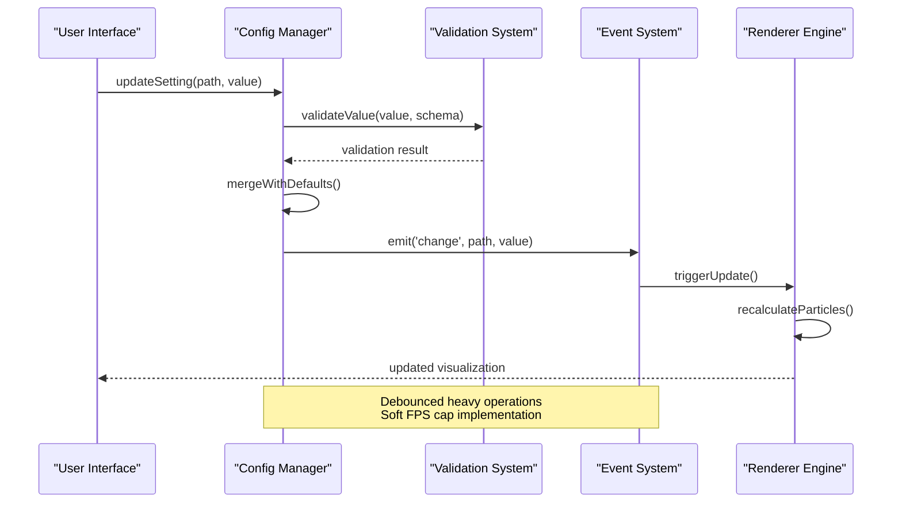
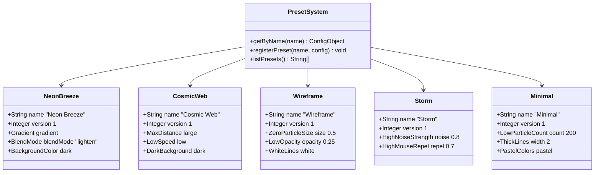
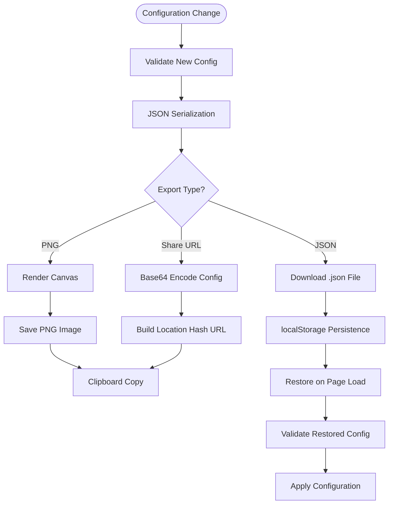
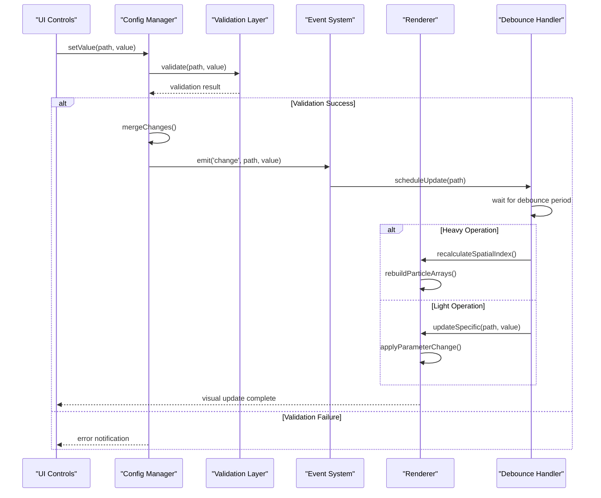

# Configuration Management System

<cite>
**Referenced Files in This Document**
- [tasks.md](file://aicontext/tasks.md)
</cite>

## Table of Contents
1. [Introduction](#introduction)
2. [JSON Schema Structure](#json-schema-structure)
3. [Config.js Implementation](#configjs-implementation)
4. [Preset System](#preset-system)
5. [Import/Export Functionality](#importexport-functionality)
6. [Event Emission System](#event-emission-system)
7. [Performance Considerations](#performance-considerations)
8. [Common Issues and Solutions](#common-issues-and-solutions)
9. [Programmatic Configuration](#programmatic-configuration)
10. [Conclusion](#conclusion)

## Introduction

The Plexus Canvas configuration management system provides a comprehensive solution for managing dynamic particle network visualizations. The system handles complex configuration objects with multiple sections including particles, edges, forces, style, interaction, and performance settings. Built around a JSON schema structure, it offers robust validation, event-driven updates, and seamless import/export capabilities.

The configuration system serves as the central nervous system for the visualization engine, allowing real-time parameter modification without requiring page reloads. Users can adjust particle counts, edge properties, force dynamics, visual styles, interaction behaviors, and performance settings on-the-fly while maintaining smooth 60 FPS operation.

## JSON Schema Structure

The configuration system is built around a well-defined JSON schema that organizes settings into logical sections for optimal usability and maintainability.

```mermaid
graph TB
Config["Configuration Object"] --> Particles["Particles Section"]
Config --> Edges["Edges Section"]
Config --> Forces["Forces Section"]
Config --> Style["Style Section"]
Config --> Interaction["Interaction Section"]
Config --> Performance["Performance Section"]
Config --> Meta["Meta Information"]
Particles --> ParticleCount["count: 50-3000"]
Particles --> ParticleSize["size: 1-6px"]
Particles --> ParticleSpeed["speed: 0-2px/ms"]
Particles --> ParticleJitter["jitter: 0-1"]
Particles --> SpawnArea["spawnArea: full/ellipse/ring/rect"]
Edges --> MaxDistance["maxDistance: 30-400px"]
Edges --> MaxEdges["maxEdgesPerNode: 0-12"]
Edges --> LineWidth["lineWidth: 0.2-3px"]
Edges --> LineOpacity["lineOpacity: 0-1"]
Edges --> BlendMode["blendMode: normal/lighten/screen/overlay"]
Edges --> ColorMode["colorMode: static/byDistance/byVelocity"]
Edges --> StaticColor["staticColor: #hex"]
Forces --> NoiseStrength["noiseStrength: 0-1"]
Forces --> Gravity["gravity: -1 to 1"]
Forces --> Drag["drag: 0-1"]
Style --> Background["bg: color + opacity"]
Style --> ParticleColor["particleColor: #hex/auto"]
Style --> Gradient["gradient: array of stops"]
Interaction --> MouseRepel["mouseRepel: 0-1"]
Interaction --> MouseRadius["mouseRadius: px"]
Interaction --> HoverHighlight["hoverHighlight: bool"]
Interaction --> ClickSpawn["clickSpawn: bool"]
Performance --> FPSCap["fpsCap: 30/60/120/off"]
Performance --> PixelRatio["pixelRatioMode: auto/1x/2x"]
Performance --> SpatialIndex["spatialIndex: none/grid/quadtree"]
Performance --> BatchEdges["batchEdges: bool"]
Meta --> Name["name: preset identifier"]
Meta --> Version["version: integer"]
```



**Diagram sources**
- [tasks.md](file://aicontext/tasks.md#L89-L149)

### Particles Section

The particles section controls the fundamental building blocks of the visualization:

- **count**: Number of particles (50-3000, default varies by preset)
- **size**: Particle diameter in pixels (1-6)
- **speed**: Movement speed in pixels per millisecond (0-2)
- **jitter**: Random movement variation (0-1)
- **spawnArea**: Distribution area type (full, ellipse, ring, rect)

### Edges Section

Edge configuration defines how particles connect and form networks:

- **maxDistance**: Maximum connection distance (30-400px)
- **maxEdgesPerNode**: Maximum connections per particle (0-12)
- **lineWidth**: Connection line thickness (0.2-3px)
- **lineOpacity**: Line transparency (0-1)
- **blendMode**: Canvas blend mode for overlapping lines
- **colorMode**: Edge coloring strategy
- **staticColor**: Fixed color when colorMode is static

### Forces Section

Force dynamics govern particle movement and behavior:

- **noiseStrength**: Perlin/noise-based movement randomness (0-1)
- **gravity**: Center attraction/repulsion (-1 to 1)
- **drag**: Velocity damping factor (0-1)

### Style Section

Visual appearance configuration includes colors and gradients:

- **bg**: Background color with opacity
- **particleColor**: Particle color or automatic gradient
- **gradient**: Array of color stops for particle coloring

### Interaction Section

User interaction settings control mouse and click behaviors:

- **mouseRepel**: Repulsion strength when near mouse cursor (0-1)
- **mouseRadius**: Area affected by mouse interaction (pixels)
- **hoverHighlight**: Enable particle highlighting on hover
- **clickSpawn**: Enable particle spawning on click

### Performance Section

Performance optimization settings balance quality and speed:

- **fpsCap**: Frame rate limit (30/60/120/FPS unlimited)
- **pixelRatioMode**: Display scaling mode (auto/1x/2x)
- **spatialIndex**: Spatial indexing method (none/grid/quadtree)
- **batchEdges**: Batch rendering of edges for performance

**Section sources**
- [tasks.md](file://aicontext/tasks.md#L89-L149)

## Config.js Implementation

The config.js module serves as the central configuration manager, implementing validation, default values, and an event emission system for real-time updates.



**Diagram sources**
- [tasks.md](file://aicontext/tasks.md#L207-L230)

### Validation System

The configuration system implements comprehensive validation to ensure parameter integrity:

- **Range Validation**: Numeric parameters are constrained to valid ranges
- **Type Checking**: Ensures correct data types for all settings
- **Enum Validation**: Validates selection parameters against predefined options
- **Schema Versioning**: Maintains backward compatibility with versioned configs

### Default Values

The system maintains sensible defaults for all configuration parameters, ensuring predictable behavior when users modify individual settings. Defaults vary by preset and are designed to produce visually appealing results.

### Event Emission System

The config.on() system provides a reactive interface for responding to configuration changes:

```javascript
// Example event listener setup
config.on('change', (path, value) => {
    // Handle specific setting changes
    if (path.startsWith('particles.')) {
        debouncedParticleRecalculation();
    }
});
```

The event system includes debouncing mechanisms to prevent excessive recalculations during rapid parameter changes, particularly for computationally expensive operations like particle array recreation or spatial index rebuilding.

**Section sources**
- [tasks.md](file://aicontext/tasks.md#L16-L16)
- [tasks.md](file://aicontext/tasks.md#L207-L230)

## Preset System

The preset system provides five built-in configurations optimized for different visual effects and performance characteristics.



**Diagram sources**
- [tasks.md](file://aicontext/tasks.md#L232-L266)

### Neon Breeze (Default)

The default preset featuring soft gradients and lightening blend modes for ethereal visual effects.

### Cosmic Web

Large connection distances with low speeds and dark backgrounds for cosmic network visualization.

### Wireframe

Minimalist wireframe display with thin white lines and disabled particles for structural analysis.

### Storm

High noise strength and mouse repulsion for turbulent, chaotic particle movement.

### Minimal

Resource-efficient preset with reduced particle counts, thick lines, and pastel color schemes.

**Section sources**
- [tasks.md](file://aicontext/tasks.md#L232-L266)

## Import/Export Functionality

The system provides comprehensive import/export capabilities for configuration persistence and sharing.



**Diagram sources**
- [tasks.md](file://aicontext/tasks.md#L292-L297)
- [tasks.md](file://aicontext/tasks.md#L180-L205)

### JSON Serialization/Deserialization

The exportJSON() and importJSON() functions handle configuration persistence:

- **exportJSON(config)**: Converts configuration object to JSON string with pretty formatting
- **importJSON(text)**: Parses JSON string, validates structure, and applies settings
- **Validation**: Ensures imported configurations match the expected schema
- **Error Handling**: Graceful handling of malformed JSON and invalid configurations

### localStorage Persistence

Automatic browser storage of user preferences and recent configurations:

- **Automatic Saving**: Configuration changes trigger immediate localStorage updates
- **Recovery**: Browser restarts restore previously saved configurations
- **Limit Management**: Handles localStorage quota limits gracefully

### URL-Based State Sharing

The buildShareURL() function enables easy sharing of visualization configurations:

- **Compression**: Optional gzip compression for large configurations
- **Base64 Encoding**: Secure encoding of configuration data in URL hash
- **Direct Linking**: Shareable URLs that restore exact visualization state
- **Browser Compatibility**: Works across different browsers and devices

**Section sources**
- [tasks.md](file://aicontext/tasks.md#L292-L297)

## Event Emission System

The configuration system implements a sophisticated event-driven architecture for responsive updates.



**Diagram sources**
- [tasks.md](file://aicontext/tasks.md#L207-L230)

### Configuration Change Events

The config.on('change', callback) system provides real-time response to configuration modifications:

- **Granular Tracking**: Individual parameter change notifications
- **Path-based Events**: Specific paths indicate which setting was modified
- **Batch Updates**: Multiple changes can be grouped into single events
- **Debounced Processing**: Heavy operations are scheduled to prevent UI blocking

### Performance Optimization

The event system includes several performance optimizations:

- **Selective Updates**: Only affected components receive change notifications
- **Batch Operations**: Multiple related changes are processed together
- **Lazy Evaluation**: Expensive calculations are deferred until necessary
- **Memory Management**: Proper cleanup of event listeners prevents memory leaks

**Section sources**
- [tasks.md](file://aicontext/tasks.md#L207-L230)

## Performance Considerations

The configuration system is designed with performance as a primary concern, implementing various optimization strategies for handling large configuration updates efficiently.

### FPS Cap Implementation

The system includes a soft FPS cap mechanism that prevents frame rate degradation:

- **Frame Timing**: Tracks frame duration and skips frames when necessary
- **Adaptive Cap**: Automatically adjusts based on system performance
- **Quality vs Speed**: Balances visual fidelity with smooth animation
- **User Control**: Allows manual adjustment of performance settings

### Spatial Index Optimization

Different spatial indexing strategies optimize performance based on particle density:

- **Grid Index**: Default strategy with O(1) lookup for typical use cases
- **Quadtree**: Advanced strategy for high-density or uneven distributions
- **Dynamic Switching**: Automatic selection based on particle count and distribution
- **Periodic Rebuilding**: Efficient rebuilding schedules to minimize overhead

### Memory Management

Efficient memory usage is crucial for handling large configurations:

- **Object Pooling**: Reuses objects to reduce garbage collection pressure
- **Lazy Loading**: Loads configuration sections only when needed
- **Reference Management**: Proper cleanup of configuration references
- **Garbage Collection**: Strategic cleanup to prevent memory leaks

### Large Configuration Handling

The system includes specific optimizations for handling large configuration updates:

- **Incremental Updates**: Applies changes incrementally rather than wholesale
- **Validation Caching**: Caches validation results for repeated operations
- **Background Processing**: Performs heavy operations in background threads
- **Progressive Enhancement**: Gradually increases complexity as resources permit

**Section sources**
- [tasks.md](file://aicontext/tasks.md#L89-L149)
- [tasks.md](file://aicontext/tasks.md#L180-L205)

## Common Issues and Solutions

### Invalid Configuration Values

The system handles various types of invalid configurations gracefully:

- **Range Violations**: Values outside acceptable ranges are clamped to valid values
- **Type Mismatches**: Incorrect data types are converted or rejected
- **Missing Fields**: Required fields are populated with appropriate defaults
- **Schema Versioning**: Older configuration formats are automatically upgraded

### Performance Degradation

Common performance issues and their solutions:

- **Excessive Particle Counts**: Automatic warnings and suggestions for optimization
- **High Edge Density**: Adaptive edge calculation algorithms prevent slowdowns
- **Complex Gradients**: Simplified gradient calculations for resource-constrained systems
- **Frequent Updates**: Debouncing mechanisms prevent UI freezing

### Browser Compatibility

Cross-browser compatibility considerations:

- **LocalStorage Limits**: Graceful degradation when storage quotas are exceeded
- **JSON Parsing**: Fallback parsing methods for older browsers
- **Canvas Rendering**: Progressive enhancement for different canvas capabilities
- **Event Handling**: Cross-browser event normalization

### Configuration Corruption

Prevention and recovery from configuration corruption:

- **Backup Systems**: Automatic backup of valid configurations
- **Validation Checks**: Regular integrity verification of stored configurations
- **Recovery Mechanisms**: Built-in restoration from known good states
- **Error Reporting**: Detailed error reporting for debugging configuration issues

## Programmatic Configuration

The configuration system supports programmatic manipulation through various APIs and methods.

### Direct Configuration Modification

Programmatic access to configuration settings:

```javascript
// Get current configuration
const currentConfig = config.get();

// Update specific settings
config.set('particles.count', 1000);
config.set('edges.maxDistance', 200);

// Batch updates for efficiency
config.batch(() => {
    config.set('particles.speed', 0.5);
    config.set('forces.noiseStrength', 0.2);
    config.set('style.particleColor', '#ff0000');
});

// Apply preset programmatically
config.applyPreset('Cosmic Web');
```

### Configuration Validation

Programmatic validation of configuration objects:

```javascript
// Validate configuration before applying
const isValid = config.validate(newConfig);
if (!isValid) {
    throw new Error('Invalid configuration');
}

// Get validation errors
const errors = config.validateWithErrors(newConfig);
console.log(errors); // Array of validation error messages
```

### Dynamic Configuration Generation

Creating configurations dynamically based on parameters:

```javascript
// Generate high-performance configuration
function createPerformanceConfig(particleCount) {
    const config = {
        particles: { count: Math.min(particleCount, 1000) },
        performance: { fpsCap: 30, batchEdges: true },
        edges: { maxEdgesPerNode: 3 }
    };
    return config;
}

// Generate artistic configuration
function createArtisticConfig() {
    return {
        particles: { jitter: 0.8, speed: 0.1 },
        edges: { lineWidth: 2, blendMode: 'lighten' },
        style: { gradient: [{ stop: 0, color: '#ff0000' }, { stop: 1, color: '#00ffff' }] }
    };
}
```

### Configuration Templates

Using templates for consistent configuration creation:

```javascript
// Template-based configuration
const template = {
    particles: { size: 2, spawnArea: 'full' },
    edges: { lineWidth: 1, lineOpacity: 0.6 },
    forces: { drag: 0.02 }
};

// Apply template with custom overrides
const customConfig = Object.assign({}, template, {
    particles: { count: 500, speed: 0.35 },
    edges: { maxDistance: 140 }
});
```

## Conclusion

The Plexus Canvas configuration management system provides a robust, flexible foundation for dynamic particle network visualization. Its comprehensive JSON schema structure, sophisticated validation system, and event-driven architecture enable seamless real-time parameter modification while maintaining optimal performance.

Key strengths of the system include:

- **Comprehensive Schema**: Well-organized configuration structure covering all visualization aspects
- **Robust Validation**: Multi-layered validation ensures configuration integrity
- **Event-Driven Updates**: Reactive system responds immediately to parameter changes
- **Performance Optimization**: Built-in optimizations for smooth operation under various conditions
- **Persistence and Sharing**: Seamless import/export capabilities for configuration management
- **Built-in Presets**: Five carefully crafted presets provide excellent starting points

The system's design prioritizes both ease of use for end users and flexibility for developers, making it suitable for a wide range of applications from simple demonstrations to complex interactive installations. Its modular architecture allows for easy extension and customization while maintaining backward compatibility and system stability.

Future enhancements could include additional preset categories, advanced configuration templates, and enhanced collaboration features for team-based visualization projects. The solid foundation provided by the current implementation makes such extensions straightforward to implement while preserving the system's core benefits.