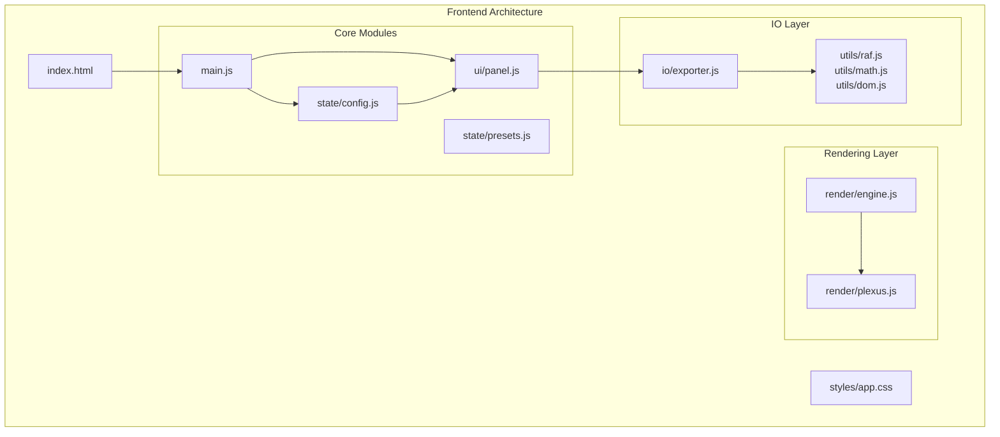
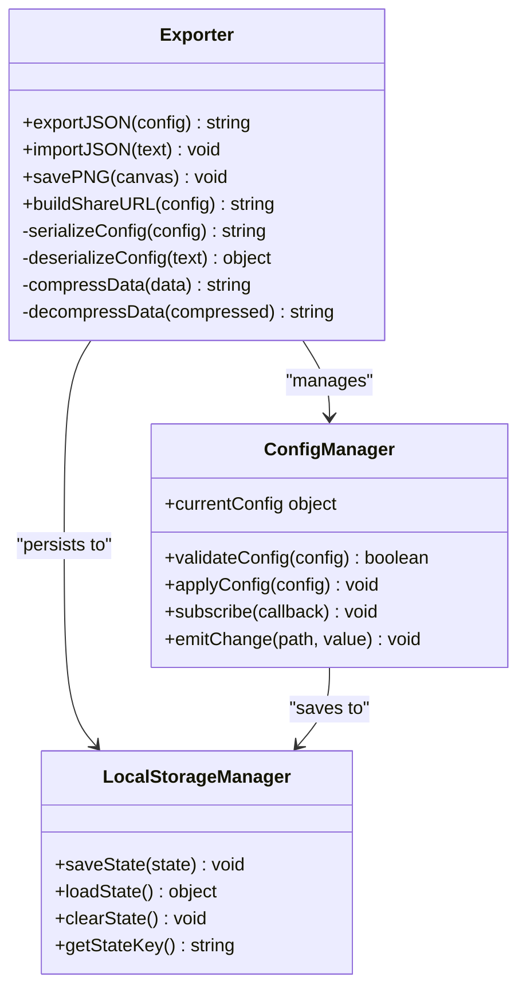
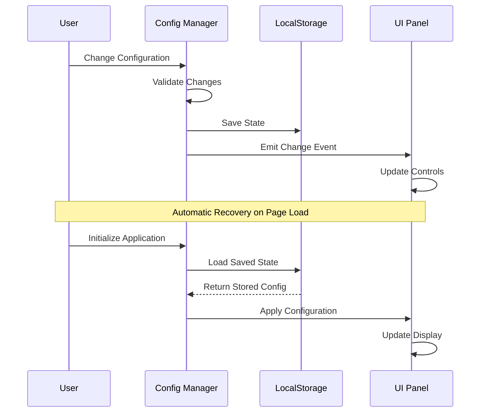
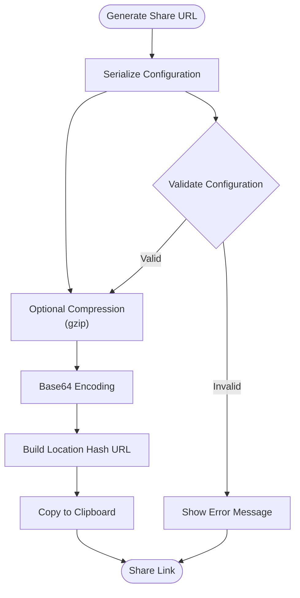
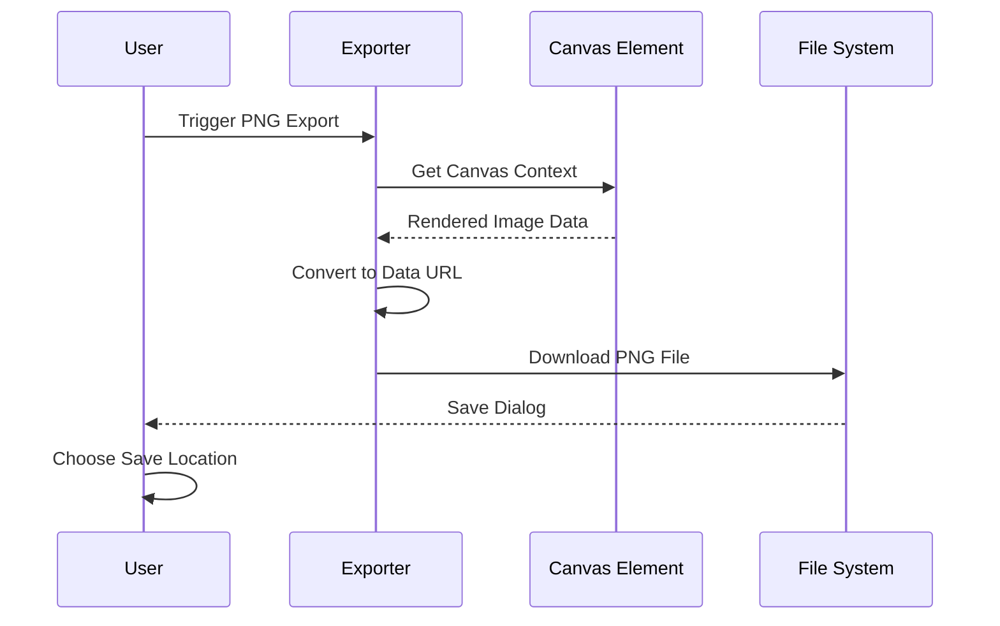
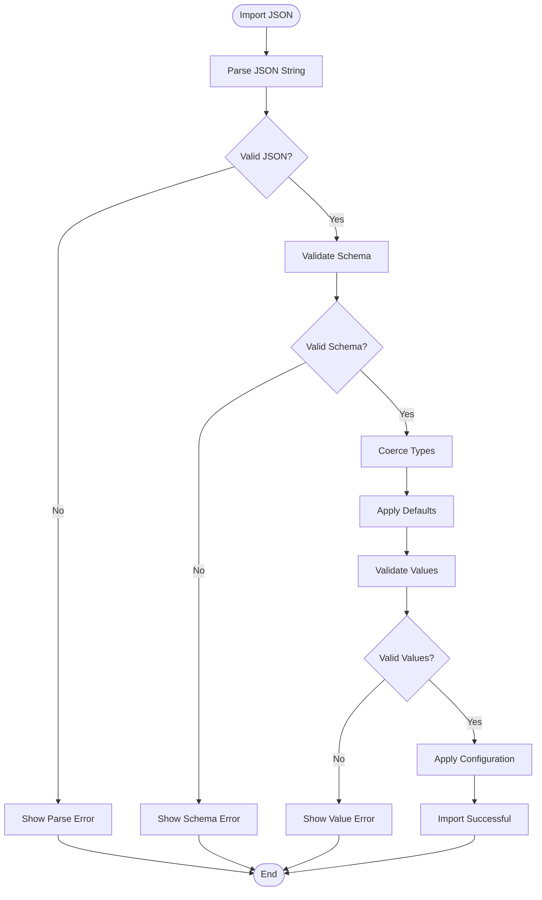
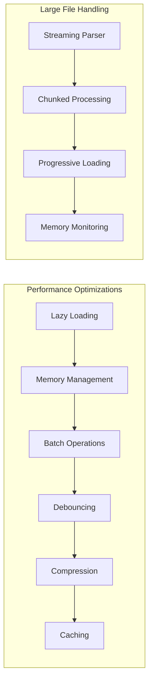

# Import and Export Functionality Documentation

<cite>
**Referenced Files in This Document**
- [tasks.md](file://aicontext/tasks.md)
- [README.md](file://README.md)
</cite>

## Table of Contents
1. [Introduction](#introduction)
2. [Project Architecture Overview](#project-architecture-overview)
3. [Core Import/Export Components](#core-importexport-components)
4. [JSON Serialization and Deserialization](#json-serialization-and-deserialization)
5. [LocalStorage Persistence Mechanism](#localstorage-persistence-mechanism)
6. [URL-Based State Sharing System](#url-based-state-sharing-system)
7. [PNG Export Feature](#png-export-feature)
8. [Import Workflows and Error Handling](#import-workflows-and-error-handling)
9. [Performance Considerations](#performance-considerations)
10. [Security Implications](#security-implications)
11. [Common Issues and Solutions](#common-issues-and-solutions)
12. [Code Examples](#code-examples)

## Introduction

Plexus Canvas is a modern web application that provides comprehensive import and export functionality for managing configuration states. The system enables users to save, load, and share their dynamic particle network configurations through multiple export methods including JSON serialization, PNG image export, and URL-based state sharing.

The import/export system is built with vanilla JavaScript (ES2020+) and follows a clean architecture approach without external frameworks. It provides robust data persistence mechanisms while maintaining optimal performance for handling large configuration files.

## Project Architecture Overview

The project follows a minimalist architecture with clear separation of concerns:



**Diagram sources**
- [tasks.md](file://aicontext/tasks.md#L4-L22)

**Section sources**
- [tasks.md](file://aicontext/tasks.md#L1-L22)

## Core Import/Export Components

The import/export functionality is centralized in the `io/exporter.js` module, which provides four primary methods:

### Exporter Module Structure



**Diagram sources**
- [tasks.md](file://aicontext/tasks.md#L292-L297)

**Section sources**
- [tasks.md](file://aicontext/tasks.md#L292-L297)

## JSON Serialization and Deserialization

The JSON export/import system provides robust configuration persistence with comprehensive validation and error handling.

### Export Process

The `exportJSON(config)` function converts the current configuration object into a JSON string with the following characteristics:

- **Structure Preservation**: Maintains the complete configuration hierarchy including particles, edges, forces, style, interaction, performance, and metadata
- **Validation**: Ensures all numeric values fall within acceptable ranges and validates color formats
- **Compression**: Optionally compresses large configurations using gzip compression
- **Base64 Encoding**: Encodes compressed data for safe URL transmission

### Import Process

The `importJSON(text)` function handles configuration loading with comprehensive error handling:

1. **Input Validation**: Verifies the JSON structure and validates against expected schema
2. **Decompression**: Decodes and decompresses data if previously compressed
3. **Schema Validation**: Ensures all required fields exist and have valid values
4. **Type Coercion**: Converts string values to appropriate data types (numbers, booleans)
5. **Default Fallback**: Applies default values for missing optional fields
6. **State Application**: Updates the current configuration and triggers UI updates

**Section sources**
- [tasks.md](file://aicontext/tasks.md#L6-L10)
- [tasks.md](file://aicontext/tasks.md#L292-L297)

## LocalStorage Persistence Mechanism

The application implements automatic state recovery through localStorage, providing seamless user experience across browser sessions.

### State Persistence Features



**Diagram sources**
- [tasks.md](file://aicontext/tasks.md#L9-L10)
- [tasks.md](file://aicontext/tasks.md#L220-L225)

### Automatic State Recovery Behavior

The localStorage persistence system operates with the following characteristics:

- **Automatic Saving**: Configuration changes trigger immediate localStorage updates
- **Debounced Updates**: Prevents excessive write operations during rapid changes
- **Cross-Tab Synchronization**: Changes in one tab automatically sync to others
- **Backup Restoration**: Provides fallback when corrupted data is detected
- **Storage Limits**: Handles browser storage quota limitations gracefully

**Section sources**
- [tasks.md](file://aicontext/tasks.md#L9-L10)
- [tasks.md](file://aicontext/tasks.md#L220-L225)

## URL-Based State Sharing System

The URL-based sharing system enables users to create and share persistent links containing serialized configuration data.

### Share URL Generation Process



**Diagram sources**
- [tasks.md](file://aicontext/tasks.md#L292-L297)

### URL Structure and Implementation

The share URL system creates compact, shareable links using the following approach:

1. **Configuration Extraction**: Extracts the current configuration object from the state manager
2. **Data Compression**: Optionally compresses the JSON data using gzip for smaller URLs
3. **Base64 Encoding**: Encodes compressed data to ensure URL-safe transmission
4. **Hash Fragment**: Places encoded data in the URL hash fragment (`#`) to avoid server-side processing
5. **Clipboard Integration**: Automatically copies the generated URL to the clipboard for easy sharing

### Share URL Recovery Process

When a shared URL is opened, the system performs the following recovery steps:

1. **Hash Parsing**: Extracts the encoded configuration data from the URL hash
2. **Base64 Decoding**: Decodes the URL-safe Base64 string back to compressed data
3. **Decompression**: Decompresses the data if compression was used
4. **JSON Parsing**: Parses the JSON configuration data
5. **Validation**: Validates the recovered configuration
6. **Application**: Applies the recovered configuration to the current session

**Section sources**
- [tasks.md](file://aicontext/tasks.md#L292-L297)

## PNG Export Feature

The PNG export functionality allows users to capture the current canvas state as a high-quality image file.

### PNG Export Implementation



**Diagram sources**
- [tasks.md](file://aicontext/tasks.md#L292-L297)

### PNG Export Features

The PNG export system provides several advanced capabilities:

- **High-DPI Support**: Automatically adjusts for device pixel ratio to maintain image quality
- **File-Saver Integration**: Optional integration with file-saver library for enhanced download functionality
- **Format Options**: Supports various image formats with configurable quality settings
- **Background Transparency**: Preserves transparent backgrounds when applicable
- **Size Optimization**: Balances image quality with file size for optimal sharing

**Section sources**
- [tasks.md](file://aicontext/tasks.md#L292-L297)

## Import Workflows and Error Handling

The import system implements comprehensive error handling to manage various failure scenarios gracefully.

### Import Workflow Architecture



**Diagram sources**
- [tasks.md](file://aicontext/tasks.md#L292-L297)

### Error Handling Strategies

The import system employs multiple error handling strategies:

1. **Graceful Degradation**: Falls back to default values when invalid data is encountered
2. **User Feedback**: Provides clear, actionable error messages for different failure types
3. **Partial Recovery**: Attempts to recover usable portions of corrupted configurations
4. **Logging**: Records errors for debugging and improvement purposes
5. **Rollback Capability**: Can revert to previous working configurations when imports fail

**Section sources**
- [tasks.md](file://aicontext/tasks.md#L292-L297)

## Performance Considerations

The import/export system is designed to handle large configuration files efficiently while maintaining optimal user experience.

### Performance Optimization Strategies



### Memory Management

- **Garbage Collection**: Explicitly manages memory cleanup for large objects
- **Object Pooling**: Reuses objects to reduce allocation overhead
- **Weak References**: Uses weak references for temporary data structures
- **Memory Monitoring**: Tracks memory usage and triggers cleanup when thresholds are exceeded

### Large File Processing

- **Streaming Parser**: Processes large JSON files incrementally to avoid memory overflow
- **Chunked Loading**: Loads configuration data in manageable chunks
- **Progressive Rendering**: Updates UI progressively as data becomes available
- **Background Processing**: Performs heavy operations in web workers when possible

## Security Implications

The import/export system implements several security measures to protect against malicious configurations and data corruption.

### Security Measures

```mermaid
mindmap
root((Security Measures))
Input Validation
Schema Validation
Type Checking
Range Validation
Sanitization
Execution Control
Safe Evaluation
Sandbox Environment
Resource Limits
Timeout Protection
Data Integrity
Hash Verification
Signature Validation
Corruption Detection
Backup Creation
Access Control
Origin Validation
Permission Checks
Rate Limiting
Audit Logging
```

### Security Best Practices

1. **Input Sanitization**: Thoroughly sanitizes all imported data to prevent injection attacks
2. **Resource Limits**: Implements strict limits on configuration complexity and size
3. **Execution Sandboxing**: Runs potentially dangerous operations in isolated environments
4. **Audit Trail**: Maintains logs of all import/export operations for security monitoring
5. **Cross-Origin Protection**: Validates origins and implements CORS policies appropriately

**Section sources**
- [tasks.md](file://aicontext/tasks.md#L292-L297)

## Common Issues and Solutions

### Data Corruption During Transfer

**Problem**: Configuration data becomes corrupted during export/import cycles.

**Solution**: 
- Implement checksum verification for data integrity
- Use compression with error detection capabilities
- Provide automatic backup and restore functionality
- Implement data validation at multiple stages

### Browser Storage Limits

**Problem**: Exceeding localStorage quota limits with large configurations.

**Solution**:
- Implement chunked storage for large configurations
- Use IndexedDB for larger data storage needs
- Provide storage optimization recommendations
- Implement automatic cleanup of old configurations

### Cross-Origin Restrictions

**Problem**: Issues with importing configurations from different domains.

**Solution**:
- Implement CORS policy compliance
- Use secure communication protocols
- Provide origin validation mechanisms
- Offer local file import alternatives

### Performance Issues with Large Files

**Problem**: Slow import/export operations with large configuration files.

**Solution**:
- Implement streaming processing for large files
- Use web workers for background processing
- Add progress indicators and cancel capabilities
- Optimize memory usage and garbage collection

## Code Examples

### Export JSON Example

```javascript
// Export current configuration to JSON
const exportJSON = (config) => {
    try {
        // Validate configuration
        if (!validateConfig(config)) {
            throw new Error('Invalid configuration');
        }
        
        // Serialize configuration
        const jsonString = JSON.stringify(config, null, 2);
        
        // Create download link
        const blob = new Blob([jsonString], { type: 'application/json' });
        const url = URL.createObjectURL(blob);
        
        // Trigger download
        const a = document.createElement('a');
        a.href = url;
        a.download = `plexus-config-${Date.now()}.json`;
        a.click();
        
        // Cleanup
        URL.revokeObjectURL(url);
        
        return jsonString;
    } catch (error) {
        console.error('Export failed:', error);
        throw error;
    }
};
```

### Import JSON Example

```javascript
// Import configuration from JSON text
const importJSON = (text) => {
    try {
        // Parse JSON
        const config = JSON.parse(text);
        
        // Validate schema
        if (!validateSchema(config)) {
            throw new Error('Invalid configuration schema');
        }
        
        // Coerce types
        const coercedConfig = coerceTypes(config);
        
        // Apply defaults
        const completeConfig = applyDefaults(coercedConfig);
        
        // Validate values
        if (!validateValues(completeConfig)) {
            throw new Error('Invalid configuration values');
        }
        
        // Apply configuration
        applyConfig(completeConfig);
        
        // Save to localStorage
        localStorage.setItem('plexus-state', JSON.stringify(completeConfig));
        
        return true;
    } catch (error) {
        console.error('Import failed:', error);
        showErrorMessage(error.message);
        return false;
    }
};
```

### PNG Export Example

```javascript
// Export canvas as PNG image
const savePNG = (canvas) => {
    try {
        // Get canvas context
        const ctx = canvas.getContext('2d');
        
        // Create data URL
        const dataURL = canvas.toDataURL('image/png', 1.0);
        
        // Create download link
        const a = document.createElement('a');
        a.href = dataURL;
        a.download = `plexus-${Date.now()}.png`;
        
        // Trigger download
        a.click();
        
        return true;
    } catch (error) {
        console.error('PNG export failed:', error);
        return false;
    }
};
```

### Build Share URL Example

```javascript
// Build shareable URL with encoded configuration
const buildShareURL = (config) => {
    try {
        // Serialize configuration
        const jsonString = JSON.stringify(config);
        
        // Compress if large
        let compressedData = jsonString;
        if (jsonString.length > 1000) {
            compressedData = compressData(jsonString);
        }
        
        // Base64 encode
        const encodedData = btoa(compressedData);
        
        // Build URL
        const baseUrl = window.location.origin + window.location.pathname;
        const shareURL = `${baseUrl}#${encodedData}`;
        
        // Copy to clipboard
        navigator.clipboard.writeText(shareURL);
        
        return shareURL;
    } catch (error) {
        console.error('Share URL creation failed:', error);
        return null;
    }
};
```

**Section sources**
- [tasks.md](file://aicontext/tasks.md#L292-L297)