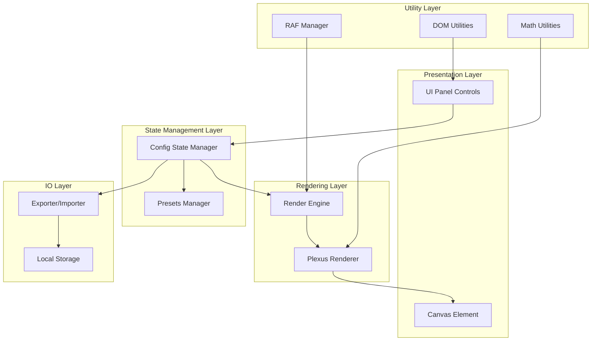
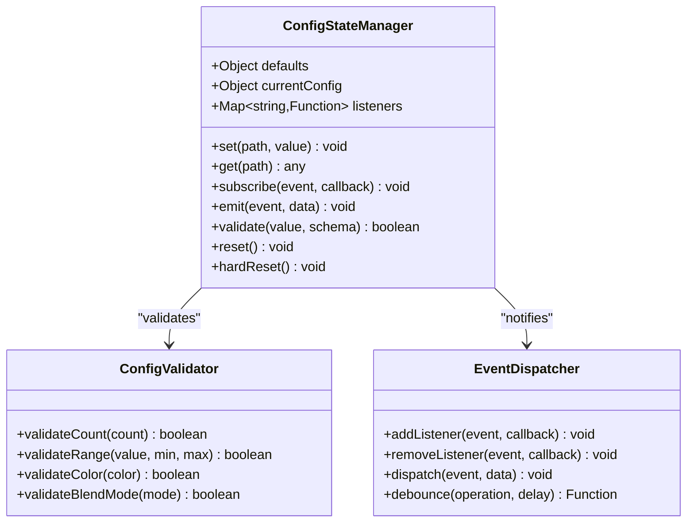
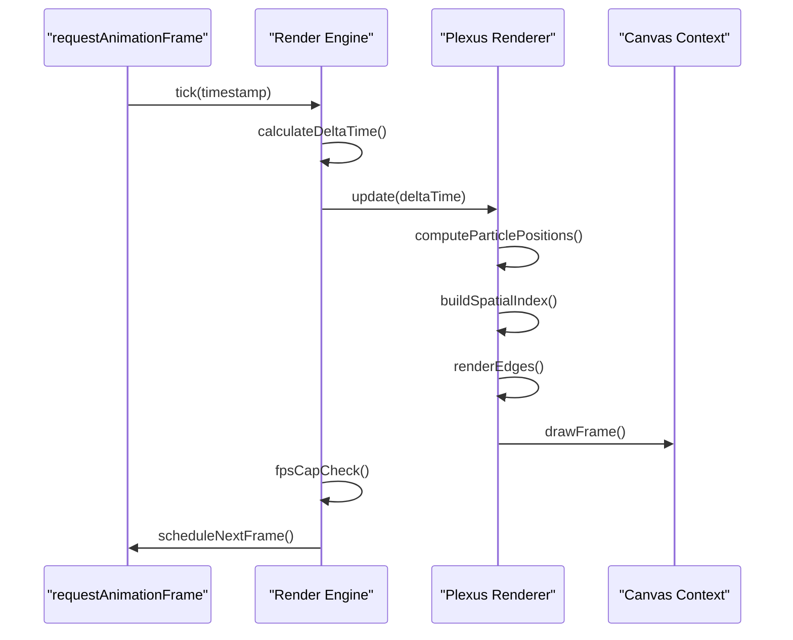
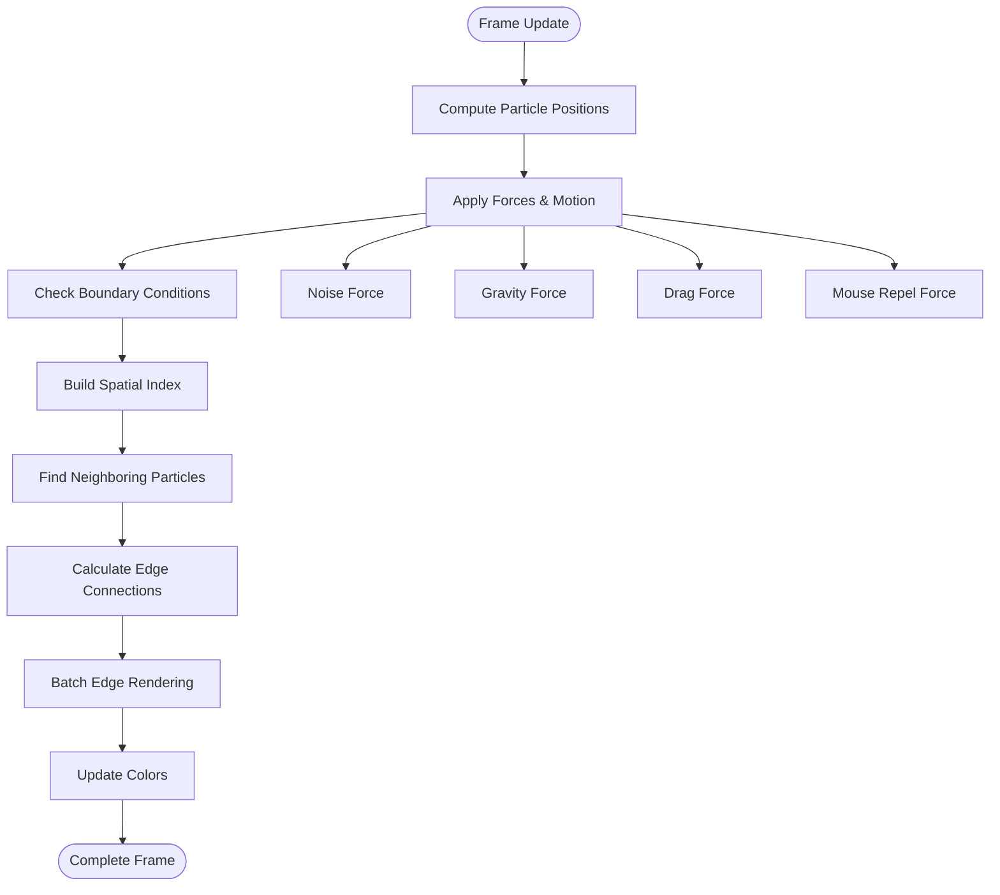
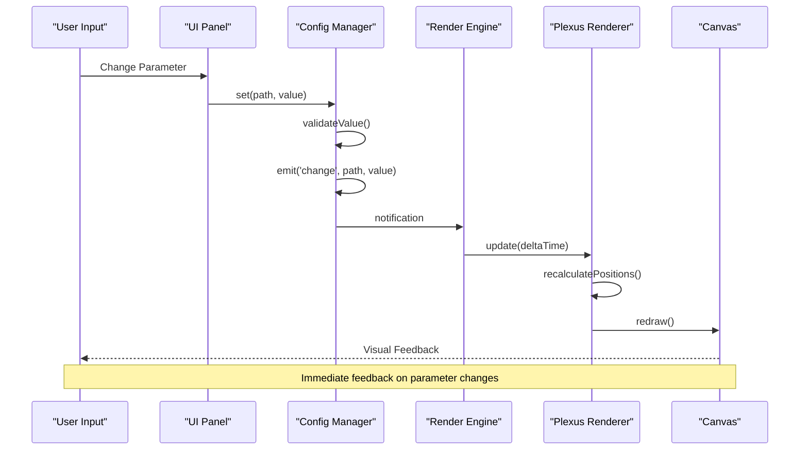
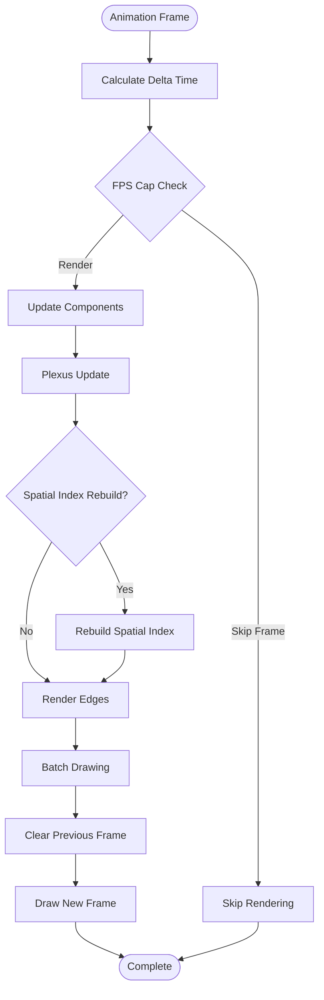
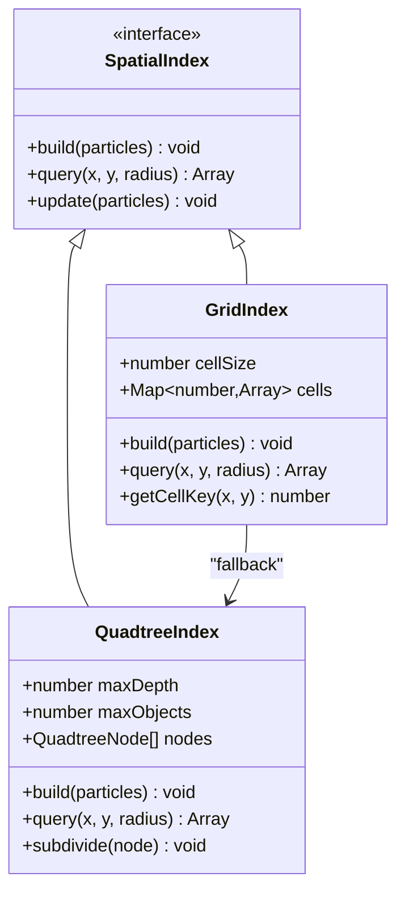
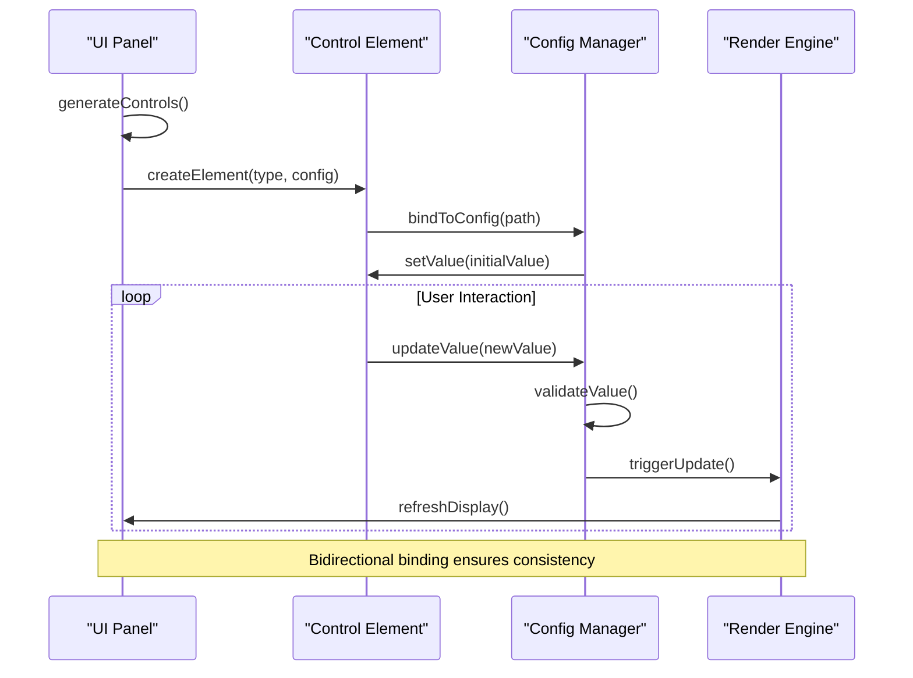
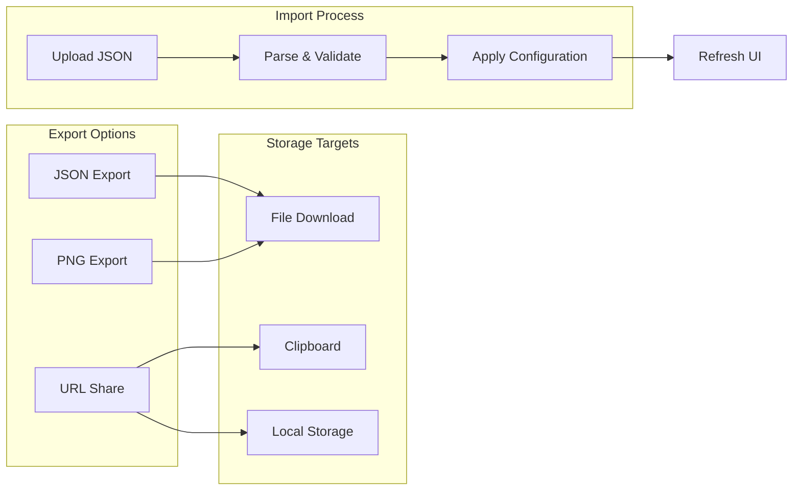
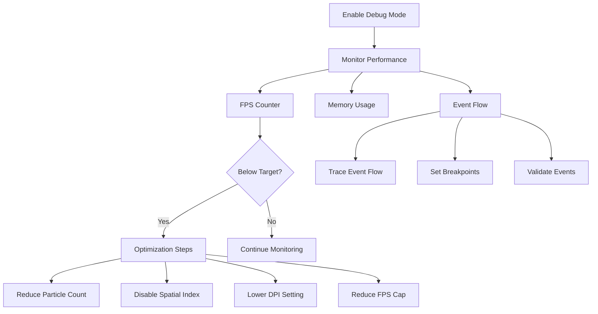

# Component Interactions in Plexus Canvas

<cite>
**Referenced Files in This Document**
- [tasks.md](file://aicontext/tasks.md)
- [README.md](file://README.md)
</cite>

## Table of Contents
1. [Introduction](#introduction)
2. [System Architecture Overview](#system-architecture-overview)
3. [Core Component Analysis](#core-component-analysis)
4. [Data Flow and Event Propagation](#data-flow-and-event-propagation)
5. [Animation Loop and Rendering Pipeline](#animation-loop-and-rendering-pipeline)
6. [Spatial Indexing and Particle Computation](#spatial-indexing-and-particle-computation)
7. [UI Panel and Configuration Binding](#ui-panel-and-configuration-binding)
8. [Export and Sharing Functions](#export-and-sharing-functions)
9. [Debugging Strategies](#debugging-strategies)
10. [Performance Optimization](#performance-optimization)
11. [Conclusion](#conclusion)

## Introduction

Plexus Canvas is a sophisticated web application that visualizes dynamic particle networks with interconnected edges on a canvas element. The system employs a clean vanilla JavaScript architecture with no frameworks, utilizing modern ES2020+ features for optimal performance. The application consists of several key components that work together to create real-time interactive visualizations with immediate feedback on configuration changes.

The core interaction model follows a unidirectional data flow where user inputs in the UI panel trigger configuration state changes, which propagate through event emissions to drive the rendering engine and particle system. This architecture ensures predictable behavior and efficient performance while maintaining clean separation of concerns.

## System Architecture Overview

The Plexus Canvas application follows a modular architecture with clearly defined component responsibilities. The system is built around five primary architectural layers that communicate through well-defined interfaces.

**Diagram sources**
- [tasks.md](file://aicontext/tasks.md#L10-L25)

The architecture emphasizes loose coupling between components while maintaining clear data flow patterns. Each layer has specific responsibilities:

- **Presentation Layer**: Handles user interface and canvas rendering
- **State Management Layer**: Manages configuration state and presets
- **Rendering Layer**: Contains the core rendering logic and particle computation
- **Utility Layer**: Provides shared functionality and helpers
- **IO Layer**: Handles file operations and persistence

**Section sources**
- [tasks.md](file://aicontext/tasks.md#L10-L25)

## Core Component Analysis

### Configuration State Manager

The configuration state manager serves as the central hub for all application state. It maintains the current configuration, validates changes, and emits events to notify dependent components of modifications.

**Diagram sources**
- [tasks.md](file://aicontext/tasks.md#L15-L17)

### Render Engine

The render engine manages the animation loop using requestAnimationFrame and coordinates with the plexus renderer to produce smooth visual output.

**Diagram sources**
- [tasks.md](file://aicontext/tasks.md#L25-L27)

### Plexus Renderer

The plexus renderer handles the core computational logic for particles and edges, utilizing spatial indexing for performance optimization.

**Diagram sources**
- [tasks.md](file://aicontext/tasks.md#L25-L27)

**Section sources**
- [tasks.md](file://aicontext/tasks.md#L15-L27)

## Data Flow and Event Propagation

The data flow in Plexus Canvas follows a unidirectional pattern where user interactions trigger configuration changes that propagate through the system. This design ensures predictable behavior and simplifies debugging.

**Diagram sources**
- [tasks.md](file://aicontext/tasks.md#L200-L205)

The event system uses debouncing for heavy operations to prevent performance issues during rapid parameter changes. This ensures that expensive operations like array recreation or spatial index rebuilding occur only after the user has finished adjusting parameters.

**Section sources**
- [tasks.md](file://aicontext/tasks.md#L200-L205)

## Animation Loop and Rendering Pipeline

The animation loop is the heart of the rendering system, coordinating frame updates and maintaining consistent performance across different devices and configurations.

**Diagram sources**
- [tasks.md](file://aicontext/tasks.md#L25-L27)

The render engine implements a soft FPS cap mechanism that skips frames when the target FPS is exceeded, ensuring smooth visual output regardless of the underlying hardware capabilities. This approach prevents frame rate stuttering while maintaining visual quality.

**Section sources**
- [tasks.md](file://aicontext/tasks.md#L25-L27)

## Spatial Indexing and Particle Computation

Spatial indexing is crucial for performance optimization in particle systems, especially as the number of particles increases. The system supports multiple indexing strategies to balance performance and accuracy.

**Diagram sources**
- [tasks.md](file://aicontext/tasks.md#L100-L110)

The grid-based spatial index divides the canvas into uniform cells, enabling efficient neighbor queries by only checking nearby cells. This approach provides excellent performance for uniformly distributed particles while maintaining simplicity in implementation.

**Section sources**
- [tasks.md](file://aicontext/tasks.md#L100-L110)

## UI Panel and Configuration Binding

The UI panel provides an intuitive interface for controlling all aspects of the particle system. The panel dynamically generates controls based on the configuration schema and maintains bidirectional binding with the configuration state.

**Diagram sources**
- [tasks.md](file://aicontext/tasks.md#L30-L50)

The panel supports various control types including sliders, dropdowns, color pickers, and checkboxes, each automatically bound to the appropriate configuration property. This design ensures that all user interactions are immediately reflected in the visual output.

**Section sources**
- [tasks.md](file://aicontext/tasks.md#L30-L50)

## Export and Sharing Functions

The export and sharing system enables users to save their configurations, share creations, and import previously saved states. This functionality enhances the creative workflow and allows for easy collaboration.

**Diagram sources**
- [tasks.md](file://aicontext/tasks.md#L200-L205)

The URL sharing mechanism encodes the current configuration as a base64 string in the URL hash, allowing users to bookmark or share their exact visual state with others. This feature preserves all configuration parameters while maintaining compact representation.

**Section sources**
- [tasks.md](file://aicontext/tasks.md#L200-L205)

## Debugging Strategies

Effective debugging in the Plexus Canvas system requires understanding the component interaction patterns and implementing appropriate monitoring and logging mechanisms.

### Common Issues and Solutions

1. **Broken Update Chains**
   - Symptoms: Configuration changes don't reflect in visuals
   - Diagnosis: Check event emission and listener registration
   - Solution: Verify event propagation and component initialization order

2. **Performance Bottlenecks**
   - Symptoms: FPS drops below target, UI becomes unresponsive
   - Diagnosis: Monitor frame timing and identify hot loops
   - Solution: Optimize spatial indexing, reduce particle count, or adjust FPS cap

3. **Memory Leaks**
   - Symptoms: Gradual memory increase over time
   - Diagnosis: Track object creation and destruction patterns
   - Solution: Properly dispose of canvas contexts and remove event listeners

### Debug Tools and Techniques

**Section sources**
- [tasks.md](file://aicontext/tasks.md#L220-L230)

## Performance Optimization

The Plexus Canvas system implements several performance optimization strategies to maintain smooth operation across different hardware configurations and particle counts.

### Key Optimization Techniques

1. **Structure of Arrays (SoA)**
   - Uses Float32Array for numerical data
   - Reduces memory fragmentation and improves cache locality
   - Enables SIMD optimizations where available

2. **Batch Rendering**
   - Single beginPath/stroke operation per frame
   - Minimizes canvas state changes
   - Reduces GPU state switching overhead

3. **Spatial Acceleration**
   - Grid-based spatial indexing for neighbor queries
   - Quadtree support for non-uniform distributions
   - Configurable rebuild intervals to balance accuracy vs performance

4. **Selective Updates**
   - Debounced configuration changes
   - Lazy evaluation of expensive operations
   - Conditional rendering based on change detection

**Section sources**
- [tasks.md](file://aicontext/tasks.md#L220-L230)

## Conclusion

The Plexus Canvas component interaction system demonstrates a well-architected approach to building interactive web applications with clean separation of concerns and efficient data flow. The modular design enables easy maintenance and extension while the performance optimizations ensure smooth operation across diverse hardware configurations.

Key strengths of the system include:

- **Predictable Data Flow**: Unidirectional updates through the event system
- **Performance Optimization**: Multiple indexing strategies and batch rendering
- **User Experience**: Immediate feedback and intuitive control interfaces
- **Extensibility**: Modular architecture supporting future enhancements

The system successfully balances functionality with performance, providing users with powerful creative tools while maintaining responsive operation. The debugging strategies and optimization techniques documented here enable developers to maintain and enhance the system effectively.

Future improvements could include additional spatial indexing algorithms, enhanced export formats, and expanded preset library to further enrich the user experience while maintaining the system's core architectural principles.