# Core Architecture

<cite>
**Referenced Files in This Document**
- [tasks.md](file://aicontext/tasks.md)
- [README.md](file://README.md)
</cite>

## Table of Contents
1. [Introduction](#introduction)
2. [Project Overview](#project-overview)
3. [Architectural Foundation](#architectural-foundation)
4. [Modular Architecture](#modular-architecture)
5. [Key Architectural Patterns](#key-architectural-patterns)
6. [Component Interactions](#component-interactions)
7. [Data Flow Architecture](#data-flow-architecture)
8. [Performance Optimizations](#performance-optimizations)
9. [Trade-offs and Benefits](#trade-offs-and-benefits)
10. [System Context Diagrams](#system-context-diagrams)
11. [Conclusion](#conclusion)

## Introduction

Plexus Canvas is a sophisticated web-based application that visualizes dynamic particle networks on a canvas element. The application employs a clean, vanilla JavaScript architecture without frameworks, focusing on performance and real-time interactivity. This document explores the core architectural decisions, design patterns, and component interactions that enable smooth real-time particle animation with live configuration changes.

The application demonstrates advanced architectural principles including Event-Driven Architecture, Structure of Arrays (SoA) data organization, and the Observer Pattern for state management. These patterns work together to create a highly performant, modular system that handles complex particle physics calculations while maintaining responsive user interface interactions.

## Project Overview

Plexus Canvas is built around a modern web stack consisting of HTML, CSS, and vanilla JavaScript (ES2020+), with no external frameworks. The architecture emphasizes simplicity, performance, and maintainability through careful modular organization and strategic use of architectural patterns.

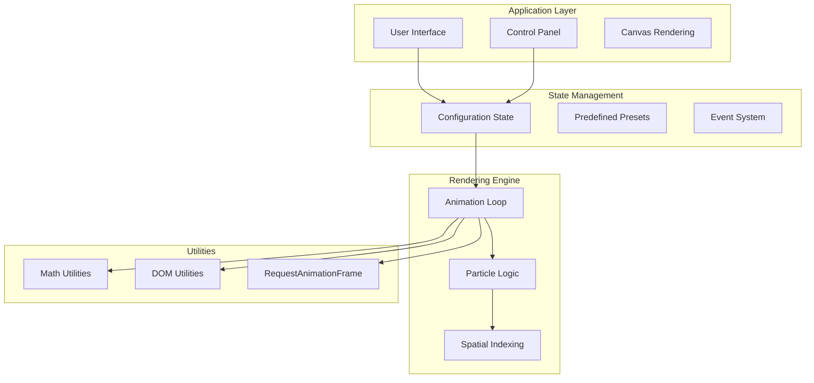

**Diagram sources**
- [tasks.md](file://aicontext/tasks.md#L10-L25)

**Section sources**
- [tasks.md](file://aicontext/tasks.md#L1-L50)
- [README.md](file://README.md#L1-L20)

## Architectural Foundation

The foundation of Plexus Canvas rests on several key architectural principles that guide the entire system design:

### Clean Stack Philosophy
The application adheres to a "clean stack" approach using only essential technologies:
- **HTML5 Canvas** for rendering
- **CSS3** for styling and layout
- **Vanilla JavaScript ES2020+** for logic and interactivity
- **No build tools** - direct browser execution

### Modular Organization
The codebase follows a minimalistic modular structure organized into distinct functional areas:

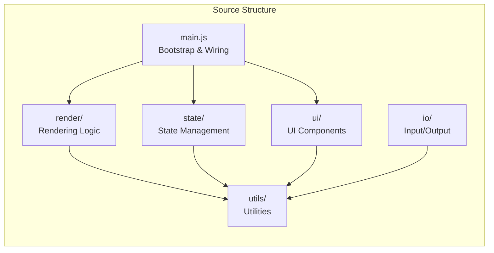

**Diagram sources**
- [tasks.md](file://aicontext/tasks.md#L10-L25)

### Event-Driven Architecture
The system employs a robust event-driven model centered around the configuration change mechanism:

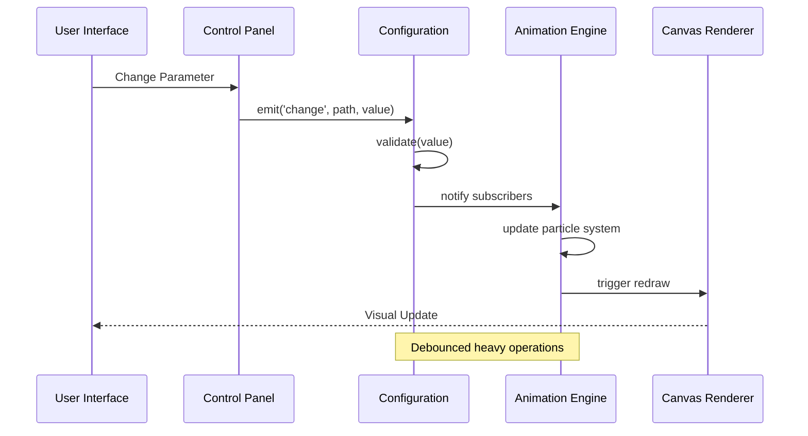

**Diagram sources**
- [tasks.md](file://aicontext/tasks.md#L200-L210)

**Section sources**
- [tasks.md](file://aicontext/tasks.md#L10-L30)

## Modular Architecture

The application's modular architecture separates concerns into distinct functional domains, each responsible for specific aspects of the system:

### Rendering Module
The rendering system handles all visual output and animation logic:

- **engine.js**: Manages the main animation loop using `requestAnimationFrame`, handles pixel density adjustments, and coordinates with the particle system
- **plexus.js**: Contains the core particle physics logic, spatial indexing, and rendering algorithms

### State Management Module
Centralized state management through configuration objects:

- **config.js**: Maintains current configuration state, validates inputs, and manages event subscriptions
- **presets.js**: Provides predefined configurations and preset management

### UI Module
User interface components and controls:

- **panel.js**: Dynamically generates control interfaces, binds to configuration state, and handles user interactions
- **Responsive Design**: Adapts to different screen sizes with flexible layouts

### Utility Modules
Supporting utilities for various system functions:

- **math.js**: Mathematical operations and vector calculations
- **dom.js**: DOM manipulation and event handling
- **raf.js**: RequestAnimationFrame wrapper and timing utilities

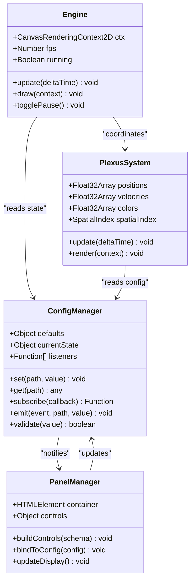

**Diagram sources**
- [tasks.md](file://aicontext/tasks.md#L15-L25)

**Section sources**
- [tasks.md](file://aicontext/tasks.md#L15-L30)

## Key Architectural Patterns

### Event-Driven Architecture

The application implements a sophisticated event-driven architecture centered around the configuration change system:

```javascript
// Example event-driven pattern from the architecture
config.on('change', (path, value) => {
    // Debounced heavy operations
    debouncedHeavyOperation();
});
```

This pattern enables loose coupling between components while maintaining efficient communication channels. The event system handles configuration changes, user interactions, and system state updates through a centralized notification mechanism.

### Structure of Arrays (SoA) Pattern

The particle data storage utilizes the Structure of Arrays pattern for optimal memory layout and cache performance:

```javascript
// SoA data structure for particles
const particles = {
    x: new Float32Array(maxCount),
    y: new Float32Array(maxCount),
    vx: new Float32Array(maxCount),
    vy: new Float32Array(maxCount),
    color: new Float32Array(maxCount) // Optional
};
```

This approach provides several advantages:
- **Memory Efficiency**: Contiguous memory allocation reduces fragmentation
- **Cache Performance**: Sequential access patterns improve CPU cache utilization
- **Vectorization**: SIMD operations can be applied to entire arrays
- **Batch Operations**: Bulk updates are more efficient

### Observer Pattern Implementation

The state management system implements the Observer pattern for automatic state propagation:

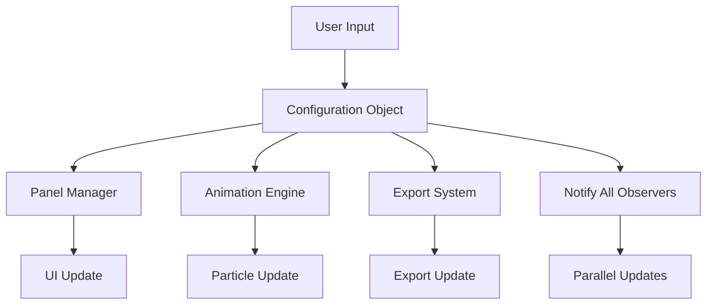

**Diagram sources**
- [tasks.md](file://aicontext/tasks.md#L200-L210)

**Section sources**
- [tasks.md](file://aicontext/tasks.md#L200-L220)

## Component Interactions

The core components work together through well-defined interfaces and communication protocols:

### Bootstrap Process (main.js)
The main.js file serves as the system bootstrap, orchestrating component initialization and wiring:

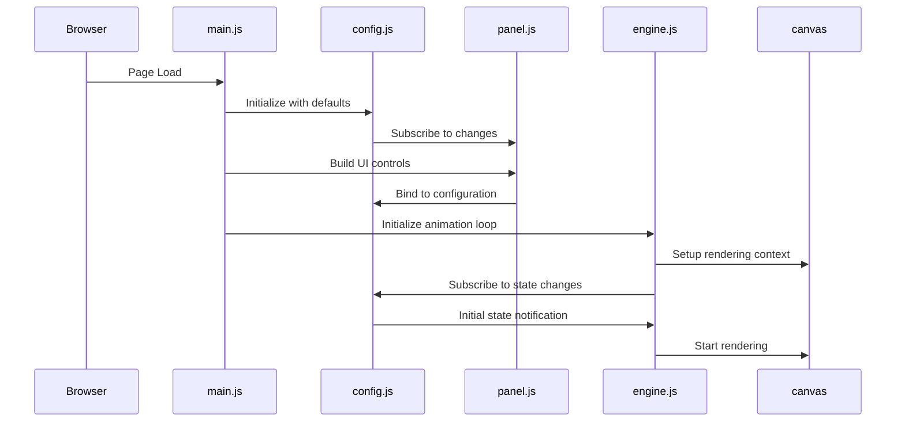

**Diagram sources**
- [tasks.md](file://aicontext/tasks.md#L250-L270)

### Configuration State Flow
The configuration system maintains state consistency across all components:

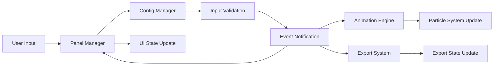

**Diagram sources**
- [tasks.md](file://aicontext/tasks.md#L200-L210)

### Animation Loop Coordination
The engine.js module coordinates the animation loop with all subsystems:

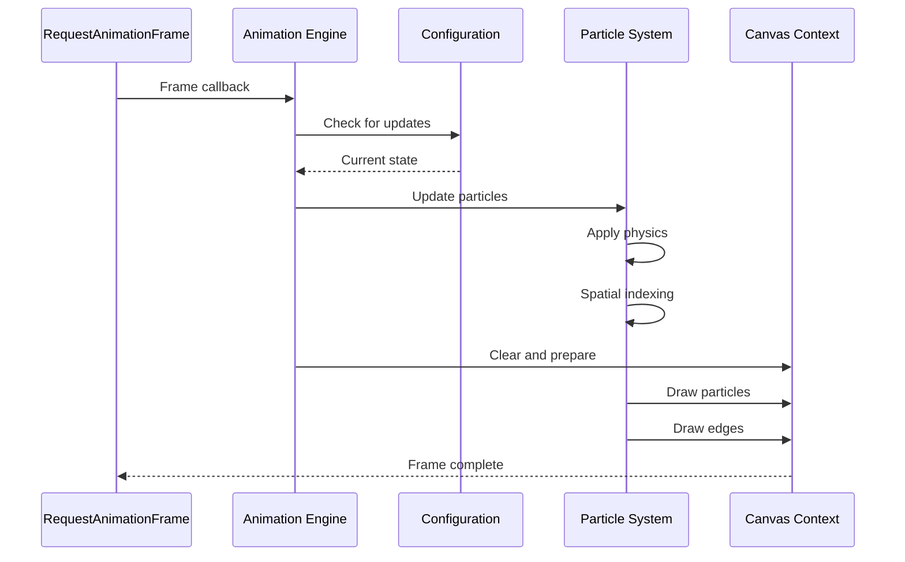

**Diagram sources**
- [tasks.md](file://aicontext/tasks.md#L270-L290)

**Section sources**
- [tasks.md](file://aicontext/tasks.md#L250-L290)

## Data Flow Architecture

The application implements a sophisticated data flow architecture that ensures efficient propagation of changes from user input to visual output:

### Input Processing Pipeline
User interactions flow through a well-defined pipeline:

1. **User Interaction**: Mouse clicks, keyboard input, or control changes
2. **Panel Processing**: Control panels capture and validate user input
3. **Configuration Update**: Configuration objects receive validated input
4. **Event Propagation**: Change events notify all subscribed components
5. **State Synchronization**: All systems synchronize with the new state
6. **Visual Rendering**: Canvas updates reflect the new configuration

### Data Transformation Chain
The system transforms raw user input through multiple processing stages:

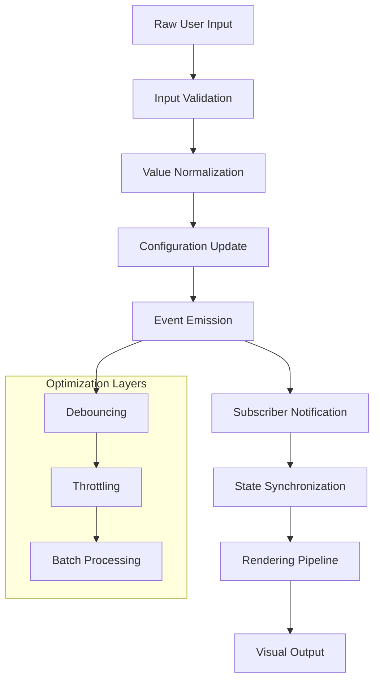

**Diagram sources**
- [tasks.md](file://aicontext/tasks.md#L200-L210)

### Spatial Data Management
The particle system uses advanced spatial data structures for efficient neighbor finding:

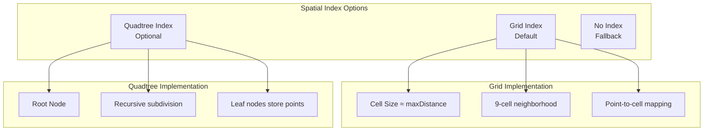

**Diagram sources**
- [tasks.md](file://aicontext/tasks.md#L280-L290)

**Section sources**
- [tasks.md](file://aicontext/tasks.md#L200-L290)

## Performance Optimizations

The architecture incorporates numerous performance optimizations designed to maintain 60 FPS across various device capabilities:

### Memory Layout Optimizations
- **Structure of Arrays**: Uses Float32Array for compact memory representation
- **Contiguous Allocation**: Reduces memory fragmentation and improves cache locality
- **Typed Arrays**: Leverages hardware acceleration for numerical operations

### Rendering Optimizations
- **Batch Drawing**: Single `beginPath()` call for multiple line segments
- **Blend Mode Optimization**: Selective blend mode application based on performance
- **Conditional Rendering**: Disables expensive effects when FPS drops

### Computational Optimizations
- **Spatial Indexing**: Grid-based neighbor finding reduces O(n²) complexity
- **Frame Rate Capping**: Soft FPS limiting prevents unnecessary calculations
- **Selective Updates**: Only affected particles are recalculated

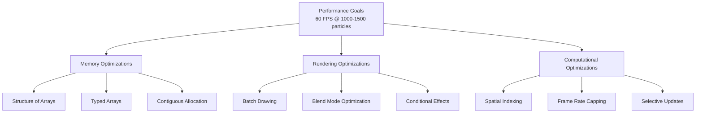

**Diagram sources**
- [tasks.md](file://aicontext/tasks.md#L220-L230)

**Section sources**
- [tasks.md](file://aicontext/tasks.md#L220-L240)

## Trade-offs and Benefits

### Advantages of Vanilla JavaScript Approach

**Benefits:**
- **Zero Dependencies**: No external library maintenance overhead
- **Full Control**: Complete understanding and customization of every aspect
- **Performance**: Minimal runtime overhead compared to framework solutions
- **Learning Value**: Deep understanding of underlying web technologies
- **Browser Compatibility**: Native support across all modern browsers

**Trade-offs:**
- **Development Time**: More manual work for common framework features
- **Code Complexity**: Larger codebase for basic functionality
- **Maintenance**: Manual implementation of features that frameworks provide
- **Team Onboarding**: Steeper learning curve for developers unfamiliar with vanilla JS

### Architectural Pattern Benefits

**Event-Driven Architecture:**
- Enables loose coupling between components
- Simplifies testing and debugging
- Allows for easy extension and modification
- Handles asynchronous operations gracefully

**Structure of Arrays:**
- Maximizes cache performance
- Enables vectorized operations
- Reduces memory fragmentation
- Improves garbage collection efficiency

**Observer Pattern:**
- Decouples state management from UI updates
- Enables reactive programming patterns
- Simplifies complex state synchronization
- Supports multiple observers efficiently

**Section sources**
- [tasks.md](file://aicontext/tasks.md#L1-L10)

## System Context Diagrams

### High-Level System Architecture

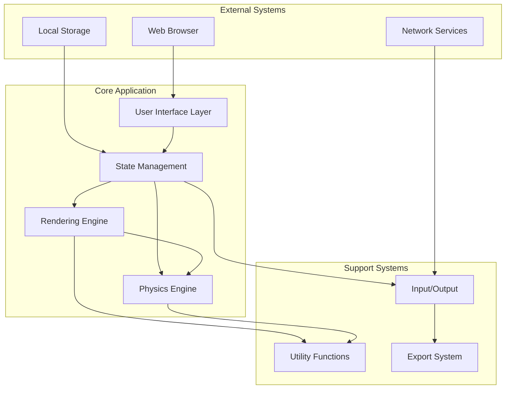

### Component Interaction Matrix

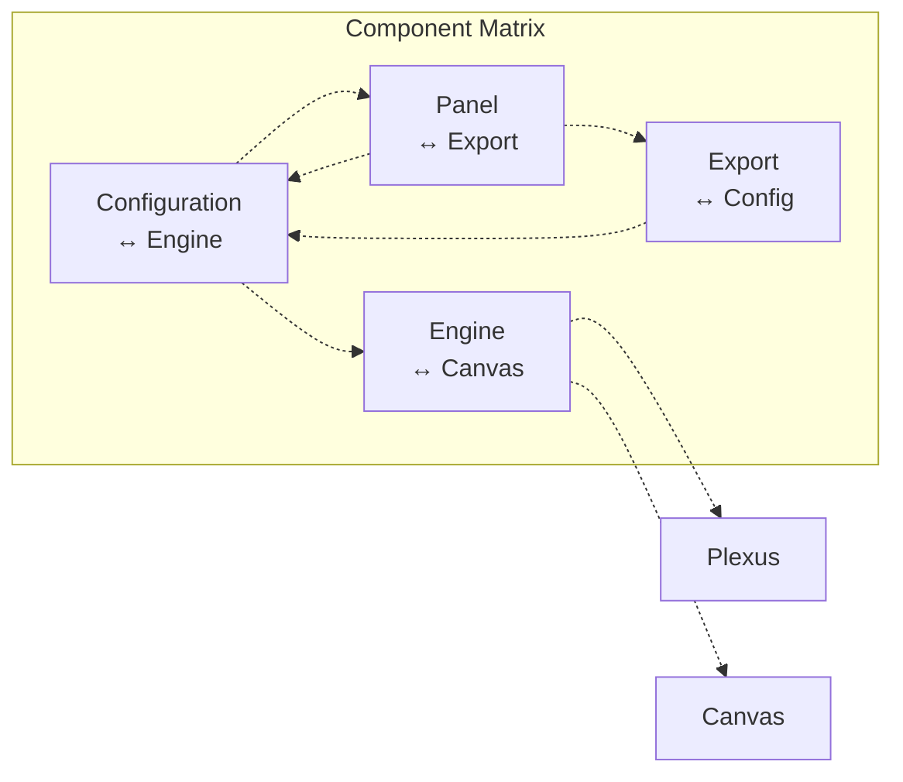

**Section sources**
- [tasks.md](file://aicontext/tasks.md#L1-L50)

## Conclusion

The Plexus Canvas architecture demonstrates a sophisticated approach to building high-performance web applications using vanilla JavaScript. The combination of Event-Driven Architecture, Structure of Arrays data organization, and the Observer Pattern creates a system that is both performant and maintainable.

Key architectural strengths include:

- **Performance Focus**: Carefully optimized memory layout and computational patterns
- **Modularity**: Well-separated concerns with clear component boundaries
- **Flexibility**: Easy extension and modification through the event-driven design
- **Maintainability**: Clean codebase with minimal dependencies

The architectural decisions reflect a deep understanding of web performance characteristics and demonstrate how modern web technologies can be leveraged to create sophisticated interactive applications without relying on external frameworks. This approach provides excellent learning opportunities while delivering production-quality results.

The system's design allows for continued evolution and enhancement while maintaining backward compatibility and performance standards. The modular structure ensures that individual components can be improved or replaced without affecting the overall system architecture.