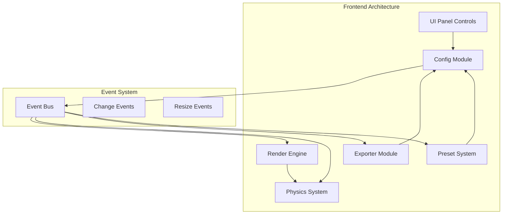
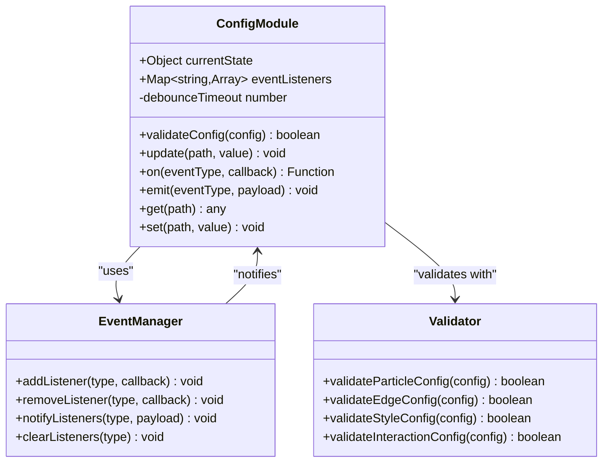
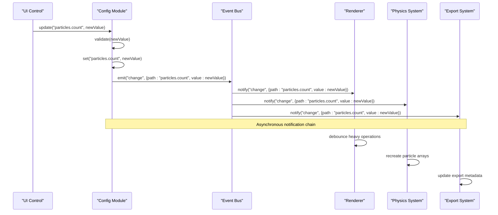
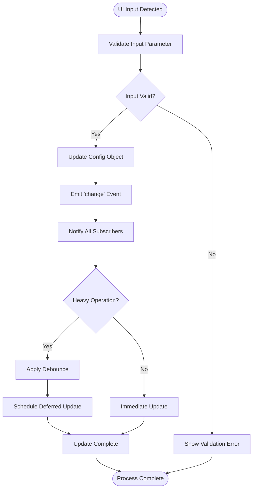

# Event-Driven Architecture

<cite>
**Referenced Files in This Document**
- [tasks.md](file://aicontext/tasks.md)
- [README.md](file://README.md)
</cite>

## Table of Contents
1. [Introduction](#introduction)
2. [Project Overview](#project-overview)
3. [Event-Driven Architecture Foundation](#event-driven-architecture-foundation)
4. [Config Module as Central State Hub](#config-module-as-central-state-hub)
5. [Observer Pattern Implementation](#observer-pattern-implementation)
6. [Component Communication Flow](#component-communication-flow)
7. [Event Handler Registration](#event-handler-registration)
8. [Performance Considerations](#performance-considerations)
9. [Memory Management and Cleanup](#memory-management-and-cleanup)
10. [Best Practices](#best-practices)
11. [Troubleshooting Guide](#troubleshooting-guide)
12. [Conclusion](#conclusion)

## Introduction

The Plexus Canvas project implements a sophisticated event-driven architecture centered around a config object that serves as the central state management hub. This architecture employs the observer pattern with `on('change', callback)` subscriptions to enable loose coupling between UI components, rendering systems, physics engines, and export functionalities.

The event-driven design allows for real-time configuration updates that propagate seamlessly across all system components, enabling dynamic parameter adjustments without requiring page reloads or manual synchronization. This approach creates a highly responsive user experience while maintaining clean separation of concerns and enabling easy extensibility through custom event handlers.

## Project Overview

Plexus Canvas is a modern web application that visualizes dynamic particle networks on canvas elements with interactive configuration panels. The project follows a clean stack architecture using vanilla JavaScript (ES2020+) without frameworks, organized into several key modules:



**Diagram sources**
- [tasks.md](file://aicontext/tasks.md#L4-L22)

**Section sources**
- [tasks.md](file://aicontext/tasks.md#L1-L22)
- [README.md](file://README.md#L1-L56)

## Event-Driven Architecture Foundation

The event-driven architecture in Plexus Canvas is built upon several fundamental principles that ensure scalability, maintainability, and performance:

### Core Design Principles

1. **Loose Coupling**: Components communicate exclusively through events, eliminating direct dependencies
2. **Centralized State Management**: All configuration changes flow through a single config object
3. **Asynchronous Processing**: Events are processed asynchronously to prevent blocking the main thread
4. **Debouncing**: Heavy operations are debounced to optimize performance during rapid updates
5. **Extensibility**: New components can easily subscribe to existing events without modifying core systems

### Event Categories

The system handles several categories of events:

- **Configuration Changes**: Triggered by UI controls when parameters are modified
- **System Resizes**: Canvas resize events that require buffer recreation and center recalculation
- **Animation Updates**: Periodic events during the render loop for continuous parameter updates
- **Export Operations**: Events triggered by export/import actions

## Config Module as Central State Hub

The config module serves as the central nervous system of the application, managing all configuration state and coordinating updates across the system:



**Diagram sources**
- [tasks.md](file://aicontext/tasks.md#L207-L230)

### Configuration Structure

The config object maintains a hierarchical structure that mirrors the UI panel organization:

```javascript
// Example configuration structure
{
  particles: {
    count: 800,
    size: 2,
    speed: 0.35,
    jitter: 0.2,
    spawnArea: "full"
  },
  edges: {
    maxDistance: 140,
    maxEdgesPerNode: 6,
    lineWidth: 1,
    lineOpacity: 0.6,
    blendMode: "lighten",
    colorMode: "byDistance",
    staticColor: "#88ccff"
  },
  forces: {
    noiseStrength: 0.15,
    gravity: 0.05,
    drag: 0.02
  },
  style: {
    bg: { color: "#0b1020", opacity: 1 },
    particleColor: "#e0f2ff",
    gradient: [
      { stop: 0.0, color: "#00e5ff" },
      { stop: 1.0, color: "#7c4dff" }
    ]
  },
  interaction: {
    mouseRepel: 0.35,
    mouseRadius: 120,
    hoverHighlight: true,
    clickSpawn: false
  },
  performance: {
    fpsCap: 60,
    pixelRatioMode: "auto",
    spatialIndex: "grid",
    batchEdges: true
  },
  meta: {
    name: "Neon Breeze v1",
    version: 1
  }
}
```

**Section sources**
- [tasks.md](file://aicontext/tasks.md#L89-L149)

## Observer Pattern Implementation

The observer pattern is implemented through a custom event system that provides flexible subscription mechanisms:



**Diagram sources**
- [tasks.md](file://aicontext/tasks.md#L207-L230)

### Event Subscription Mechanism

Components register event listeners using a simple callback-based interface:

```javascript
// Example event listener registration
config.on('change', (path, value) => {
  // Handle configuration change
  console.log(`Parameter ${path} changed to ${value}`);
  
  // Conditional logic based on changed parameter
  if (path.startsWith('particles.')) {
    // Update particle system
    updateParticleSystem();
  } else if (path.startsWith('edges.')) {
    // Update edge rendering
    updateEdgeRendering();
  }
});
```

**Section sources**
- [tasks.md](file://aicontext/tasks.md#L207-L230)

## Component Communication Flow

The event-driven architecture enables seamless communication between different system components:



**Diagram sources**
- [tasks.md](file://aicontext/tasks.md#L207-L230)

### Component Responsibilities

Each major component has specific responsibilities within the event system:

1. **UI Panel**: Listens for external configuration changes and updates controls accordingly
2. **Renderer**: Responds to visual parameter changes and triggers re-rendering
3. **Physics System**: Handles simulation parameter updates and recalculates particle dynamics
4. **Export System**: Maintains export metadata and responds to configuration changes
5. **Preset System**: Manages configuration templates and applies them through the event system

**Section sources**
- [tasks.md](file://aicontext/tasks.md#L4-L22)

## Event Handler Registration

Components register event handlers during initialization to establish their participation in the event system:

### UI Panel Event Registration

```javascript
// UI Panel registers listeners for configuration changes
class UIPanel {
  constructor(config) {
    this.config = config;
    this.registerEventHandlers();
  }
  
  registerEventHandlers() {
    // Listen for all configuration changes
    this.config.on('change', (path, value) => {
      this.updateControl(path, value);
    });
    
    // Listen for specific parameter changes
    this.config.on('change', (path, value) => {
      if (path === 'style.bg.color') {
        this.updateBackgroundColor(value);
      }
    });
  }
  
  updateControl(path, value) {
    const control = this.findControlByPath(path);
    if (control) {
      control.setValue(value);
    }
  }
}
```

### Renderer Event Registration

```javascript
// Renderer listens for visual parameter changes
class Renderer {
  constructor(config, canvas) {
    this.config = config;
    this.canvas = canvas;
    this.ctx = canvas.getContext('2d');
    this.registerRendererHandlers();
  }
  
  registerRendererHandlers() {
    // Handle visual parameter changes
    this.config.on('change', (path, value) => {
      switch (path) {
        case 'style.particleColor':
          this.updateParticleColor(value);
          break;
        case 'edges.lineWidth':
          this.updateLineWidth(value);
          break;
        case 'style.bg.color':
          this.updateBackgroundColor(value);
          break;
      }
    });
  }
}
```

### Physics System Event Registration

```javascript
// Physics system listens for simulation parameter changes
class PhysicsEngine {
  constructor(config) {
    this.config = config;
    this.registerPhysicsHandlers();
  }
  
  registerPhysicsHandlers() {
    // Handle simulation parameter changes
    this.config.on('change', (path, value) => {
      switch (path) {
        case 'particles.count':
          this.recreateParticleArrays(value);
          break;
        case 'forces.noiseStrength':
          this.updateNoiseParameters(value);
          break;
        case 'forces.gravity':
          this.updateGravityParameters(value);
          break;
      }
    });
  }
}
```

## Performance Considerations

The event-driven architecture must handle frequent updates efficiently, especially during animation loops:

### Debouncing Heavy Operations

```javascript
class ConfigModule {
  constructor() {
    this.debounceTimeout = null;
    this.pendingUpdates = new Map();
  }
  
  update(path, value) {
    // Store pending update
    this.pendingUpdates.set(path, value);
    
    // Clear existing timeout
    if (this.debounceTimeout) {
      clearTimeout(this.debounceTimeout);
    }
    
    // Schedule batched update
    this.debounceTimeout = setTimeout(() => {
      this.processPendingUpdates();
      this.debounceTimeout = null;
    }, 16); // ~60 FPS
  }
  
  processPendingUpdates() {
    this.pendingUpdates.forEach((value, path) => {
      this.emit('change', { path, value });
    });
    this.pendingUpdates.clear();
  }
}
```

### Animation Loop Optimization

During animation loops, the system prioritizes critical updates:

```javascript
// Optimized animation loop with selective event emission
function animate() {
  requestAnimationFrame(animate);
  
  const currentTime = performance.now();
  const deltaTime = currentTime - lastFrameTime;
  
  // Skip frame if below FPS threshold
  if (deltaTime < frameDuration) return;
  
  // Update physics with minimal event emission
  physicsEngine.update(deltaTime);
  
  // Batch render updates
  renderer.batchRender();
  
  // Only emit non-critical events
  if (frameCount % 10 === 0) { // Every 10th frame
    config.emitNonCriticalEvents();
  }
  
  lastFrameTime = currentTime;
  frameCount++;
}
```

**Section sources**
- [tasks.md](file://aicontext/tasks.md#L207-L230)

## Memory Management and Cleanup

Proper memory management is crucial for preventing memory leaks in long-running applications:

### Event Listener Cleanup

```javascript
class Component {
  constructor(config) {
    this.config = config;
    this.eventHandlers = [];
    this.initialize();
  }
  
  initialize() {
    // Register event handlers with cleanup references
    const handlers = [
      this.config.on('change', this.handleParticleCount.bind(this)),
      this.config.on('change', this.handleEdgeSettings.bind(this))
    ];
    
    this.eventHandlers.push(...handlers);
  }
  
  destroy() {
    // Clean up all registered event handlers
    this.eventHandlers.forEach(handler => handler.remove());
    this.eventHandlers.length = 0;
    
    // Clear references
    this.config = null;
  }
  
  handleParticleCount(path, value) {
    if (path === 'particles.count') {
      // Handle particle count change
    }
  }
  
  handleEdgeSettings(path, value) {
    if (path.startsWith('edges.')) {
      // Handle edge setting changes
    }
  }
}
```

### Weak References for Long-lived Events

```javascript
class WeakEventListener {
  constructor(target, eventType, callback) {
    this.target = new WeakRef(target);
    this.eventType = eventType;
    this.callback = callback;
  }
  
  notify(data) {
    const target = this.target.deref();
    if (target) {
      this.callback.call(target, data);
    } else {
      // Target was garbage collected, remove listener
      this.cleanup();
    }
  }
  
  cleanup() {
    // Remove from event system
    this.target = null;
    this.callback = null;
  }
}
```

## Best Practices

### Event Naming Conventions

```javascript
// Recommended event naming patterns
const EVENTS = {
  // Configuration changes
  CONFIG_CHANGE: 'change',
  CONFIG_RESET: 'reset',
  
  // System lifecycle
  INITIALIZED: 'initialized',
  DESTROYED: 'destroyed',
  
  // Specific parameter groups
  PARTICLES_UPDATED: 'particles.update',
  EDGES_UPDATED: 'edges.update',
  STYLE_UPDATED: 'style.update',
  
  // Export/import operations
  EXPORT_STARTED: 'export.start',
  EXPORT_COMPLETED: 'export.complete',
  IMPORT_STARTED: 'import.start',
  IMPORT_COMPLETED: 'import.complete'
};
```

### Error Handling in Event Handlers

```javascript
class RobustEventHandler {
  constructor(config) {
    this.config = config;
    this.registerSafeHandlers();
  }
  
  registerSafeHandlers() {
    this.config.on('change', this.safelyHandleChange.bind(this));
  }
  
  safelyHandleChange(path, value) {
    try {
      // Validate parameters before processing
      if (!this.validateParameter(path, value)) {
        throw new Error(`Invalid parameter: ${path}`);
      }
      
      // Process change with error boundaries
      this.processChange(path, value);
    } catch (error) {
      console.error('Event handler error:', error);
      this.handleError(error, path, value);
    }
  }
  
  validateParameter(path, value) {
    // Parameter validation logic
    return true;
  }
  
  processChange(path, value) {
    // Safe parameter processing
  }
  
  handleError(error, path, value) {
    // Error recovery and logging
  }
}
```

### Testing Event Systems

```javascript
// Unit testing for event systems
describe('Config Event System', () => {
  let config;
  let mockHandler;
  
  beforeEach(() => {
    config = new ConfigModule();
    mockHandler = jest.fn();
  });
  
  it('should notify all subscribers of configuration changes', () => {
    config.on('change', mockHandler);
    
    config.set('particles.count', 1000);
    
    expect(mockHandler).toHaveBeenCalledWith(
      'particles.count', 
      1000
    );
  });
  
  it('should handle multiple subscribers correctly', () => {
    const handler1 = jest.fn();
    const handler2 = jest.fn();
    
    config.on('change', handler1);
    config.on('change', handler2);
    
    config.set('particles.count', 1000);
    
    expect(handler1).toHaveBeenCalled();
    expect(handler2).toHaveBeenCalled();
  });
  
  it('should clean up event listeners properly', () => {
    const handler = jest.fn();
    const unsubscribe = config.on('change', handler);
    
    unsubscribe();
    config.set('particles.count', 1000);
    
    expect(handler).not.toHaveBeenCalled();
  });
});
```

## Troubleshooting Guide

### Common Issues and Solutions

#### Memory Leaks from Unremoved Event Listeners

**Problem**: Components fail to clean up event listeners, causing memory leaks.

**Solution**:
```javascript
// Always track and clean up event handlers
class ProblematicComponent {
  constructor(config) {
    this.config = config;
    this.handlers = [];
    this.init();
  }
  
  init() {
    // Track all handlers
    this.handlers.push(
      this.config.on('change', this.handleChange.bind(this))
    );
  }
  
  destroy() {
    // Clean up all handlers
    this.handlers.forEach(handler => handler.remove());
    this.handlers = [];
  }
}
```

#### Event Handler Performance Issues

**Problem**: Too many event handlers causing performance degradation.

**Solution**:
```javascript
// Use event delegation and batching
class OptimizedEventHandler {
  constructor(config) {
    this.config = config;
    this.batchedUpdates = [];
    this.setupBatchedHandler();
  }
  
  setupBatchedHandler() {
    // Batch multiple changes into single update
    this.config.on('change', (path, value) => {
      this.batchedUpdates.push({ path, value });
      
      if (this.batchedUpdates.length >= 10) {
        this.flushBatch();
      }
    });
  }
  
  flushBatch() {
    // Process all accumulated changes
    const updates = [...this.batchedUpdates];
    this.batchedUpdates = [];
    
    updates.forEach(({ path, value }) => {
      this.handleBatchedChange(path, value);
    });
  }
}
```

#### Circular Dependencies Between Components

**Problem**: Components listening to each other creating infinite loops.

**Solution**:
```javascript
// Use flag-based prevention
class SafeEventHandler {
  constructor(config) {
    this.config = config;
    this.isProcessing = false;
    this.setupSafeHandler();
  }
  
  setupSafeHandler() {
    this.config.on('change', (path, value) => {
      if (this.isProcessing) return;
      
      this.isProcessing = true;
      try {
        this.handleSafeChange(path, value);
      } finally {
        this.isProcessing = false;
      }
    });
  }
}
```

### Debugging Event Systems

```javascript
// Debug wrapper for event system
class DebuggableConfig {
  constructor() {
    this.config = new ConfigModule();
    this.debugEnabled = true;
    this.eventLog = [];
  }
  
  on(eventType, callback) {
    const debugCallback = (path, value) => {
      if (this.debugEnabled) {
        console.log(`[${new Date().toISOString()}] Event: ${eventType} -> ${path}`, value);
        this.eventLog.push({ type: eventType, path, value, timestamp: Date.now() });
      }
      callback(path, value);
    };
    
    return this.config.on(eventType, debugCallback);
  }
  
  dumpEventLog() {
    return this.eventLog.slice(-100); // Last 100 events
  }
}
```

## Conclusion

The event-driven architecture in Plexus Canvas demonstrates a sophisticated approach to building responsive, maintainable web applications. By centralizing state management through the config object and employing the observer pattern, the system achieves excellent decoupling between UI components, rendering systems, physics engines, and export functionalities.

Key benefits of this architecture include:

- **Scalability**: Easy addition of new components without modifying existing code
- **Maintainability**: Clear separation of concerns with well-defined interfaces
- **Performance**: Efficient debouncing and batching of expensive operations
- **Extensibility**: Custom event handlers can be added without system modifications
- **Debugging**: Comprehensive event logging and monitoring capabilities

The architecture successfully addresses the challenge of coordinating multiple subsystems while maintaining responsiveness and preventing memory leaks. Through careful implementation of best practices and robust error handling, the system provides a solid foundation for complex interactive applications.

Future enhancements could include advanced event filtering, priority-based event processing, and distributed event systems for larger-scale applications. The current implementation provides an excellent foundation for these potential improvements while maintaining backward compatibility and system stability.