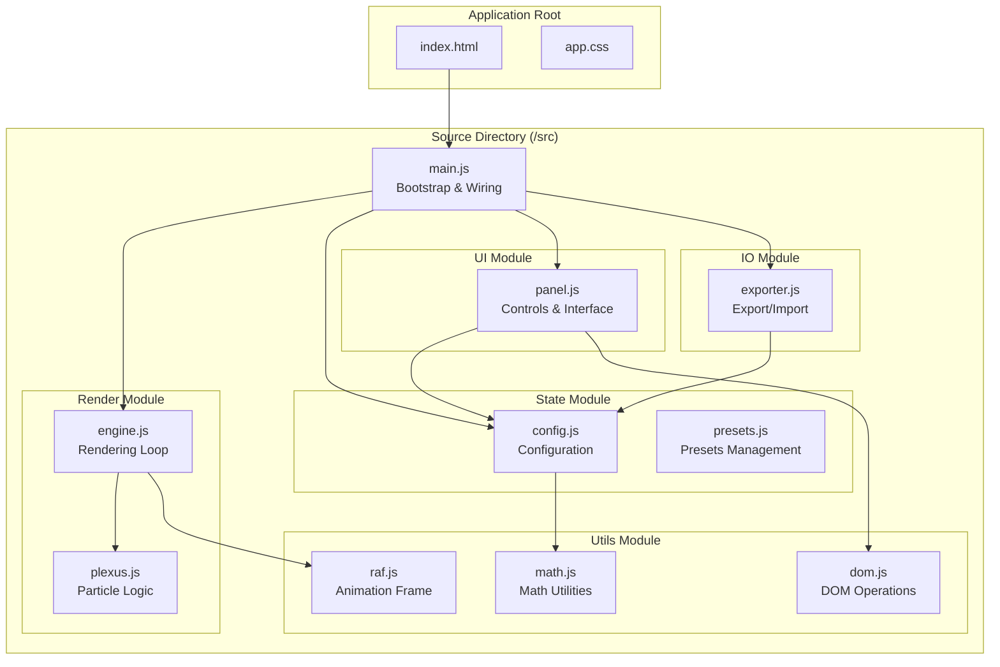
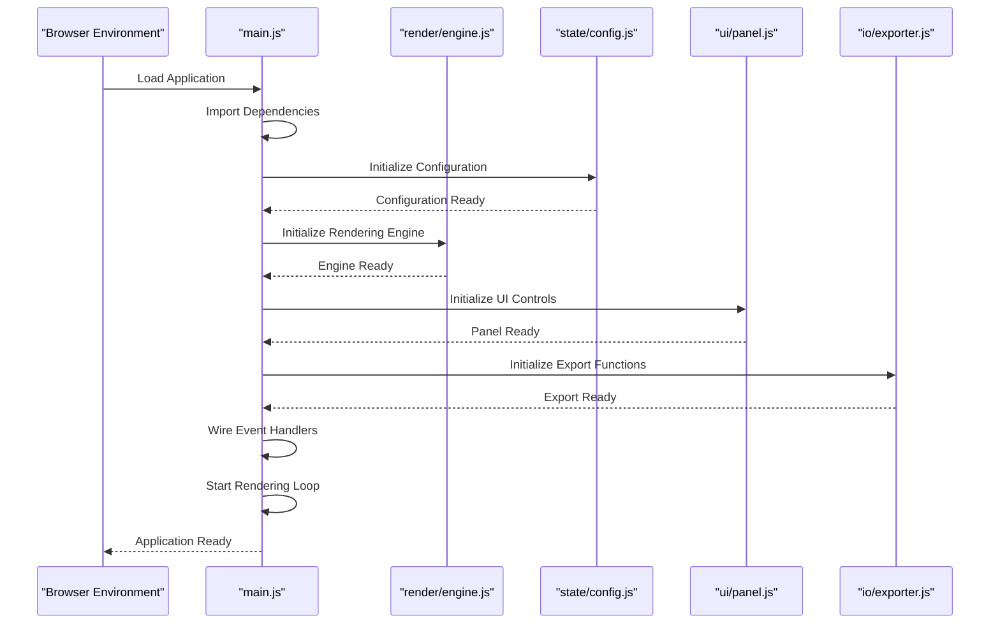
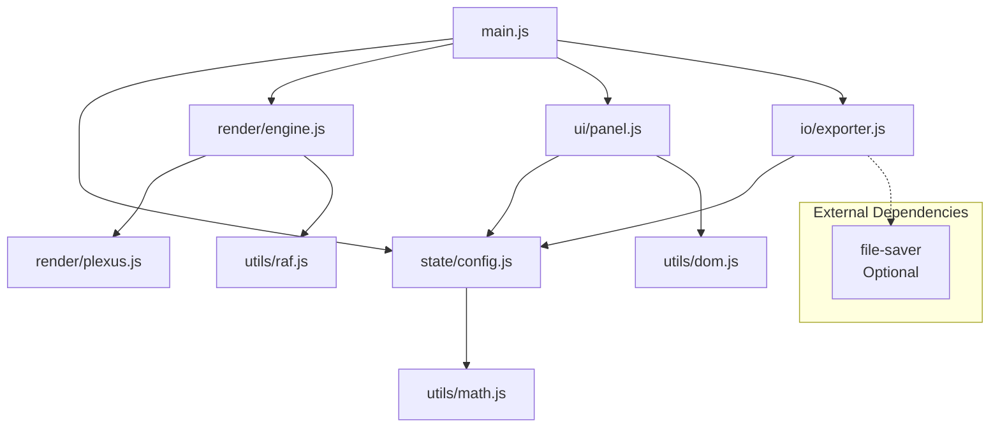

# Module Structure

<cite>
**Referenced Files in This Document**
- [tasks.md](file://aicontext/tasks.md)
- [README.md](file://README.md)
</cite>

## Table of Contents
1. [Introduction](#introduction)
2. [Project Structure Overview](#project-structure-overview)
3. [Core Modules Analysis](#core-modules-analysis)
4. [Main Application Bootstrap](#main-application-bootstrap)
5. [Module Dependencies and Interactions](#module-dependencies-and-interactions)
6. [Vanilla JavaScript Architecture Benefits](#vanilla-javascript-architecture-benefits)
7. [Code Organization Principles](#code-organization-principles)
8. [Extension and Maintainability](#extension-and-maintainability)
9. [Conclusion](#conclusion)

## Introduction

Plexus Canvas is a modern web application built with vanilla JavaScript (ES2020+) that demonstrates excellent modular architecture without relying on build tools or bundlers. The application follows clean architecture principles with clear separation of concerns across dedicated modules, each serving a specific responsibility in the overall system.

The project's architecture emphasizes simplicity, maintainability, and extensibility through a well-defined module structure that promotes single responsibility principles and loose coupling between components.

## Project Structure Overview

The Plexus Canvas project follows a minimalist yet organized structure that prioritizes clarity and ease of maintenance. The architecture is built around five primary modules, each responsible for distinct aspects of the application's functionality.



**Diagram sources**
- [tasks.md](file://aicontext/tasks.md#L11-L22)

**Section sources**
- [tasks.md](file://aicontext/tasks.md#L1-L50)

## Core Modules Analysis

### Render Module

The Render module is responsible for all visual aspects of the application, managing the rendering pipeline and particle system logic.

**Engine Module (`render/engine.js`)**
- Manages the main rendering loop using `requestAnimationFrame`
- Handles time-step calculations for consistent animation
- Processes DPI scaling for high-resolution displays
- Coordinates frame updates across the application

**Plexus Module (`render/plexus.js`)**
- Implements particle and edge logic
- Maintains spatial indexing for efficient collision detection
- Handles particle physics and movement algorithms
- Manages visual representation of connections between particles

### State Module

The State module manages the application's configuration and data persistence.

**Config Module (`state/config.js`)**
- Stores and validates current application configuration
- Provides reactive change events for configuration updates
- Ensures data integrity through validation mechanisms
- Acts as the central source of truth for application state

**Presets Module (`state/presets.js`)**
- Contains predefined configuration sets
- Enables quick switching between different visual styles
- Provides default configurations for new users
- Supports saving and loading custom presets

### UI Module

The UI module handles all user interface interactions and control systems.

**Panel Module (`ui/panel.js`)**
- Constructs user controls and interface elements
- Binds configuration values to UI controls
- Manages user input and event handling
- Provides responsive interface updates

### Utils Module

The Utils module provides essential utility functions used across the application.

**RAF Module (`utils/raf.js`)**
- Offers enhanced requestAnimationFrame functionality
- Provides performance monitoring capabilities
- Implements frame rate limiting when needed

**Math Module (`utils/math.js`)**
- Contains mathematical utilities for geometric calculations
- Provides vector and matrix operations
- Implements spatial math for particle physics

**DOM Module (`utils/dom.js`)**
- Handles DOM manipulation utilities
- Provides cross-browser DOM compatibility
- Manages element positioning and layout calculations

### IO Module

The IO module manages all import and export functionality.

**Exporter Module (`io/exporter.js`)**
- Exports canvas content as PNG images
- Generates SVG representations of the current state
- Handles JSON serialization of configuration data
- Creates shareable URLs for saved configurations

**Section sources**
- [tasks.md](file://aicontext/tasks.md#L11-L22)

## Main Application Bootstrap

The `main.js` file serves as the central orchestrator that initializes and wires together all application modules. This bootstrap process follows a carefully orchestrated sequence to ensure proper dependency resolution and system initialization.



**Diagram sources**
- [tasks.md](file://aicontext/tasks.md#L268-L270)

The bootstrap process follows these key steps:

1. **Module Loading**: All required modules are imported using ES6 import statements
2. **Configuration Initialization**: The configuration system is initialized and validated
3. **Rendering Engine Setup**: The rendering engine is configured with appropriate parameters
4. **UI Control Creation**: User interface controls are constructed and bound to configuration
5. **Event Handler Registration**: All event handlers are wired up for user interaction
6. **System Startup**: The rendering loop begins and the application becomes interactive

**Section sources**
- [tasks.md](file://aicontext/tasks.md#L268-L270)

## Module Dependencies and Interactions

The module architecture follows a well-defined dependency graph that ensures loose coupling while maintaining necessary inter-module communication.



**Diagram sources**
- [tasks.md](file://aicontext/tasks.md#L11-L22)

### Dependency Resolution Strategy

The application employs a top-down dependency resolution strategy where the main bootstrap module coordinates the initialization of all subsystems. This approach ensures:

- **Predictable Initialization Order**: Modules are loaded and initialized in a specific sequence
- **Circular Dependency Prevention**: Careful design prevents circular dependencies
- **Modular Independence**: Each module can be tested and developed independently
- **Clear Interface Contracts**: Well-defined interfaces between modules facilitate maintenance

### Communication Patterns

Modules communicate through several established patterns:

1. **Event-Driven Communication**: Configuration changes trigger events that propagate through the system
2. **Direct Method Calls**: Modules invoke methods on other modules when direct interaction is needed
3. **Shared State Access**: Configuration and state modules provide centralized access to shared data
4. **Callback-Based Interaction**: Asynchronous operations use callback patterns for coordination

**Section sources**
- [tasks.md](file://aicontext/tasks.md#L11-L22)

## Vanilla JavaScript Architecture Benefits

Plexus Canvas demonstrates the advantages of building modern applications without build tools or bundlers, leveraging the power of native browser capabilities and modern JavaScript features.

### Advantages of Vanilla JavaScript Approach

**Development Simplicity**
- No build configuration overhead
- Direct file linking eliminates transpilation complexity
- Immediate feedback during development
- Simplified debugging with source maps

**Performance Benefits**
- Reduced initial load times
- Elimination of build-time compilation
- Direct browser optimization utilization
- Minimal runtime overhead

**Maintainability Features**
- Clear file-to-function mapping
- Explicit dependency declarations
- No magic or abstraction layers
- Easier onboarding for new developers

### Modular Design Principles

The application adheres to several key architectural principles:

**Single Responsibility Principle**
Each module has a clearly defined purpose:
- Render module handles all visual aspects
- State module manages data and configuration
- UI module focuses exclusively on user interaction
- Utils module provides reusable utilities
- IO module handles all file operations

**Separation of Concerns**
- Visual rendering separated from business logic
- Configuration management isolated from UI concerns
- Utility functions remain agnostic of application context
- Import/export functionality encapsulated in dedicated modules

**Loose Coupling**
- Modules interact through well-defined interfaces
- Internal implementation details are hidden
- Changes in one module don't necessarily affect others
- Testing can be performed in isolation

## Code Organization Principles

The project structure reflects careful consideration of code organization principles that enhance readability, maintainability, and extensibility.

### Naming Conventions and File Organization

**File Naming Strategy**
- Descriptive, lowercase filenames with hyphens
- Clear indication of module purpose (e.g., `engine.js`, `config.js`)
- Consistent directory structure reflecting module categories

**Directory Structure**
- Logical grouping of related functionality
- Clear separation between source code and assets
- Minimal nesting to maintain simplicity

### Import and Export Patterns

The application uses ES6 module syntax consistently:

```javascript
// Standard import pattern
import { functionName } from './module.js';

// Named exports
export const configValue = 'default';
export function utilityFunction() { /* ... */ }

// Default exports
export default class ModuleClass { /* ... */ }
```

### Code Quality Practices

**Consistent Coding Style**
- Uniform indentation and formatting
- Meaningful variable and function names
- Comprehensive comments for complex logic
- Proper error handling and validation

**Testing and Validation**
- Input validation in configuration modules
- Defensive programming practices
- Graceful error handling
- Comprehensive type checking where applicable

## Extension and Maintainability

The modular architecture provides excellent support for future enhancements and maintenance activities.

### Scalability Considerations

**Adding New Features**
- New functionality can be added as separate modules
- Existing modules remain unaffected by new additions
- Clear extension points for customization
- Minimal impact on existing codebase

**Performance Optimization**
- Individual modules can be optimized independently
- Clear profiling targets for performance analysis
- Efficient resource utilization through focused responsibilities
- Minimal overhead from unnecessary abstractions

### Maintenance Strategies

**Code Refactoring**
- Modules can be refactored without affecting other parts
- Well-defined interfaces prevent breaking changes
- Comprehensive testing ensures stability during modifications
- Gradual migration paths for legacy code replacement

**Bug Fixing and Debugging**
- Isolated modules simplify problem identification
- Clear error boundaries prevent cascading failures
- Comprehensive logging and error reporting
- Easy reproduction of issues through module isolation

### Future Enhancement Opportunities

**Potential Extensions**
- Plugin system for third-party modules
- Enhanced export formats (PDF, WebGL)
- Advanced configuration options
- Multi-user collaboration features

**Technology Evolution**
- Seamless integration with emerging web APIs
- Progressive enhancement capabilities
- Compatibility with future browser standards
- Migration paths to more advanced architectures when needed

## Conclusion

The Plexus Canvas module structure exemplifies excellent software architecture principles applied to modern web development. By embracing vanilla JavaScript and a clean modular approach, the application achieves remarkable simplicity while maintaining robust functionality and extensibility.

The architecture's key strengths include:

- **Clear Separation of Concerns**: Each module has a well-defined responsibility
- **Minimal Dependencies**: Loose coupling enables easy maintenance and testing
- **Scalable Design**: The structure supports future enhancements without major rewrites
- **Developer-Friendly**: The codebase is accessible and understandable for developers of varying skill levels

This architectural approach demonstrates that modern web applications can be both powerful and maintainable without relying on complex build tools or frameworks. The success of Plexus Canvas as a demonstration project highlights the viability of this approach for real-world applications requiring high performance and long-term maintainability.

The modular design, combined with vanilla JavaScript implementation, creates a foundation that can adapt to changing requirements while preserving the application's core functionality and user experience. This architecture serves as an excellent model for developers seeking to build maintainable, performant web applications without the overhead of modern JavaScript frameworks.