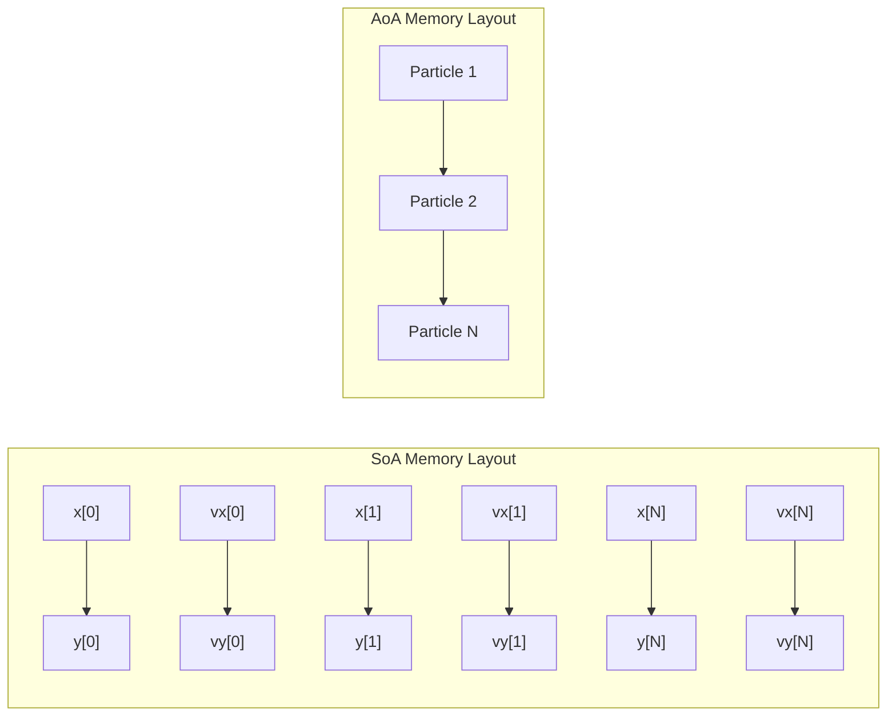
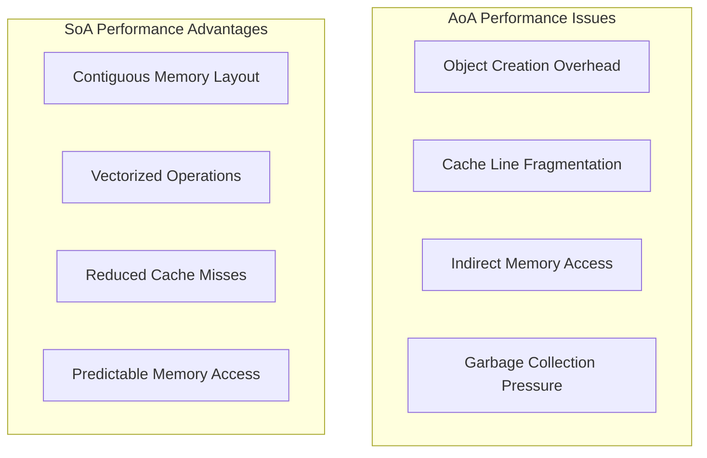
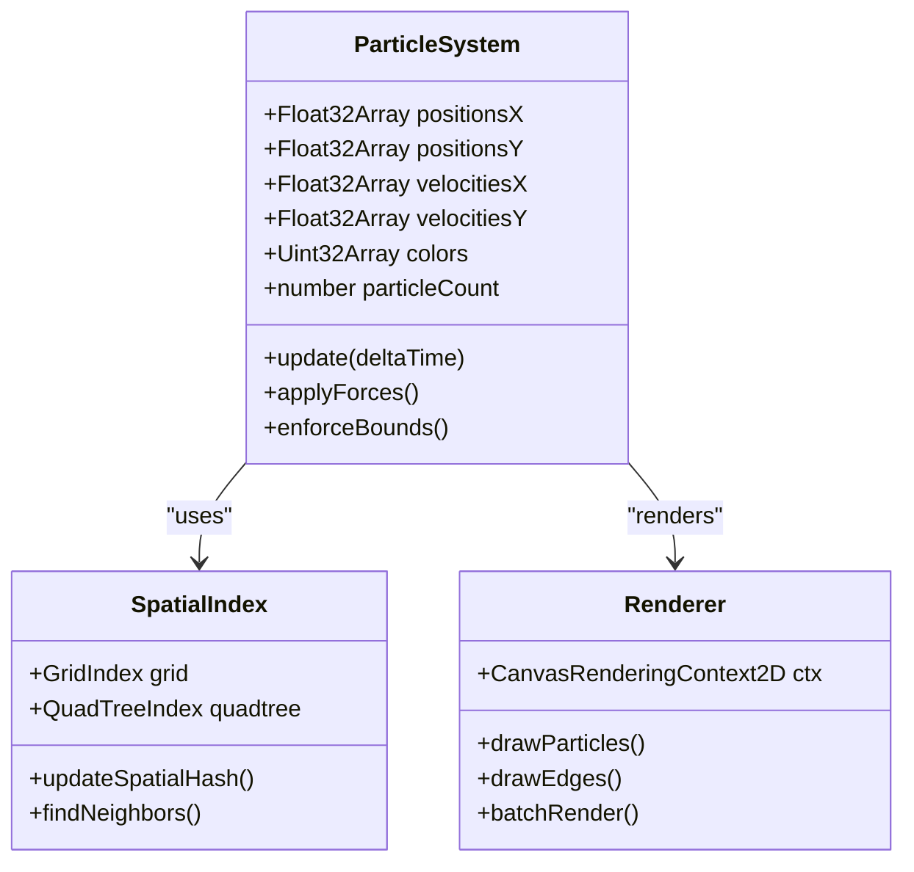

# Structure of Arrays (SoA) Pattern in Particle Systems

<cite>
**Referenced Files in This Document**
- [tasks.md](file://aicontext/tasks.md)
- [README.md](file://README.md)
</cite>

## Table of Contents
1. [Introduction](#introduction)
2. [Understanding SoA vs AoA](#understanding-soa-vs-aoa)
3. [SoA Implementation in Plexus Canvas](#soa-implementation-in-plexus-canvas)
4. [Memory Layout and Performance Benefits](#memory-layout-and-performance-benefits)
5. [Particle System Architecture](#particle-system-architecture)
6. [Spatial Indexing and SoA](#spatial-indexing-and-soa)
7. [Code Examples and Patterns](#code-examples-and-patterns)
8. [Trade-offs and Considerations](#trade-offs-and-considerations)
9. [Best Practices for SoA Implementation](#best-practices-for-soa-implementation)
10. [Conclusion](#conclusion)

## Introduction

The Structure of Arrays (SoA) pattern is a fundamental optimization technique used in high-performance computing, particularly in graphics and simulation systems. Unlike the traditional Array of Structures (AoA) approach, SoA stores related data in separate arrays, which significantly improves cache locality and computational efficiency in tight rendering loops with thousands of particles.

In the context of the Plexus Canvas particle system, SoA is implemented using Float32Array data structures to store particle properties such as position (x, y), velocity (vx, vy), and color. This approach provides substantial performance benefits when processing thousands of particles in real-time rendering scenarios.

## Understanding SoA vs AoA

### Array of Structures (AoA) Approach

The AoA pattern organizes data as collections of objects, where each object contains all properties for a single entity:

```javascript
// Traditional AoA implementation
const particles = [
  { x: 100, y: 150, vx: 0.5, vy: -0.3, color: '#ffffff' },
  { x: 120, y: 160, vx: 0.4, vy: -0.2, color: '#cccccc' },
  // ... thousands of particles
];
```

### Structure of Arrays (SoA) Approach

The SoA pattern separates properties into individual arrays, where each array contains values for a specific property across all entities:

```javascript
// SoA implementation using Float32Array
const positionsX = new Float32Array(maxParticles);
const positionsY = new Float32Array(maxParticles);
const velocitiesX = new Float32Array(maxParticles);
const velocitiesY = new Float32Array(maxParticles);
const colors = new Uint32Array(maxParticles); // Packed color values
```

**Section sources**
- [tasks.md](file://aicontext/tasks.md#L156-L156)

## SoA Implementation in Plexus Canvas

### Core Data Structure Design

The Plexus Canvas particle system implements SoA using Float32Array for numerical properties and Uint32Array for packed color values. This design choice provides several advantages:

```javascript
// Core SoA structure from the tasks documentation
const soaStructure = {
  // Position properties
  x: new Float32Array(maxParticles),
  y: new Float32Array(maxParticles),
  
  // Velocity properties
  vx: new Float32Array(maxParticles),
  vy: new Float32Array(maxParticles),
  
  // Optional color property
  color: new Uint32Array(maxParticles)
};
```

### Memory Layout Benefits

The SoA pattern creates a contiguous memory layout where related data is stored sequentially:



**Diagram sources**
- [tasks.md](file://aicontext/tasks.md#L156-L156)

**Section sources**
- [tasks.md](file://aicontext/tasks.md#L156-L156)

## Memory Layout and Performance Benefits

### Cache Locality Optimization

The SoA pattern significantly improves cache locality because:

1. **Sequential Access Patterns**: When updating positions, all x-coordinates are accessed sequentially, followed by all y-coordinates
2. **Reduced Cache Misses**: Related data is stored contiguously, reducing the number of cache lines loaded
3. **Better SIMD Utilization**: Modern CPUs can process multiple float values simultaneously

### Computational Efficiency

The SoA implementation enables efficient vectorized operations:

```javascript
// Efficient SoA update loop
for (let i = 0; i < particleCount; i++) {
  // Vectorized operations on entire arrays
  positionsX[i] += velocitiesX[i] * deltaTime;
  positionsY[i] += velocitiesY[i] * deltaTime;
  
  // Apply forces and constraints
  applyForces(i);
  enforceBounds(i);
}
```

### Comparison with AoA Performance



## Particle System Architecture

### Particle Property Management

The SoA pattern in Plexus Canvas manages particle properties through dedicated arrays:



**Diagram sources**
- [tasks.md](file://aicontext/tasks.md#L156-L156)

### Force Calculation and Integration

The SoA pattern enables efficient force calculation and integration:

```javascript
// SoA-friendly force calculation
function applyForces(particleIdx) {
  const x = positionsX[particleIdx];
  const y = positionsY[particleIdx];
  const vx = velocitiesX[particleIdx];
  const vy = velocitiesY[particleIdx];
  
  // Noise forces
  const noiseX = noiseStrength * Math.sin(frequency * (y + currentTime));
  const noiseY = noiseStrength * Math.cos(frequency * (x + currentTime));
  
  // Gravity force
  const centerX = canvasWidth * 0.5;
  const centerY = canvasHeight * 0.5;
  const gravityX = gravity * (centerX - x);
  const gravityY = gravity * (centerY - y);
  
  // Apply forces to velocity
  velocitiesX[particleIdx] += noiseX + gravityX;
  velocitiesY[particleIdx] += noiseY + gravityY;
  
  // Apply drag
  velocitiesX[particleIdx] *= (1 - drag);
  velocitiesY[particleIdx] *= (1 - drag);
}
```

**Section sources**
- [tasks.md](file://aicontext/tasks.md#L156-L156)

## Spatial Indexing and SoA

### Grid-Based Spatial Index

The SoA pattern works seamlessly with spatial indexing structures:

```javascript
// Grid index implementation optimized for SoA
class GridIndex {
  constructor(cellSize, width, height) {
    this.cellSize = cellSize;
    this.grid = {};
    this.width = width;
    this.height = height;
  }
  
  updateSpatialHash(positionsX, positionsY, particleCount) {
    // Clear existing grid
    this.grid = {};
    
    // Hash particles into grid cells
    for (let i = 0; i < particleCount; i++) {
      const x = positionsX[i];
      const y = positionsY[i];
      
      const cellX = Math.floor(x / this.cellSize);
      const cellY = Math.floor(y / this.cellSize);
      
      const cellKey = `${cellX},${cellY}`;
      if (!this.grid[cellKey]) {
        this.grid[cellKey] = [];
      }
      this.grid[cellKey].push(i);
    }
  }
}
```

### Quadtree Implementation

For larger particle counts or uneven distributions, a quadtree can be used:

```javascript
// Quadtree implementation compatible with SoA
class QuadTree {
  constructor(bounds, maxParticles, maxDepth) {
    this.bounds = bounds;
    this.maxParticles = maxParticles;
    this.maxDepth = maxDepth;
    this.particles = [];
    this.children = null;
  }
  
  insert(positionsX, positionsY, particleIdx) {
    // Insert particle into appropriate quadrant
    if (this.children) {
      const x = positionsX[particleIdx];
      const y = positionsY[particleIdx];
      this.insertIntoChild(x, y, particleIdx);
    } else {
      this.particles.push(particleIdx);
      
      // Subdivide if we exceed capacity
      if (this.particles.length > this.maxParticles && this.depth < this.maxDepth) {
        this.subdivide();
      }
    }
  }
}
```

**Section sources**
- [tasks.md](file://aicontext/tasks.md#L218-L218)

## Code Examples and Patterns

### Batch Rendering with SoA

The SoA pattern enables efficient batch rendering:

```javascript
// Batch drawing of particles using SoA
function drawParticles(ctx, positionsX, positionsY, colors, particleCount) {
  ctx.beginPath();
  
  for (let i = 0; i < particleCount; i++) {
    const x = positionsX[i];
    const y = positionsY[i];
    
    // Set color from packed SoA array
    ctx.fillStyle = `#${colors[i].toString(16).padStart(6, '0')}`;
    
    // Draw individual particle
    ctx.arc(x, y, particleSize, 0, Math.PI * 2);
  }
  
  ctx.fill();
}
```

### Edge Drawing with SoA

Edges are drawn efficiently using SoA neighbor finding:

```javascript
// Edge drawing optimized for SoA
function drawEdges(ctx, positionsX, positionsY, particleCount, maxDistance, maxEdgesPerNode) {
  ctx.beginPath();
  
  for (let i = 0; i < particleCount; i++) {
    let edgesDrawn = 0;
    
    // Find neighbors using spatial index
    const neighbors = findNeighbors(i, positionsX, positionsY, particleCount);
    
    for (const j of neighbors) {
      if (edgesDrawn >= maxEdgesPerNode) break;
      
      const dx = positionsX[j] - positionsX[i];
      const dy = positionsY[j] - positionsY[i];
      const distance = Math.sqrt(dx * dx + dy * dy);
      
      if (distance <= maxDistance) {
        ctx.moveTo(positionsX[i], positionsY[i]);
        ctx.lineTo(positionsX[j], positionsY[j]);
        edgesDrawn++;
      }
    }
  }
  
  ctx.stroke();
}
```

### Dynamic Property Addition

Adding new properties to the SoA structure:

```javascript
// Adding age property to SoA
class EnhancedParticleSystem extends ParticleSystem {
  constructor(maxParticles) {
    super(maxParticles);
    
    // Add new SoA property
    this.age = new Float32Array(maxParticles);
    this.birthTime = new Float32Array(maxParticles);
  }
  
  initializeParticles() {
    super.initializeParticles();
    
    // Initialize new properties
    const currentTime = Date.now();
    for (let i = 0; i < this.particleCount; i++) {
      this.birthTime[i] = currentTime;
      this.age[i] = 0;
    }
  }
  
  update(deltaTime) {
    super.update(deltaTime);
    
    // Update new properties
    for (let i = 0; i < this.particleCount; i++) {
      this.age[i] += deltaTime;
      
      // Example: fade out particles based on age
      const alpha = Math.max(0, 1 - this.age[i] / this.maxAge);
      this.colors[i] = (this.colors[i] & 0xFFFFFF) | (Math.floor(alpha * 255) << 24);
    }
  }
}
```

## Trade-offs and Considerations

### Memory Management

**Advantages of SoA:**
- Better cache locality and performance
- Reduced memory fragmentation
- Efficient bulk operations
- Predictable memory access patterns

**Disadvantages of SoA:**
- Increased complexity in code
- More verbose property access
- Higher memory overhead for sparse properties
- Less intuitive debugging

### Code Readability vs Performance

```javascript
// Less readable but more performant SoA access
const x = positionsX[particleIdx];
const y = positionsY[particleIdx];

// More readable but potentially less performant AoA access
const particle = particles[particleIdx];
const x = particle.x;
const y = particle.y;
```

### Hybrid Approaches

For optimal balance, consider hybrid approaches:

```javascript
// Hybrid SoA/AoA implementation
class HybridParticleSystem {
  constructor(maxParticles) {
    this.soa = {
      x: new Float32Array(maxParticles),
      y: new Float32Array(maxParticles),
      vx: new Float32Array(maxParticles),
      vy: new Float32Array(maxParticles)
    };
    
    this.aoa = new Array(maxParticles);
    this.maxParticles = maxParticles;
  }
  
  // Proxy interface for AoA-like access
  getParticle(idx) {
    return {
      x: this.soa.x[idx],
      y: this.soa.y[idx],
      vx: this.soa.vx[idx],
      vy: this.soa.vy[idx]
    };
  }
  
  setParticle(idx, particle) {
    this.soa.x[idx] = particle.x;
    this.soa.y[idx] = particle.y;
    this.soa.vx[idx] = particle.vx;
    this.soa.vy[idx] = particle.vy;
  }
}
```

## Best Practices for SoA Implementation

### When to Use SoA

**Ideal Use Cases:**
- Real-time simulations with thousands of entities
- Graphics rendering with tight performance requirements
- Numerical computations requiring vectorization
- Systems with frequent property updates

**Not Ideal for:**
- Small datasets (< 100 entities)
- Systems with infrequent updates
- Applications prioritizing code simplicity over performance
- Scenarios with mostly read-only data

### Integration Guidelines

When adding new properties to an existing SoA system:

1. **Maintain Array Alignment**: Ensure all properties remain aligned in their respective arrays
2. **Consider Data Types**: Use appropriate TypedArray types (Float32Array, Int32Array, Uint32Array)
3. **Plan for Growth**: Allocate sufficient capacity for future expansion
4. **Optimize Access Patterns**: Group related properties together

### Performance Monitoring

Monitor SoA performance using:

```javascript
// Performance profiling for SoA operations
function profileSoAOperation(operationName, operationFn) {
  const startTime = performance.now();
  operationFn();
  const endTime = performance.now();
  
  console.log(`${operationName}: ${endTime - startTime}ms`);
}

// Example usage
profileSoAOperation('Particle Update', () => {
  for (let i = 0; i < particleCount; i++) {
    updateParticle(i);
  }
});
```

## Conclusion

The Structure of Arrays (SoA) pattern represents a powerful optimization technique for high-performance particle systems and simulations. By storing related data in separate arrays rather than objects, SoA significantly improves cache locality, enables vectorized operations, and provides substantial performance benefits in tight rendering loops with thousands of particles.

The Plexus Canvas implementation demonstrates how SoA can be effectively applied to create smooth, responsive particle visualizations while maintaining clean separation of concerns. The pattern's benefits become particularly evident when dealing with complex force calculations, spatial indexing, and batch rendering operations.

While SoA introduces additional complexity compared to traditional object-oriented approaches, the performance gains justify its use in computationally intensive applications. Developers should carefully evaluate their specific requirements and consider hybrid approaches when balancing performance needs with code maintainability.

For similar visualization projects, the SoA pattern should be considered when:
- Working with thousands of interactive elements
- Requiring real-time performance
- Implementing complex physics simulations
- Developing graphics-intensive applications

The key to successful SoA implementation lies in understanding the trade-offs between performance and code complexity, and applying the pattern judiciously based on specific application requirements.