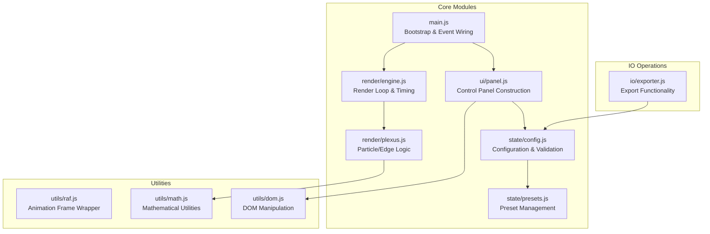
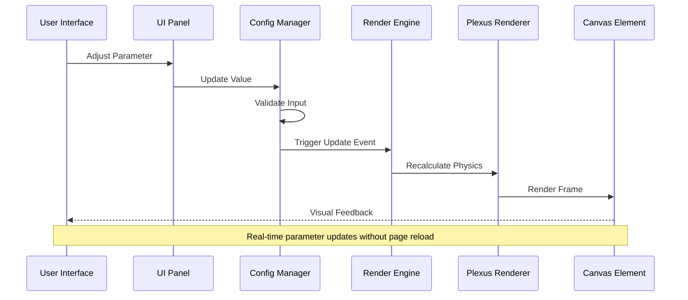
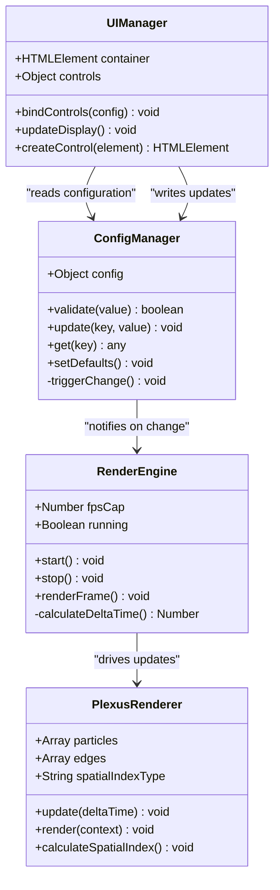
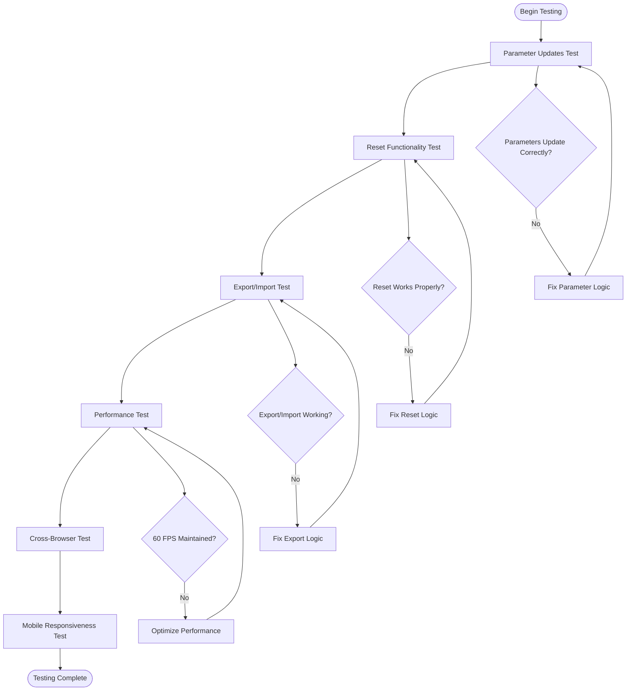
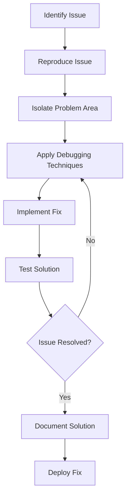

# Development Guide

<cite>
**Referenced Files in This Document**
- [README.md](file://README.md)
- [tasks.md](file://aicontext/tasks.md)
</cite>

## Table of Contents
1. [Introduction](#introduction)
2. [Project Overview](#project-overview)
3. [Development Environment Setup](#development-environment-setup)
4. [Code Organization Principles](#code-organization-principles)
5. [Contribution Workflow](#contribution-workflow)
6. [Architecture Guidelines](#architecture-guidelines)
7. [Testing Procedures](#testing-procedures)
8. [Performance Optimization](#performance-optimization)
9. [Debugging Techniques](#debugging-techniques)
10. [Troubleshooting Guide](#troubleshooting-guide)
11. [Best Practices](#best-practices)

## Introduction

Welcome to the Plexus Canvas development guide! This document provides comprehensive instructions for developers contributing to the project. Plexus Canvas is a modern web application that visualizes dynamic particle networks on a canvas element, featuring real-time parameter adjustments, presets, and export capabilities.

The project follows a clean architecture approach with vanilla JavaScript (ES2020+) and emphasizes performance optimization to maintain 60 FPS rendering. This guide covers everything from initial setup to advanced development techniques.

## Project Overview

Plexus Canvas is a web-based application designed to create interactive particle network visualizations. The core concept involves rendering dynamic "plexus" networks (particles connected by edges) on a canvas element with an interactive settings panel on the right side.

### Key Features
- Real-time parameter adjustment without page reload
- Preset management system
- JSON import/export functionality
- High-performance rendering with spatial indexing
- Interactive mouse controls and keyboard shortcuts
- Multi-format export capabilities (PNG, SVG, JSON)

### Technology Stack
- **Frontend**: Vanilla HTML, CSS (with optional Tailwind), ES2020+ JavaScript
- **Build Tools**: None required (can open index.html directly)
- **Optional Dependencies**: file-saver for download functionality
- **Rendering**: Canvas API with requestAnimationFrame
- **Performance**: Spatial indexing (grid/quadtree), batch rendering

**Section sources**
- [README.md](file://README.md#L1-L56)
- [tasks.md](file://aicontext/tasks.md#L1-L50)

## Development Environment Setup

### Prerequisites

Before starting development, ensure you have the following installed:

- **Node.js**: Version 18 or higher
- **npm or yarn**: Package manager of choice
- **Modern web browser**: Chrome, Firefox, or Edge for development

### Initial Setup

1. **Clone the Repository**
```bash
git clone https://github.com/y-tretyakov/plexus-canvas.git
cd plexus-canvas
```

2. **Install Dependencies**
```bash
npm install
```

3. **Start Development Server**
```bash
npm run dev
```

### Directory Structure Understanding

Based on the project structure and architecture guidelines, the expected directory layout should be:

```
plexus-canvas/
├── index.html          # Main HTML file
├── styles/             # CSS stylesheets
│   └── app.css         # Base styles and responsive design
├── src/                # JavaScript source files
│   ├── main.js         # Bootstrap and event wiring
│   ├── render/         # Rendering engine
│   │   ├── engine.js   # Render loop and timing
│   │   └── plexus.js   # Particle/edge logic
│   ├── state/          # Application state management
│   │   ├── config.js   # Configuration and validation
│   │   └── presets.js  # Preset definitions
│   ├── ui/             # User interface components
│   │   └── panel.js    # Control panel construction
│   ├── utils/          # Utility functions
│   │   ├── raf.js      # RequestAnimationFrame wrapper
│   │   ├── math.js     # Mathematical utilities
│   │   └── dom.js      # DOM manipulation helpers
│   └── io/             # Input/output operations
│       └── exporter.js # Export functionality
└── aicontext/          # AI context and tasks documentation
    └── tasks.md        # Detailed project specifications
```

### Development Workflow

#### Setting Up Your Development Environment

1. **Fork the Repository**
   - Navigate to the GitHub repository
   - Click "Fork" to create your copy
   - Clone your fork locally

2. **Configure Remote**
```bash
git remote add upstream https://github.com/y-tretyakov/plexus-canvas.git
```

3. **Create Feature Branch**
```bash
git checkout -b feature/your-feature-name
```

4. **Development Cycle**
   - Make incremental commits
   - Test frequently during development
   - Keep branches focused on single features

#### Local Development Tips

- Use browser developer tools for debugging
- Enable source maps for better debugging experience
- Utilize console logging strategically
- Test across different browsers and devices

**Section sources**
- [README.md](file://README.md#L8-L30)

## Code Organization Principles

### Architecture Philosophy

Plexus Canvas follows a minimalist architecture with the following principles:

1. **Vanilla JavaScript First**: No frameworks, pure ES2020+
2. **Minimal Dependencies**: Only essential utilities
3. **Clear Separation of Concerns**: Well-defined module boundaries
4. **Performance-Centric Design**: Optimized for 60 FPS rendering

### Module Structure

#### Core Modules



**Diagram sources**
- [tasks.md](file://aicontext/tasks.md#L10-L30)

#### Data Flow Architecture



**Diagram sources**
- [tasks.md](file://aicontext/tasks.md#L10-L30)

### Coding Standards

#### JavaScript Conventions

1. **ES2020+ Features**: Utilize modern JavaScript syntax
2. **Consistent Naming**: 
   - Variables: camelCase
   - Constants: UPPER_SNAKE_CASE
   - Classes: PascalCase
3. **Modular Design**: Single responsibility principle
4. **Documentation**: Inline comments for complex logic
5. **Error Handling**: Graceful degradation and meaningful errors

#### File Organization

- **Group Related Functions**: Place closely related functions together
- **Export Clear Interfaces**: Use named exports for public APIs
- **Internal Utilities**: Prefix internal functions with underscore (_)
- **Constants**: Define constants at the top of files

**Section sources**
- [tasks.md](file://aicontext/tasks.md#L10-L30)

## Contribution Workflow

### Forking and Branching Strategy

#### Step-by-Step Contribution Process

1. **Fork the Repository**
   - Create your own copy on GitHub
   - Clone your fork locally
   ```bash
   git clone https://github.com/YOUR_USERNAME/plexus-canvas.git
   cd plexus-canvas
   ```

2. **Set Up Remotes**
   ```bash
   git remote add upstream https://github.com/y-tretyakov/plexus-canvas.git
   git remote -v
   ```

3. **Create Feature Branch**
   ```bash
   git checkout -b feature/description-of-feature
   ```

4. **Development Workflow**
   ```bash
   # Make changes
   git add .
   git commit -m "Add descriptive commit message"
   
   # Sync with upstream
   git fetch upstream
   git rebase upstream/main
   
   # Resolve conflicts if any
   # Continue rebase: git rebase --continue
   ```

5. **Push and Create Pull Request**
   ```bash
   git push origin feature/description-of-feature
   ```

### Commit Message Guidelines

Follow conventional commit format:
- **feat**: New feature implementation
- **fix**: Bug fixes
- **docs**: Documentation changes
- **style**: Code formatting changes
- **refactor**: Code restructuring
- **test**: Adding or updating tests
- **chore**: Maintenance tasks

Example: `feat: add spatial indexing for improved performance`

### Pull Request Process

1. **Ensure Tests Pass**: All functionality should be tested
2. **Update Documentation**: Add comments for new features
3. **Keep PR Focused**: Single-purpose changes only
4. **Respond Promptly**: Address feedback quickly
5. **Rebase Cleanly**: Keep history clean and readable

### Review Checklist

Before submitting your pull request:

- [ ] Code follows established patterns
- [ ] Performance impact assessed
- [ ] Browser compatibility verified
- [ ] Documentation updated
- [ ] Tests passing
- [ ] No linting errors
- [ ] Changes tested across browsers

**Section sources**
- [README.md](file://README.md#L32-L38)

## Architecture Guidelines

### Vanilla JavaScript Architecture

Plexus Canvas maintains strict adherence to vanilla JavaScript principles:

#### Core Principles

1. **No Framework Dependency**: Pure ES2020+ JavaScript
2. **Minimal Dependencies**: Only essential utilities
3. **Performance Focus**: Optimized for real-time rendering
4. **Maintainable Code**: Clear separation of concerns

#### Module Design Patterns



**Diagram sources**
- [tasks.md](file://aicontext/tasks.md#L10-L30)

### Adding New Features

#### Integration Points

When adding new features, consider these integration points:

1. **Configuration System**: Add new parameters to the config object
2. **UI Controls**: Extend the panel.js module
3. **Logic Implementation**: Integrate with existing modules
4. **Export/Import**: Ensure new features are serializable

#### Feature Development Checklist

- [ ] Add configuration parameters
- [ ] Create UI controls
- [ ] Implement logic integration
- [ ] Add validation
- [ ] Update export/import
- [ ] Write tests
- [ ] Update documentation

### Maintaining Vanilla Architecture

#### Best Practices

1. **Avoid Frameworks**: Never introduce React, Vue, Angular
2. **Minimize Dependencies**: Only add when absolutely necessary
3. **Keep It Simple**: Prefer native APIs over third-party libraries
4. **Performance First**: Optimize for rendering performance
5. **Browser Compatibility**: Support modern browsers without polyfills

#### Migration Considerations

If considering future enhancements:

- Plan for gradual migration paths
- Maintain backward compatibility
- Document breaking changes clearly
- Provide migration guides

**Section sources**
- [tasks.md](file://aicontext/tasks.md#L1-L50)

## Testing Procedures

### MVP Test Checklist

Based on the project requirements, comprehensive testing should cover:

#### Parameter Updates Testing

1. **Real-time Updates**
   - Verify parameters update immediately without page reload
   - Test all parameter types (ranges, selects, booleans)
   - Validate input validation works correctly

2. **Parameter Boundaries**
   - Test minimum and maximum values
   - Verify clamping behavior
   - Check for invalid input handling

#### Reset Functionality

1. **Soft Reset (R)**
   - Particles return to initial positions
   - Configuration remains unchanged
   - Animation continues from reset state

2. **Hard Reset (Shift+R)**
   - Complete system recreation
   - New random seed generation
   - Fresh configuration initialization

#### Import/Export Cycles

1. **JSON Export/Import**
   - Export current configuration
   - Import exported JSON
   - Verify identical state restoration

2. **Share URL Generation**
   - Generate base64-encoded URLs
   - Test URL parsing and restoration
   - Verify parameter preservation

3. **PNG Export**
   - Capture canvas content
   - Verify image quality
   - Test download functionality

#### Performance Targets

1. **FPS Monitoring**
   - Maintain 60 FPS consistently
   - Test with varying particle counts
   - Monitor memory usage

2. **Rendering Performance**
   - Spatial indexing effectiveness
   - Batch rendering optimization
   - Memory leak detection

### Testing Framework Setup

#### Unit Testing Approach

Since this is a vanilla JavaScript project:

1. **Manual Testing**: Primary testing method
2. **Automated Testing**: Consider adding Jest for critical functions
3. **Visual Regression**: Compare screenshots across versions

#### Test Scenarios



**Diagram sources**
- [tasks.md](file://aicontext/tasks.md#L150-L200)

### Quality Assurance

#### Performance Testing

1. **FPS Measurement**: Use browser performance tools
2. **Memory Profiling**: Monitor memory usage over time
3. **CPU Profiling**: Identify bottlenecks in render loop
4. **Network Testing**: Verify export functionality

#### Cross-Browser Compatibility

1. **Chrome**: Primary development target
2. **Firefox**: Secondary testing
3. **Edge**: Basic compatibility
4. **Safari**: Mobile Safari support

**Section sources**
- [tasks.md](file://aicontext/tasks.md#L150-L250)

## Performance Optimization

### Rendering Performance Goals

Plexus Canvas aims to maintain 60 FPS rendering across various scenarios:

#### Performance Targets

- **Base Rendering**: 60 FPS with 1000 particles
- **High-Density**: 30 FPS with 3000+ particles
- **Memory Usage**: < 100MB for typical configurations
- **Startup Time**: < 2 seconds

### Optimization Strategies

#### Spatial Indexing

```mermaid
graph TB
subgraph "Spatial Index Options"
None[None<br/>Full O(n²) search]
Grid[Grid<br/>O(n) with cell lookup]
Quadtree[Quadtree<br/>O(log n) for sparse data]
end
subgraph "Performance Impact"
None --> NonePerf["Poor: Slow scaling"]
Grid --> GridPerf["Good: Linear scaling"]
Quadtree --> QuadPerf["Excellent: Logarithmic"]
end
NonePerf --> Decision{Data Density}
GridPerf --> Decision
QuadPerf --> Decision
Decision --> |Uniform| Grid
Decision --> |Sparse| Quadtree
Decision --> |Very Dense| None
```

**Diagram sources**
- [tasks.md](file://aicontext/tasks.md#L120-L150)

#### Batch Rendering

1. **Single Path Construction**: Use one `beginPath()` per frame
2. **Multiple Line Segments**: Add multiple `lineTo()` calls
3. **Single Stroke Call**: Render all edges with one `stroke()` call

#### Memory Management

1. **Array Reuse**: Minimize garbage collection
2. **Typed Arrays**: Use Float32Array for numerical data
3. **Object Pooling**: Reuse particle objects when possible

### Performance Monitoring

#### Tools and Techniques

1. **Chrome DevTools**: Performance tab for FPS monitoring
2. **WebGL Inspector**: For advanced rendering analysis
3. **Memory Profiler**: Monitor memory allocation patterns
4. **CPU Profiler**: Identify computational bottlenecks

#### Performance Metrics

- **Frame Time**: Target < 16.67ms per frame
- **Draw Calls**: Minimize canvas API calls
- **Garbage Collection**: Reduce allocation frequency
- **Event Handlers**: Efficient event binding and cleanup

**Section sources**
- [tasks.md](file://aicontext/tasks.md#L120-L180)

## Debugging Techniques

### Development Debugging

#### Console-Based Debugging

1. **Strategic Logging**: Add debug statements at key points
2. **Conditional Debugging**: Use debug flags for verbose output
3. **Performance Markers**: Track function execution times

#### Visual Debugging

1. **Canvas Overlay**: Draw debug information on canvas
2. **Wireframe Mode**: Show particle positions and connections
3. **Performance Graph**: Display FPS and memory usage

### Common Debugging Scenarios

#### Event Binding Issues

```javascript
// Problem: Events not firing
// Solution: Check event delegation and timing
function debugEventBinding() {
    const elements = document.querySelectorAll('.control');
    elements.forEach(el => {
        el.addEventListener('click', (e) => {
            console.log('Event fired:', e.target);
        });
    });
}
```

#### Rendering Glitches

1. **Frame Rate Issues**: Check requestAnimationFrame timing
2. **Canvas State Problems**: Verify context state management
3. **Memory Leaks**: Monitor particle array growth

#### Configuration Problems

1. **Validation Failures**: Check parameter ranges and types
2. **Default Values**: Ensure proper fallbacks
3. **Serialization Issues**: Verify JSON export/import

### Debugging Workflow



## Troubleshooting Guide

### Common Development Issues

#### Build and Setup Issues

**Problem**: Dependencies not installing
```bash
# Solution: Clear cache and reinstall
npm cache clean --force
rm -rf node_modules package-lock.json
npm install
```

**Problem**: Development server not starting
```bash
# Solution: Check port availability
lsof -i :3000  # Check if port is in use
npm run dev -- --port 3001  # Use different port
```

#### Runtime Issues

**Problem**: Canvas rendering not appearing
1. Check canvas element exists in DOM
2. Verify canvas dimensions are set
3. Ensure render loop is running
4. Check for JavaScript errors in console

**Problem**: Performance degradation
1. Monitor FPS using browser tools
2. Check particle count vs performance
3. Verify spatial indexing is enabled
4. Look for memory leaks

#### Configuration Issues

**Problem**: Parameters not updating
1. Verify event listeners are bound
2. Check configuration object structure
3. Ensure validation passes
4. Test with simple parameter changes

**Problem**: Export functionality failing
1. Verify canvas content is ready
2. Check browser permissions for downloads
3. Test with small configurations
4. Verify JSON serialization works

### Performance Troubleshooting

#### Memory Issues

1. **Monitor Allocation**: Use browser memory profiler
2. **Check Array Growth**: Verify particle arrays aren't growing unbounded
3. **Event Listener Cleanup**: Ensure proper cleanup on component destruction
4. **Canvas State Management**: Verify context state isn't accumulating

#### Rendering Issues

1. **Frame Rate Drops**: Check for heavy computations in render loop
2. **Visual Artifacts**: Verify canvas clearing and drawing order
3. **Animation Jitter**: Check deltaTime calculation and smoothing
4. **Responsive Issues**: Test on different screen sizes and orientations

### Debugging Tools and Resources

#### Essential Tools

1. **Browser DevTools**: Comprehensive debugging capabilities
2. **Console Logging**: Strategic placement of debug statements
3. **Performance Monitor**: Track FPS and memory usage
4. **Network Tab**: Monitor asset loading and exports

#### Third-Party Resources

1. **Canvas Inspector**: For detailed canvas debugging
2. **Performance Budget Tools**: For automated performance testing
3. **Memory Leak Detection**: For identifying memory issues
4. **Cross-Browser Testing**: For compatibility verification

## Best Practices

### Development Guidelines

#### Code Quality

1. **Consistent Formatting**: Use Prettier or ESLint for consistent style
2. **Meaningful Variable Names**: Choose descriptive names over abbreviations
3. **Comment Complex Logic**: Document algorithms and mathematical formulas
4. **Error Handling**: Implement graceful error recovery

#### Performance Optimization

1. **Minimize DOM Access**: Cache DOM elements when possible
2. **Efficient Loops**: Use typed arrays and optimized iteration
3. **Event Delegation**: Use single event listeners for multiple elements
4. **RequestAnimationFrame**: Use for all animation-related code

#### Testing and Validation

1. **Manual Testing**: Primary testing method for visual applications
2. **Cross-Browser Testing**: Verify functionality across browsers
3. **Performance Testing**: Regular performance benchmarking
4. **Accessibility Testing**: Ensure keyboard navigation and screen reader support

### Maintenance Practices

#### Code Maintenance

1. **Regular Refactoring**: Keep code clean and maintainable
2. **Documentation Updates**: Keep documentation current with code changes
3. **Dependency Updates**: Regular review of external dependencies
4. **Performance Monitoring**: Continuous performance tracking

#### Team Collaboration

1. **Code Reviews**: Peer review all significant changes
2. **Branch Management**: Keep feature branches focused and short-lived
3. **Communication**: Use issue templates and pull request descriptions
4. **Knowledge Sharing**: Document complex implementation details

### Future Development Considerations

#### Scalability Planning

1. **Performance Benchmarks**: Establish baseline performance metrics
2. **Feature Roadmap**: Plan for future enhancements systematically
3. **Architecture Flexibility**: Design for easy extension of functionality
4. **Backward Compatibility**: Maintain compatibility with existing features

#### Community Engagement

1. **Issue Tracking**: Use GitHub issues for bug reports and feature requests
2. **Documentation**: Keep user and developer documentation up-to-date
3. **Contributor Guidelines**: Maintain clear contribution standards
4. **Release Management**: Plan regular releases with changelog maintenance

This comprehensive development guide provides the foundation for contributing effectively to the Plexus Canvas project. By following these guidelines and maintaining the project's vanilla JavaScript philosophy, contributors can help ensure the continued success and performance of this innovative visualization tool.