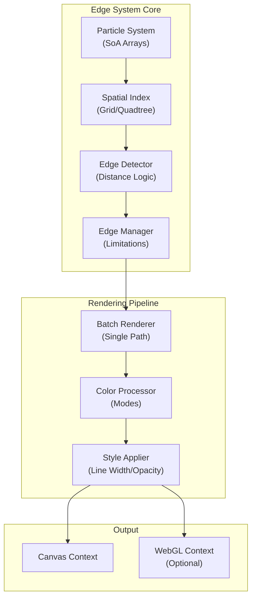
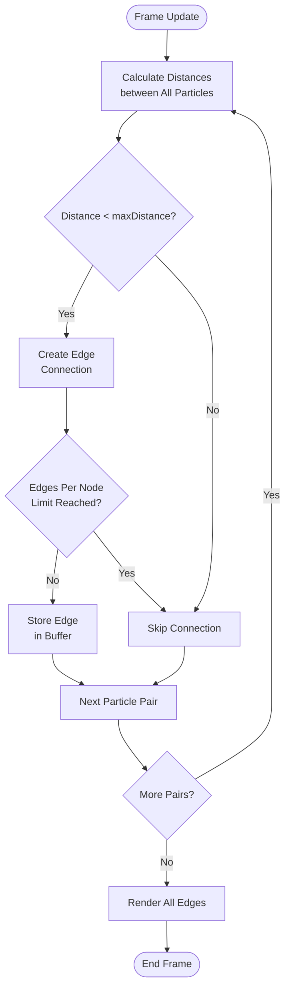
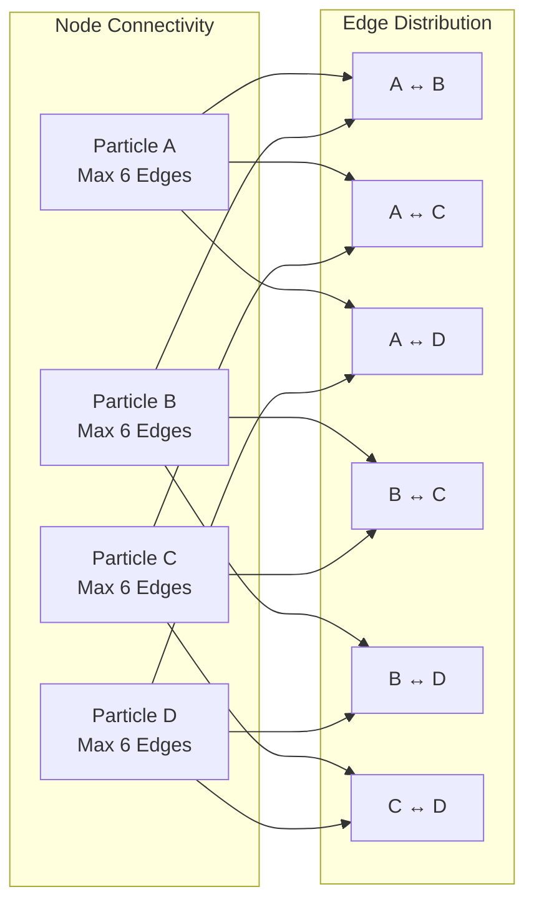
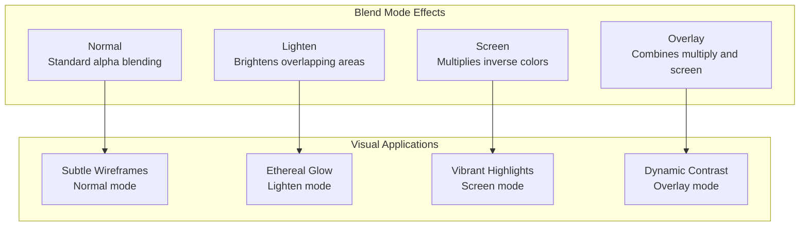
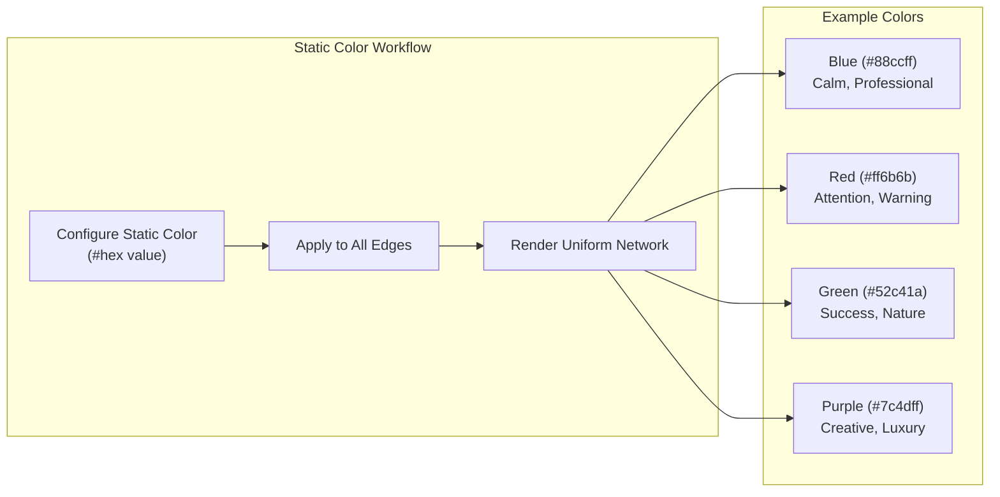
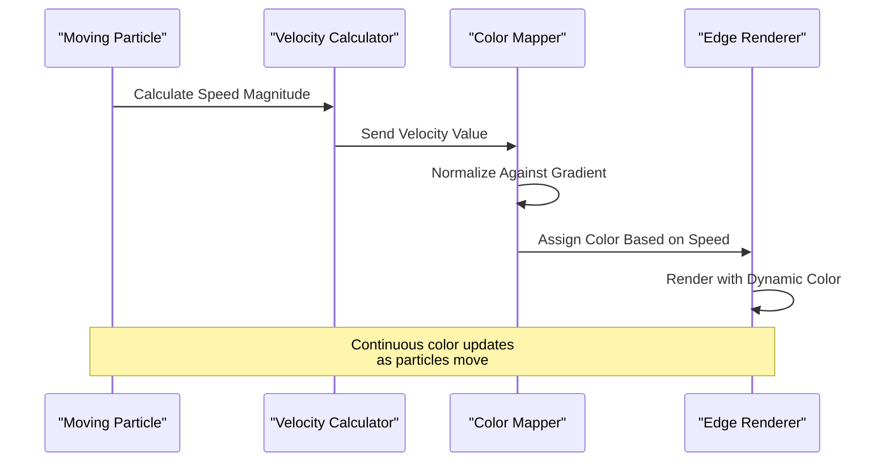
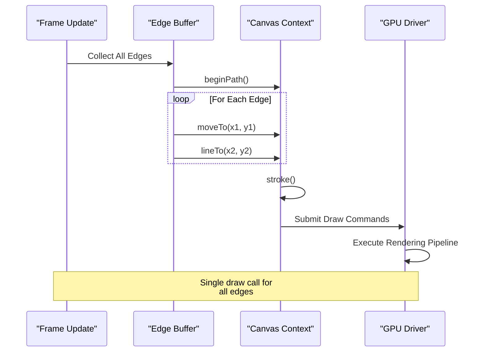
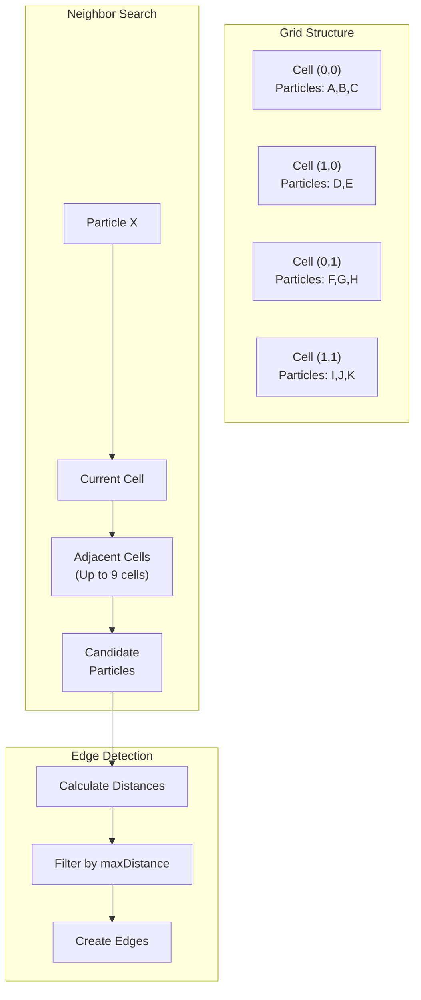

# Edge System

<cite>
**Referenced Files in This Document**
- [tasks.md](file://aicontext/tasks.md)
- [README.md](file://README.md)
</cite>

## Table of Contents
1. [Introduction](#introduction)
2. [Edge System Architecture](#edge-system-architecture)
3. [Distance-Based Connection Logic](#distance-based-connection-logic)
4. [Edge Limitations and Performance](#edge-limitations-and-performance)
5. [Visual Styling Options](#visual-styling-options)
6. [Edge Color Modes](#edge-color-modes)
7. [Batched Rendering Approach](#batched-rendering-approach)
8. [Spatial Indexing Integration](#spatial-indexing-integration)
9. [Visual Aesthetics and Examples](#visual-aesthetics-and-examples)
10. [Performance Considerations](#performance-considerations)
11. [Troubleshooting Guide](#troubleshooting-guide)
12. [Conclusion](#conclusion)

## Introduction

The edge system is a core component of the Plexus Canvas application that creates dynamic visual connections between particles based on spatial proximity. This system forms the backbone of the particle-edge network visualization, enabling the creation of intricate geometric patterns and fluid motion effects through intelligent edge detection and rendering.

The edge system operates on several key principles: distance-based connection logic, performance optimization through spatial indexing, flexible visual styling, and efficient batched rendering. These components work together to create visually appealing particle networks that respond dynamically to changes in particle positions and system parameters.

## Edge System Architecture

The edge system follows a modular architecture designed for optimal performance and flexibility. At its core, the system consists of several interconnected components that handle different aspects of edge creation, management, and rendering.



**Diagram sources**
- [tasks.md](file://aicontext/tasks.md#L150-L178)

The architecture emphasizes separation of concerns, with each component handling specific responsibilities while maintaining efficient communication channels. This design enables the system to scale effectively and support various rendering backends.

**Section sources**
- [tasks.md](file://aicontext/tasks.md#L150-L178)

## Distance-Based Connection Logic

The fundamental principle of the edge system is distance-based connection logic, where edges form between particles when their spatial distance falls below a configurable threshold. This mechanism creates organic, flowing connections that respond naturally to particle movement.

### Connection Criteria

The primary criterion for edge formation is the Euclidean distance between particle pairs. The system calculates the distance using the Pythagorean theorem:

```
distance = √((x₂ - x₁)² + (y₂ - y₁)²)
```

Edges are formed when this distance is less than the configured `maxDistance` parameter. This approach ensures that connections remain meaningful and visually coherent, preventing excessive edge density that could overwhelm the display.

### Dynamic Connection Management

The edge system continuously evaluates particle positions during each frame update. As particles move according to physics calculations (noise forces, gravity, drag), the system re-evaluates all potential connections. This dynamic approach ensures that edges appear and disappear organically, creating fluid visual effects.



**Diagram sources**
- [tasks.md](file://aicontext/tasks.md#L150-L178)

**Section sources**
- [tasks.md](file://aicontext/tasks.md#L150-L178)

## Edge Limitations and Performance

To maintain optimal performance and prevent visual clutter, the edge system implements two key limitations: `maxDistance` and `maxEdgesPerNode`. These constraints work together to balance visual complexity with computational efficiency.

### Max Distance Threshold

The `maxDistance` parameter defines the maximum allowable distance between connected particles. This threshold serves multiple purposes:

- **Visual Clarity**: Prevents distant particles from forming unnecessary connections
- **Performance Optimization**: Limits the number of distance calculations
- **Aesthetic Control**: Creates clean, focused connection patterns

The default value of 140 pixels strikes a balance between connectivity and visual simplicity, though this can be adjusted between 30-400 pixels depending on the desired effect.

### Max Edges Per Node Limitation

The `maxEdgesPerNode` parameter restricts the number of edges that can originate from any single particle. This limitation prevents any individual particle from dominating the visual landscape and maintains balanced connectivity across the network.



**Diagram sources**
- [tasks.md](file://aicontext/tasks.md#L150-L178)

### Performance Implications

The combination of distance threshold and edge limits creates significant performance benefits:

- **Reduced Computational Load**: Limits the number of distance calculations
- **Memory Efficiency**: Controls edge buffer sizes
- **Rendering Optimization**: Minimizes draw calls and GPU overhead
- **Scalability**: Enables smooth operation with thousands of particles

**Section sources**
- [tasks.md](file://aicontext/tasks.md#L150-L178)

## Visual Styling Options

The edge system provides extensive visual customization through configurable styling parameters that control appearance and blending characteristics. These options enable artists and developers to create diverse visual effects ranging from subtle wireframes to dense network displays.

### Line Width Configuration

The `lineWidth` parameter controls the thickness of rendered edges, accepting values between 0.2 and 3 pixels. This range accommodates various aesthetic preferences and display contexts:

- **Subtle Wireframes**: 0.2-0.5 pixel width for delicate, transparent networks
- **Standard Networks**: 1 pixel width for balanced visibility
- **Bold Visuals**: 2-3 pixel width for prominent, eye-catching designs

### Line Opacity Settings

The `lineOpacity` parameter manages transparency levels, with values ranging from 0.0 (completely transparent) to 1.0 (fully opaque). This setting interacts dynamically with the blend mode to create various visual effects:

- **Ghostly Networks**: Low opacity values (0.1-0.3) for ethereal, translucent effects
- **Balanced Visibility**: Medium opacity values (0.5-0.7) for clear, readable connections
- **Dominant Presence**: High opacity values (0.8-1.0) for bold, attention-grabbing designs

### Blend Mode Options

The system supports four distinct blend modes that alter how edges interact with the background and other visual elements:



**Diagram sources**
- [tasks.md](file://aicontext/tasks.md#L66-L68)

Each blend mode offers unique visual characteristics:

- **Normal**: Standard alpha compositing for predictable transparency
- **Lighten**: Creates glowing effects by brightening overlapping pixels
- **Screen**: Produces vibrant highlights by multiplying inverse colors
- **Overlay**: Provides dynamic contrast by combining multiplication and screen blending

**Section sources**
- [tasks.md](file://aicontext/tasks.md#L66-L68)

## Edge Color Modes

The edge system implements three sophisticated color modes that automatically adjust edge colors based on different criteria, creating dynamic visual effects that respond to particle behavior and spatial relationships.

### Static Color Mode

The static color mode applies a uniform color to all edges regardless of their properties or relationships. This mode provides consistent visual appearance and is ideal for applications requiring uniformity or when color differentiation is not desired.



**Diagram sources**
- [tasks.md](file://aicontext/tasks.md#L67-L68)

### By Distance Color Mode

The by-distance color mode interpolates colors along a gradient based on the normalized distance between connected particles. This creates visually compelling effects where edges closer to the maximum distance appear at one end of the gradient, while shorter edges show colors from the opposite end.

The interpolation process involves:

1. **Distance Normalization**: Calculating the ratio of actual distance to maxDistance
2. **Gradient Mapping**: Converting normalized values to gradient stops
3. **Color Interpolation**: Blending between gradient colors based on position

This mode produces dynamic visual effects where edge colors change continuously as particles move, creating depth perception and spatial awareness within the network.

### By Velocity Color Mode

The by-velocity color mode bases edge colors on the magnitude of particle velocities. This mode creates reactive visual feedback where faster-moving particles generate brighter or more intense edge colors, while slower movements produce softer tones.

The velocity-based coloring system considers:

- **Speed Magnitude**: Total velocity regardless of direction
- **Direction Independence**: Colors reflect speed, not movement direction
- **Real-time Updates**: Colors change continuously with particle motion
- **Gradient Application**: Similar to distance mode, using configurable gradients



**Diagram sources**
- [tasks.md](file://aicontext/tasks.md#L67-L68)

**Section sources**
- [tasks.md](file://aicontext/tasks.md#L67-L68)

## Batched Rendering Approach

The edge system employs an advanced batched rendering technique that optimizes performance by minimizing drawing operations and reducing GPU state changes. This approach uses a single `beginPath()` call with multiple `moveTo()` and `lineTo()` operations, followed by a single `stroke()` call.

### Rendering Pipeline

The batched rendering process follows a carefully orchestrated sequence:



**Diagram sources**
- [tasks.md](file://aicontext/tasks.md#L175-L178)

### Performance Benefits

The batched rendering approach delivers significant performance advantages:

- **Reduced Draw Calls**: Single `stroke()` replaces multiple individual line draws
- **Minimized State Changes**: Fewer context switches and GPU state modifications
- **Improved Memory Efficiency**: Consolidated vertex data reduces memory bandwidth
- **Enhanced GPU Utilization**: Better batching aligns with GPU pipeline architecture

### Implementation Details

The rendering system maintains several buffers and optimization strategies:

1. **Edge Coordinate Buffers**: Separate arrays for start and end coordinates
2. **Color Attribute Buffers**: Parallel arrays for color and opacity data
3. **Index Management**: Efficient coordinate mapping and validation
4. **Viewport Culling**: Automatic exclusion of off-screen edges
5. **Anti-aliasing**: Configurable smoothing for crisp, clean lines

**Section sources**
- [tasks.md](file://aicontext/tasks.md#L175-L178)

## Spatial Indexing Integration

The edge system integrates sophisticated spatial indexing mechanisms to accelerate edge detection and improve overall performance. This integration is crucial for maintaining smooth operation with large numbers of particles and complex network configurations.

### Grid-Based Indexing

The default spatial index implementation uses a grid-based approach where the canvas area is divided into uniform cells. Each cell maintains a list of particles contained within its boundaries, enabling efficient neighbor searches.



**Diagram sources**
- [tasks.md](file://aicontext/tasks.md#L180-L205)

### Quadtree Implementation

For scenarios with uneven particle distribution or extremely high particle counts, the system supports quadtree indexing. This hierarchical structure subdivides space recursively, providing optimal performance for sparse distributions.

The quadtree implementation includes:

- **Adaptive Subdivision**: Automatic splitting based on particle density
- **Dynamic Rebalancing**: Periodic restructuring for optimal performance
- **Level-Specific Queries**: Efficient neighbor searches at appropriate depths
- **Memory Management**: Automatic cleanup of empty branches

### Performance Optimization Strategies

The spatial indexing system incorporates several optimization techniques:

- **Periodic Rebuilding**: Index reconstruction every k frames to balance accuracy and performance
- **Adaptive Resolution**: Dynamic cell size adjustment based on particle density
- **Lazy Evaluation**: On-demand calculation of expensive operations
- **Cache-Friendly Access**: Optimized memory layout for spatial locality

**Section sources**
- [tasks.md](file://aicontext/tasks.md#L180-L205)

## Visual Aesthetics and Examples

The edge system's configurability enables the creation of diverse visual aesthetics, from subtle wireframe patterns to dense, vibrant network displays. These examples demonstrate the system's versatility and creative potential.

### Wireframe Aesthetics

Wireframe configurations emphasize minimalism and clarity, using thin, semi-transparent lines to create delicate network structures:

```javascript
// Wireframe Configuration Example
{
  edges: {
    lineWidth: 0.5,
    lineOpacity: 0.25,
    blendMode: "normal",
    colorMode: "static",
    staticColor: "#ffffff"
  }
}
```

This setup creates ghostly, translucent networks that serve as elegant backgrounds or subtle decorative elements.

### Neon Breeze Aesthetic

The default "Neon Breeze" preset combines soft gradients with lightening blend modes for ethereal, glowing effects:

```javascript
// Neon Breeze Configuration
{
  edges: {
    lineWidth: 1.0,
    lineOpacity: 0.6,
    blendMode: "lighten",
    colorMode: "byDistance"
  }
}
```

This configuration produces vibrant, glowing networks that appear to emit light, perfect for modern digital art and interactive installations.

### Cosmic Web Pattern

The "Cosmic Web" aesthetic features long-range connections with low particle density, creating expansive, cosmic-scale networks:

```javascript
// Cosmic Web Configuration
{
  edges: {
    maxDistance: 200,
    lineWidth: 0.8,
    lineOpacity: 0.4,
    colorMode: "byDistance"
  }
}
```

This setup generates vast, interconnected networks reminiscent of galaxy formations and neural networks.

### Storm Dynamics

The "Storm" configuration emphasizes velocity-based coloring and strong interaction effects:

```javascript
// Storm Configuration
{
  edges: {
    lineWidth: 1.2,
    lineOpacity: 0.8,
    blendMode: "screen",
    colorMode: "byVelocity"
  }
}
```

This creates dynamic, reactive networks where fast-moving particles generate bright, attention-grabbing connections.

### Minimal Design

The "Minimal" preset focuses on simplicity with reduced particle counts and bold visual elements:

```javascript
// Minimal Configuration
{
  edges: {
    maxDistance: 100,
    lineWidth: 2.0,
    lineOpacity: 0.9,
    colorMode: "static",
    staticColor: "#ff6b6b"
  }
}
```

This setup produces striking, high-contrast networks suitable for emphasis and focal points.

**Section sources**
- [tasks.md](file://aicontext/tasks.md#L24-L40)
- [tasks.md](file://aicontext/tasks.md#L102-L125)
- [tasks.md](file://aicontext/tasks.md#L232-L266)

## Performance Considerations

The edge system is designed with performance as a primary consideration, incorporating numerous optimization strategies to maintain smooth operation across various hardware configurations and particle counts.

### Computational Complexity

The edge detection algorithm has O(n²) complexity in the worst case, where n is the number of particles. However, spatial indexing reduces this to approximately O(n log n) on average, making the system practical for real-time applications with thousands of particles.

### Memory Management

Efficient memory usage is achieved through several strategies:

- **Structure-of-Arrays (SoA)**: Separated data structures for optimal cache performance
- **Typed Arrays**: Float32Array for numerical data to minimize memory overhead
- **Buffer Reuse**: Dynamic allocation and recycling of temporary buffers
- **Garbage Collection**: Strategic cleanup to prevent memory leaks

### Hardware Acceleration

The system leverages modern graphics hardware through:

- **Canvas 2D API**: Optimized browser rendering engine utilization
- **WebGL Compatibility**: Optional hardware acceleration for advanced features
- **GPU Texture Operations**: Efficient color processing and blending
- **Rasterization Optimization**: Smart culling and clipping strategies

### Adaptive Performance

The system includes adaptive performance features:

- **Dynamic Quality Scaling**: Automatic adjustment based on performance metrics
- **Frame Rate Targeting**: Soft FPS capping to maintain stability
- **Resource Monitoring**: Real-time assessment of system capabilities
- **Graceful Degradation**: Progressive reduction of visual fidelity when needed

## Troubleshooting Guide

Common issues and solutions for the edge system component:

### Performance Issues

**Problem**: Low frame rates with high particle counts
**Solution**: Reduce `maxEdgesPerNode`, increase FPS cap, or disable spatial indexing temporarily

**Problem**: Visual artifacts or incorrect edge rendering
**Solution**: Verify spatial index configuration, check for NaN values in particle positions

### Visual Problems

**Problem**: Edges not appearing or disappearing unexpectedly
**Solution**: Adjust `maxDistance` threshold, verify particle position updates, check blend mode settings

**Problem**: Color inconsistencies or gradient issues
**Solution**: Review gradient configuration, verify color mode settings, check opacity values

### Configuration Issues

**Problem**: Settings not taking effect
**Solution**: Ensure proper JSON structure, validate parameter ranges, check for conflicting settings

**Problem**: Import/export failures
**Solution**: Verify JSON format compliance, check for unsupported features, validate configuration schema

## Conclusion

The edge system represents a sophisticated approach to dynamic particle networking, combining intelligent distance-based connection logic with advanced performance optimization techniques. Through its modular architecture, extensive customization options, and efficient rendering pipeline, the system enables the creation of visually stunning particle-edge networks suitable for a wide range of applications.

Key strengths of the system include:

- **Intelligent Connection Logic**: Distance-based detection with configurable thresholds
- **Performance Optimization**: Spatial indexing and batched rendering for smooth operation
- **Visual Flexibility**: Multiple color modes and styling options for diverse aesthetics
- **Scalability**: Efficient algorithms that maintain performance with large particle counts
- **Integration**: Seamless compatibility with modern web technologies and graphics APIs

The edge system's design demonstrates how careful consideration of both functionality and performance can create powerful tools for creative expression and scientific visualization. Its modular architecture and comprehensive feature set make it suitable for everything from interactive art installations to educational simulations and data visualization projects.

Future enhancements could include additional blend modes, advanced color mapping techniques, and support for three-dimensional edge rendering. The solid foundation provided by the current implementation ensures that such extensions would integrate seamlessly with existing functionality.