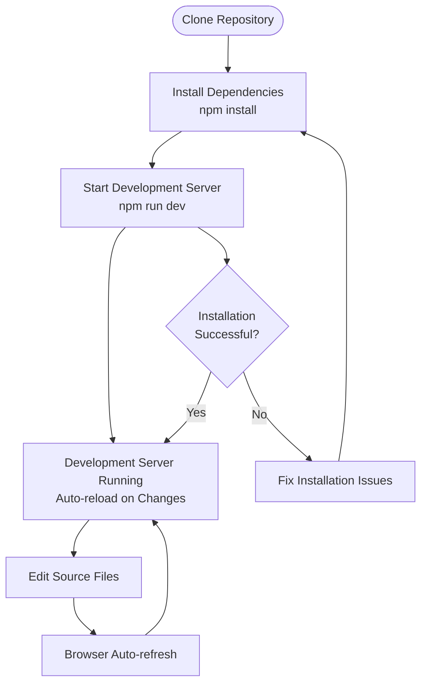

# Getting Started

<cite>
**Referenced Files in This Document**
- [README.md](file://README.md)
</cite>

## Table of Contents
1. [Introduction](#introduction)
2. [Prerequisites](#prerequisites)
3. [Installation Process](#installation-process)
4. [Development Environment Setup](#development-environment-setup)
5. [Basic Usage Example](#basic-usage-example)
6. [Common Setup Issues](#common-setup-issues)
7. [Troubleshooting Guide](#troubleshooting-guide)
8. [Next Steps](#next-steps)

## Introduction

Plexus Canvas is a modern web application project designed to provide an intuitive interface for [add your project description here]. This guide will walk you through the complete process of setting up your local development environment, from cloning the repository to launching the application for the first time.

The project follows a zero-build approach, allowing developers to open and modify files directly without requiring complex build processes. This makes it particularly accessible for beginners while maintaining professional development standards.

## Prerequisites

Before you begin setting up your development environment, ensure you have the following prerequisites installed on your system:

### Node.js Requirements
- **Minimum Version**: Node.js version 18 or higher
- **Recommended**: Latest LTS version of Node.js
- **Package Manager**: npm (comes bundled with Node.js) or yarn

### Operating System Compatibility
- **Windows**: Windows 10 or later
- **macOS**: macOS 10.15 or later
- **Linux**: Ubuntu 18.04+, CentOS 7+, or equivalent distributions

### Network Requirements
- Internet connection for downloading dependencies
- Firewall permissions for localhost development server

**Section sources**
- [README.md](file://README.md#L10-L15)

## Installation Process

Follow these step-by-step instructions to set up your local development environment:

### Step 1: Clone the Repository

Open your terminal or command prompt and execute the following commands:

```bash
# Clone the repository from GitHub
git clone https://github.com/y-tretyakov/plexus-canvas.git

# Navigate into the project directory
cd plexus-canvas
```

**Key Features of the Cloning Process:**
- Creates a local copy of the entire project repository
- Preserves Git history for version control
- Downloads all necessary source files and configurations

### Step 2: Install Dependencies

Once you've navigated into the project directory, install all required dependencies:

```bash
# Install all project dependencies
npm install
```

**What Happens During Installation:**
- Downloads all packages listed in package.json
- Sets up development dependencies
- Configures project-specific configurations
- Creates node_modules directory with all required libraries

### Step 3: Verify Installation

After installation completes, verify that all dependencies were installed correctly:

```bash
# List installed packages
npm list --depth=0
```

**Expected Output:**
You should see a list of installed packages without any errors. The exact packages will depend on the project's dependencies.

**Section sources**
- [README.md](file://README.md#L17-L35)

## Development Environment Setup

### Starting the Development Server

Launch the development server using the following command:

```bash
# Start the development server
npm run dev
```

**Development Server Features:**
- Hot module replacement for instant updates
- Automatic browser refresh on file changes
- Local development URL (typically http://localhost:3000)
- Error reporting and debugging capabilities

### Understanding the Development Workflow



**Diagram sources**
- [README.md](file://README.md#L25-L30)

### Project Structure Overview

Understanding the project structure helps you navigate and modify the code effectively:

```
plexus-canvas/
├── aicontext/          # AI context and tasks
└── README.md          # Project documentation
```

**Directory Details:**
- `aicontext/`: Contains AI-related context and task definitions
- `README.md`: Project documentation and setup instructions

**Section sources**
- [README.md](file://README.md#L37-L43)

## Basic Usage Example

### Launching the Application

After successfully starting the development server, follow these steps to interact with the application:

1. **Open Your Web Browser**: Navigate to the development server URL (typically http://localhost:3000)
2. **Verify Application Loading**: Check that the application loads without errors
3. **Explore Default Features**: Interact with the default visualization and interface elements

### First-Time User Experience

When you first launch the application, you'll encounter:

- **Default Visualization**: The main interface displaying core features
- **Interactive Elements**: Clickable components and responsive controls
- **Loading States**: Progress indicators during initial data loading
- **Error Boundaries**: Graceful error handling for unexpected situations

### Interactive Example

Here's how to interact with the default visualization:

```javascript
// Example: Interacting with the visualization
const visualization = document.querySelector('.plexus-visualization');
visualization.addEventListener('click', (event) => {
    console.log('Visualization clicked at:', event.clientX, event.clientY);
});
```

*Note: The actual implementation details will depend on the specific features of your application.*

## Common Setup Issues

### Node.js Version Compatibility

**Problem**: Node.js version is too old
```
Error: This project requires Node.js version 18 or higher
```

**Solution**:
1. Check your current Node.js version:
   ```bash
   node --version
   ```
2. Download and install the latest LTS version from [nodejs.org](https://nodejs.org/)
3. Restart your terminal/command prompt
4. Verify the update:
   ```bash
   node --version
   ```

### Missing Dependencies

**Problem**: Dependencies fail to install
```
npm ERR! network timeout
```

**Solution**:
1. Clear npm cache:
   ```bash
   npm cache clean --force
   ```
2. Retry installation:
   ```bash
   npm install
   ```
3. If using a proxy, configure npm proxy settings:
   ```bash
   npm config set proxy http://your-proxy-url:port
   npm config set https-proxy http://your-proxy-url:port
   ```

### Port Conflicts

**Problem**: Development server fails to start due to port conflicts
```
Error: listen EADDRINUSE :::3000
```

**Solution**:
1. Find the process using the port:
   ```bash
   # On Windows
   netstat -ano | findstr :3000
   
   # On macOS/Linux
   lsof -i :3000
   ```
2. Kill the conflicting process or change the port:
   ```bash
   # Change port in package.json or use environment variable
   PORT=3001 npm run dev
   ```

### Permission Issues

**Problem**: Cannot write to node_modules directory
```
EACCES: permission denied
```

**Solution**:
1. Run with administrator privileges (Windows) or use sudo (macOS/Linux):
   ```bash
   # Windows (as Administrator)
   npm install
   
   # macOS/Linux
   sudo npm install
   ```
2. Alternatively, fix directory permissions:
   ```bash
   chmod -R 755 node_modules
   ```

## Troubleshooting Guide

### Comprehensive Diagnostic Commands

Run these commands to diagnose common setup issues:

```bash
# Check Node.js and npm versions
echo "Node.js: $(node --version)"
echo "npm: $(npm --version)"

# Verify project structure
ls -la

# Check for package.json
test -f package.json && echo "package.json found" || echo "package.json missing"

# Test dependency installation
npm install --dry-run
```

### Log Analysis

When encountering errors, check these log locations:

- **npm Debug Log**: `~/.npm/_logs/`
- **System Logs**: Check operating system logs for permission issues
- **Browser Console**: Developer tools in your web browser

### Recovery Procedures

If setup becomes corrupted, follow these recovery steps:

1. **Clean Installation**:
   ```bash
   # Remove existing installation
   rm -rf node_modules package-lock.json
   
   # Reinstall dependencies
   npm install
   ```

2. **Fresh Clone**:
   ```bash
   # Remove corrupted repository
   cd ..
   rm -rf plexus-canvas
   
   # Clone fresh copy
   git clone https://github.com/y-tretyakov/plexus-canvas.git
   cd plexus-canvas
   npm install
   ```

### Performance Optimization

To improve development server performance:

1. **Disable Unnecessary Extensions**: Some browser extensions can slow down development
2. **Increase Memory Limits**: Configure Node.js memory limits if experiencing out-of-memory errors
3. **Use SSD Storage**: Development servers perform better on solid-state drives

## Next Steps

### Exploring the Codebase

Once your development environment is set up:

1. **Review Source Files**: Examine the main JavaScript/TypeScript files
2. **Understand Build Process**: Study the development server configuration
3. **Test Functionality**: Verify all features work as expected
4. **Experiment with Changes**: Make small modifications to understand the code flow

### Contributing to the Project

If you want to contribute:

1. **Fork the Repository**: Create your own copy on GitHub
2. **Create Feature Branches**: Use descriptive branch names
3. **Follow Coding Standards**: Maintain consistent code style
4. **Submit Pull Requests**: Follow the contribution guidelines

### Learning Resources

For further learning:

- **Node.js Documentation**: [nodejs.org/docs](https://nodejs.org/docs)
- **npm Package Manager**: [npmjs.com](https://www.npmjs.com/)
- **Web Development Basics**: HTML, CSS, JavaScript fundamentals
- **Version Control**: Git and GitHub best practices

### Getting Help

If you encounter issues:

1. **Check Documentation**: Review this getting started guide
2. **Search Online**: Look for similar issues on Stack Overflow
3. **Community Support**: Join developer communities and forums
4. **Issue Tracker**: Report bugs through the project's issue tracker

**Section sources**
- [README.md](file://README.md#L45-L55)