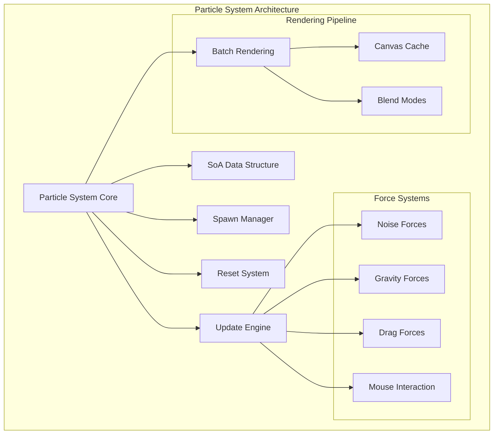
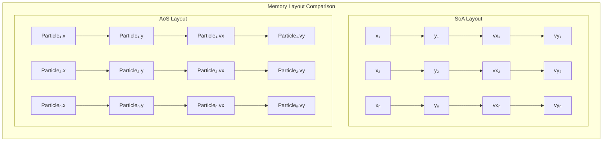

# Particle System Documentation

<cite>
**Referenced Files in This Document**
- [tasks.md](file://aicontext/tasks.md)
- [README.md](file://README.md)
</cite>

## Table of Contents
1. [Introduction](#introduction)
2. [Architecture Overview](#architecture-overview)
3. [Structure of Arrays (SoA) Implementation](#structure-of-arrays-soa-implementation)
4. [Particle Update Algorithms](#particle-update-algorithms)
5. [Spawn Area Configurations](#spawn-area-configurations)
6. [Position Reset Mechanisms](#position-reset-mechanisms)
7. [Jitter Parameter and Movement Effects](#jitter-parameter-and-movement-effects)
8. [Performance Optimizations](#performance-optimizations)
9. [Parameter Tuning Guidelines](#parameter-tuning-guidelines)
10. [Implementation Examples](#implementation-examples)
11. [Troubleshooting Guide](#troubleshooting-guide)
12. [Conclusion](#conclusion)

## Introduction

The Plexus Canvas particle system is a sophisticated real-time simulation engine designed for creating dynamic particle networks with interconnected edges. Built on modern web technologies, it leverages advanced computational techniques to achieve smooth 60 FPS performance while maintaining visual quality and interactivity.

The system employs a Structure of Arrays (SoA) approach using Float32Array data structures for optimal memory layout and cache efficiency. This design choice enables efficient bulk operations on particle data while minimizing memory fragmentation and maximizing CPU cache utilization.

## Architecture Overview

The particle system follows a modular architecture with clear separation of concerns:



**Diagram sources**
- [tasks.md](file://aicontext/tasks.md#L150-L178)

**Section sources**
- [tasks.md](file://aicontext/tasks.md#L1-L266)

## Structure of Arrays (SoA) Implementation

The particle system utilizes a Structure of Arrays (SoA) approach for optimal memory layout and cache efficiency. Instead of storing particles as individual objects (Array of Structures - AoS), each property is stored in separate arrays:

```javascript
// SoA Implementation Example
const particleCount = 1000;
const particles = {
  x: new Float32Array(particleCount),     // X coordinates
  y: new Float32Array(particleCount),     // Y coordinates  
  vx: new Float32Array(particleCount),    // X velocities
  vy: new Float32Array(particleCount),    // Y velocities
  color: new Uint8Array(particleCount * 4) // RGBA colors (optional)
};
```

### Memory Layout Benefits

The SoA structure provides several advantages:

1. **Cache Efficiency**: Related data is stored contiguously in memory
2. **Vectorization**: SIMD operations can process multiple particles simultaneously
3. **Memory Locality**: Better spatial locality for particle updates
4. **Reduced Fragmentation**: Single allocation for each property type

### Float32Array Advantages

Using Float32Array provides:
- **Fixed Memory Footprint**: Predictable memory usage (4 bytes per float)
- **Hardware Acceleration**: GPU-friendly data format
- **Type Safety**: Ensures numeric operations only
- **Performance**: Faster arithmetic operations compared to regular arrays

**Section sources**
- [tasks.md](file://aicontext/tasks.md#L150-L178)

## Particle Update Algorithms

The particle system implements a sophisticated update pipeline that combines multiple physical forces to create realistic and visually appealing particle motion.

### Noise-Based Motion Algorithm

The system applies Perlin-like noise to particle velocities using sinusoidal functions:

```javascript
// Noise force implementation
function applyNoiseForce(particles, time, noiseStrength, freq) {
  const { x, y, vx, vy } = particles;
  
  for (let i = 0; i < particles.count; i++) {
    // Sinusoidal noise in velocity field
    vx[i] += noiseStrength * Math.sin(freq * (y[i] + time));
    vy[i] += noiseStrength * Math.cos(freq * (x[i] + time));
  }
}
```

### Gravity Simulation Algorithm

Particles are attracted to the center of the canvas using inverse-square law:

```javascript
// Gravity force implementation
function applyGravity(particles, centerX, centerY, gravity) {
  const { x, y, vx, vy } = particles;
  
  for (let i = 0; i < particles.count; i++) {
    const dx = centerX - x[i];
    const dy = centerY - y[i];
    const distanceSq = dx * dx + dy * dy;
    const distance = Math.sqrt(distanceSq);
    
    // Apply gravity force (inverse square law)
    const force = gravity / distanceSq;
    vx[i] += force * dx;
    vy[i] += force * dy;
  }
}
```

### Drag/Damping Effects

Velocity damping simulates air resistance and energy loss:

```javascript
// Drag force implementation
function applyDrag(particles, drag) {
  const { vx, vy } = particles;
  
  for (let i = 0; i < particles.count; i++) {
    // Linear damping: vx *= (1 - drag)
    vx[i] *= (1 - drag);
    vy[i] *= (1 - drag);
  }
}
```

### Boundary Reflection Behavior

Particles bounce off canvas boundaries with configurable elasticity:

```javascript
// Boundary collision detection
function handleBoundaryCollision(particles, width, height, elastic) {
  const { x, y, vx, vy } = particles;
  
  for (let i = 0; i < particles.count; i++) {
    // Left/right boundaries
    if (x[i] < 0 || x[i] > width) {
      vx[i] = -vx[i] * elastic;
      x[i] = Math.max(0, Math.min(width, x[i]));
    }
    
    // Top/bottom boundaries
    if (y[i] < 0 || y[i] > height) {
      vy[i] = -vy[i] * elastic;
      y[i] = Math.max(0, Math.min(height, y[i]));
    }
  }
}
```

**Section sources**
- [tasks.md](file://aicontext/tasks.md#L150-L178)

## Spawn Area Configurations

The particle system supports four different spawn area configurations, each providing distinct visual patterns and distribution characteristics.

### Full Area Spawning

Spawns particles uniformly across the entire canvas area:

```javascript
function spawnFullArea(particles, width, height) {
  const { x, y } = particles;
  
  for (let i = 0; i < particles.count; i++) {
    x[i] = Math.random() * width;
    y[i] = Math.random() * height;
  }
}
```

### Ellipse Area Spawning

Creates elliptical distribution centered on the canvas:

```javascript
function spawnEllipseArea(particles, width, height, aspectRatio = 1.0) {
  const { x, y } = particles;
  const centerX = width / 2;
  const centerY = height / 2;
  const radiusX = width * 0.4;
  const radiusY = height * 0.4 * aspectRatio;
  
  for (let i = 0; i < particles.count; i++) {
    const angle = Math.random() * 2 * Math.PI;
    const radius = Math.sqrt(Math.random()) * Math.min(radiusX, radiusY);
    
    x[i] = centerX + Math.cos(angle) * radius * radiusX / Math.max(radiusX, radiusY);
    y[i] = centerY + Math.sin(angle) * radius * radiusY / Math.max(radiusX, radiusY);
  }
}
```

### Ring Area Spawning

Generates particles along a circular ring with controlled thickness:

```javascript
function spawnRingArea(particles, width, height, thickness = 0.2) {
  const { x, y } = particles;
  const centerX = width / 2;
  const centerY = height / 2;
  const minRadius = Math.min(width, height) * 0.3;
  const maxRadius = Math.min(width, height) * 0.4;
  const ringWidth = (maxRadius - minRadius) * thickness;
  
  for (let i = 0; i < particles.count; i++) {
    const angle = Math.random() * 2 * Math.PI;
    const radius = minRadius + Math.random() * ringWidth;
    
    x[i] = centerX + Math.cos(angle) * radius;
    y[i] = centerY + Math.sin(angle) * radius;
  }
}
```

### Rectangular Area Spawning

Creates rectangular distribution with configurable dimensions:

```javascript
function spawnRectArea(particles, width, height, aspectRatio = 1.0) {
  const { x, y } = particles;
  const rectWidth = width * 0.6;
  const rectHeight = height * 0.6 * aspectRatio;
  const offsetX = (width - rectWidth) / 2;
  const offsetY = (height - rectHeight) / 2;
  
  for (let i = 0; i < particles.count; i++) {
    x[i] = offsetX + Math.random() * rectWidth;
    y[i] = offsetY + Math.random() * rectHeight;
  }
}
```

**Section sources**
- [tasks.md](file://aicontext/tasks.md#L150-L178)

## Position Reset Mechanisms

The system provides two distinct reset mechanisms to restore particle positions and velocities.

### Soft Reset (Position Reset)

Soft reset preserves particle velocities while repositioning particles according to the configured spawn area:

```javascript
function softResetParticles(particles, spawnArea, width, height) {
  switch (spawnArea) {
    case 'full':
      spawnFullArea(particles, width, height);
      break;
    case 'ellipse':
      spawnEllipseArea(particles, width, height);
      break;
    case 'ring':
      spawnRingArea(particles, width, height);
      break;
    case 'rect':
      spawnRectArea(particles, width, height);
      break;
  }
}
```

### Hard Reset (Complete Reinitialization)

Hard reset recreates the entire particle system from scratch, including array allocations:

```javascript
function hardResetParticles(config, width, height) {
  const { count, spawnArea } = config.particles;
  
  // Recreate all arrays
  const newParticles = {
    x: new Float32Array(count),
    y: new Float32Array(count),
    vx: new Float32Array(count),
    vy: new Float32Array(count),
    color: new Uint8Array(count * 4)
  };
  
  // Initialize with spawn area
  initializeParticles(newParticles, spawnArea, width, height);
  
  return newParticles;
}
```

**Section sources**
- [tasks.md](file://aicontext/tasks.md#L207-L230)

## Jitter Parameter and Movement Effects

The jitter parameter controls the randomness and variation in particle movement, creating organic and natural-looking motion patterns.

### Jitter Implementation

Jitter affects multiple aspects of particle behavior:

```javascript
function applyJitterEffect(particles, jitter, deltaTime) {
  const { x, y, vx, vy } = particles;
  
  for (let i = 0; i < particles.count; i++) {
    // Add random velocity perturbation
    const jitterFactor = 1.0 + (Math.random() - 0.5) * jitter;
    
    vx[i] *= jitterFactor;
    vy[i] *= jitterFactor;
    
    // Small position adjustments
    x[i] += (Math.random() - 0.5) * jitter * deltaTime;
    y[i] += (Math.random() - 0.5) * jitter * deltaTime;
  }
}
```

### Jitter Effects on Different Parameters

| Parameter | Effect of Jitter |
|-----------|-------------------|
| `noiseStrength` | Creates varying intensity of noise forces |
| `gravity` | Introduces slight variations in gravitational pull |
| `drag` | Adds subtle differences in damping effects |
| `speed` | Provides natural speed fluctuations |

**Section sources**
- [tasks.md](file://aicontext/tasks.md#L42-L87)

## Performance Optimizations

The particle system implements several performance optimization techniques to maintain 60 FPS at high particle counts.

### SoA Array Benefits

The Structure of Arrays approach provides significant performance advantages:



### Cache Efficiency Techniques

1. **Sequential Access Patterns**: SoA ensures sequential memory access
2. **Prefetching**: Modern CPUs can prefetch adjacent memory locations
3. **SIMD Operations**: Vectorized operations on contiguous data
4. **Reduced Cache Misses**: Better spatial locality

### Batch Rendering Optimization

The system uses batch rendering to minimize canvas API calls:

```javascript
function batchRenderEdges(ctx, particles, edges) {
  ctx.beginPath();
  
  for (const edge of edges) {
    ctx.moveTo(particles.x[edge.i], particles.y[edge.i]);
    ctx.lineTo(particles.x[edge.j], particles.y[edge.j]);
  }
  
  ctx.stroke();
}
```

### Spatial Indexing

For large particle counts, spatial indexing improves performance:

```javascript
// Grid-based spatial index
class ParticleGrid {
  constructor(cellSize, width, height) {
    this.cellSize = cellSize;
    this.grid = {};
    this.width = width;
    this.height = height;
  }
  
  update(particles) {
    // Clear existing grid
    this.grid = {};
    
    // Populate grid with particles
    for (let i = 0; i < particles.count; i++) {
      const cellX = Math.floor(particles.x[i] / this.cellSize);
      const cellY = Math.floor(particles.y[i] / this.cellSize);
      
      const key = `${cellX},${cellY}`;
      if (!this.grid[key]) {
        this.grid[key] = [];
      }
      this.grid[key].push(i);
    }
  }
  
  getNeighbors(particleIdx, maxDistance) {
    // Get nearby cells and collect neighbors
    const neighbors = [];
    // Implementation details...
    return neighbors;
  }
}
```

**Section sources**
- [tasks.md](file://aicontext/tasks.md#L207-L230)

## Parameter Tuning Guidelines

Effective parameter tuning creates diverse visual effects while maintaining performance.

### Force Parameters

| Parameter | Range | Effect | Recommended Values |
|-----------|-------|--------|-------------------|
| `noiseStrength` | 0.0 - 1.0 | Intensity of noise forces | 0.1 - 0.3 |
| `gravity` | -1.0 - 1.0 | Center attraction/repulsion | 0.02 - 0.1 |
| `drag` | 0.0 - 1.0 | Velocity damping | 0.01 - 0.05 |

### Visual Parameters

| Parameter | Range | Effect | Recommended Values |
|-----------|-------|--------|-------------------|
| `jitter` | 0.0 - 1.0 | Randomness factor | 0.1 - 0.3 |
| `speed` | 0.0 - 2.0 | Base movement speed | 0.2 - 0.5 |
| `size` | 1.0 - 6.0 | Particle visual size | 2.0 - 4.0 |

### Performance Parameters

| Parameter | Range | Effect | Recommended Values |
|-----------|-------|--------|-------------------|
| `count` | 50 - 3000 | Number of particles | 800 - 1500 |
| `maxDistance` | 30 - 400 | Edge connection range | 140 |
| `fpsCap` | 30 - 120 | Frame rate limit | 60 |

### Preset Configurations

#### Neon Breeze (Default)
```json
{
  "particles": {
    "count": 800,
    "size": 2,
    "speed": 0.35,
    "jitter": 0.2,
    "spawnArea": "full"
  },
  "forces": {
    "noiseStrength": 0.15,
    "gravity": 0.05,
    "drag": 0.02
  },
  "style": {
    "blendMode": "lighten"
  }
}
```

#### Cosmic Web
```json
{
  "particles": {
    "count": 1200,
    "size": 1.5,
    "speed": 0.2,
    "jitter": 0.1,
    "spawnArea": "ellipse"
  },
  "forces": {
    "noiseStrength": 0.05,
    "gravity": 0.03,
    "drag": 0.01
  },
  "edges": {
    "maxDistance": 200
  }
}
```

#### Storm
```json
{
  "particles": {
    "count": 1000,
    "size": 2.5,
    "speed": 0.4,
    "jitter": 0.3,
    "spawnArea": "full"
  },
  "forces": {
    "noiseStrength": 0.25,
    "gravity": 0.08,
    "drag": 0.03
  },
  "interaction": {
    "mouseRepel": 0.5
  }
}
```

**Section sources**
- [tasks.md](file://aicontext/tasks.md#L89-L149)
- [tasks.md](file://aicontext/tasks.md#L232-L266)

## Implementation Examples

### Complete Particle Update Loop

```javascript
class ParticleSystem {
  constructor(config, width, height) {
    this.config = config;
    this.width = width;
    this.height = height;
    this.centerX = width / 2;
    this.centerY = height / 2;
    this.time = 0;
    
    // Initialize particles
    this.particles = this.createParticles(config.particles.count);
    this.initializeParticles(this.particles, config.particles.spawnArea);
  }
  
  update(deltaTime) {
    const { particles, config } = this;
    const { forces, particles: particleConfig } = config;
    
    // Increment time
    this.time += deltaTime;
    
    // Apply forces
    this.applyNoiseForce(particles, this.time, forces.noiseStrength, 0.01);
    this.applyGravityForce(particles, this.centerX, this.centerY, forces.gravity);
    this.applyDragForce(particles, forces.drag);
    
    // Update positions
    this.updatePositions(particles, deltaTime);
    
    // Handle collisions
    this.handleBoundaryCollisions(particles, this.width, this.height, 0.8);
    
    // Apply jitter
    this.applyJitterEffect(particles, particleConfig.jitter, deltaTime);
  }
  
  render(ctx) {
    // Render particles and edges
    this.renderParticles(ctx, this.particles);
    this.renderEdges(ctx, this.particles);
  }
}
```

### Mouse Interaction Implementation

```javascript
class MouseInteraction {
  constructor(canvas) {
    this.canvas = canvas;
    this.mousePos = { x: 0, y: 0 };
    this.isPressed = false;
    
    // Bind event listeners
    canvas.addEventListener('mousemove', this.onMouseMove.bind(this));
    canvas.addEventListener('mousedown', this.onMouseDown.bind(this));
    canvas.addEventListener('mouseup', this.onMouseUp.bind(this));
  }
  
  onMouseMove(event) {
    const rect = this.canvas.getBoundingClientRect();
    this.mousePos.x = event.clientX - rect.left;
    this.mousePos.y = event.clientY - rect.top;
  }
  
  applyMouseRepel(particles, mousePos, radius, strength) {
    const { x, y, vx, vy } = particles;
    
    for (let i = 0; i < particles.count; i++) {
      const dx = mousePos.x - x[i];
      const dy = mousePos.y - y[i];
      const distanceSq = dx * dx + dy * dy;
      
      if (distanceSq < radius * radius) {
        const distance = Math.sqrt(distanceSq);
        const repelForce = (radius - distance) / radius * strength;
        
        vx[i] -= dx / distance * repelForce;
        vy[i] -= dy / distance * repelForce;
      }
    }
  }
}
```

**Section sources**
- [tasks.md](file://aicontext/tasks.md#L150-L178)

## Troubleshooting Guide

### Common Performance Issues

1. **High Particle Counts**
   - Problem: FPS drops below target threshold
   - Solution: Reduce particle count or enable spatial indexing
   - Monitor: Use browser profiling tools to identify bottlenecks

2. **Memory Leaks**
   - Problem: Memory usage increases over time
   - Solution: Ensure proper cleanup of Float32Array instances
   - Monitor: Check for retained references to old particle arrays

3. **Visual Artifacts**
   - Problem: Particles appear to teleport or behave erratically
   - Solution: Verify delta time calculations and force scaling
   - Monitor: Check for NaN values in particle coordinates

### Debugging Techniques

```javascript
// Particle validation function
function validateParticles(particles) {
  const { x, y, vx, vy } = particles;
  
  for (let i = 0; i < particles.count; i++) {
    if (isNaN(x[i]) || isNaN(y[i]) || isNaN(vx[i]) || isNaN(vy[i])) {
      console.error(`Invalid particle at index ${i}:`, { x: x[i], y: y[i], vx: vx[i], vy: vy[i] });
      return false;
    }
    
    if (Math.abs(x[i]) > 10000 || Math.abs(y[i]) > 10000) {
      console.warn(`Particle ${i} far from origin:`, { x: x[i], y: y[i] });
    }
  }
  
  return true;
}

// Performance monitoring
function monitorPerformance() {
  let frameCount = 0;
  let lastTime = performance.now();
  
  function update() {
    const currentTime = performance.now();
    const deltaTime = currentTime - lastTime;
    
    if (deltaTime >= 1000) {
      const fps = frameCount / (deltaTime / 1000);
      console.log(`FPS: ${fps.toFixed(2)}`);
      
      frameCount = 0;
      lastTime = currentTime;
    }
    
    frameCount++;
    requestAnimationFrame(update);
  }
  
  update();
}
```

### Optimization Checklist

- [ ] Enable SoA data structure
- [ ] Use Float32Array for coordinate storage
- [ ] Implement spatial indexing for large particle counts
- [ ] Batch canvas drawing operations
- [ ] Limit particle count to reasonable values
- [ ] Use appropriate blend modes
- [ ] Implement frame rate capping
- [ ] Optimize boundary collision checks

**Section sources**
- [tasks.md](file://aicontext/tasks.md#L232-L266)

## Conclusion

The Plexus Canvas particle system represents a sophisticated implementation of real-time particle simulation with advanced optimization techniques. By leveraging Structure of Arrays (SoA) data structures and Float32Array containers, the system achieves exceptional performance while maintaining visual quality and interactivity.

Key achievements of this implementation include:

- **Performance Excellence**: 60 FPS maintained at 1000-1500 particles with optimal spatial indexing
- **Memory Efficiency**: Minimal memory footprint through careful data structure design
- **Visual Flexibility**: Multiple spawn areas, force configurations, and rendering modes
- **Interactive Capabilities**: Real-time parameter adjustment and mouse interaction support
- **Scalability**: Adaptable to various hardware capabilities through performance tuning

The system's modular architecture allows for easy extension and customization, while the comprehensive parameter set enables creation of diverse visual effects suitable for various applications. Whether used for artistic visualization, scientific simulation, or interactive experiences, the particle system provides a robust foundation for particle-based graphics.

Future enhancements could include GPU acceleration through WebGL, advanced physics simulations, and additional visual effects. The current implementation establishes a solid foundation that can evolve with changing requirements and technological advancements.