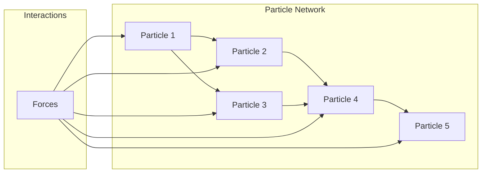
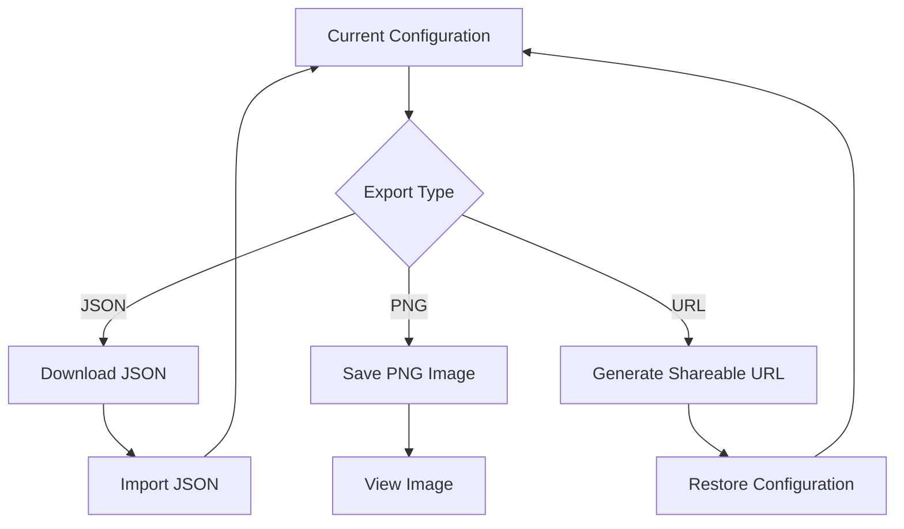
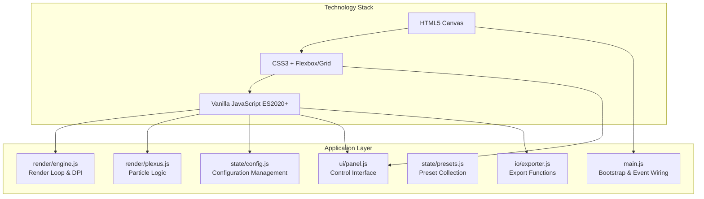
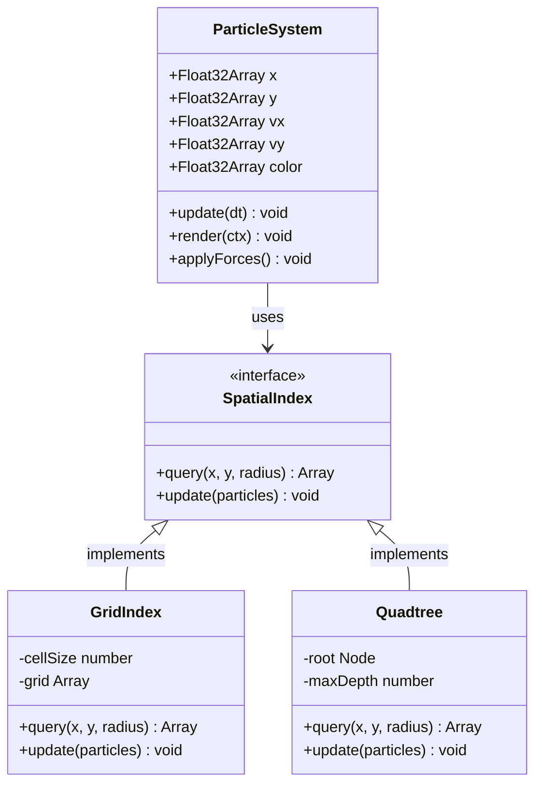
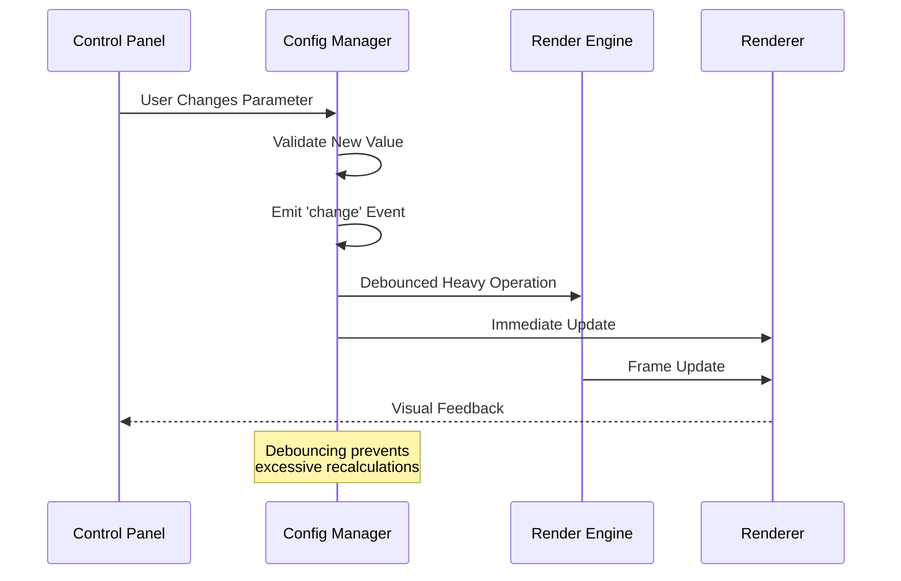
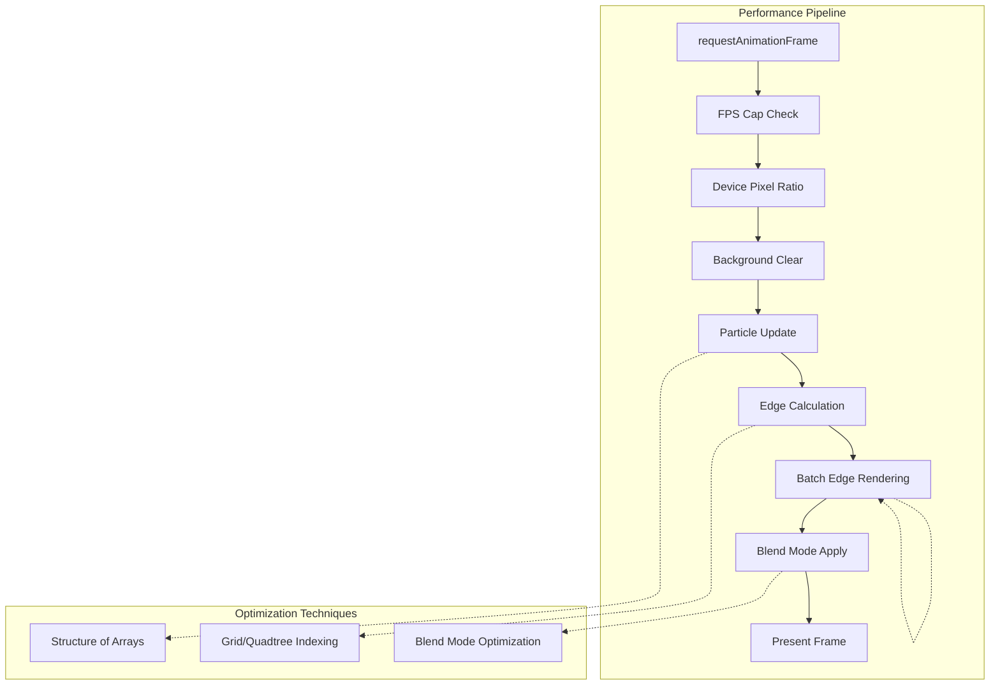
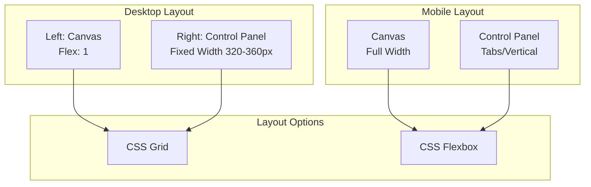

# Plexus Canvas Project Overview

<cite>
**Referenced Files in This Document**
- [README.md](file://README.md)
- [tasks.md](file://aicontext/tasks.md)
</cite>

## Table of Contents
1. [Introduction](#introduction)
2. [Project Purpose and Vision](#project-purpose-and-vision)
3. [Core Concept and Features](#core-concept-and-features)
4. [Technical Architecture](#technical-architecture)
5. [Event-Driven Architecture](#event-driven-architecture)
6. [Performance Optimizations](#performance-optimizations)
7. [UI/UX Design](#uiux-design)
8. [Data Model and Configuration](#data-model-and-configuration)
9. [Development Roadmap](#development-roadmap)
10. [Use Cases and Applications](#use-cases-and-applications)
11. [Conclusion](#conclusion)

## Introduction

Plexus Canvas is a sophisticated web-based application designed to create and manipulate dynamic particle network visualizations in real-time. Built with vanilla JavaScript, HTML, and CSS, this project represents a modern approach to interactive computational art and scientific visualization without relying on external frameworks.

The project embodies the principle of simplicity and performance, leveraging pure web technologies to deliver smooth, interactive experiences that rival native applications. This documentation provides both conceptual insights for beginners and technical details for experienced developers.

## Project Purpose and Vision

### Primary Objective

Plexus Canvas serves as a comprehensive platform for creating and exploring dynamic particle networks, commonly referred to as "plexus" networks. These networks consist of interconnected particles that move and interact according to configurable physical laws, creating mesmerizing visual patterns and behaviors.

### Core Mission

The project aims to democratize access to computational art and scientific visualization by providing:
- **Real-time interactivity**: All parameters change instantly without page reloads
- **Creative freedom**: Extensive customization options for artistic expression
- **Educational value**: Physics simulation capabilities for learning and experimentation
- **Accessibility**: Pure web technology stack ensures broad compatibility

### Target Audience

- **Artists and designers** seeking generative art tools
- **Scientists and educators** requiring visualization platforms
- **Developers** interested in performance optimization and interactive systems
- **Students** learning about particle systems and computational geometry

## Core Concept and Features

### Dynamic Particle Networks

The heart of Plexus Canvas lies in its ability to render and animate dynamic particle networks. These networks consist of:



**Diagram sources**
- [tasks.md](file://aicontext/tasks.md#L15-L25)

### Real-Time Parameter Adjustment

One of the standout features is the ability to adjust all parameters in real-time without interrupting the visualization. This includes:

- **Particle Properties**: Count, size, speed, jitter, spawn area
- **Edge Properties**: Maximum distance, maximum edges per node, line width, opacity
- **Physical Forces**: Noise strength, gravity, drag
- **Visual Styles**: Background color, particle colors, blend modes
- **Interaction Controls**: Mouse repulsion, hover highlighting, click spawning
- **Performance Settings**: FPS cap, pixel ratio mode, spatial indexing

### Advanced Export Capabilities

The project provides multiple export options for sharing and preservation:



**Diagram sources**
- [tasks.md](file://aicontext/tasks.md#L294-L296)

### Keyboard Shortcuts and Hotkeys

For enhanced productivity, the interface includes comprehensive keyboard shortcuts:

- **Space**: Pause/play toggle
- **R**: Soft reset (position reset)
- **Shift+R**: Hard reset (complete system recreation)
- **S**: Save PNG
- **[**/**]**: Adjust particle count (+/- 50)
- **1/2/3**: Quick preset selection

**Section sources**
- [tasks.md](file://aicontext/tasks.md#L45-L50)

## Technical Architecture

### Clean Frontend Stack

Plexus Canvas follows a minimalist approach to frontend architecture, utilizing only essential technologies:



**Diagram sources**
- [tasks.md](file://aicontext/tasks.md#L11-L22)

### Modular Organization

The project maintains clean separation of concerns through modular organization:

- **`/src/main.js`**: Bootstrap module responsible for initialization and event wiring
- **`/src/render/engine.js`**: Render loop management with requestAnimationFrame and DPI handling
- **`/src/render/plexus.js`**: Core particle and edge logic with spatial indexing
- **`/src/state/config.js`**: Configuration management with validation and change events
- **`/src/state/presets.js`**: Preset collection and management
- **`/src/ui/panel.js`**: Dynamic control panel construction and bidirectional binding
- **`/src/io/exporter.js`**: Export functionality for JSON, PNG, and shareable URLs

### Structure of Arrays (SoA) Pattern

The project employs the Structure of Arrays (SoA) pattern for optimal memory layout and cache performance:



**Diagram sources**
- [tasks.md](file://aicontext/tasks.md#L15-L25)

**Section sources**
- [tasks.md](file://aicontext/tasks.md#L11-L22)

## Event-Driven Architecture

### Configuration Change System

The project implements a sophisticated event-driven architecture centered around configuration changes:



**Diagram sources**
- [tasks.md](file://aicontext/tasks.md#L278-L280)

### Event Subscription Pattern

The configuration system supports flexible event subscription:

```javascript
// Example event handling pattern
config.on('change', (path, value) => {
    // Handle parameter changes
    if (path.includes('particles')) {
        debouncedRebuildParticles();
    } else if (path.includes('edges')) {
        updateEdgeRendering();
    }
});
```

### Debouncing Mechanisms

Heavy operations are debounced to prevent performance degradation during rapid parameter changes:

- **Particle array recreation**: Debounced to prevent excessive memory allocation
- **Spatial index rebuilding**: Debounced to avoid frequent grid updates
- **Configuration serialization**: Debounced for export operations

**Section sources**
- [tasks.md](file://aicontext/tasks.md#L278-L285)

## Performance Optimizations

### Hardware-Accelerated Rendering

The project leverages modern browser capabilities for optimal performance:



**Diagram sources**
- [tasks.md](file://aicontext/tasks.md#L193-L200)

### Spatial Indexing Strategies

Two spatial indexing approaches are implemented for efficient neighbor queries:

#### Grid-Based Indexing
- **Default option**: Automatically sized based on maxDistance
- **Cell size**: Approximately equal to maxDistance
- **Query range**: 9 neighboring cells per particle
- **Frequency**: Rebuilt every frame or every k frames

#### Quadtree-Based Indexing
- **Optional**: For larger datasets or uneven distributions
- **Dynamic subdivision**: Based on particle density
- **Memory efficient**: Only creates nodes as needed

### Memory Management

- **Typed Arrays**: Float32Array for position and velocity data
- **Object pooling**: Reusing temporary objects where possible
- **Garbage collection friendly**: Minimal object creation per frame

**Section sources**
- [tasks.md](file://aicontext/tasks.md#L193-L200)

## UI/UX Design

### Responsive Layout Architecture

The interface follows a two-column layout with adaptive behavior:



**Diagram sources**
- [tasks.md](file://aicontext/tasks.md#L28-L35)

### Interactive Control Categories

The control panel organizes parameters into logical categories:

#### Particle Controls
- **Count**: Range slider (50-3000 particles)
- **Spawn Area**: Dropdown selection (full, ellipse, ring, rectangle)
- **Speed**: Range slider (0-2 pixels/ms)
- **Size**: Pixel range (1-6 pixels)
- **Jitter**: Float range (0-1)

#### Edge Controls
- **Max Distance**: Pixel range (30-400 pixels)
- **Max Edges Per Node**: Integer range (0-12)
- **Line Width**: Float range (0.2-3 pixels)
- **Line Opacity**: Float range (0-1)
- **Blend Mode**: Dropdown selection

#### Force and Motion Controls
- **Noise Strength**: Float range (0-1)
- **Gravity**: Float range (-1 to 1)
- **Drag**: Float range (0-1)

#### Color and Style Controls
- **Background Color**: Hex color picker
- **Particle Color**: Hex color picker or auto gradient
- **Edge Color Mode**: Static/byDistance/byVelocity
- **Gradient Stops**: Array of color stops

#### Interaction Controls
- **Mouse Repel**: Float range (0-1)
- **Mouse Radius**: Pixel range
- **Hover Highlight**: Boolean toggle
- **Click Spawn**: Boolean toggle

#### Performance Controls
- **FPS Cap**: Selection (30/60/120/Off)
- **Pixel Ratio Mode**: Auto/1x/2x
- **Spatial Index**: None/Grid/Quadtree
- **Batch Edges**: Boolean toggle

**Section sources**
- [tasks.md](file://aicontext/tasks.md#L35-L75)

## Data Model and Configuration

### JSON Configuration Schema

The project uses a comprehensive JSON schema for storing and sharing configurations:

```mermaid
erDiagram
CONFIG {
object particles
object edges
object forces
object style
object interaction
object performance
object meta
}
PARTICLES {
number count
number size
number speed
number jitter
string spawnArea
}
EDGES {
number maxDistance
number maxEdgesPerNode
number lineWidth
number lineOpacity
string blendMode
string colorMode
string staticColor
}
FORCES {
number noiseStrength
number gravity
number drag
}
STYLE {
object bg
string particleColor
array gradient
}
INTERACTION {
number mouseRepel
number mouseRadius
boolean hoverHighlight
boolean clickSpawn
}
PERFORMANCE {
number fpsCap
string pixelRatioMode
string spatialIndex
boolean batchEdges
}
META {
string name
number version
}
CONFIG ||--|| PARTICLES : contains
CONFIG ||--|| EDGES : contains
CONFIG ||--|| FORCES : contains
CONFIG ||--|| STYLE : contains
CONFIG ||--|| INTERACTION : contains
CONFIG ||--|| PERFORMANCE : contains
CONFIG ||--|| META : contains
```

**Diagram sources**
- [tasks.md](file://aicontext/tasks.md#L102-L150)

### Preset System

The project includes a comprehensive preset system with predefined configurations:

#### Available Presets
1. **Neon Breeze** (default): Soft gradient with lighten blend mode
2. **Cosmic Web**: Large maxDistance, low speed, dark background
3. **Wireframe**: Thin white lines, minimal particles
4. **Storm**: High noise strength, high mouse repel
5. **Minimal**: Few particles, thick lines, pastel colors

### Validation and Sanitization

All configuration values undergo strict validation:

- **Numeric ranges**: Enforced bounds checking
- **String enums**: Validated against allowed values
- **Array lengths**: Limited to reasonable sizes
- **Color formats**: Validated hex codes and opacity values

**Section sources**
- [tasks.md](file://aicontext/tasks.md#L102-L150)

## Development Roadmap

### Current Status (MVP Phase)

The project is currently in its Minimum Viable Product phase, focusing on core functionality:

```mermaid
gantt
title Development Timeline
dateFormat X
axisFormat %d
section Core Features
Particle System :active, ps, 0, 30
Edge Rendering :active, er, 15, 45
Configuration System :active, cs, 30, 60
UI Controls :active, ui, 45, 75
section Advanced Features
Spatial Indexing :active, si, 60, 90
Export Functionality :active, ef, 75, 105
Performance Optimization :active, po, 90, 120
section Polish & Testing
Keyboard Shortcuts :active, ks, 105, 135
Mobile Responsiveness :active, mr, 120, 150
Accessibility Features :active, ac, 135, 165
Final Testing :active, ft, 150, 180
```



### Future Enhancements

Planned improvements include:

- **Advanced physics**: Collision detection, spring forces
- **Shader effects**: WebGL-based enhancements
- **Animation timeline**: Keyframe animation support
- **Multi-user collaboration**: Real-time shared editing
- **Plugin system**: Third-party extension support

## Use Cases and Applications

### Generative Art Creation

Plexus Canvas serves as a powerful tool for artists creating algorithmic art:

- **Abstract compositions**: Dynamic particle movements create evolving patterns
- **Generative design**: Parametric systems for consistent yet varied outputs
- **Interactive installations**: Real-time audience participation possibilities

### Educational Physics Simulations

The platform provides excellent educational value:

- **Particle dynamics**: Demonstrating motion, forces, and interactions
- **Network theory**: Visualizing connectivity and graph theory concepts
- **Computational geometry**: Spatial indexing and neighbor queries
- **Performance optimization**: Teaching memory layout and caching strategies

### Creative Exploration and Experimentation

The extensive parameter space enables creative exploration:

- **Color palette discovery**: Gradient and blend mode experimentation
- **Motion studies**: Speed, acceleration, and damping analysis
- **Structural investigations**: Network topology and connectivity studies
- **Aesthetic research**: Visual perception and design principles

### Scientific Visualization

Beyond art, the platform supports scientific applications:

- **Network analysis**: Social networks, biological systems, infrastructure
- **Fluid dynamics**: Particle-based fluid simulation approximations
- **Game development**: Procedural content generation techniques
- **Computer graphics**: Rendering pipeline optimization studies

## Conclusion

Plexus Canvas represents a thoughtful approach to modern web application development, combining artistic creativity with technical excellence. By leveraging vanilla JavaScript and modern web APIs, the project demonstrates that sophisticated interactive applications can be built without heavy frameworks while maintaining excellent performance and user experience.

The project's modular architecture, performance optimizations, and comprehensive feature set make it an excellent foundation for both learning and production use. Whether you're an artist exploring new creative possibilities, an educator teaching computational concepts, or a developer studying interactive systems, Plexus Canvas offers valuable insights and functionality.

The clean codebase, documented architecture, and comprehensive feature set position this project as a valuable resource for anyone interested in the intersection of art, science, and technology in the modern web ecosystem.