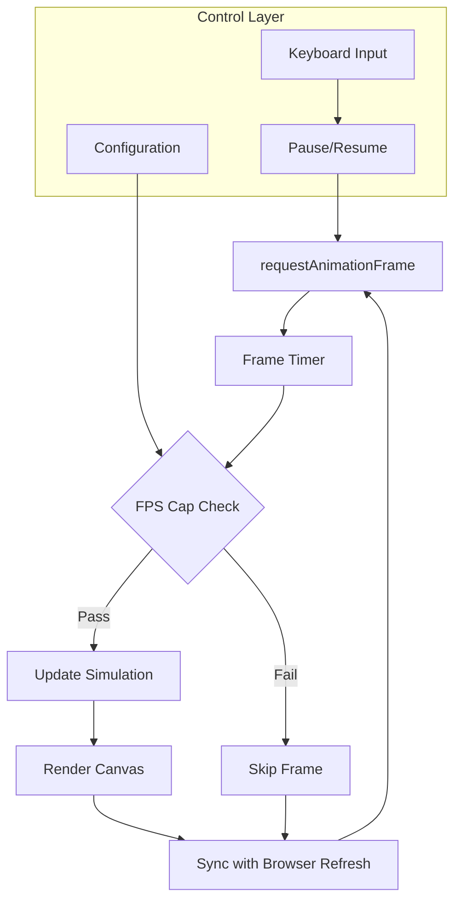
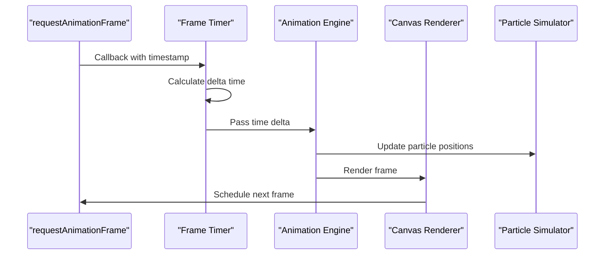
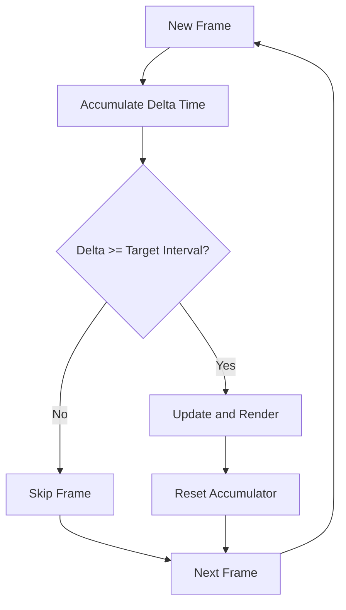
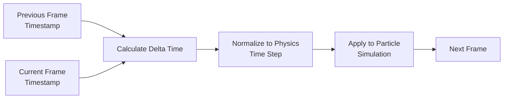
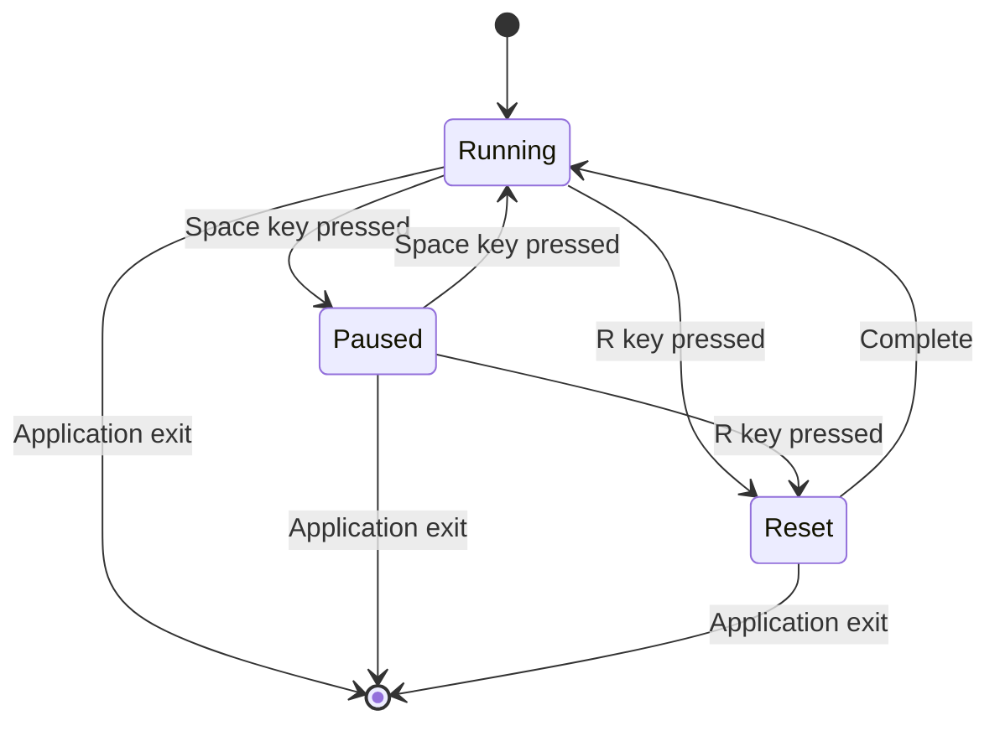
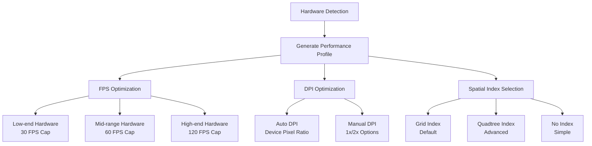
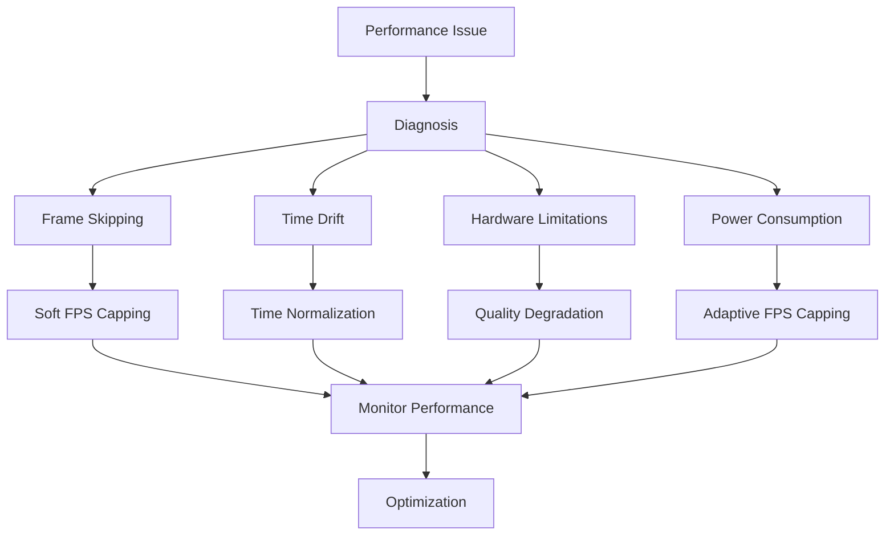
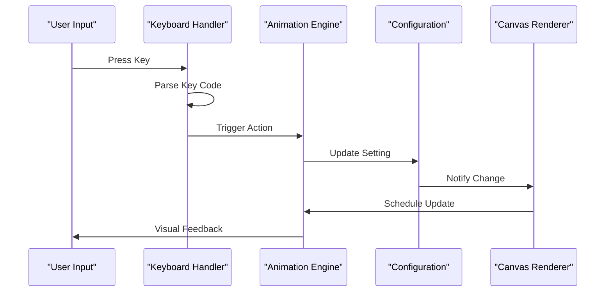

# Animation Loop

<cite>
**Referenced Files in This Document**
- [tasks.md](file://aicontext/tasks.md)
</cite>

## Table of Contents
1. [Introduction](#introduction)
2. [Architecture Overview](#architecture-overview)
3. [Core Animation Engine](#core-animation-engine)
4. [FPS Capping Mechanism](#fps-capping-mechanism)
5. [Time-Step Management](#time-step-management)
6. [Pause/Resume Control](#pause-resume-control)
7. [Performance Optimization](#performance-optimization)
8. [Common Issues and Solutions](#common-issues-and-solutions)
9. [Keyboard Shortcuts](#keyboard-shortcuts)
10. [Conclusion](#conclusion)

## Introduction

The animation loop is the heart of the Plexus Canvas application, responsible for orchestrating the rendering pipeline and maintaining consistent visual updates. Built around the browser's native `requestAnimationFrame` API, the loop implements sophisticated time-step management and optional frame-rate capping to ensure optimal performance across different hardware configurations.

The animation system is designed to handle complex particle simulations with up to 5000 particles while maintaining target frame rates of 60 FPS on mid-range laptops. It incorporates advanced techniques such as soft FPS capping, delta time calculations, and adaptive performance controls to balance visual quality with system resources.

## Architecture Overview

The animation loop follows a modular architecture that separates concerns between timing management, rendering coordination, and performance optimization:

**Diagram sources**
- [tasks.md](file://aicontext/tasks.md#L180-L205)

**Section sources**
- [tasks.md](file://aicontext/tasks.md#L4-L22)
- [tasks.md](file://aicontext/tasks.md#L180-L205)

## Core Animation Engine

The animation engine is built around the browser's `requestAnimationFrame` API, which provides optimal synchronization with the display refresh rate. The core implementation manages the timing loop and coordinates between simulation updates and rendering operations.

### RequestAnimationFrame Integration

The animation loop leverages the browser's native `requestAnimationFrame` mechanism to ensure smooth rendering synchronized with the display's refresh cycle. This approach provides several advantages:

- **Display Synchronization**: Frames are rendered at optimal intervals based on the monitor's refresh rate
- **Battery Efficiency**: Automatic throttling during inactive tabs and reduced CPU usage when frames are skipped
- **Smooth Animations**: Consistent timing that prevents judder and visual artifacts

### Rendering Pipeline

The rendering process follows a structured pipeline that ensures efficient resource utilization:

**Diagram sources**
- [tasks.md](file://aicontext/tasks.md#L180-L205)

**Section sources**
- [tasks.md](file://aicontext/tasks.md#L180-L205)

## FPS Capping Mechanism

The animation system implements a sophisticated soft FPS capping mechanism that allows users to optimize performance based on their hardware capabilities and power consumption preferences.

### Available Capping Options

The system supports four distinct FPS cap modes:

- **30 FPS**: Conservative setting for maximum battery life and stability
- **60 FPS**: Balanced setting for smooth animations on mid-range hardware
- **120 FPS**: High-performance mode for capable systems with minimal latency
- **Off**: No artificial frame rate limit, allowing the browser to render as fast as possible

### Implementation Details

The soft FPS capping works by accumulating time deltas and only proceeding with frame updates when sufficient time has passed to meet the target frame rate:

**Diagram sources**
- [tasks.md](file://aicontext/tasks.md#L180-L205)

### Impact on Battery Life and Visual Smoothness

The FPS capping mechanism provides significant benefits across different scenarios:

**Battery Optimization**:
- Lower frame rates reduce GPU and CPU workload
- Extended battery life on mobile devices
- Reduced thermal throttling on laptops

**Visual Quality Trade-offs**:
- 30 FPS: Acceptable for most applications, especially on older hardware
- 60 FPS: Optimal balance for interactive applications
- 120 FPS: Enhanced responsiveness for competitive gaming or high-refresh displays
- Off: Maximum visual fidelity but increased power consumption

**Section sources**
- [tasks.md](file://aicontext/tasks.md#L89-L149)
- [tasks.md](file://aicontext/tasks.md#L232-L266)

## Time-Step Management

The animation loop implements precise time-step management to ensure consistent motion regardless of frame rate fluctuations. This system calculates delta time between frames and applies it consistently to physics simulations.

### Delta Time Calculation

The time-step system tracks elapsed time between consecutive frames and normalizes it for physics calculations:

**Diagram sources**
- [tasks.md](file://aicontext/tasks.md#L150-L178)

### Consistency Across Frame Rates

The time-step management ensures that particle motion remains consistent regardless of frame rate variations:

- **Variable Frame Rates**: Systems with fluctuating frame rates receive normalized time steps
- **Physics Stability**: Consistent time steps prevent simulation drift and instability
- **Interpolation**: Smooth motion interpolation between frames maintains visual continuity

### Time Drift Prevention

The system implements safeguards against time drift accumulation:

- **Clamping**: Extreme delta values are clamped to reasonable limits
- **Reset Conditions**: Large time gaps trigger simulation resets to prevent instability
- **Adaptive Timing**: The system adapts to varying system loads and performance conditions

**Section sources**
- [tasks.md](file://aicontext/tasks.md#L150-L178)

## Pause/Resume Control

The animation system provides robust pause/resume functionality that seamlessly transitions between active and inactive states while maintaining simulation consistency.

### State Management

The pause/resume system operates through a state machine that tracks the animation's active status:

**Diagram sources**
- [tasks.md](file://aicontext/tasks.md#L89-L149)

### Event-Driven Toggling

The system responds to various events for pause/resume control:

- **Keyboard Shortcuts**: Space bar toggles between running and paused states
- **Configuration Changes**: Settings modifications can trigger automatic pausing
- **Focus Events**: Browser tab visibility changes automatically pause/resume
- **Manual Controls**: UI buttons provide explicit pause/resume functionality

### State Synchronization

During pause/resume transitions, the system maintains synchronization between:

- **Simulation State**: Particle positions and velocities remain consistent
- **Rendering State**: Visual updates continue smoothly when resumed
- **Timing State**: Delta time calculations resume accurately from pause points
- **Resource State**: Memory and computational resources are managed appropriately

**Section sources**
- [tasks.md](file://aicontext/tasks.md#L89-L149)

## Performance Optimization

The animation loop incorporates multiple performance optimization techniques to achieve target frame rates while minimizing resource consumption.

### Hardware Adaptation

The system adapts to different hardware capabilities through configurable parameters:

**Diagram sources**
- [tasks.md](file://aicontext/tasks.md#L89-L149)
- [tasks.md](file://aicontext/tasks.md#L232-L266)

### Target Performance Metrics

The system targets specific performance metrics for different hardware categories:

- **60 FPS**: Primary goal for 1000–1500 particles with maxDistance=140 on mid-range laptops
- **Memory Usage**: Optimized SoA (Structure of Arrays) arrays using Float32Array
- **CPU Efficiency**: Batched rendering operations and spatial indexing
- **GPU Utilization**: Efficient canvas operations with minimal state changes

### Adaptive Resource Management

The animation loop implements dynamic resource management:

- **Dynamic FPS Adjustment**: Automatically adjusts frame rate based on performance metrics
- **Quality Degradation**: Reduces visual effects when performance drops below thresholds
- **Memory Management**: Efficient array reuse and garbage collection optimization
- **Batch Operations**: Minimizes canvas state changes through batching

**Section sources**
- [tasks.md](file://aicontext/tasks.md#L89-L149)
- [tasks.md](file://aicontext/tasks.md#L232-L266)

## Common Issues and Solutions

The animation loop addresses several common performance and stability challenges that can occur in real-world usage scenarios.

### Frame Skipping Challenges

Frame skipping occurs when the system cannot maintain the target frame rate. The soft capping mechanism mitigates this issue:

**Problem**: Inconsistent frame timing causes visual artifacts and simulation instability
**Solution**: Soft capping accumulates time deltas and only renders when sufficient time has passed

### Time Drift Resolution

Time drift can accumulate over long periods, causing simulation divergence:

**Problem**: Small timing errors compound over time, leading to unstable particle behavior
**Solution**: Regular time normalization and periodic simulation resets

### Lower-End Hardware Optimization

Systems with limited processing power require special consideration:

**Problem**: High particle counts cause frame rate drops and stuttering
**Solution**: Progressive degradation of visual quality and performance optimizations

### Power Consumption Management

Mobile devices and laptops require careful power management:

**Problem**: Continuous high frame rates drain battery quickly
**Solution**: Adaptive FPS capping and intelligent resource allocation

**Diagram sources**
- [tasks.md](file://aicontext/tasks.md#L89-L149)

**Section sources**
- [tasks.md](file://aicontext/tasks.md#L89-L149)
- [tasks.md](file://aicontext/tasks.md#L232-L266)

## Keyboard Shortcuts

The animation loop integrates with a comprehensive keyboard shortcut system that provides intuitive control over the simulation state and configuration.

### Primary Controls

The system provides essential keyboard shortcuts for immediate access to common functions:

- **Space**: Toggle between running and paused states
- **R**: Perform soft reset (reset particle positions while maintaining velocity)
- **Shift+R**: Perform hard reset (completely recreate the particle system)
- **S**: Save current canvas as PNG image
- **[**: Decrease particle count by 50 units
- **]**: Increase particle count by 50 units
- **1/2/3**: Quick selection of presets 1, 2, and 3

### Shortcut Implementation

The keyboard control system operates through event listeners that capture key presses and translate them into appropriate actions:

**Diagram sources**
- [tasks.md](file://aicontext/tasks.md#L89-L149)

### Event Handling

The keyboard system implements robust event handling with proper key state management:

- **Key Debouncing**: Prevents rapid repeated actions
- **Modifier Keys**: Proper handling of Shift, Ctrl, and Alt combinations
- **Global Scope**: Keyboard events work regardless of focused element
- **Accessibility**: All shortcuts are documented and discoverable

**Section sources**
- [tasks.md](file://aicontext/tasks.md#L89-L149)

## Conclusion

The animation loop sub-component represents a sophisticated implementation of modern web animation techniques, combining browser-native APIs with intelligent performance optimization. Through its soft FPS capping mechanism, precise time-step management, and adaptive resource allocation, the system delivers consistent visual performance across diverse hardware configurations.

The modular architecture ensures maintainability and extensibility, while the comprehensive keyboard shortcut system provides intuitive user control. By addressing common performance challenges such as frame skipping and time drift, the animation engine maintains stability and visual quality even under demanding conditions.

The implementation demonstrates best practices for web-based particle simulations, balancing visual fidelity with system resource efficiency. The soft capping mechanism, combined with intelligent performance monitoring, ensures that the application remains responsive and battery-efficient while delivering smooth, visually appealing animations.

Future enhancements could include predictive frame scheduling, advanced spatial indexing algorithms, and machine learning-based performance optimization. The current implementation provides a solid foundation for these potential improvements while meeting the project's core objectives of 60 FPS performance with up to 5000 particles on mid-range hardware.