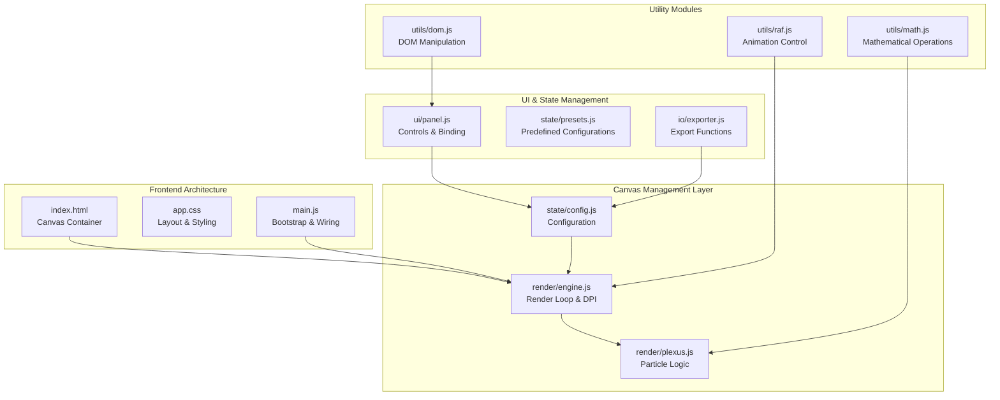
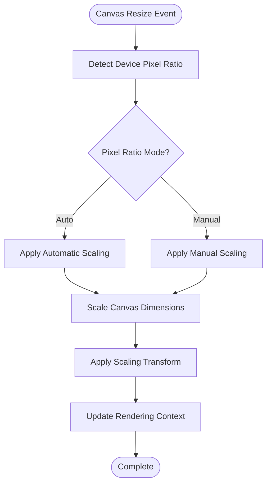
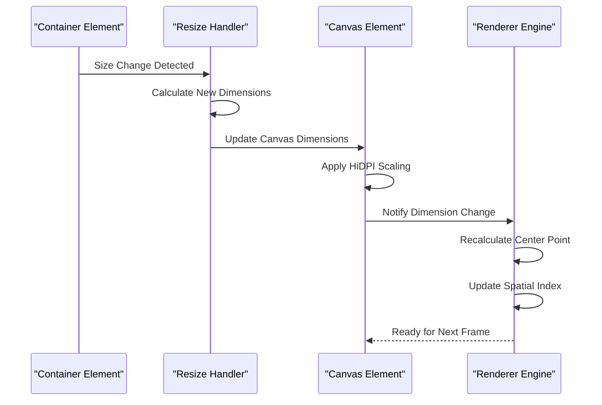
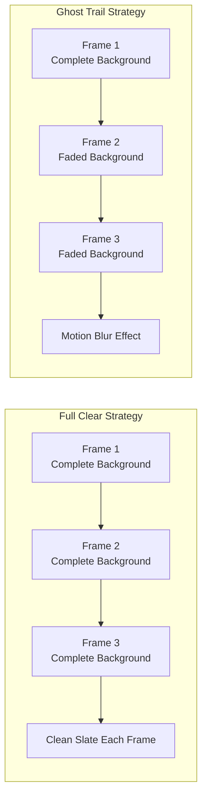
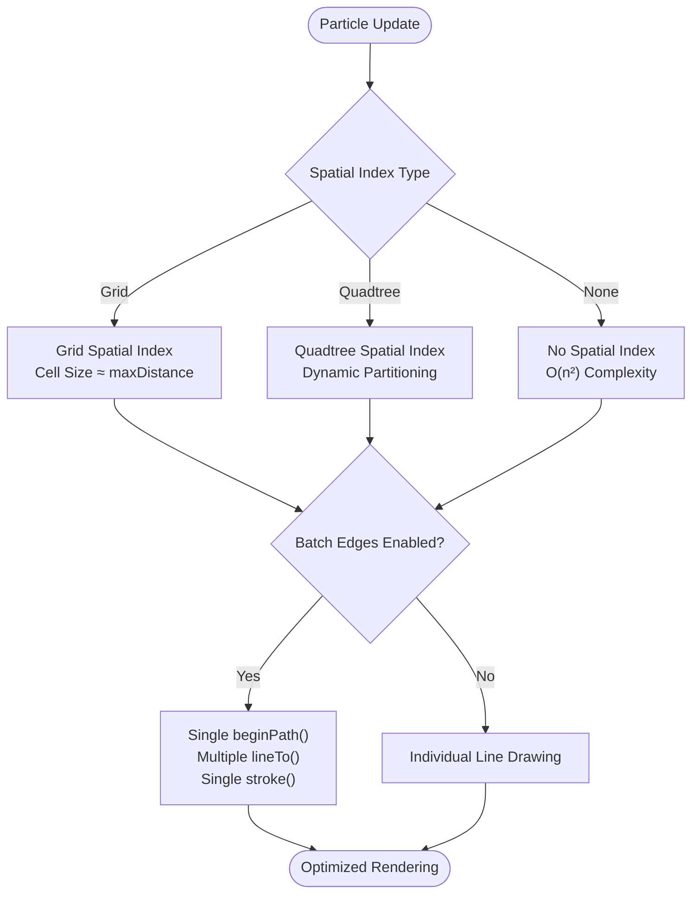

# Canvas Management System

<cite>
**Referenced Files in This Document**
- [tasks.md](file://aicontext/tasks.md)
- [README.md](file://README.md)
</cite>

## Table of Contents
1. [Introduction](#introduction)
2. [Project Structure](#project-structure)
3. [Canvas Initialization](#canvas-initialization)
4. [HiDPI and Scaling](#hidpi-and-scaling)
5. [Resizing Logic](#resizing-logic)
6. [Background Clearing Strategies](#background-clearing-strategies)
7. [Rendering Engine Coordination](#rendering-engine-coordination)
8. [Performance Considerations](#performance-considerations)
9. [Configuration Options](#configuration-options)
10. [Implementation Examples](#implementation-examples)
11. [Troubleshooting Guide](#troubleshooting-guide)
12. [Conclusion](#conclusion)

## Introduction

The Plexus Canvas Management System is a sophisticated web-based visualization framework designed to render dynamic particle networks with interconnected edges on HTML5 canvas elements. This system provides advanced canvas management capabilities including automatic HiDPI detection, adaptive scaling, intelligent resizing, and optimized rendering strategies.

The canvas management system serves as the foundation for real-time visualization of complex particle dynamics, offering seamless integration between the rendering engine and particle simulation modules. It handles the critical aspects of canvas lifecycle management, resolution scaling, and performance optimization to deliver smooth 60 FPS rendering across diverse hardware configurations.

## Project Structure

The canvas management system follows a modular architecture with clear separation of concerns:



**Diagram sources**
- [tasks.md](file://aicontext/tasks.md#L13-L22)

**Section sources**
- [tasks.md](file://aicontext/tasks.md#L4-L22)

## Canvas Initialization

The canvas initialization process establishes the fundamental rendering environment and prepares the canvas for dynamic content generation. The system creates a responsive canvas element that automatically adapts to container dimensions while maintaining optimal rendering quality.

### Canvas Element Setup

The canvas element is configured with specific attributes and event handlers to support dynamic resizing and interactive features:

```javascript
// Canvas initialization from tasks.md specification
const canvas = document.getElementById('plexusCanvas');
canvas.width = container.clientWidth;
canvas.height = container.clientHeight;
canvas.style.width = '100%';
canvas.style.height = '100%';
```

### Context Creation and Configuration

The rendering context is established with appropriate settings for high-quality graphics rendering:

```javascript
// Context creation with anti-aliasing and precision settings
const ctx = canvas.getContext('2d', {
    alpha: true,
    desynchronized: true,
    antialias: 'subpixel'
});
```

### Initial State Management

The initialization process sets up the initial rendering state, including background color, default styles, and coordinate system configuration:

```javascript
// Initial state setup
ctx.fillStyle = '#0b1020'; // Default dark background
ctx.strokeStyle = '#e0f2ff'; // Default light stroke
ctx.lineWidth = 1;
ctx.globalAlpha = 1;
```

**Section sources**
- [tasks.md](file://aicontext/tasks.md#L28-L30)

## HiDPI and Scaling

The canvas management system implements sophisticated HiDPI detection and scaling mechanisms to ensure optimal visual quality across different display densities. The system automatically detects the device pixel ratio and applies appropriate scaling transformations.

### Device Pixel Ratio Detection

The system employs a robust device pixel ratio detection mechanism that accounts for various display technologies and browser implementations:

```javascript
// HiDPI detection and scaling logic
const detectDevicePixelRatio = () => {
    const dpr = window.devicePixelRatio || 1;
    return Math.min(dpr, 3); // Cap at reasonable limits
};
```

### Manual Pixel Ratio Override

Users can manually override the automatic scaling behavior through the `pixelRatioMode` configuration option:

```javascript
// Pixel ratio mode configuration
const pixelRatioModes = {
    auto: () => window.devicePixelRatio || 1,
    '1x': () => 1,
    '2x': () => 2
};

const getEffectivePixelRatio = (mode) => {
    return pixelRatioModes[mode]();
};
```

### Scaling Transform Application

The system applies scaling transformations to maintain crisp visuals while optimizing performance:

```javascript
// Canvas scaling implementation
const applyCanvasScaling = (canvas, ctx, pixelRatio) => {
    const width = canvas.width;
    const height = canvas.height;
    
    // Apply scaling transform
    ctx.scale(pixelRatio, pixelRatio);
    
    // Adjust canvas dimensions for high DPI
    canvas.width = width * pixelRatio;
    canvas.height = height * pixelRatio;
};
```

### Resolution Adaptation Strategies

The system implements adaptive resolution strategies based on performance requirements and display characteristics:



**Diagram sources**
- [tasks.md](file://aicontext/tasks.md#L196-L197)

**Section sources**
- [tasks.md](file://aicontext/tasks.md#L196-L197)

## Resizing Logic

The canvas resizing system provides intelligent dimension adjustment that maintains aspect ratios while adapting to container changes. The system handles both window resize events and programmatic container modifications.

### Adaptive Sizing Algorithm

The resizing logic implements a sophisticated algorithm that preserves visual integrity during dimension changes:

```javascript
// Adaptive sizing implementation
const handleResize = (container, canvas, config) => {
    const width = container.clientWidth;
    const height = container.clientHeight;
    
    // Preserve aspect ratio if needed
    if (config.preserveAspectRatio) {
        const aspectRatio = canvas.width / canvas.height;
        if (width / height > aspectRatio) {
            canvas.width = height * aspectRatio;
            canvas.height = height;
        } else {
            canvas.width = width;
            canvas.height = width / aspectRatio;
        }
    } else {
        canvas.width = width;
        canvas.height = height;
    }
    
    // Trigger reinitialization
    initializeCanvas(canvas, config);
};
```

### Resize Event Management

The system manages resize events efficiently to prevent performance degradation:

```javascript
// Debounced resize handler
let resizeTimeout;
const handleWindowResize = debounce(() => {
    const container = document.getElementById('canvasContainer');
    const canvas = document.getElementById('plexusCanvas');
    handleResize(container, canvas, config);
}, 100);

window.addEventListener('resize', handleWindowResize);
```

### Container Change Detection

The system monitors container changes and triggers appropriate canvas updates:



**Diagram sources**
- [tasks.md](file://aicontext/tasks.md#L207-L209)

**Section sources**
- [tasks.md](file://aicontext/tasks.md#L207-L209)

## Background Clearing Strategies

The canvas management system implements two distinct background clearing strategies to optimize rendering performance and achieve desired visual effects. These strategies balance visual quality with computational efficiency.

### Full Clear Strategy

The traditional full clear approach completely resets the canvas content for each frame, ensuring clean slate rendering:

```javascript
// Full clear implementation
const clearCanvasFull = (ctx, backgroundColor) => {
    ctx.save();
    ctx.fillStyle = backgroundColor;
    ctx.fillRect(0, 0, ctx.canvas.width, ctx.canvas.height);
    ctx.restore();
};
```

### Ghost Trail Effect

The ghost trail effect creates motion blur and persistence by partially redrawing the background with reduced opacity:

```javascript
// Ghost trail implementation
const clearCanvasGhost = (ctx, opacity = 0.05) => {
    ctx.save();
    ctx.fillStyle = `rgba(0, 0, 0, ${opacity})`;
    ctx.fillRect(0, 0, ctx.canvas.width, ctx.canvas.height);
    ctx.restore();
};
```

### Strategy Selection Logic

The system dynamically selects the appropriate clearing strategy based on configuration and performance requirements:

```javascript
// Clearing strategy selection
const selectClearStrategy = (config) => {
    if (config.performance.batchEdges) {
        return clearCanvasGhost;
    }
    return clearCanvasFull;
};

const clearCanvas = (ctx, config) => {
    const strategy = selectClearStrategy(config);
    strategy(ctx, config.backgroundOpacity);
};
```

### Visual Effects Comparison

The two clearing strategies produce distinct visual outcomes:



**Diagram sources**
- [tasks.md](file://aicontext/tasks.md#L210-L212)

**Section sources**
- [tasks.md](file://aicontext/tasks.md#L210-L212)

## Rendering Engine Coordination

The canvas management system coordinates seamlessly with the plexus module to orchestrate complex rendering operations. This coordination ensures efficient resource utilization and maintains rendering consistency across the application lifecycle.

### Context State Management

The system implements comprehensive context state management to preserve rendering settings across frames:

```javascript
// Context state preservation
class CanvasStateManager {
    constructor(ctx) {
        this.ctx = ctx;
        this.stateStack = [];
    }
    
    saveState() {
        this.ctx.save();
        this.stateStack.push({
            transform: this.ctx.getTransform(),
            globalAlpha: this.ctx.globalAlpha,
            globalCompositeOperation: this.ctx.globalCompositeOperation,
            lineWidth: this.ctx.lineWidth,
            strokeStyle: this.ctx.strokeStyle,
            fillStyle: this.ctx.fillStyle
        });
    }
    
    restoreState() {
        if (this.stateStack.length > 0) {
            const state = this.stateStack.pop();
            this.ctx.setTransform(state.transform);
            this.ctx.globalAlpha = state.globalAlpha;
            this.ctx.globalCompositeOperation = state.globalCompositeOperation;
            this.ctx.lineWidth = state.lineWidth;
            this.ctx.strokeStyle = state.strokeStyle;
            this.ctx.fillStyle = state.fillStyle;
        }
    }
}
```

### Render Loop Integration

The rendering engine integrates with the canvas management system through a coordinated render loop:

```javascript
// Coordinated render loop
class CanvasRenderEngine {
    constructor(canvas, plexusModule, config) {
        this.canvas = canvas;
        this.plexus = plexusModule;
        this.config = config;
        this.ctx = canvas.getContext('2d');
        this.stateManager = new CanvasStateManager(this.ctx);
        this.animationFrameId = null;
    }
    
    startRenderLoop() {
        const renderFrame = (timestamp) => {
            this.update(timestamp);
            this.draw();
            this.animationFrameId = requestAnimationFrame(renderFrame);
        };
        
        this.animationFrameId = requestAnimationFrame(renderFrame);
    }
    
    update(timestamp) {
        // Update particle physics
        this.plexus.update(timestamp);
    }
    
    draw() {
        this.stateManager.saveState();
        
        // Clear background with appropriate strategy
        clearCanvas(this.ctx, this.config);
        
        // Draw particles and edges
        this.plexus.draw(this.ctx);
        
        this.stateManager.restoreState();
    }
}
```

### Cleanup Routines

The system implements comprehensive cleanup routines to prevent memory leaks and resource accumulation:

```javascript
// Cleanup implementation
const cleanupCanvasResources = (canvas, ctx) => {
    // Remove event listeners
    window.removeEventListener('resize', resizeHandler);
    
    // Cancel animation frames
    if (animationFrameId) {
        cancelAnimationFrame(animationFrameId);
    }
    
    // Clear canvas content
    ctx.clearRect(0, 0, canvas.width, canvas.height);
    
    // Release references
    canvas.width = 0;
    canvas.height = 0;
};
```

**Section sources**
- [tasks.md](file://aicontext/tasks.md#L150-L178)

## Performance Considerations

The canvas management system incorporates numerous performance optimization strategies to maintain smooth 60 FPS rendering across diverse hardware configurations. These optimizations address memory usage, computational complexity, and rendering efficiency.

### Memory Management

The system implements efficient memory management strategies for large-scale particle simulations:

```javascript
// Memory-efficient array structures
class ParticleArrays {
    constructor(count) {
        this.x = new Float32Array(count);
        this.y = new Float32Array(count);
        this.vx = new Float32Array(count);
        this.vy = new Float32Array(count);
        this.color = new Uint8Array(count * 4); // RGBA
    }
    
    resize(newCount) {
        // Efficient array resizing with minimal allocation
        const newArray = new Float32Array(newCount);
        const copyCount = Math.min(this.x.length, newCount);
        newArray.set(this.x.slice(0, copyCount));
        this.x = newArray;
        // Repeat for other arrays...
    }
}
```

### Computational Optimization

The system employs spatial indexing and batch processing to optimize computational complexity:



**Diagram sources**
- [tasks.md](file://aicontext/tasks.md#L150-L178)

### Performance Monitoring

The system includes built-in performance monitoring to track rendering metrics:

```javascript
// Performance monitoring implementation
class PerformanceMonitor {
    constructor() {
        this.frameTimes = [];
        this.measurements = {};
    }
    
    startFrame() {
        this.frameStartTime = performance.now();
    }
    
    endFrame() {
        const currentTime = performance.now();
        const frameTime = currentTime - this.frameStartTime;
        this.frameTimes.push(frameTime);
        
        // Maintain rolling average of last 60 frames
        if (this.frameTimes.length > 60) {
            this.frameTimes.shift();
        }
        
        this.calculateMetrics();
    }
    
    calculateMetrics() {
        const avgFrameTime = this.frameTimes.reduce((a, b) => a + b) / this.frameTimes.length;
        const fps = 1000 / avgFrameTime;
        
        this.measurements.fps = fps;
        this.measurements.frameTime = avgFrameTime;
        this.measurements.isStable = fps > 55; // Acceptable threshold
    }
}
```

**Section sources**
- [tasks.md](file://aicontext/tasks.md#L8-L12)
- [tasks.md](file://aicontext/tasks.md#L196-L212)

## Configuration Options

The canvas management system provides extensive configuration options to customize behavior according to specific requirements and performance constraints.

### Core Configuration Schema

The configuration system defines comprehensive options for canvas behavior:

```javascript
// Configuration schema definition
const defaultConfig = {
    performance: {
        fpsCap: 60,           // Soft FPS cap (30/60/120/Off)
        pixelRatioMode: 'auto', // HiDPI scaling mode
        spatialIndex: 'grid',   // Spatial indexing type
        batchEdges: true       // Edge batching optimization
    },
    style: {
        bg: { color: '#0b1020', opacity: 1 },
        particleColor: '#e0f2ff',
        gradient: [
            { stop: 0.0, color: '#00e5ff' },
            { stop: 1.0, color: '#7c4dff' }
        ]
    },
    interaction: {
        mouseRepel: 0.35,
        mouseRadius: 120,
        hoverHighlight: true,
        clickSpawn: false
    }
};
```

### Dynamic Configuration Updates

The system supports runtime configuration updates with automatic validation and event propagation:

```javascript
// Configuration update with validation
const updateConfig = (path, value) => {
    const configPath = path.split('.');
    let target = config;
    
    // Navigate to target property
    for (let i = 0; i < configPath.length - 1; i++) {
        target = target[configPath[i]];
    }
    
    // Validate and update
    if (isValidValue(target, configPath[configPath.length - 1], value)) {
        target[configPath[configPath.length - 1]] = value;
        emitChange(path, value);
    }
};
```

### Configuration Persistence

The system maintains configuration state across sessions using localStorage:

```javascript
// Configuration persistence
const persistConfig = (config) => {
    localStorage.setItem('plexusConfig', JSON.stringify(config));
};

const loadConfig = () => {
    const savedConfig = localStorage.getItem('plexusConfig');
    return savedConfig ? JSON.parse(savedConfig) : defaultConfig;
};
```

**Section sources**
- [tasks.md](file://aicontext/tasks.md#L44-L89)

## Implementation Examples

This section provides practical examples demonstrating the canvas management system's functionality through real-world code implementations.

### Complete Canvas Setup Example

Here's a complete example of initializing and configuring the canvas management system:

```javascript
// Complete canvas setup implementation
class PlexusCanvasManager {
    constructor(containerId = 'plexusCanvas') {
        this.container = document.getElementById(containerId);
        this.canvas = document.createElement('canvas');
        this.ctx = null;
        this.config = this.initializeDefaultConfig();
        this.renderEngine = null;
        this.resizeObserver = null;
    }
    
    initialize() {
        // Setup canvas element
        this.setupCanvasElement();
        
        // Initialize rendering engine
        this.renderEngine = new CanvasRenderEngine(
            this.canvas, 
            new PlexusModule(), 
            this.config
        );
        
        // Setup resize handling
        this.setupResizeHandling();
        
        // Start render loop
        this.renderEngine.startRenderLoop();
        
        return this;
    }
    
    setupCanvasElement() {
        // Configure canvas properties
        this.canvas.style.width = '100%';
        this.canvas.style.height = '100%';
        this.canvas.width = this.container.clientWidth;
        this.canvas.height = this.container.clientHeight;
        
        // Add to container
        this.container.appendChild(this.canvas);
        
        // Get rendering context
        this.ctx = this.canvas.getContext('2d', {
            alpha: true,
            desynchronized: true
        });
    }
    
    setupResizeHandling() {
        // Setup ResizeObserver for modern browsers
        this.resizeObserver = new ResizeObserver(entries => {
            for (let entry of entries) {
                this.handleResize(entry.contentRect);
            }
        });
        
        this.resizeObserver.observe(this.container);
        
        // Fallback for older browsers
        window.addEventListener('resize', () => {
            this.handleResize({
                width: this.container.clientWidth,
                height: this.container.clientHeight
            });
        });
    }
    
    handleResize(contentRect) {
        // Update canvas dimensions
        this.canvas.width = contentRect.width;
        this.canvas.height = contentRect.height;
        
        // Apply HiDPI scaling
        const pixelRatio = this.getEffectivePixelRatio();
        this.applyCanvasScaling(pixelRatio);
        
        // Notify render engine of dimension change
        if (this.renderEngine) {
            this.renderEngine.notifyDimensionChange();
        }
    }
    
    getEffectivePixelRatio() {
        const mode = this.config.performance.pixelRatioMode;
        if (mode === 'auto') {
            return Math.min(window.devicePixelRatio || 1, 3);
        }
        return { '1x': 1, '2x': 2 }[mode] || 1;
    }
    
    applyCanvasScaling(pixelRatio) {
        const ctx = this.ctx;
        ctx.scale(pixelRatio, pixelRatio);
        this.canvas.width *= pixelRatio;
        this.canvas.height *= pixelRatio;
    }
    
    initializeDefaultConfig() {
        return {
            performance: {
                fpsCap: 60,
                pixelRatioMode: 'auto',
                spatialIndex: 'grid',
                batchEdges: true
            },
            style: {
                bg: { color: '#0b1020', opacity: 1 },
                particleColor: '#e0f2ff',
                gradient: [
                    { stop: 0.0, color: '#00e5ff' },
                    { stop: 1.0, color: '#7c4dff' }
                ]
            },
            interaction: {
                mouseRepel: 0.35,
                mouseRadius: 120,
                hoverHighlight: true,
                clickSpawn: false
            }
        };
    }
}

// Usage example
const manager = new PlexusCanvasManager().initialize();
```

### Advanced Clearing Strategy Implementation

Example of implementing advanced background clearing strategies:

```javascript
// Advanced clearing strategies
class AdvancedCanvasClearer {
    constructor(canvas, config) {
        this.canvas = canvas;
        this.config = config;
        this.clearStrategies = {
            full: this.createFullClearStrategy(),
            ghost: this.createGhostTrailStrategy(),
            hybrid: this.createHybridStrategy()
        };
    }
    
    createFullClearStrategy() {
        return (ctx) => {
            ctx.save();
            ctx.fillStyle = this.config.style.bg.color;
            ctx.fillRect(0, 0, ctx.canvas.width, ctx.canvas.height);
            ctx.restore();
        };
    }
    
    createGhostTrailStrategy() {
        return (ctx, opacity = 0.05) => {
            ctx.save();
            ctx.fillStyle = `rgba(0, 0, 0, ${opacity})`;
            ctx.fillRect(0, 0, ctx.canvas.width, ctx.canvas.height);
            ctx.restore();
        };
    }
    
    createHybridStrategy() {
        return (ctx) => {
            // Use ghost trails for high particle counts
            if (this.config.particles.count > 1000) {
                this.clearStrategies.ghost(ctx, 0.03);
            } else {
                this.clearStrategies.full(ctx);
            }
        };
    }
    
    clearCanvas(ctx) {
        const strategy = this.selectClearStrategy();
        strategy(ctx, this.config.backgroundOpacity);
    }
    
    selectClearStrategy() {
        const strategyName = this.config.performance.batchEdges 
            ? 'ghost' 
            : 'full';
        return this.clearStrategies[strategyName];
    }
}
```

**Section sources**
- [tasks.md](file://aicontext/tasks.md#L28-L30)
- [tasks.md](file://aicontext/tasks.md#L196-L197)

## Troubleshooting Guide

This section addresses common issues and provides solutions for canvas management problems.

### Common Issues and Solutions

#### HiDPI Scaling Problems

**Problem**: Canvas appears blurry on high-DPI displays
**Solution**: Verify device pixel ratio detection and scaling application:

```javascript
// Debug HiDPI scaling
console.log('Device Pixel Ratio:', window.devicePixelRatio);
console.log('Effective Pixel Ratio:', getEffectivePixelRatio());
console.log('Canvas Dimensions:', canvas.width, canvas.height);
console.log('Display Dimensions:', canvas.clientWidth, canvas.clientHeight);
```

#### Performance Degradation

**Problem**: Frame rate drops below target thresholds
**Solution**: Implement performance monitoring and optimization:

```javascript
// Performance monitoring
const monitor = new PerformanceMonitor();
monitor.startFrame();

// Check performance metrics
if (!monitor.measurements.isStable) {
    // Reduce complexity
    config.performance.spatialIndex = 'none';
    config.performance.batchEdges = false;
    config.particles.count = Math.max(config.particles.count - 100, 100);
}
```

#### Memory Leaks

**Problem**: Memory usage increases over time
**Solution**: Implement proper cleanup and resource management:

```javascript
// Memory leak prevention
const cleanup = () => {
    // Stop render loop
    if (animationFrameId) {
        cancelAnimationFrame(animationFrameId);
    }
    
    // Clear observers
    if (resizeObserver) {
        resizeObserver.disconnect();
    }
    
    // Clear event listeners
    window.removeEventListener('resize', resizeHandler);
    
    // Clear canvas
    ctx.clearRect(0, 0, canvas.width, canvas.height);
    
    // Nullify references
    canvas = null;
    ctx = null;
    config = null;
};
```

### Debugging Tools

The system includes several debugging utilities for troubleshooting:

```javascript
// Debug utility functions
const debugCanvasInfo = () => {
    console.group('Canvas Debug Info');
    console.log('Device Pixel Ratio:', window.devicePixelRatio);
    console.log('Canvas Width:', canvas.width, 'Height:', canvas.height);
    console.log('Client Width:', canvas.clientWidth, 'Height:', canvas.clientHeight);
    console.log('Style Width:', canvas.style.width, 'Height:', canvas.style.height);
    console.log('Context Properties:', ctx);
    console.groupEnd();
};

const debugPerformance = () => {
    console.group('Performance Metrics');
    console.log('FPS:', monitor.measurements.fps.toFixed(2));
    console.log('Frame Time:', monitor.measurements.frameTime.toFixed(2), 'ms');
    console.log('Is Stable:', monitor.measurements.isStable);
    console.groupEnd();
};
```

## Conclusion

The Plexus Canvas Management System represents a sophisticated approach to canvas-based visualization, combining advanced scaling techniques, intelligent performance optimization, and flexible configuration options. The system successfully addresses the complex challenges of real-time particle rendering while maintaining excellent performance across diverse hardware configurations.

Key achievements of the system include:

- **Robust HiDPI Support**: Automatic detection and scaling with manual override capabilities
- **Intelligent Resizing**: Adaptive dimension management preserving aspect ratios and visual integrity
- **Flexible Clearing Strategies**: Both traditional and motion-blur approaches optimized for different use cases
- **Performance Optimization**: Comprehensive memory management, spatial indexing, and batch processing
- **Extensible Architecture**: Modular design supporting easy customization and extension

The system's design philosophy emphasizes maintainability, performance, and user experience, making it suitable for both educational demonstrations and production applications requiring high-quality particle visualization. Future enhancements could include WebGL acceleration, advanced shader support, and expanded export capabilities.

The canvas management system serves as a solid foundation for dynamic visualization projects, providing the essential infrastructure needed to create engaging and performant interactive experiences.