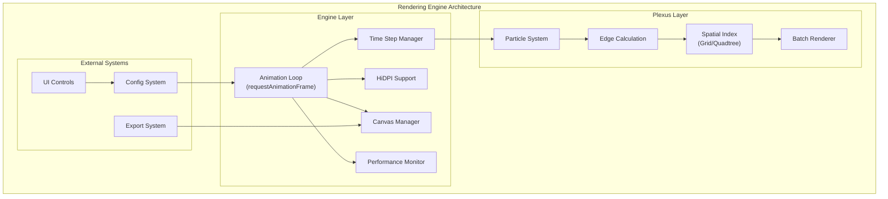
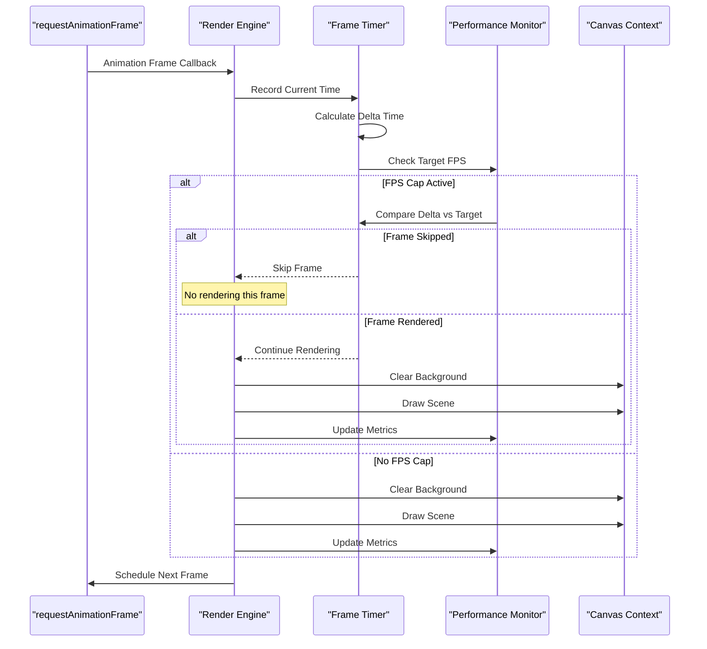
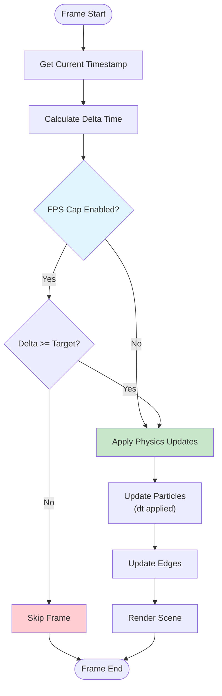
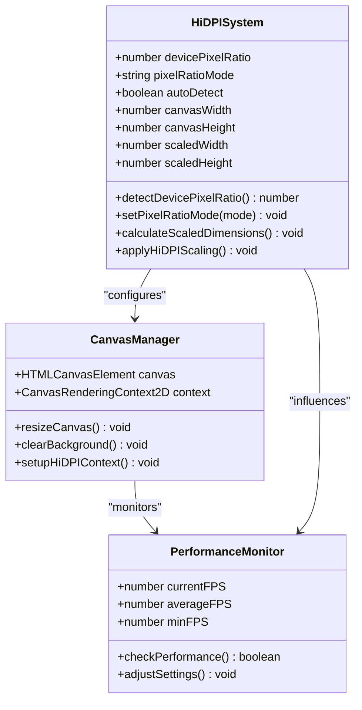
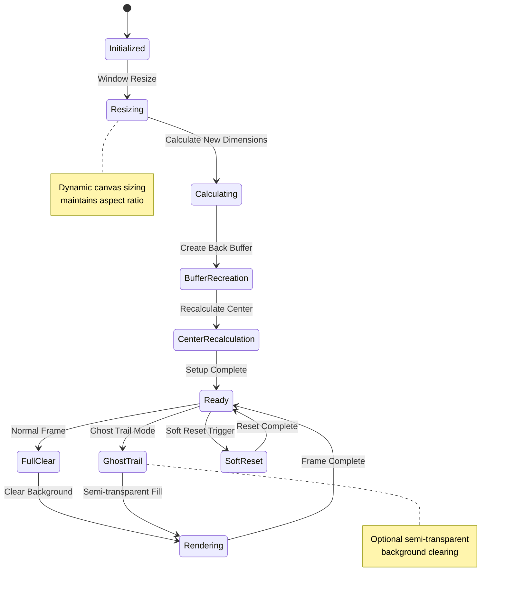
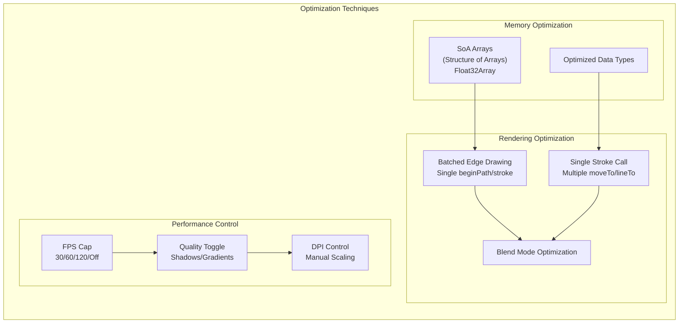
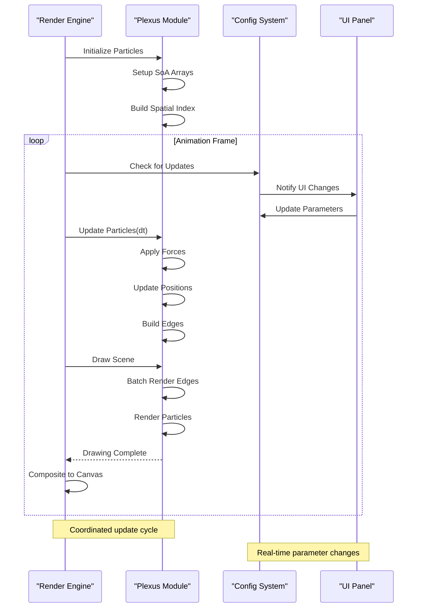
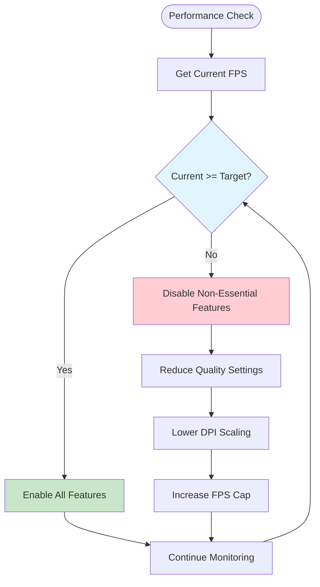

# Rendering Engine

<cite>
**Referenced Files in This Document**
- [tasks.md](file://aicontext/tasks.md)
- [README.md](file://README.md)
</cite>

## Table of Contents
1. [Introduction](#introduction)
2. [Architecture Overview](#architecture-overview)
3. [Animation Loop Implementation](#animation-loop-implementation)
4. [Time-Step Management](#time-step-management)
5. [HiDPI Support](#hidpi-support)
6. [Canvas Management](#canvas-management)
7. [Rendering Optimization](#rendering-optimization)
8. [Plexus Module Coordination](#plexus-module-coordination)
9. [Performance Monitoring](#performance-monitoring)
10. [Configuration Options](#configuration-options)
11. [Conclusion](#conclusion)

## Introduction

The Plexus Canvas rendering engine is a sophisticated web-based animation system designed to visualize dynamic particle networks with smooth motion and optimal performance. Built using vanilla JavaScript (ES2020+) and modern web technologies, the engine implements advanced rendering techniques including requestAnimationFrame-based animation loops, HiDPI support, and intelligent performance monitoring.

The rendering subsystem consists of two primary components: the `render/engine.js` responsible for managing the animation loop, time-step calculations, and canvas operations, and the `render/plexus.js` handling particle physics, edge calculations, and spatial indexing. Together, these components create a seamless visual experience with configurable performance characteristics suitable for various hardware configurations.

## Architecture Overview

The rendering engine follows a modular architecture with clear separation of concerns between animation management and particle simulation. The system is designed around the concept of coordinated updates where the engine drives the animation loop while delegating computational intensive tasks to the plexus module.

**Diagram sources**
- [tasks.md](file://aicontext/tasks.md#L14-L22)

**Section sources**
- [tasks.md](file://aicontext/tasks.md#L4-L22)

## Animation Loop Implementation

The core of the rendering engine is built around the `requestAnimationFrame` API, which provides optimal timing for browser-based animations. The implementation features a sophisticated "soft" FPS capping mechanism that intelligently manages frame rate while maintaining smooth motion.

**Diagram sources**
- [tasks.md](file://aicontext/tasks.md#L193-L196)

The animation loop implements several key features:

### Soft FPS Capping Mechanism
The engine supports multiple FPS capping modes (30, 60, 120, Off) that dynamically adjust frame rendering based on performance metrics. When FPS capping is enabled, the system accumulates time deltas and only renders frames when sufficient time has passed to meet the target frame rate.

### Delta Time Handling
Accurate time-step management ensures consistent motion regardless of frame rate fluctuations. The engine calculates precise delta times between frames and applies them to particle physics calculations, resulting in smooth and predictable animations.

**Section sources**
- [tasks.md](file://aicontext/tasks.md#L193-L196)

## Time-Step Management

The time-step management system is crucial for maintaining consistent physics behavior across varying frame rates. The engine implements adaptive time-stepping that balances performance with visual quality.

**Diagram sources**
- [tasks.md](file://aicontext/tasks.md#L193-L196)

The time-step system handles several scenarios:

### Variable Frame Rate
When no FPS cap is set, the engine renders every available frame, applying the exact delta time to physics calculations. This provides maximum visual fidelity but may impact performance on lower-end hardware.

### Fixed Frame Rate
With FPS caps enabled, the system accumulates time and only renders when the accumulated time meets or exceeds the target frame duration. This creates smoother motion at the cost of occasional skipped frames.

### Adaptive Time-Stepping
The engine automatically adjusts time steps for physics calculations to prevent instability during frame rate variations, ensuring consistent particle behavior.

**Section sources**
- [tasks.md](file://aicontext/tasks.md#L193-L196)

## HiDPI Support

High-DPI display support is essential for crisp visuals on modern devices. The rendering engine implements automatic detection of device pixel ratios combined with manual override capabilities.

**Diagram sources**
- [tasks.md](file://aicontext/tasks.md#L196-L197)

### Automatic Detection
The system automatically detects the device's pixel ratio using `window.devicePixelRatio` and scales the canvas accordingly. This ensures sharp rendering on Retina displays and other high-density screens.

### Manual Override
Users can manually set the pixel ratio mode to force lower resolutions for performance optimization. The available modes include automatic detection, manual scaling, and forced low-DPI rendering.

### Scaling Strategies
The engine employs different scaling approaches depending on the target resolution and performance requirements. Higher pixel ratios improve visual quality but increase rendering overhead.

**Section sources**
- [tasks.md](file://aicontext/tasks.md#L196-L197)

## Canvas Management

Canvas management encompasses resizing behavior, background clearing strategies, and context configuration. The system is designed to handle dynamic window resizing while maintaining optimal performance.

**Diagram sources**
- [tasks.md](file://aicontext/tasks.md#L197-L199)

### Dynamic Resizing
The canvas automatically resizes to match container dimensions while preserving the aspect ratio. This ensures the visualization adapts to different screen sizes and layout configurations.

### Background Clearing Strategies
The engine supports two background clearing approaches:

1. **Full Clear Mode**: Completely clears the canvas before each frame, providing clean slate rendering
2. **Ghost Trail Mode**: Uses semi-transparent background fills to create motion blur effects, enhancing visual appeal

### Back Buffer Management
During resize operations, the system recreates back buffers to accommodate new dimensions while preserving existing particle data and maintaining continuity.

**Section sources**
- [tasks.md](file://aicontext/tasks.md#L197-L199)

## Rendering Optimization

The rendering engine implements several optimization techniques to maximize performance while maintaining visual quality. These optimizations are particularly important for handling large numbers of particles efficiently.

**Diagram sources**
- [tasks.md](file://aicontext/tasks.md#L8-L12)

### Structure of Arrays (SoA)
The engine uses SoA data structures for particle storage, organizing data into separate arrays for position, velocity, and color components. This memory layout improves cache locality and enables efficient SIMD operations.

### Batched Edge Drawing
Instead of individual stroke calls for each edge, the system performs batched drawing using a single `beginPath()` call followed by multiple `moveTo()` and `lineTo()` operations, then a single `stroke()` call. This significantly reduces GPU state changes and improves rendering performance.

### Memory Efficiency
All numerical data uses `Float32Array` for optimal memory usage and performance. The SoA structure minimizes memory fragmentation and improves cache hit rates during particle updates.

### Quality vs Performance Trade-offs
The engine provides runtime controls for adjusting rendering quality based on performance requirements. Features like shadows and gradients can be disabled when FPS drops below target thresholds.

**Section sources**
- [tasks.md](file://aicontext/tasks.md#L8-L12)

## Plexus Module Coordination

The rendering engine coordinates closely with the plexus module to manage particle updates and drawing operations. This coordination ensures that physics calculations and rendering occur in sync while maintaining optimal performance.

**Diagram sources**
- [tasks.md](file://aicontext/tasks.md#L14-L15)

### Update Coordination
The engine passes time deltas to the plexus module for physics calculations, ensuring consistent temporal behavior across all particle operations. This coordination happens every frame during the animation loop.

### Parameter Synchronization
UI controls modify configuration parameters that trigger immediate updates to the plexus module. The system debounces heavy operations like spatial index rebuilding to prevent performance degradation.

### Event-Driven Updates
Changes to configuration parameters trigger events that propagate through the system, ensuring all components remain synchronized while minimizing unnecessary computations.

**Section sources**
- [tasks.md](file://aicontext/tasks.md#L14-L15)

## Performance Monitoring

The rendering engine includes comprehensive performance monitoring capabilities that track frame rates, detect performance degradation, and automatically adjust settings to maintain target frame rates.

**Diagram sources**
- [tasks.md](file://aicontext/tasks.md#L8-L12)

### Real-time FPS Tracking
The engine continuously monitors actual frame rates and compares them against target performance goals. This data informs automatic quality adjustments and user feedback mechanisms.

### Soft-Cap Mechanism
When performance drops below target levels, the system automatically increases the FPS cap threshold to allow more frequent rendering attempts, helping recover lost performance.

### Quality Adjustment
The engine can dynamically disable non-essential rendering features like shadows, gradients, and complex blend modes when performance pressure mounts.

### Performance Thresholds
Predefined performance targets guide automatic adjustments. The system aims for 60 FPS with 1000-1500 particles and maxDistance=140 on mid-range laptops.

**Section sources**
- [tasks.md](file://aicontext/tasks.md#L8-L12)

## Configuration Options

The rendering engine provides extensive configuration options that allow users to customize performance characteristics and visual appearance according to their needs and hardware capabilities.

### FPS Control Options
- **30 FPS**: Conservative setting for maximum compatibility
- **60 FPS**: Standard target for smooth motion
- **120 FPS**: High-performance mode for capable hardware
- **Off**: Unrestricted frame rate with minimal latency

### HiDPI Configuration
- **Auto-detect**: Automatically use device pixel ratio
- **Manual**: Allow user-controlled scaling
- **Low-DPI**: Force 1x scaling for performance

### Background Clearing Modes
- **Full Clear**: Complete background reset each frame
- **Ghost Trail**: Semi-transparent background for motion blur
- **Custom**: User-defined clearing behavior

### Performance Tuning
- **Spatial Index Type**: Grid vs Quadtree selection
- **Quality Levels**: Feature enable/disable toggles
- **Memory Limits**: Maximum particle count restrictions

**Section sources**
- [tasks.md](file://aicontext/tasks.md#L8-L12)

## Conclusion

The Plexus Canvas rendering engine represents a sophisticated approach to real-time particle visualization that balances performance, visual quality, and user experience. Through its modular architecture, intelligent optimization techniques, and adaptive performance monitoring, the engine delivers smooth animations suitable for a wide range of hardware configurations.

Key strengths of the system include:

- **Adaptive Performance**: Automatic quality adjustment based on actual performance metrics
- **Efficient Rendering**: Optimized SoA data structures and batched drawing operations  
- **Flexible Configuration**: Extensive options for customizing behavior and appearance
- **Robust Architecture**: Clean separation of concerns between animation and physics
- **Modern Standards**: Built using vanilla JavaScript with ES2020+ features

The engine's design philosophy emphasizes maintainability and extensibility while delivering professional-grade rendering capabilities. Its modular structure allows for easy modification and enhancement while maintaining backward compatibility and performance stability.

Future enhancements could include WebGL acceleration for larger particle counts, advanced lighting effects, and additional spatial indexing algorithms for improved performance with extreme particle densities.