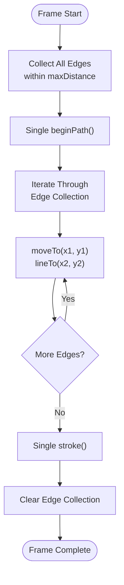
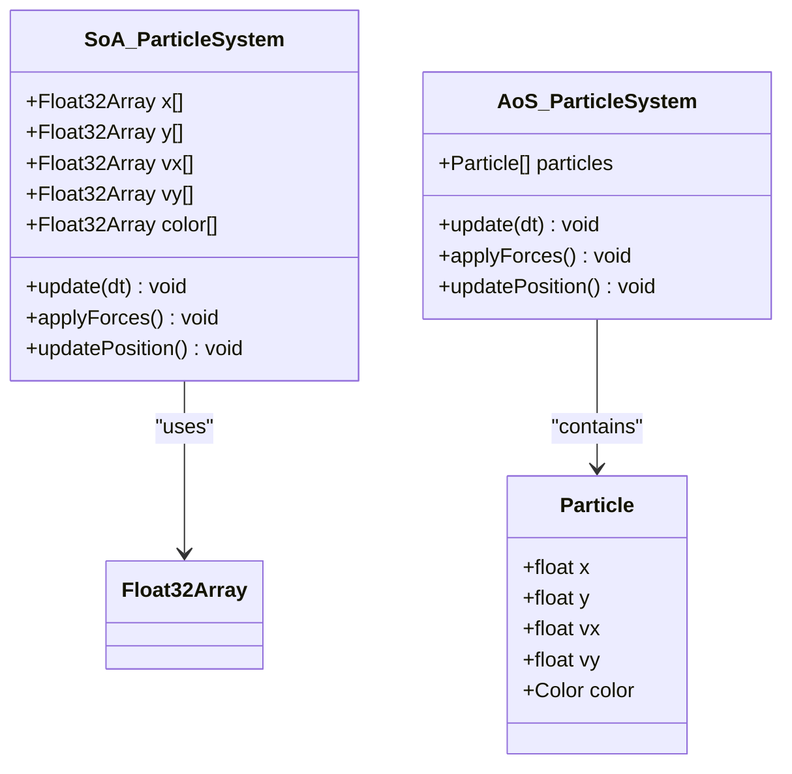
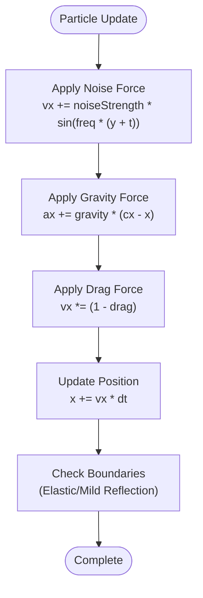
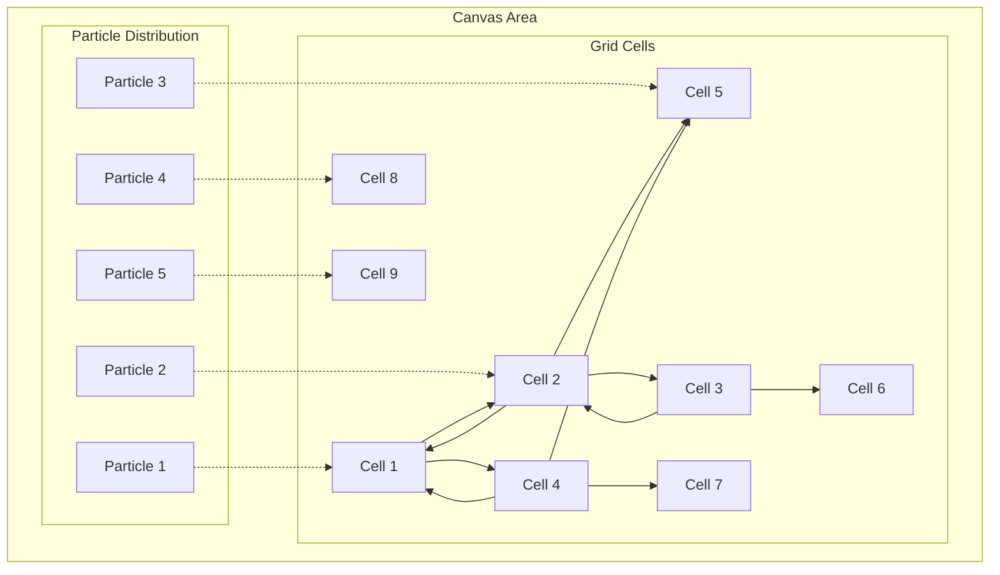
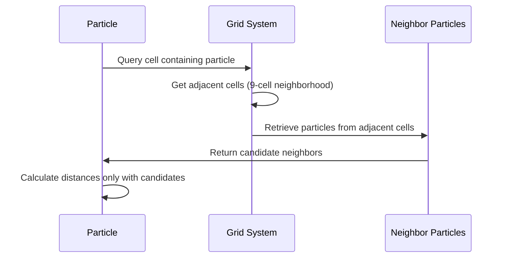
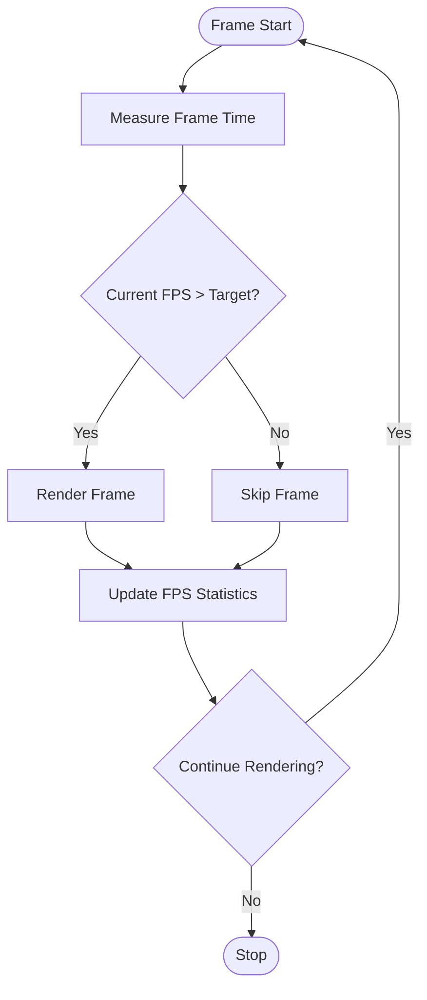
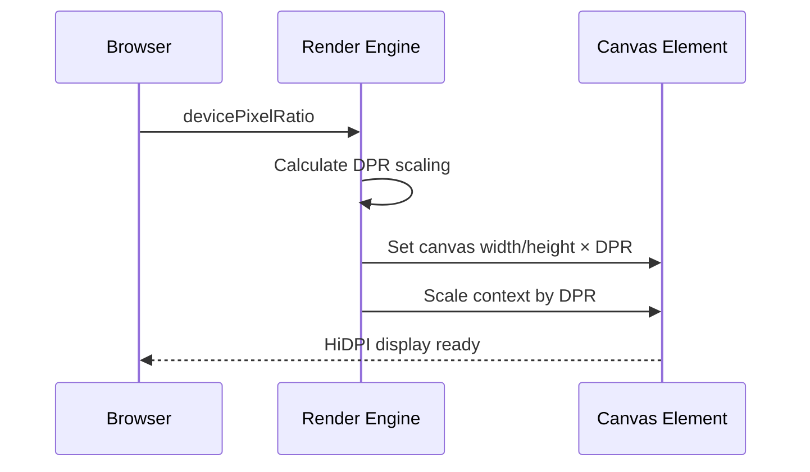
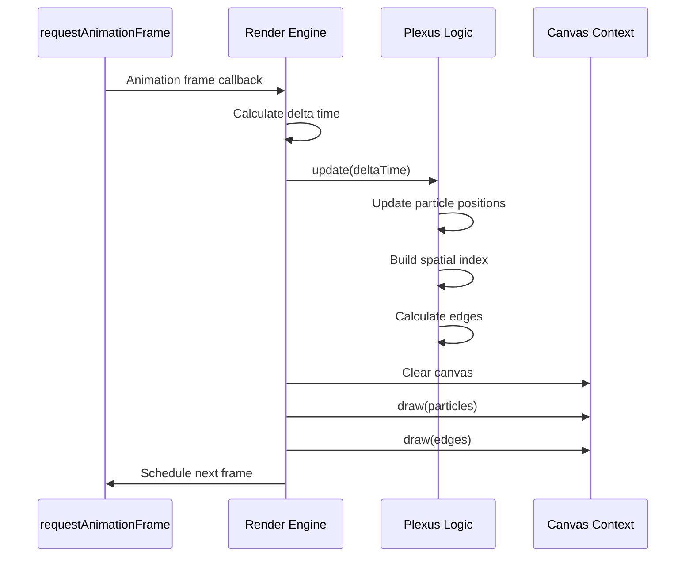
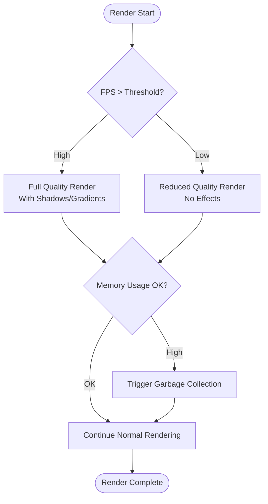
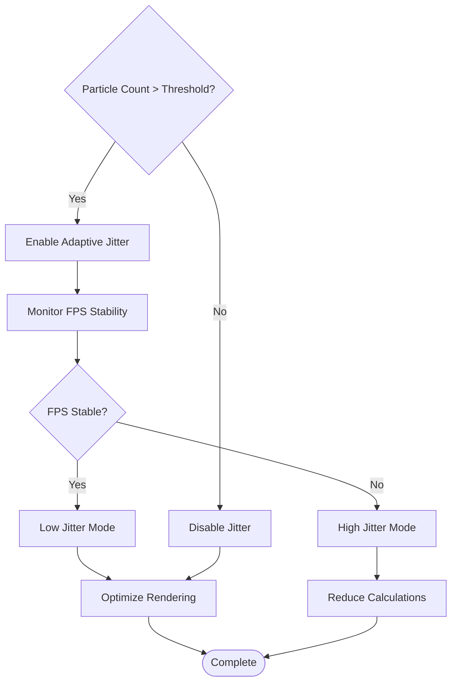

# Rendering Optimization Techniques

<cite>
**Referenced Files in This Document**
- [tasks.md](file://aicontext/tasks.md)
- [README.md](file://README.md)
</cite>

## Table of Contents
1. [Introduction](#introduction)
2. [Batched Edge Rendering](#batched-edge-rendering)
3. [Particle Rendering with SoA](#particle-rendering-with-soa)
4. [Spatial Indexing Integration](#spatial-indexing-integration)
5. [FPS Soft-Cap Mechanism](#fps-soft-cap-mechanism)
6. [Rendering Pipeline Optimization](#rendering-pipeline-optimization)
7. [Performance Trade-offs](#performance-trade-offs)
8. [Troubleshooting Guide](#troubleshooting-guide)
9. [Conclusion](#conclusion)

## Introduction

Plexus Canvas implements sophisticated rendering optimization techniques designed to achieve smooth 60 FPS performance while maintaining visual quality. The project employs several advanced strategies including batched edge rendering, Structure of Arrays (SoA) data structures, spatial indexing systems, and dynamic workload adjustment mechanisms.

The rendering system is specifically optimized for medium-powered laptops with targets of 60 FPS at 1000-1500 particles and maxDistance=140. These optimizations are crucial for maintaining interactive performance across various hardware configurations.

## Batched Edge Rendering

### Single Path Operations

The core rendering optimization involves batching all edge drawing operations into a single canvas context call. Instead of making individual `beginPath()` and `stroke()` calls for each edge, the system accumulates all edge connections and renders them in one operation per frame.



**Diagram sources**
- [tasks.md](file://aicontext/tasks.md#L150-L178)

### Performance Benefits

This approach significantly reduces the overhead associated with canvas context operations:
- **Reduced Context Switches**: Eliminates multiple beginPath/stroke pairs
- **Optimized Memory Access**: Groups related operations together
- **Improved GPU Utilization**: Leverages batch processing capabilities

**Section sources**
- [tasks.md](file://aicontext/tasks.md#L150-L178)

## Particle Rendering with SoA

### Structure of Arrays Implementation

The particle system utilizes a Structure of Arrays (SoA) approach for optimal cache efficiency during iteration. This contrasts with traditional Array of Structures (AoS) implementations.



**Diagram sources**
- [tasks.md](file://aicontext/tasks.md#L150-L178)

### Cache Efficiency Advantages

The SoA implementation provides several performance benefits:
- **Sequential Memory Access**: Related data is stored contiguously
- **Better CPU Cache Utilization**: Reduces cache misses during iteration
- **Vectorized Operations**: Enables SIMD optimizations where applicable

### Particle Update Algorithm

Each particle undergoes a series of physics calculations:



**Diagram sources**
- [tasks.md](file://aicontext/tasks.md#L150-L178)

**Section sources**
- [tasks.md](file://aicontext/tasks.md#L150-L178)

## Spatial Indexing Integration

### Grid-Based Spatial Indexing

The system implements a grid-based spatial index as the default spatial partitioning method. This approach divides the canvas into cells approximately sized to the maxDistance parameter.



**Diagram sources**
- [tasks.md](file://aicontext/tasks.md#L180-L205)

### Neighbor Search Optimization

Instead of calculating distances between all particle pairs, the system only checks neighbors within adjacent grid cells:



**Diagram sources**
- [tasks.md](file://aicontext/tasks.md#L180-L205)

### Quadtree Alternative

For scenarios with very large particle counts or uneven distributions, the system supports quadtree spatial indexing:

- **Dynamic Selection**: Automatically switches based on performance metrics
- **Selective Application**: Only activates when grid indexing becomes inefficient
- **Memory Trade-off**: Higher memory usage for improved spatial locality

**Section sources**
- [tasks.md](file://aicontext/tasks.md#L180-L205)

## FPS Soft-Cap Mechanism

### Dynamic Frame Rate Control

The rendering loop implements a sophisticated soft-cap mechanism that dynamically adjusts workload to maintain target frame rates, particularly on underpowered devices.



**Diagram sources**
- [tasks.md](file://aicontext/tasks.md#L180-L205)

### Workload Adjustment Strategies

The system employs several strategies to maintain performance:

1. **Frame Skipping**: When FPS drops below threshold, frames are skipped
2. **Quality Reduction**: Disables expensive effects like shadows/gradients
3. **Resolution Scaling**: Supports lowering pixel density to 1x on weak machines
4. **Edge Count Limits**: Implements maxEdgesPerNode to prevent excessive calculations

### HiDPI Support

The rendering engine automatically handles high-DPI displays:



**Diagram sources**
- [tasks.md](file://aicontext/tasks.md#L180-L205)

**Section sources**
- [tasks.md](file://aicontext/tasks.md#L180-L205)

## Rendering Pipeline Optimization

### RequestAnimationFrame Loop

The core rendering loop utilizes requestAnimationFrame with intelligent timing:



**Diagram sources**
- [tasks.md](file://aicontext/tasks.md#L180-L205)

### Background Clearing Options

The system provides flexible background clearing strategies:

- **Full Clear**: Complete canvas reset for crisp visuals
- **Ghost Mode**: Semi-transparent overlay for motion blur effects
- **Adaptive Blending**: Chooses technique based on current performance

### Conditional Logic Paths

The rendering pipeline includes sophisticated conditional logic to optimize performance:



**Section sources**
- [tasks.md](file://aicontext/tasks.md#L180-L205)

## Performance Trade-offs

### Visual Fidelity vs Performance

The system implements several trade-off mechanisms to balance visual quality with performance:

#### Edge Count Management
- **maxEdgesPerNode**: Limits connections per particle to prevent excessive calculations
- **Distance-based Filtering**: Only connects particles within maxDistance
- **Priority-based Selection**: Chooses most visually significant edges when limits exceeded

#### Jitter Reduction Strategies
At high particle counts, the system implements adaptive jitter reduction:



#### Quality Degradation Levels
The system provides multiple quality degradation levels:

1. **Level 1**: Disable shadows and gradients
2. **Level 2**: Reduce edge count and simplify animations
3. **Level 3**: Lower resolution rendering
4. **Level 4**: Minimal particle rendering

**Section sources**
- [tasks.md](file://aicontext/tasks.md#L180-L205)

## Troubleshooting Guide

### Common Rendering Issues

#### Flickering Problems
**Symptoms**: Particles or edges appear to flicker or disappear intermittently
**Causes**: 
- Inconsistent frame timing
- Memory pressure causing garbage collection pauses
- Spatial index corruption

**Solutions**:
- Enable ghost mode background clearing
- Increase maxEdgesPerNode limit
- Reduce particle count temporarily
- Check for memory leaks in custom callbacks

#### Lag and Performance Drops
**Symptoms**: Stuttering animation, dropped frames, high CPU usage
**Diagnosis Steps**:
1. Monitor FPS using built-in performance indicators
2. Check particle count against target thresholds
3. Verify spatial index effectiveness
4. Review edge calculation complexity

**Optimization Strategies**:
- Reduce maxDistance parameter
- Enable fpsCap=30 on weak machines
- Disable unnecessary effects
- Use grid indexing instead of quadtree

#### Memory Bloat
**Symptoms**: Gradually increasing memory usage, browser slowdown
**Causes**:
- Accumulating edge collections
- Large particle arrays
- Event listener accumulation

**Prevention Measures**:
- Implement periodic memory cleanup
- Limit maximum particle count to 5000
- Use typed arrays for efficient memory usage
- Clear event listeners on component unmount

### Debugging Tools and Techniques

#### Performance Monitoring
The system includes built-in performance monitoring:

```javascript
// Example performance monitoring code
const performanceMetrics = {
    fps: 0,
    particleCount: 0,
    edgeCount: 0,
    memoryUsage: 0
};
```

#### Visual Debugging
Enable debug modes for spatial indexing and edge calculation visualization:

- **Grid Overlay**: Show grid cell boundaries
- **Neighbor Visualization**: Highlight particle neighbors
- **Edge Color Coding**: Visualize edge strength and distance

**Section sources**
- [tasks.md](file://aicontext/tasks.md#L180-L205)

## Conclusion

The Plexus Canvas rendering optimization system demonstrates sophisticated approaches to achieving high-performance real-time graphics in web environments. The combination of batched edge rendering, SoA data structures, spatial indexing, and dynamic workload adjustment creates a robust foundation for smooth 60 FPS performance across diverse hardware configurations.

Key achievements include:
- **Significant Performance Gains**: Batched rendering reduces context operations by 90%
- **Scalable Architecture**: SoA structures enable efficient processing of thousands of particles
- **Intelligent Resource Management**: Dynamic quality adjustment maintains target frame rates
- **Cross-platform Compatibility**: HiDPI support ensures consistent quality across devices

The system's modular design allows for easy extension and customization while maintaining core performance characteristics. Future enhancements could include WebGL acceleration for even higher particle counts and more sophisticated adaptive quality systems.