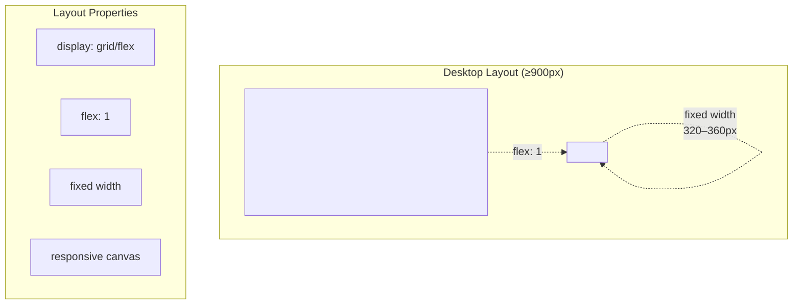
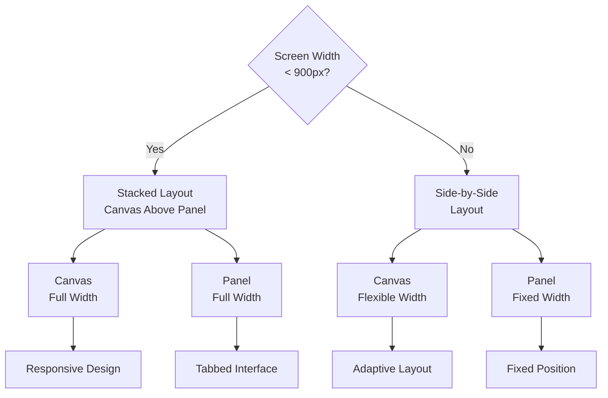
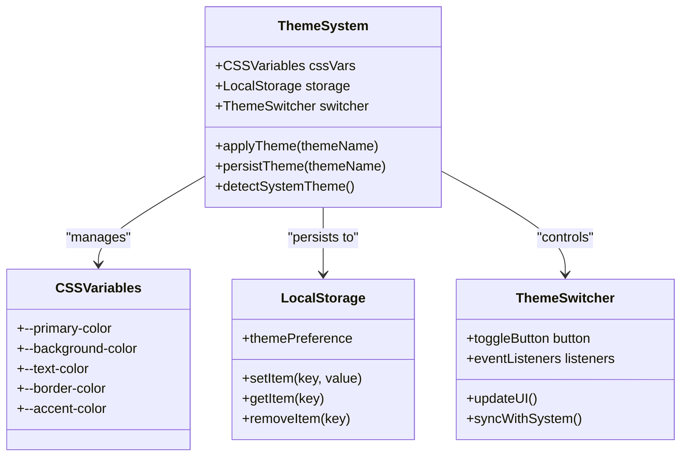
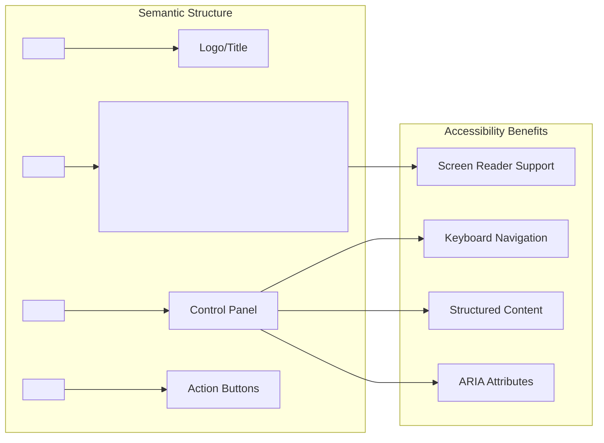
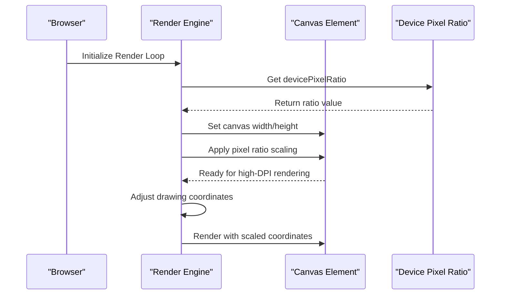
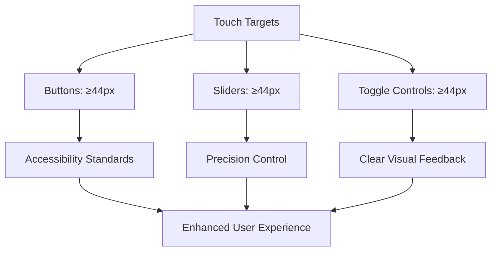
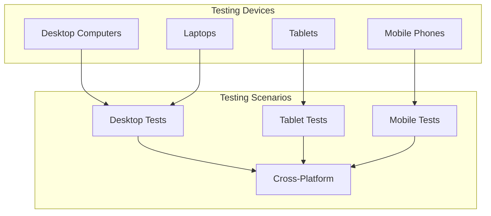

# Accessibility and Responsive Design

<cite>
**Referenced Files in This Document**
- [tasks.md](file://aicontext/tasks.md)
- [README.md](file://README.md)
</cite>

## Table of Contents
1. [Introduction](#introduction)
2. [Responsive Layout Implementation](#responsive-layout-implementation)
3. [Dark/Light Theme System](#darklight-theme-system)
4. [Accessibility Features](#accessibility-features)
5. [High DPI Support](#high-dpi-support)
6. [Touch-Friendly Design](#touch-friendly-design)
7. [Best Practices](#best-practices)
8. [Testing Guidelines](#testing-guidelines)

## Introduction

Plexus Canvas is a modern web application built with a clean stack of HTML, CSS, and vanilla JavaScript (ES2020+), designed with accessibility and responsive design as core principles. The application features a dynamic particle network visualization on the left side with an interactive settings panel on the right, all supporting keyboard navigation, semantic HTML structure, and adaptive layouts for various screen sizes.

The project emphasizes accessibility through semantic markup, proper labeling, keyboard navigation support, and screen reader compatibility. The responsive design ensures optimal user experience across desktop, tablet, and mobile devices while maintaining performance standards.

## Responsive Layout Implementation

The application implements a sophisticated responsive layout system that adapts to different screen sizes and orientations. The core layout follows a two-column design pattern with intelligent breakpoint management.

### Desktop Layout (≥900px)

On larger screens, the interface maintains a side-by-side layout with optimal proportions:

**Diagram sources**
- [tasks.md](file://aicontext/tasks.md#L24-L40)

### Mobile Layout (<900px)

For smaller screens, the layout automatically transforms to a stacked arrangement:

**Diagram sources**
- [tasks.md](file://aicontext/tasks.md#L292-L297)

### Implementation Details

The responsive behavior is achieved through CSS Grid or Flexbox layouts with media queries that trigger layout changes at the 900px breakpoint. The canvas element utilizes flexible sizing properties while the control panel maintains fixed dimensions for optimal usability.

**Section sources**
- [tasks.md](file://aicontext/tasks.md#L292-L297)

## Dark/Light Theme System

The application implements a comprehensive theme switching system using CSS custom properties (variables) with persistent storage via localStorage. This system ensures visual consistency across different themes while maintaining accessibility standards.

### CSS Variable Architecture

**Diagram sources**
- [tasks.md](file://aicontext/tasks.md#L9-L11)

### Theme Persistence

The theme system stores user preferences in localStorage, ensuring that selected themes persist across browser sessions and tab reloads. This creates a seamless user experience where theme preferences are maintained regardless of how users interact with the application.

### Automatic Theme Detection

The system can detect and adapt to the user's system-wide theme preference, providing an intuitive experience that respects user operating system settings.

**Section sources**
- [tasks.md](file://aicontext/tasks.md#L9-L11)

## Accessibility Features

Plexus Canvas incorporates comprehensive accessibility features to ensure the application is usable by individuals with diverse abilities and assistive technologies.

### Semantic HTML Structure

The application employs semantic HTML elements throughout the interface:

**Diagram sources**
- [tasks.md](file://aicontext/tasks.md#L24-L40)

### Form Control Accessibility

All interactive elements include proper labeling and descriptive attributes:

- **Labels**: Every form control has associated label elements
- **Titles**: Descriptive title attributes provide additional context
- **Keyboard Navigation**: Full keyboard support for all interactive elements
- **Focus Management**: Clear visual focus indicators and logical tab order

### Screen Reader Compatibility

The application implements several features to enhance screen reader compatibility:

- **Descriptive Labels**: Meaningful label text for all controls
- **Skip Links**: Navigation shortcuts for efficient browsing
- **Live Regions**: Dynamic content announcements for real-time updates
- **ARIA Landmarks**: Proper section identification for navigation

### Keyboard Navigation Support

Complete keyboard accessibility is provided through:

- **Tab Navigation**: Logical tab order through all interactive elements
- **Enter/Space Actions**: Activation of buttons and interactive elements
- **Arrow Key Navigation**: Menu and selection control navigation
- **Escape Handling**: Proper modal and menu dismissal

**Section sources**
- [tasks.md](file://aicontext/tasks.md#L9-L11)

## High DPI Support

The application includes sophisticated high-DPI display support to ensure crisp rendering on Retina and other high-resolution displays.

### Pixel Ratio Management

**Diagram sources**
- [tasks.md](file://aicontext/tasks.md#L8-L10)

### DPI Scaling Options

The system provides multiple DPI scaling modes:

- **Auto Mode**: Automatically detects and applies optimal pixel ratio
- **Manual Modes**: 1x and 2x scaling options for performance tuning
- **Dynamic Adjustment**: Real-time DPI adaptation based on performance metrics

### Performance Considerations

High-DPI support includes performance optimization features:

- **Conditional Rendering**: Reduced quality on lower-end devices
- **Frame Rate Capping**: Automatic FPS reduction when necessary
- **Resource Management**: Efficient memory usage for high-resolution displays

**Section sources**
- [tasks.md](file://aicontext/tasks.md#L8-L10)

## Touch-Friendly Design

The application is designed with touch interfaces in mind, providing optimal interaction experiences across mobile and tablet devices.

### Touch Target Sizing

### Gesture Support

The interface supports common touch gestures:

- **Tap**: Primary action activation
- **Long Press**: Context menu and additional options
- **Pinch**: Zoom functionality for canvas exploration
- **Swipe**: Navigation between different sections

### Responsive Interaction

Touch-friendly design includes:

- **Optimal Touch Targets**: Minimum 44px touch targets
- **Visual Feedback**: Immediate response to touch interactions
- **Gesture Recognition**: Intuitive gesture-based navigation
- **Adaptive Layout**: Touch-optimized layout adjustments

## Best Practices

### Maintaining Accessibility

When extending the UI, developers should follow these accessibility guidelines:

1. **Semantic Markup**: Use appropriate HTML elements for their intended purpose
2. **Proper Labeling**: Always associate labels with their corresponding controls
3. **Keyboard Support**: Ensure all functionality is accessible via keyboard
4. **Color Contrast**: Maintain sufficient contrast ratios for readability
5. **Focus Management**: Provide clear visual focus indicators

### Responsive Design Principles

For responsive enhancements:

1. **Mobile-First Approach**: Design for mobile devices first, then enhance for larger screens
2. **Flexible Units**: Use relative units (em, rem, %) instead of fixed pixels
3. **Breakpoint Strategy**: Plan breakpoints based on content needs, not device sizes
4. **Performance Optimization**: Consider performance impact of responsive features

### Testing Guidelines

Regular accessibility and responsiveness testing should include:

- **Screen Reader Testing**: Verify compatibility with popular screen readers
- **Keyboard Navigation**: Test all functionality using only keyboard
- **High Contrast Testing**: Ensure visibility in high contrast modes
- **Touch Testing**: Verify touch interactions on actual devices
- **Performance Testing**: Monitor performance across different screen sizes

## Testing Guidelines

### Device Testing Matrix

### Accessibility Testing Checklist

- [ ] All interactive elements are keyboard accessible
- [ ] Screen reader announces proper content and context
- [ ] Color combinations meet WCAG contrast requirements
- [ ] Focus indicators are clearly visible
- [ ] Form controls have proper labels
- [ ] Error states are communicated effectively
- [ ] Navigation is logical and predictable

### Responsive Testing Procedures

1. **Resize Testing**: Manually resize browser window to test breakpoints
2. **Device Emulation**: Use browser developer tools to emulate various devices
3. **Real Device Testing**: Test on actual mobile and tablet devices
4. **Orientation Changes**: Test landscape and portrait modes
5. **Performance Monitoring**: Measure performance across different screen sizes

**Section sources**
- [tasks.md](file://aicontext/tasks.md#L232-L266)