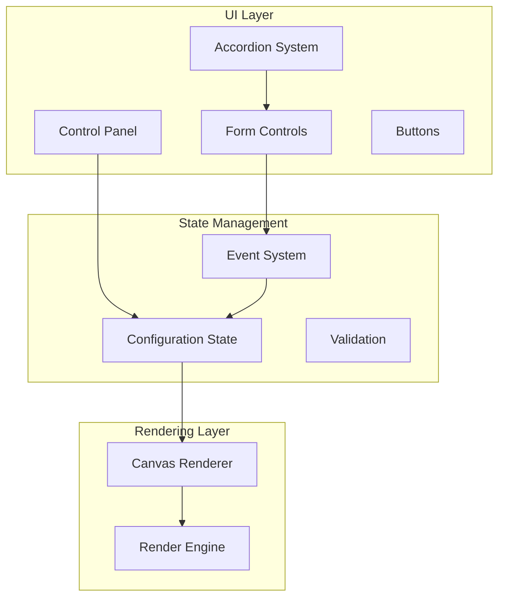
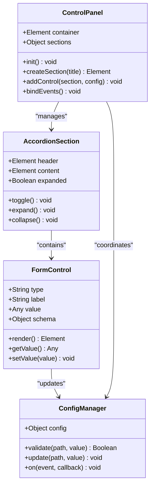
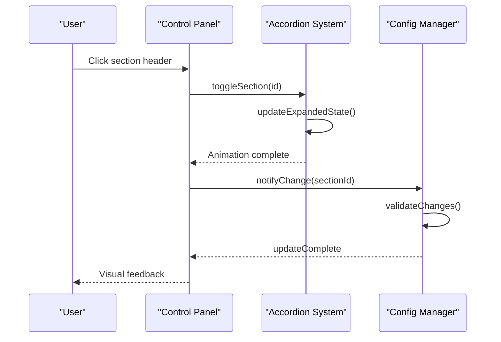
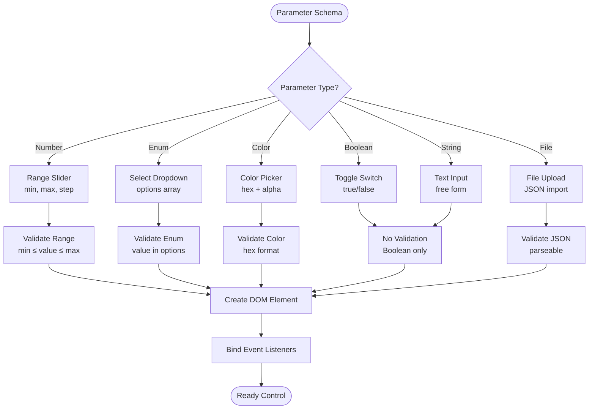
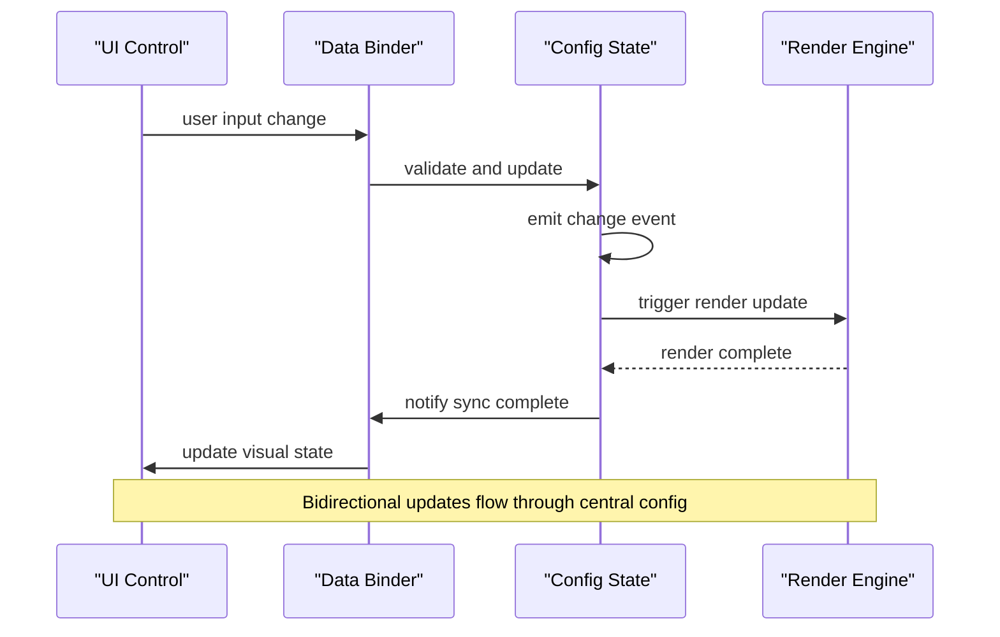
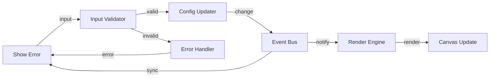

# Control Panel UI Component Documentation

<cite>
**Referenced Files in This Document**
- [tasks.md](file://aicontext/tasks.md)
- [README.md](file://README.md)
</cite>

## Table of Contents
1. [Introduction](#introduction)
2. [Project Structure](#project-structure)
3. [Control Panel Architecture](#control-panel-architecture)
4. [Accordion Layout Implementation](#accordion-layout-implementation)
5. [Dynamic Form Controls Generation](#dynamic-form-controls-generation)
6. [Two-Way Data Binding](#two-way-data-binding)
7. [Responsive Design](#responsive-design)
8. [Configuration Schema](#configuration-schema)
9. [Event System](#event-system)
10. [Customization Guidelines](#customization-guidelines)
11. [Performance Considerations](#performance-considerations)
12. [Troubleshooting Guide](#troubleshooting-guide)
13. [Conclusion](#conclusion)

## Introduction

The Control Panel UI component is a sophisticated interactive interface designed for the Plexus Canvas application. This component provides a comprehensive configuration system with accordion-based layout, dynamic form controls, and real-time parameter adjustment capabilities. The panel serves as the primary interface for users to customize particle systems, edge configurations, forces, colors, interactions, and performance settings.

The control panel implements a modern web architecture with responsive design principles, supporting both desktop and mobile interfaces. It features an intuitive accordion structure with collapsible sections for different configuration categories, enabling users to efficiently navigate and modify complex parameter sets.

## Project Structure

The control panel follows a modular architecture with clear separation of concerns:



**Diagram sources**
- [tasks.md](file://aicontext/tasks.md#L18-L26)

**Section sources**
- [tasks.md](file://aicontext/tasks.md#L1-L50)

## Control Panel Architecture

The control panel is built around a hierarchical accordion system that organizes configuration parameters into logical groups. Each accordion section represents a distinct functional category with its own set of configurable parameters.

### Core Components

The control panel architecture consists of several interconnected components:

1. **Accordion Container**: Manages the collapsible state of each section
2. **Form Control Factory**: Dynamically generates appropriate UI controls based on parameter schemas
3. **Event Handler**: Processes user interactions and updates the configuration state
4. **Validation System**: Ensures parameter values remain within acceptable ranges
5. **Responsive Layout Manager**: Adapts the interface for different screen sizes



**Diagram sources**
- [tasks.md](file://aicontext/tasks.md#L18-L26)

**Section sources**
- [tasks.md](file://aicontext/tasks.md#L18-L26)

## Accordion Layout Implementation

The accordion system provides an intuitive way to organize the extensive configuration options into manageable sections. Each accordion section can be independently expanded or collapsed, allowing users to focus on specific parameter categories.

### Section Categories

The control panel organizes parameters into seven main categories:

1. **Particles**: Particle count, spawn area, speed, size, and jitter
2. **Edges**: Maximum distance, edges per node, line width, opacity, and blend mode
3. **Forces & Motion**: Noise strength, gravity, and drag parameters
4. **Colors & Style**: Background color, particle color, gradient, and color modes
5. **Interaction**: Mouse repulsion, hover highlighting, and click spawning
6. **Performance**: FPS cap, pixel ratio, spatial indexing, and edge batching
7. **Presets/Import/Export**: Preset selection, JSON import/export, and sharing

### Implementation Details

The accordion implementation uses a combination of HTML, CSS, and JavaScript to create an interactive expandable interface:



**Diagram sources**
- [tasks.md](file://aicontext/tasks.md#L24-L40)

**Section sources**
- [tasks.md](file://aicontext/tasks.md#L24-L40)

## Dynamic Form Controls Generation

The control panel implements a sophisticated form control generation system that automatically creates appropriate UI elements based on parameter schemas. This system ensures consistency and reduces development overhead while maintaining flexibility for future parameter additions.

### Control Types

The system supports multiple control types, each optimized for specific parameter characteristics:

1. **Range Sliders**: For numeric parameters with defined min/max values
2. **Select Dropdowns**: For enumerated parameter choices
3. **Color Pickers**: For color-related parameters with hex values and opacity
4. **Toggle Switches**: For boolean parameters
5. **Text Inputs**: For free-form text parameters
6. **File Uploads**: For importing JSON configurations

### Schema-Based Generation

Each parameter is defined in a configuration schema that specifies its type, constraints, and display properties. The system reads these schemas and generates appropriate controls:



**Diagram sources**
- [tasks.md](file://aicontext/tasks.md#L42-L87)

**Section sources**
- [tasks.md](file://aicontext/tasks.md#L42-L87)

## Two-Way Data Binding

The control panel implements a robust two-way data binding system that maintains synchronization between UI controls and the central configuration state. This system ensures that changes made through the interface are immediately reflected in the application state and vice versa.

### Binding Mechanism

The two-way binding operates through a centralized event system that coordinates updates between the UI and configuration:



**Diagram sources**
- [tasks.md](file://aicontext/tasks.md#L207-L230)

### Event System

The event system provides a clean abstraction for managing state changes and triggering appropriate reactions:

1. **Change Events**: Emitted when configuration values are modified
2. **Validation Events**: Triggered during input validation
3. **Sync Events**: Indicate successful synchronization between UI and state
4. **Error Events**: Handle validation failures and invalid inputs

### Debouncing and Throttling

To optimize performance and prevent excessive updates, the system implements debouncing for heavy operations:

- **Debounce Period**: 100ms for most parameter changes
- **Throttle Period**: 16ms for continuous updates like mouse movement
- **Immediate Updates**: Critical parameters (FPS, resolution) bypass debouncing

**Section sources**
- [tasks.md](file://aicontext/tasks.md#L207-L230)

## Responsive Design

The control panel implements a responsive design strategy that adapts to different screen sizes and orientations. The responsive behavior ensures optimal usability across devices ranging from desktop computers to mobile phones.

### Breakpoint Strategy

The responsive design uses a single breakpoint at 900px to switch between desktop and mobile layouts:

1. **Desktop Mode** (≥ 900px): Side-by-side layout with fixed-width panel
2. **Mobile Mode** (< 900px): Stacked layout with accordion sections as tabs

### Desktop Layout

In desktop mode, the control panel appears as a fixed-width sidebar adjacent to the canvas:

```css
/* Desktop layout */
#controlPanel {
    width: 320px;
    position: sticky;
    top: 0;
    height: 100vh;
    overflow-y: auto;
}

#plexusCanvas {
    flex: 1;
    min-width: 0;
}
```

### Mobile Layout

In mobile mode, the layout reflows to accommodate smaller screens:

```css
/* Mobile layout */
@media (max-width: 900px) {
    body {
        display: flex;
        flex-direction: column;
    }
    
    #controlPanel {
        width: 100%;
        order: 1;
    }
    
    #plexusCanvas {
        order: 0;
        height: 60vh;
    }
}
```

### Touch-Friendly Interactions

The mobile layout includes touch-friendly adaptations:

- **Larger Touch Targets**: Increased padding and minimum button sizes
- **Gesture Support**: Swipe gestures for accordion navigation
- **Keyboard Navigation**: Full keyboard accessibility with tab order
- **Screen Reader Support**: ARIA labels and semantic markup

**Section sources**
- [tasks.md](file://aicontext/tasks.md#L207-L230)

## Configuration Schema

The configuration system defines the structure and constraints for all adjustable parameters. The schema provides type safety, validation rules, and metadata for automatic UI generation.

### Schema Structure

Each parameter is defined with comprehensive metadata:

```javascript
// Example parameter schema
const parameterSchema = {
    type: 'number',
    min: 0,
    max: 100,
    step: 0.1,
    defaultValue: 50,
    label: 'Particle Count',
    description: 'Number of particles in the simulation',
    units: '',
    category: 'particles'
};
```

### Parameter Categories

The configuration schema organizes parameters into logical categories:

1. **Particles Configuration**
   - `count`: Number of particles (50-3000)
   - `spawnArea`: Spawn distribution (full/ellipse/ring/rect)
   - `speed`: Movement speed (0-2 px/ms)
   - `size`: Particle diameter (1-6 pixels)
   - `jitter`: Random variation (0-1)

2. **Edge Configuration**
   - `maxDistance`: Connection range (30-400 pixels)
   - `maxEdgesPerNode`: Connections per particle (0-12)
   - `lineWidth`: Line thickness (0.2-3 pixels)
   - `lineOpacity`: Line transparency (0-1)
   - `blendMode`: Composite operation (normal/lighten/screen/overlay)

3. **Force Configuration**
   - `noiseStrength`: Perlin/sine noise (0-1)
   - `gravity`: Center attraction/repulsion (-1 to 1)
   - `drag`: Velocity damping (0-1)

4. **Style Configuration**
   - `bgColor`: Background color with opacity
   - `particleColor`: Particle color or gradient mode
   - `gradient`: Array of color stops for gradients
   - `edgeColorMode`: Static/byDistance/byVelocity

5. **Interaction Configuration**
   - `mouseRepel`: Mouse influence strength (0-1)
   - `mouseRadius`: Influence radius in pixels
   - `hoverHighlight`: Enable hover effects
   - `clickSpawn`: Enable click-to-spawn

6. **Performance Configuration**
   - `fpsCap`: Frame rate limit (30/60/120/Off)
   - `pixelRatioMode`: Display scaling (auto/1x/2x)
   - `spatialIndex`: Spatial acceleration (none/grid/quadtree)
   - `batchEdges`: Batch rendering optimization

**Section sources**
- [tasks.md](file://aicontext/tasks.md#L42-L87)

## Event System

The control panel implements a comprehensive event system that coordinates communication between UI components, configuration state, and the rendering engine. This system ensures efficient updates and maintains consistency across the application.

### Event Types

The event system handles multiple categories of events:

1. **Parameter Change Events**: Triggered when UI controls modify configuration values
2. **Validation Events**: Emitted during input validation and error handling
3. **Lifecycle Events**: Indicate initialization, cleanup, and state transitions
4. **Performance Events**: Monitor rendering performance and resource usage

### Event Flow



**Diagram sources**
- [tasks.md](file://aicontext/tasks.md#L207-L230)

### Event Handlers

The system registers multiple types of event handlers:

- **Change Handlers**: Respond to parameter modifications
- **Validation Handlers**: Process input validation results
- **Error Handlers**: Manage error conditions and user feedback
- **Performance Handlers**: Monitor and adjust rendering performance

**Section sources**
- [tasks.md](file://aicontext/tasks.md#L207-L230)

## Customization Guidelines

The control panel architecture is designed for extensibility, allowing developers to easily add new parameters, controls, and functionality without disrupting existing code.

### Adding New Parameters

To add new parameters to the configuration schema:

1. **Define Parameter Schema**: Add parameter definition with type, constraints, and metadata
2. **Update Control Factory**: Extend the form control generator to handle new types
3. **Modify Event Handlers**: Add appropriate event listeners for new parameters
4. **Update Validation Logic**: Ensure new parameters are properly validated
5. **Test Integration**: Verify parameter works correctly with existing system

### Extending Control Types

The control factory can be extended to support new control types:

```javascript
// Example extension for new control type
function createCustomControl(schema) {
    const control = document.createElement('div');
    control.className = 'custom-control';
    
    // Add custom rendering logic
    if (schema.customType === 'slider-range') {
        return createSliderRange(control, schema);
    }
    
    return control;
}
```

### Theme Customization

The control panel supports CSS variable-based theming:

```css
/* Light theme */
:root {
    --cp-bg-color: #ffffff;
    --cp-text-color: #333333;
    --cp-accent-color: #0066cc;
    --cp-border-color: #dddddd;
}

/* Dark theme */
[data-theme="dark"] {
    --cp-bg-color: #1a1a1a;
    --cp-text-color: #ffffff;
    --cp-accent-color: #0099ff;
    --cp-border-color: #333333;
}
```

## Performance Considerations

The control panel is optimized for smooth operation across various devices and performance levels. Several strategies ensure optimal responsiveness and minimal impact on rendering performance.

### Rendering Optimization

1. **Debounced Updates**: Heavy operations are debounced to prevent excessive recalculations
2. **Selective Updates**: Only affected parameters trigger corresponding updates
3. **Batch Operations**: Multiple related changes are batched into single updates
4. **Lazy Evaluation**: Expensive calculations are deferred until necessary

### Memory Management

1. **Event Cleanup**: Proper cleanup of event listeners prevents memory leaks
2. **DOM Recycling**: Reused DOM elements reduce garbage collection pressure
3. **Weak References**: Non-critical references use weak references where appropriate
4. **Resource Pooling**: Shared resources are pooled and reused

### Browser Compatibility

The control panel maintains compatibility across modern browsers:

- **Modern Browsers**: Full feature support in Chrome, Firefox, Safari, Edge
- **Legacy Support**: Graceful degradation for older browsers
- **Progressive Enhancement**: Enhanced features for capable browsers
- **Feature Detection**: Runtime detection of browser capabilities

**Section sources**
- [tasks.md](file://aicontext/tasks.md#L207-L230)

## Troubleshooting Guide

Common issues and solutions for the control panel implementation:

### UI Not Updating

**Symptoms**: Changes in configuration don't reflect in the UI
**Causes**: 
- Event listeners not properly attached
- Two-way binding broken
- Validation preventing updates

**Solutions**:
1. Check event listener registration
2. Verify two-way binding implementation
3. Test validation logic
4. Review error handling

### Performance Issues

**Symptoms**: Slow response to parameter changes
**Causes**:
- Excessive event propagation
- Heavy validation operations
- Inefficient DOM manipulation

**Solutions**:
1. Implement debouncing for frequent updates
2. Optimize validation algorithms
3. Use requestAnimationFrame for DOM updates
4. Profile performance bottlenecks

### Responsive Layout Problems

**Symptoms**: Interface doesn't adapt to screen size
**Causes**:
- CSS media queries not working
- JavaScript breakpoints incorrect
- Missing viewport meta tag

**Solutions**:
1. Verify CSS media query syntax
2. Check JavaScript breakpoint logic
3. Add proper viewport meta tag
4. Test on multiple device sizes

### Configuration Validation Errors

**Symptoms**: Invalid parameter values accepted
**Causes**:
- Validation logic incomplete
- Type checking missing
- Boundary conditions not handled

**Solutions**:
1. Implement comprehensive validation
2. Add type checking for all parameters
3. Handle boundary conditions
4. Test edge cases thoroughly

## Conclusion

The control panel UI component represents a sophisticated and well-architected solution for interactive configuration management in the Plexus Canvas application. Its accordion-based layout, dynamic form control generation, and robust two-way data binding system provide users with an intuitive and powerful interface for customizing particle simulations.

The component's responsive design ensures usability across devices, while its modular architecture facilitates easy maintenance and extension. The comprehensive event system and performance optimizations make it suitable for production deployment across diverse hardware configurations.

Key strengths of the implementation include:

- **Intuitive Organization**: Logical grouping of parameters through accordion sections
- **Automatic UI Generation**: Schema-driven form control creation reduces development overhead
- **Robust Data Binding**: Reliable synchronization between UI and configuration state
- **Responsive Adaptability**: Seamless adaptation to different screen sizes and orientations
- **Extensible Architecture**: Clean separation of concerns enables easy parameter addition
- **Performance Optimization**: Debouncing and selective updates minimize computational overhead

Future enhancements could include advanced parameter filtering, keyboard shortcuts for rapid parameter adjustment, and enhanced accessibility features for users with disabilities. The solid foundation provided by the current implementation makes such improvements straightforward to implement.