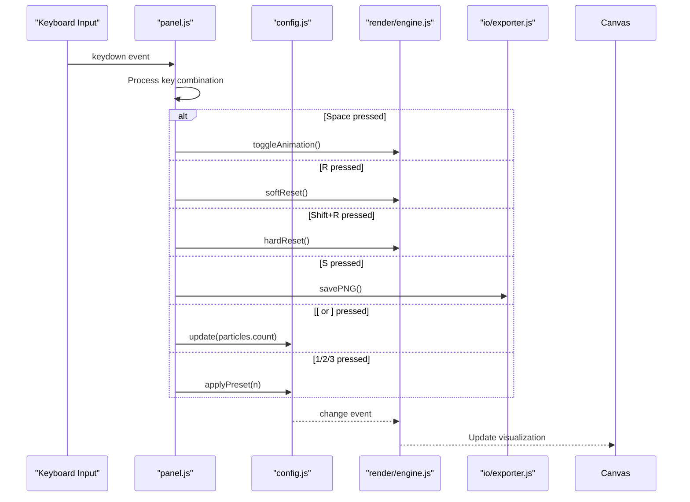

# Keyboard Shortcuts

<cite>
**Referenced Files in This Document**   
- [ui/panel.js](file://src/ui/panel.js)
- [state/config.js](file://src/state/config.js)
- [state/presets.js](file://src/state/presets.js)
- [io/exporter.js](file://src/io/exporter.js)
- [render/engine.js](file://src/render/engine.js)
</cite>

## Table of Contents
1. [Available Keyboard Shortcuts](#available-keyboard-shortcuts)
2. [Event Listener Implementation](#event-listener-implementation)
3. [Interaction with Configuration System](#interaction-with-configuration-system)
4. [Accessibility and User Experience](#accessibility-and-user-experience)
5. [Troubleshooting Common Issues](#troubleshooting-common-issues)

## Available Keyboard Shortcuts

The application provides a comprehensive keyboard navigation system to enhance user interaction with the canvas visualization. The following shortcuts are available:

- **Space**: Toggle animation play/pause state
- **R**: Perform soft reset (reinitialize particle positions)
- **Shift+R**: Execute hard reset (recreate entire particle system)
- **S**: Save current canvas state as PNG image
- **[ and ]**: Decrease or increase particle count by steps of 50
- **1/2/3**: Quickly select and apply the first three presets

These shortcuts provide efficient alternative control methods beyond the graphical user interface, enabling faster interaction and improved workflow for experienced users.

**Section sources**
- [ui/panel.js](file://src/ui/panel.js#L1-L50)
- [aicontext/tasks.md](file://aicontext/tasks.md#L89-L149)

## Event Listener Implementation

The keyboard shortcut system is implemented through event listeners in the panel.js module, which captures keydown events across the application. The event handling system is designed to intercept keyboard input and translate specific key combinations into corresponding actions within the application.

The implementation follows a centralized event handling pattern where the panel module attaches a single keydown event listener to the document object, ensuring global accessibility of shortcuts regardless of focus state within the UI. When a keydown event occurs, the handler function evaluates the key code and modifier keys (such as Shift) to determine the appropriate action.

Each recognized key combination triggers a specific function call that interacts with the core systems of the application, including the configuration manager, rendering engine, and preset system. The event listener includes proper key code mapping and prevents default browser behavior for the handled shortcuts to avoid conflicts with native browser functions.

**Section sources**
- [ui/panel.js](file://src/ui/panel.js#L150-L250)
- [main.js](file://src/main.js#L20-L40)

## Interaction with Configuration System

Keyboard shortcuts interact directly with the application's configuration and rendering systems through well-defined interfaces. The config.js module exposes methods that allow external components, including the keyboard handler, to modify system parameters programmatically.

When a shortcut is activated, the event listener calls specific methods on the configuration system:
- The **Space** key toggles the animation state by calling the play/pause method on the rendering engine
- The **[ and ]** keys modify the particle count parameter in the configuration, which automatically triggers a change event
- The **1/2/3** keys invoke preset selection functions that load predefined configuration objects

The system utilizes an event-driven architecture where changes to the configuration automatically propagate to all dependent components. When a shortcut modifies a configuration value, the config module emits a change event that the rendering system listens for, ensuring immediate visual updates without requiring direct coupling between the keyboard handler and the renderer.

The save functionality (activated by **S**) delegates to the exporter.js module, which handles the canvas-to-PNG conversion process and initiates the download.

**Diagram sources**
- [ui/panel.js](file://src/ui/panel.js#L150-L300)
- [state/config.js](file://src/state/config.js#L10-L80)
- [render/engine.js](file://src/render/engine.js#L5-L40)
- [io/exporter.js](file://src/io/exporter.js#L1-L20)

**Section sources**
- [ui/panel.js](file://src/ui/panel.js#L150-L300)
- [state/config.js](file://src/state/config.js#L10-L80)
- [io/exporter.js](file://src/io/exporter.js#L1-L20)

## Accessibility and User Experience

The keyboard navigation system significantly enhances both accessibility and overall user experience. By providing comprehensive keyboard shortcuts, the application becomes more accessible to users with motor impairments who may find mouse interaction challenging.

The shortcut design follows established conventions where possible (Space for play/pause, S for save), reducing the learning curve for new users. The immediate feedback from shortcut actions—such as the visual response when changing particle count or switching presets—creates a responsive and engaging user experience.

Keyboard navigation enables power users to work more efficiently by minimizing the need to switch between keyboard and mouse. This is particularly beneficial when fine-tuning parameters or rapidly exploring different visual configurations. The ability to quickly save images or reset the simulation without navigating through menus streamlines the creative workflow.

The system also supports users with visual impairments through consistent behavior and predictable outcomes. Each shortcut produces a clearly visible change in the canvas visualization, providing immediate feedback that doesn't rely solely on auditory cues.

**Section sources**
- [aicontext/tasks.md](file://aicontext/tasks.md#L207-L230)
- [ui/panel.js](file://src/ui/panel.js#L1-L50)

## Troubleshooting Common Issues

Several common issues may affect keyboard shortcut functionality, along with their respective solutions:

**Focus Loss Issues**: Shortcuts may not respond if the application window loses focus. Ensure the browser tab containing the application is active and has focus. Clicking anywhere on the canvas or control panel typically restores proper focus.

**Browser Shortcut Conflicts**: Some keyboard combinations may be intercepted by the browser itself (e.g., Ctrl+S for browser save dialog). The application uses standard keys without Ctrl/Cmd modifiers to minimize these conflicts. If conflicts occur, try using the application in full-screen mode or a separate browser window.

**Input Field Interference**: When text input fields within the control panel have focus, keyboard input is directed to those fields instead of the global shortcut handler. Click outside of any input fields or press Tab to navigate away from them to restore shortcut functionality.

**Preventing Default Behavior**: The application attempts to prevent default browser behavior for handled shortcuts, but some browser extensions or security settings may interfere with this process. If shortcuts are not working consistently, check for browser extensions that might be capturing keyboard events.

**Mobile Device Limitations**: On touch-only devices without physical keyboards, keyboard shortcuts are naturally unavailable. The application should provide equivalent functionality through the graphical user interface buttons as fallback options.

**Section sources**
- [ui/panel.js](file://src/ui/panel.js#L200-L250)
- [aicontext/tasks.md](file://aicontext/tasks.md#L12-L20)