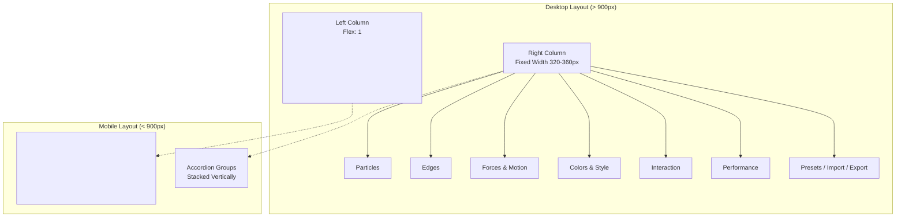
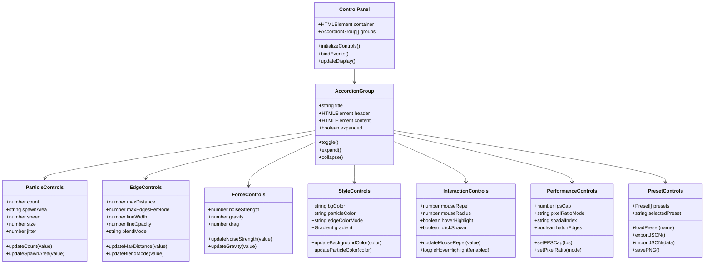
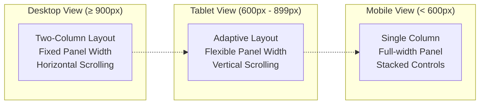
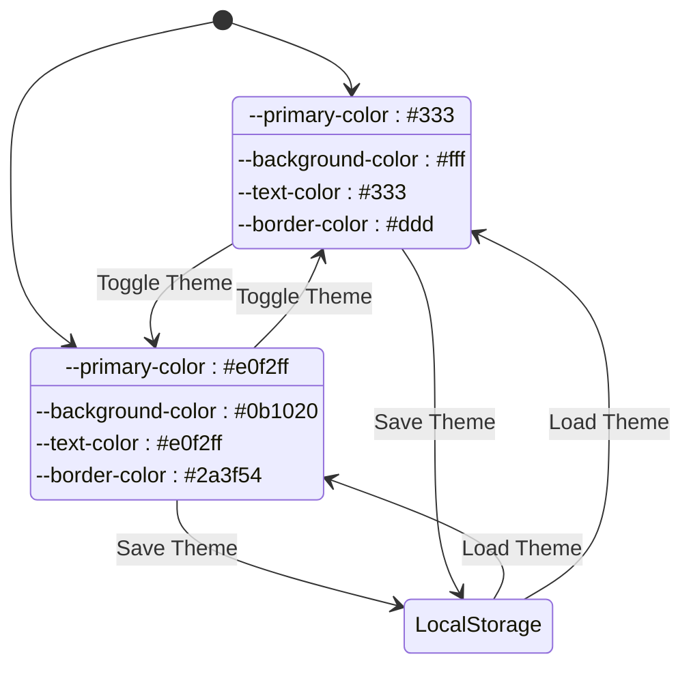
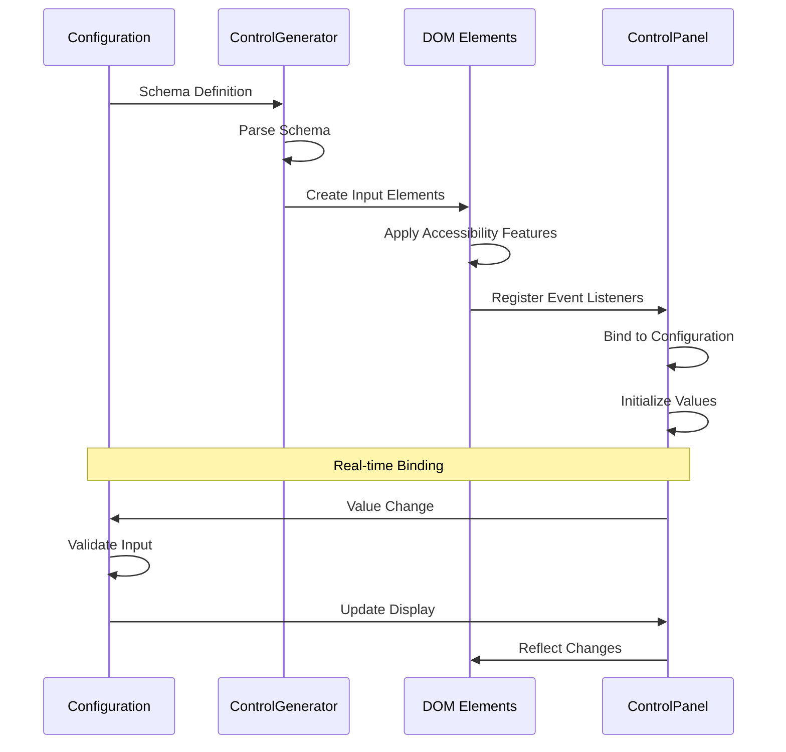

# User Interface Documentation

<cite>
**Referenced Files in This Document**
- [tasks.md](file://aicontext/tasks.md)
- [README.md](file://README.md)
</cite>

## Table of Contents
1. [Introduction](#introduction)
2. [Layout Architecture](#layout-architecture)
3. [Control Panel Components](#control-panel-components)
4. [Keyboard Shortcuts](#keyboard-shortcuts)
5. [Responsive Design](#responsive-design)
6. [Theme Support](#theme-support)
7. [Accessibility Features](#accessibility-features)
8. [Dynamic Control Generation](#dynamic-control-generation)
9. [Performance Considerations](#performance-considerations)
10. [Troubleshooting Guide](#troubleshooting-guide)
11. [Conclusion](#conclusion)

## Introduction

Plexus Canvas features a sophisticated two-column interface design that combines a dynamic canvas visualization on the left with an interactive control panel on the right. The interface is built around the principle of real-time parameter modification without requiring page reloads, offering immediate visual feedback for all configuration changes.

The UI system is designed with accessibility, responsiveness, and performance in mind, featuring a comprehensive set of controls organized into logical accordion groups, intuitive keyboard shortcuts, and adaptive layouts that work seamlessly across different screen sizes.

## Layout Architecture

The application employs a flexible two-column layout that adapts to various screen sizes while maintaining optimal usability.



**Diagram sources**
- [tasks.md](file://aicontext/tasks.md#L24-L40)

### Desktop Layout Structure

On desktop displays, the layout utilizes a flexbox-based approach where:
- **Canvas Area**: Takes up 100% of available horizontal space with flexible height
- **Control Panel**: Fixed width between 320-360 pixels with scrollable content
- **Responsive Behavior**: Maintains separation between visualization and controls

### Mobile Adaptation

For screens narrower than 900px, the layout transforms to:
- **Single Column**: Control panel moves below the canvas
- **Tabbed Interface**: Accordion groups become tab-like sections
- **Touch-Friendly**: Larger touch targets and simplified navigation

**Section sources**
- [tasks.md](file://aicontext/tasks.md#L24-L40)
- [tasks.md](file://aicontext/tasks.md#L207-L230)

## Control Panel Components

The control panel is organized into seven distinct accordion groups, each containing specific categories of configuration parameters.



**Diagram sources**
- [tasks.md](file://aicontext/tasks.md#L24-L40)

### Particles Controls

Manages particle generation and behavior parameters:

- **Count**: Range slider (50-3000 particles)
- **Spawn Area**: Dropdown selection (full, ellipse, ring, rectangle)
- **Speed**: Range slider (0-2 pixels per millisecond)
- **Size**: Pixel range slider (1-6 pixels)
- **Jitter**: Float slider (0-1 for randomness)

### Edges Controls

Controls connection and rendering properties:

- **Max Distance**: Pixel range slider (30-400 pixels)
- **Max Edges Per Node**: Integer range (0-12 connections)
- **Line Width**: Float range slider (0.2-3 pixels)
- **Line Opacity**: Alpha slider (0-1)
- **Blend Mode**: Dropdown selection (normal, lighten, screen, overlay)

### Forces & Motion Controls

Adjusts physical simulation parameters:

- **Noise Strength**: Pseudo-random noise (0-1)
- **Gravity**: Center attraction/repulsion (-1 to 1)
- **Drag**: Velocity damping (0-1)

### Colors & Style Controls

Defines visual appearance and gradients:

- **Background Color**: Hex color picker with opacity
- **Particle Color**: Static hex or automatic gradient
- **Edge Color Mode**: Static, distance-based, velocity-based
- **Gradient Stops**: Array of color stops for particle coloring

### Interaction Controls

Manages user interaction behavior:

- **Mouse Repel**: Force magnitude (0-1)
- **Mouse Radius**: Interaction distance in pixels
- **Hover Highlight**: Boolean toggle
- **Click Spawn**: Boolean toggle with click count setting

### Performance Controls

Optimizes rendering performance:

- **FPS Cap**: Frame rate limiting (30, 60, 120, Off)
- **Pixel Ratio Mode**: Automatic or manual DPI setting
- **Spatial Index**: None, grid, or quadtree acceleration
- **Batch Edges**: Boolean edge batching optimization

### Presets & Import/Export

Handles configuration management:

- **Preset Selection**: Dropdown menu with predefined configurations
- **JSON Import**: File upload or textarea input
- **JSON Export**: Button for configuration download
- **PNG Export**: Canvas screenshot capture
- **Share URL**: Base64-encoded configuration sharing

**Section sources**
- [tasks.md](file://aicontext/tasks.md#L42-L87)

## Keyboard Shortcuts

The application provides comprehensive keyboard shortcuts for efficient interaction and control.

```mermaid
flowchart TD
Start([User Input]) --> CheckKey["Check Key Press"]
CheckKey --> Space{"Space?"}
CheckKey --> R{"R?"}
CheckKey --> ShiftR{"Shift+R?"}
CheckKey --> S{"S?"}
CheckKey --> BracketL{"["?}
CheckKey --> BracketR]{"]?"}
CheckKey --> Num1{"1?"}
CheckKey --> Num2{"2?"}
CheckKey --> Num3{"3?"}
Space --> TogglePlay["Toggle Play/Pause"]
R --> SoftReset["Soft Reset<br/>(Position Reset)"]
ShiftR --> HardReset["Hard Reset<br/>(System Rebuild)"]
S --> SavePNG["Save PNG Image"]
BracketL --> DecrementCount["Decrement Count<br/>(Step: 50)"]
BracketR --> IncrementCount["Increment Count<br/>(Step: 50)"]
Num1 --> LoadPreset1["Load Preset 1"]
Num2 --> LoadPreset2["Load Preset 2"]
Num3 --> LoadPreset3["Load Preset 3"]
TogglePlay --> End([Action Complete])
SoftReset --> End
HardReset --> End
SavePNG --> End
DecrementCount --> End
IncrementCount --> End
LoadPreset1 --> End
LoadPreset2 --> End
LoadPreset3 --> End
```

**Diagram sources**
- [tasks.md](file://aicontext/tasks.md#L89-L149)

### Primary Shortcuts

- **Space**: Toggles play/pause state of the simulation
- **R**: Performs soft reset (resets particle positions while maintaining system structure)
- **Shift+R**: Executes hard reset (completely rebuilds the particle system)
- **S**: Saves current canvas view as PNG image
- **[**: Decrements particle count by 50 units
- **]**: Increments particle count by 50 units
- **1**: Loads first preset configuration
- **2**: Loads second preset configuration
- **3**: Loads third preset configuration

### Shortcut Implementation

The keyboard shortcuts are implemented through event listeners that capture keydown events and trigger appropriate actions. These shortcuts provide:

- **Immediate Feedback**: Visual indicators show when shortcuts are activated
- **Context Awareness**: Some shortcuts may behave differently based on current state
- **Accessibility**: All shortcuts can be accessed via keyboard navigation

**Section sources**
- [tasks.md](file://aicontext/tasks.md#L89-L149)

## Responsive Design

The interface adapts gracefully to different screen sizes and orientations.



### Breakpoint Strategy

The responsive design follows a mobile-first approach with strategic breakpoints:

- **Desktop**: ≥ 900px - Full two-column layout
- **Tablet**: 600px - 899px - Adaptive panel sizing
- **Mobile**: < 600px - Single column with stacked controls

### Layout Transformations

Each breakpoint triggers specific layout modifications:

**Desktop (≥ 900px)**:
- Fixed panel width (320-360px)
- Horizontal scrolling for overflow
- Optimal control spacing

**Tablet (600px - 899px)**:
- Flexible panel width
- Vertical scrolling enabled
- Touch-optimized controls

**Mobile (< 600px)**:
- Full-width panel
- Stacked accordion groups
- Simplified navigation

**Section sources**
- [tasks.md](file://aicontext/tasks.md#L207-L230)

## Theme Support

The application supports both light and dark themes through CSS custom properties and localStorage persistence.



### CSS Variable System

Theme colors are managed through CSS custom properties:

```css
:root {
  /* Light Theme Variables */
  --primary-color: #333;
  --background-color: #fff;
  --text-color: #333;
  --border-color: #ddd;
}

[data-theme="dark"] {
  /* Dark Theme Variables */
  --primary-color: #e0f2ff;
  --background-color: #0b1020;
  --text-color: #e0f2ff;
  --border-color: #2a3f54;
}
```

### Theme Persistence

Theme preferences are stored in localStorage and automatically applied on subsequent visits:

- **Automatic Detection**: System preference detection
- **Manual Override**: User can manually switch themes
- **Persistence**: Settings saved across sessions
- **Sync Across Tabs**: Theme changes sync across browser tabs

**Section sources**
- [tasks.md](file://aicontext/tasks.md#L207-L230)

## Accessibility Features

The interface incorporates comprehensive accessibility features to ensure usability for all users.

### Labeled Controls

All form elements include proper labeling:

```html
<!-- Example of accessible control structure -->
<label for="particle-count">
  Particle Count
  <input type="range" id="particle-count" min="50" max="3000">
</label>
```

### Title Attributes

Interactive elements include descriptive title attributes:

```html
<button title="Save current configuration as JSON">
  <span>Export JSON</span>
</button>
```

### Keyboard Navigation

Complete keyboard navigation support:

- **Tab Navigation**: Logical tab order through all controls
- **Arrow Keys**: Navigate within sliders and dropdowns
- **Enter/Space**: Activate buttons and toggles
- **Escape**: Close open menus or dialogs

### Screen Reader Support

- **ARIA Labels**: Descriptive labels for assistive technologies
- **Live Regions**: Updates announced for dynamic content
- **Focus Management**: Clear focus indicators and logical focus order

### High Contrast Support

- **Color Independence**: Controls usable without relying solely on color
- **Visual Indicators**: Clear visual feedback for all interactions
- **Text Alternatives**: Alternative text for graphical elements

**Section sources**
- [tasks.md](file://aicontext/tasks.md#L207-L230)

## Dynamic Control Generation

The control panel implements dynamic generation of UI elements based on configuration schemas.



**Diagram sources**
- [tasks.md](file://aicontext/tasks.md#L207-L230)

### Control Generation Process

The dynamic control generation follows a structured approach:

1. **Schema Parsing**: Configuration schemas define control types and constraints
2. **Element Creation**: Corresponding HTML elements are generated
3. **Event Binding**: Change events are bound to configuration updates
4. **Validation**: Input validation ensures data integrity
5. **Real-time Updates**: Immediate visual feedback for all changes

### Control Types

Different control types are supported based on data requirements:

- **Range Sliders**: Numeric values with min/max constraints
- **Dropdown Menus**: Enumerated options with string values
- **Color Pickers**: Hex color values with alpha support
- **Boolean Toggles**: On/off switches with descriptive labels
- **File Uploads**: JSON import functionality
- **Text Areas**: Free-form text input for configuration

### Event Handling

All controls implement robust event handling:

- **Debounced Updates**: Prevent excessive re-rendering during rapid changes
- **Validation**: Real-time input validation with error feedback
- **Undo Support**: Ability to revert changes before committing
- **State Persistence**: Changes saved immediately to configuration

**Section sources**
- [tasks.md](file://aicontext/tasks.md#L207-L230)

## Performance Considerations

The UI is optimized for smooth operation across different devices and configurations.

### Rendering Optimizations

- **Frame Rate Control**: Adjustable FPS caps prevent unnecessary calculations
- **Batch Operations**: Grouped rendering operations reduce overhead
- **Lazy Loading**: Controls load only when panels are expanded
- **Memory Management**: Efficient cleanup of unused resources

### Responsive Performance

- **Adaptive Complexity**: Reduce computational load on lower-end devices
- **Progressive Enhancement**: Basic functionality works everywhere
- **Graceful Degradation**: Advanced features disabled on older browsers
- **Resource Prioritization**: Critical UI elements render first

### Memory Efficiency

- **Control Reuse**: Dynamic element creation minimizes memory footprint
- **Event Cleanup**: Proper removal of event listeners prevents memory leaks
- **State Compression**: Efficient storage of configuration data
- **Garbage Collection**: Regular cleanup of temporary objects

**Section sources**
- [tasks.md](file://aicontext/tasks.md#L207-L230)

## Troubleshooting Guide

Common issues and their solutions:

### Layout Problems

**Issue**: Controls appear cut off or misaligned
**Solution**: Check viewport meta tag and CSS media queries

**Issue**: Canvas not filling available space
**Solution**: Verify flexbox properties and parent container sizing

### Performance Issues

**Issue**: Slow response to control changes
**Solution**: Enable FPS cap and disable advanced features temporarily

**Issue**: High memory usage
**Solution**: Reduce particle count and disable spatial indexing

### Accessibility Concerns

**Issue**: Controls not accessible via keyboard
**Solution**: Verify tabindex attributes and focus management

**Issue**: Screen reader not announcing changes
**Solution**: Add live regions and ARIA attributes

**Section sources**
- [tasks.md](file://aicontext/tasks.md#L232-L266)

## Conclusion

The Plexus Canvas UI represents a sophisticated balance between functionality, accessibility, and performance. The two-column layout with accordion-based controls provides intuitive access to complex configuration options while maintaining visual clarity and ease of use.

Key strengths of the interface include:

- **Intuitive Organization**: Logical grouping of related controls
- **Responsive Design**: Seamless adaptation across device types
- **Accessibility Compliance**: Comprehensive support for diverse users
- **Performance Optimization**: Efficient resource utilization
- **Extensibility**: Dynamic control generation supports future enhancements

The implementation demonstrates best practices in modern web interface design, combining proven UX patterns with innovative features that enhance user experience while maintaining technical excellence.